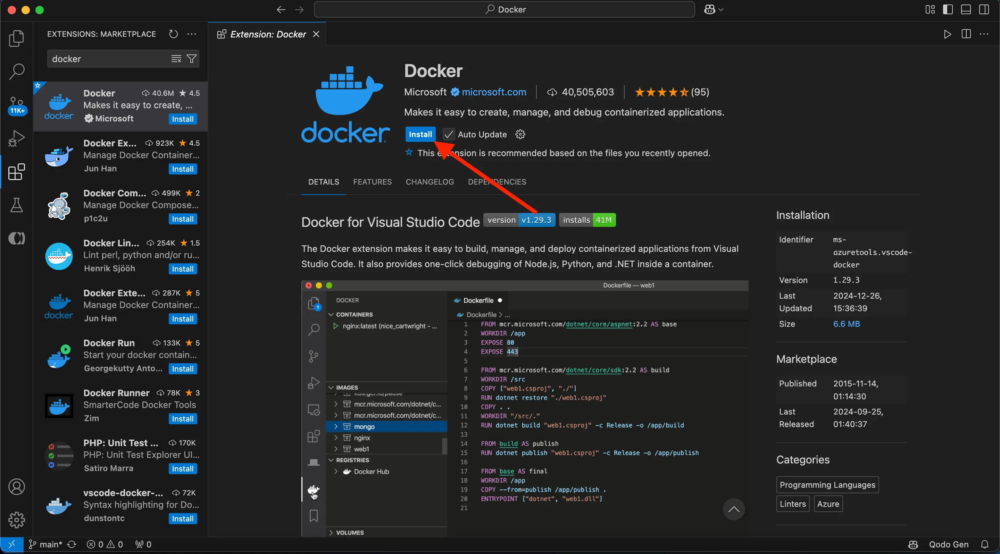
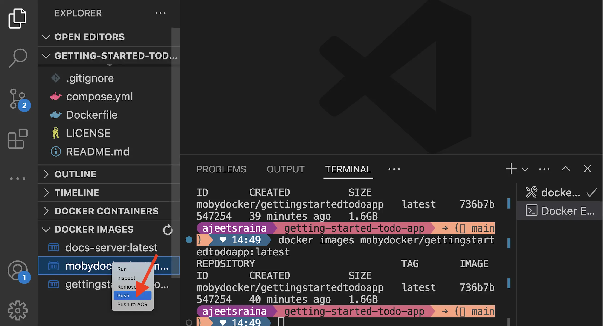



## 说明

现在你已经更新了[待办事项应用](develop-with-containers.md)，接下来可以为该应用创建一个容器镜像，并将其分享到 Docker Hub。为此，你需要完成以下步骤：

1. 使用你的 Docker 账号登录
2. 在 Docker Hub 上创建镜像仓库
3. 构建容器镜像
4. 将镜像推送到 Docker Hub

在开始动手之前，我们先来了解几个核心概念。

### 容器镜像

如果你刚接触容器镜像，可以将其理解为一个标准化的软件包，其中包含了运行应用所需的一切：源文件、配置信息以及所有依赖项。这些镜像可以方便地分发并与他人共享，极大简化了应用部署流程。

### Docker Hub

要分享你的 Docker 镜像，你需要一个存放它们的地方，即“仓库”（registry）。虽然市面上有许多可用的仓库服务，但 Docker Hub 是默认且最广泛使用的镜像仓库平台。Docker Hub 不仅是你存放自有镜像的理想场所，还是一个丰富的资源库，你可以在其中查找他人的镜像，用来直接运行或作为你自己镜像的基础。

在[使用容器进行开发](develop-with-containers.md)章节中，你使用了来自 Docker Hub 的以下镜像，它们均为[Docker 官方镜像](/manuals/docker-hub/image-library/trusted-content.md#docker-official-images)：

- [node](https://hub.docker.com/_/node) - 提供 Node 运行环境，作为开发阶段的基础镜像，同时也作为最终应用镜像的基础。
- [mysql](https://hub.docker.com/_/mysql) - 提供用于存储待办事项的 MySQL 数据库。
- [phpmyadmin](https://hub.docker.com/_/phpmyadmin) - 提供 phpMyAdmin，一个基于 Web 的 MySQL 数据库管理界面。
- [traefik](https://hub.docker.com/_/traefik) - 提供 Traefik，一款现代化的 HTTP 反向代理与负载均衡器，可基于路由规则将请求转发到目标容器。

你可以前往查看完整目录：[Docker 官方镜像](https://hub.docker.com/search?image_filter=official&q=)、[Docker 验证发布者](https://hub.docker.com/search?q=&image_filter=store)与 [Docker 赞助的开源软件](https://hub.docker.com/search?q=&image_filter=open_source)，探索更多可运行和可构建的内容。

## 动手实践

在这个动手实践指南中，你将学习如何登录 Docker Hub，并将自己构建的镜像推送到 Docker Hub 仓库，从而实现镜像的分享和复用。

## 使用 Docker 账号登录

要将镜像推送到 Docker Hub，你需要先使用 Docker 账号登录。

1. 打开 Docker Dashboard。

2. 点击右上角的 **Sign in** 按钮。

3. 如果你还没有账号，请先创建一个，然后再完成登录流程。

登录成功后，你将看到右上角的 **Sign in** 按钮变为你的个人头像，表示已成功登录。

## 创建镜像仓库

现在你已经有了账号，接下来可以创建镜像仓库了。就像 Git 仓库用于存放源代码一样，镜像仓库专门用于存放和管理容器镜像。

1. 访问 [Docker Hub](https://hub.docker.com) 网站。

2. 点击 **Create repository** 按钮。

3. 在 **Create repository** 页面中填写以下信息：

    - **Repository name** - `getting-started-todo-app`（仓库名称）
    - **Short description** - 可按需填写简短描述，帮助他人了解你的镜像用途
    - **Visibility** - 选择 **Public**（公开），这样其他人就可以拉取你定制的待办事项应用镜像

4. 点击 **Create** 按钮完成仓库创建。


## 构建并推送镜像

有了仓库之后，现在就可以构建并推送镜像了。值得注意的是，你将要构建的镜像是基于 Node 镜像的，这意味着你无需手动安装或配置 Node、Yarn 等依赖环境，可以将精力完全集中在应用开发本身。

> **什么是镜像和 Dockerfile？**
>
> 简单来说，容器镜像是一个包含运行特定进程所需全部内容的独立软件包。
> 在本示例中，它包含了 Node 运行环境、后端服务代码以及编译后的 React 前端代码。
>
> 任何使用该镜像运行容器的计算机，都能以完全相同的方式运行应用，
> 而无需在宿主机上预先安装任何额外组件，实现了"一次构建，随处运行"的理念。
>
> 而 `Dockerfile` 则是一个文本格式的脚本文件，它提供了构建镜像所需的完整指令集合。
> 在本快速入门示例中，项目仓库中已经包含了预先编写好的 Dockerfile。





1. 首先，将项目克隆到本地，或者直接[下载 ZIP 包](https://github.com/docker/getting-started-todo-app/archive/refs/heads/main.zip)。

   ```console
   $ git clone https://github.com/docker/getting-started-todo-app
   ```

   克隆完成后，进入项目目录：

   ```console
   $ cd getting-started-todo-app
   ```

2. 运行以下命令构建项目，注意将 `DOCKER_USERNAME` 替换为你的 Docker 用户名。

    ```console
    $ docker build -t <DOCKER_USERNAME>/getting-started-todo-app .
    ```

    例如，如果你的 Docker 用户名为 `mobydock`，则应运行：

    ```console
    $ docker build -t mobydock/getting-started-todo-app .
    ```

3. 构建完成后，使用 `docker image ls` 命令验证镜像是否已成功创建并存在于本地：

    ```console
    $ docker image ls
    ```

    你将看到类似如下的输出结果：

    ```console
    REPOSITORY                          TAG       IMAGE ID       CREATED          SIZE
    mobydock/getting-started-todo-app   latest    1543656c9290   2 minutes ago    1.12GB
    ...
    ```

4. 最后，使用 `docker push` 命令将镜像推送到 Docker Hub。请记得将 `DOCKER_USERNAME` 替换为你的实际用户名：

    ```console
    $ docker push <DOCKER_USERNAME>/getting-started-todo-app
    ```

    推送过程的时间长短取决于你的网络上传带宽，可能需要等待片刻才能完成。




1. 打开 Visual Studio Code。如果你尚未安装 Docker 扩展，请从[扩展市场](https://marketplace.visualstudio.com/items?itemName=ms-azuretools.vscode-docker)安装 **Docker 扩展**。

   

2. 在 **File** 菜单中选择 **Open Folder**，然后选择 **Clone Git Repository** 选项，并粘贴以下 URL： [https://github.com/docker/getting-started-todo-app](https://github.com/docker/getting-started-todo-app)

    


3. 在项目文件列表中找到 `Dockerfile` 文件，右键点击它，然后选择 **Build Image...** 选项。


    

4. 在弹出的输入对话框中，输入镜像名称 `DOCKER_USERNAME/getting-started-todo-app`，记得将 `DOCKER_USERNAME` 替换为你的实际 Docker 用户名。 

5. 按下 **Enter** 键确认后，VS Code 将打开一个终端窗口并开始执行构建过程。构建完成后，你可以关闭该终端窗口。

6. 点击 VS Code 左侧导航栏中的 Docker 图标，打开 Docker 扩展面板。

7. 在扩展面板中找到你刚刚构建的镜像，其名称应为 `docker.io/DOCKER_USERNAME/getting-started-todo-app`。 

8. 展开该镜像条目以查看其标签（即不同版本）。你应该能看到一个名为 `latest` 的标签，这是镜像的默认标签。

9. 右键点击 **latest** 标签条目，然后选择 **Push...** 选项。

    

10. 按下 **Enter** 键确认操作，然后观察镜像被推送至 Docker Hub 的过程。推送时间取决于你的网络上传带宽。

    上传完成后，你可以关闭终端窗口。





## 成果回顾

在继续学习之前，让我们花点时间回顾一下你刚才完成的工作：在短短几分钟内，你已经成功构建了一个完整的应用容器镜像，并将其推送到了 Docker Hub 平台上，实现了容器化应用的分享与发布。

接下来，请记住以下几点重要信息：

- Docker Hub 是查找可信内容的首选仓库平台。Docker 公司提供了由 Docker 官方镜像、Docker 验证发布者以及 Docker 赞助开源软件构成的丰富可信内容集合，你可以直接使用这些镜像，或将它们作为你自己镜像的基础层。

- Docker Hub 同样可以作为分发你自有应用的"应用市场"。任何开发者都可以创建账号并分发自己的镜像。除了公开分发之外，你还可以使用私有仓库功能，确保只有经过授权的用户才能访问你的特定镜像。

> **关于使用其他仓库**
>
> 虽然 Docker Hub 是默认的镜像仓库服务，但在 [Open Container Initiative](https://opencontainers.org/)（开放容器计划）的推动下，
> 各类容器镜像仓库已实现了标准化与互操作性。这使得企业和组织能够根据自身需求运行各自的私有仓库系统。
> 在实际应用场景中，可信内容通常会从 Docker Hub 镜像（或复制）到这些私有仓库中，以满足特定的安全和访问控制需求。
>

## 下一步

现在你已经成功构建并发布了一个容器镜像，接下来我们将探讨作为开发者为何应当进一步学习 Docker 技术，以及它如何帮助你更高效地完成日常开发工作。


