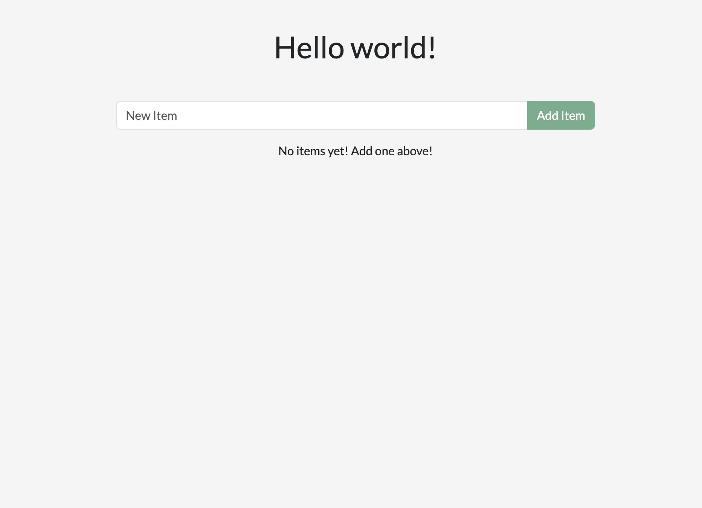
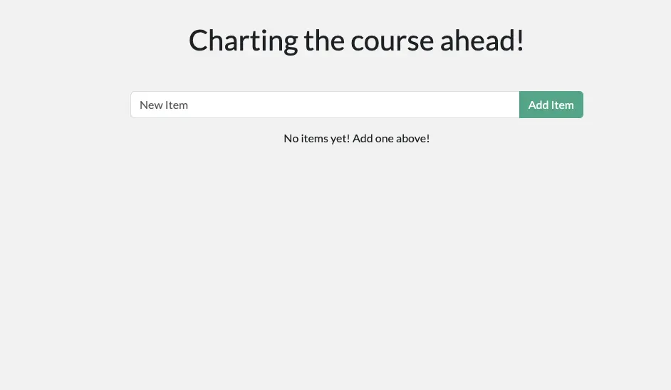
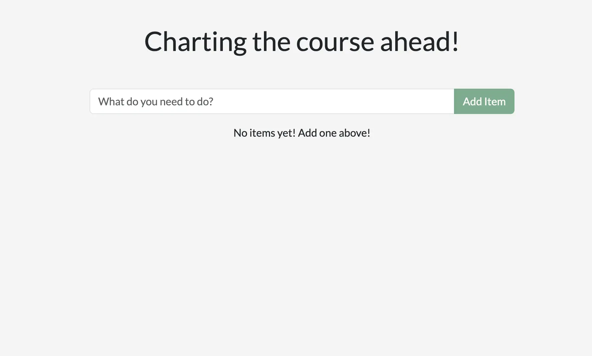
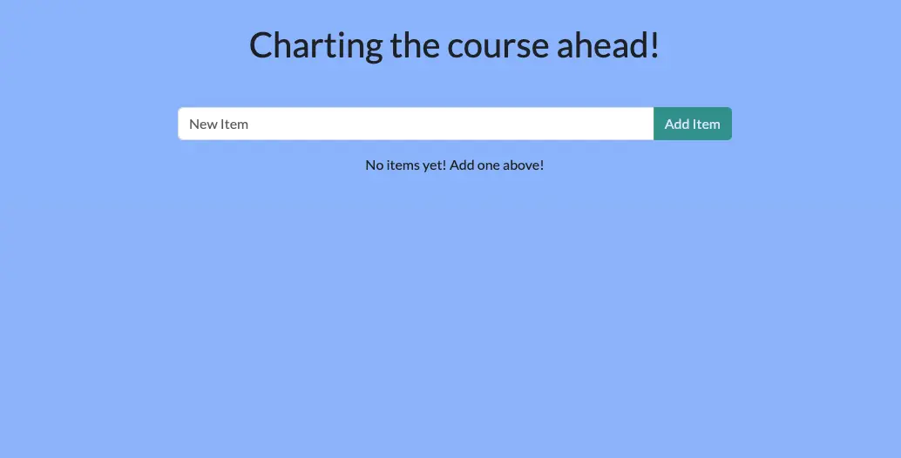



## 说明

现在你已经成功安装了 Docker Desktop，是时候体验容器化应用开发带来的便捷与高效了。在本节中，你将完成以下核心任务：

1. 克隆并启动一个完整的开发项目
2. 修改后端与前端代码，体验实时开发流程
3. 实时查看变更效果，感受容器化开发的独特优势

## 动手实践

在这个实践指南中，你将亲身体验如何使用 Docker 容器进行高效开发。无需复杂的环境配置，即可快速进入开发状态，专心编写代码。


## 启动项目

1. 首先，将示例项目克隆到本地，或者直接[下载 ZIP 压缩包](https://github.com/docker/getting-started-todo-app/archive/refs/heads/main.zip)。

    ```console
    $ git clone https://github.com/docker/getting-started-todo-app
    ```

    克隆完成后，进入项目目录：

    ```console
    $ cd getting-started-todo-app
    ```

2. 获取项目代码后，使用 Docker Compose 启动完整的开发环境。这一步将自动配置并启动所有必要的服务。

    在命令行界面（CLI）中运行以下命令来启动项目：

   ```console
   $ docker compose watch
   ```

   执行后，你将看到 Docker 自动拉取所需镜像、创建网络并启动各个容器的输出信息。不必担心理解所有技术细节，稍等片刻，整个环境将自动完成初始化并稳定运行。


3. 环境启动后，打开浏览器访问 [http://localhost](http://localhost)，即可查看正在运行的应用。首次启动可能需要几分钟时间来完成所有初始化工作。这是一个功能完整的待办事项应用，你可以添加新条目、标记完成状态或删除已有条目。

    


### 环境架构解析

现在环境已经成功运行，让我们深入了解这个容器化开发环境的架构设计。从整体结构来看，它由多个独立但协同工作的容器组成，每个容器负责特定的功能模块：

- **React 前端容器** —— 一个运行 React 开发服务器的 Node 容器，集成了 [Vite](https://vitejs.dev/) 构建工具，提供高效的热重载功能，使前端代码修改能够即时反映。
- **Node 后端容器** —— 提供完整的 RESTful API 接口，负责待办事项的获取、创建、更新与删除等核心业务逻辑处理。
- **MySQL 数据库容器** —— 负责数据持久化存储，确保待办事项列表在容器重启后仍然保持完整。
- **phpMyAdmin 容器** —— 提供直观的数据库管理 Web 界面，方便开发者查看和操作数据库内容，可通过 [http://db.localhost](http://db.localhost) 轻松访问。
- **Traefik 代理容器** —— [Traefik](https://traefik.io/traefik/) 作为现代化的应用代理和负载均衡器，智能管理请求路由：将 `localhost/api/*` 路径的请求精确转发到后端服务，将 `localhost/*` 的请求导向前端应用，将 `db.localhost` 的请求引导至 phpMyAdmin 界面。这种设计让你能够通过统一的 80 端口访问所有服务，避免了端口冲突和复杂的端口管理。

这种容器化开发环境的最大优势在于：作为开发者，你无需手动安装或配置任何服务组件、初始化数据库结构或管理复杂的数据库凭据。只需安装 Docker Desktop 这一个工具，整个开发环境的所有组件就能自动协同工作，让你专注于代码开发而非环境配置。

## 实时修改应用

现在环境已经成功运行，你可以开始体验 Docker 容器化开发的核心优势 —— 实时代码修改与即时反馈。这种开发体验让你能够快速迭代，立即看到修改效果，大幅提升开发效率。

### 修改后端欢迎语

首先，我们来修改页面顶部的欢迎语。这个文本由后端的 `/api/greeting` API 接口提供。目前它总是返回固定的「Hello world!」文本。我们将对其进行改进，使其从一组自定义消息中随机返回一条，为应用增添趣味性。

1. 在你喜欢的代码编辑器中打开 `backend/src/routes/getGreeting.js` 文件。这个文件包含了欢迎语 API 端点的核心处理逻辑。

2. 将文件顶部的变量修改为一个包含多条欢迎语的数组，并更新端点逻辑，使其能够随机选择一条消息返回。你可以使用以下示例代码，也可以根据自己的喜好自定义内容：

    ```js {linenos=table,hl_lines=["1-5",9],linenostart=1}
    const GREETINGS = [
        "Whalecome!",
        "All hands on deck!",
        "Charting the course ahead!",
    ];

    module.exports = async (req, res) => {
        res.send({
            greeting: GREETINGS[ Math.floor( Math.random() * GREETINGS.length )],
        });
    };
    ```

3. 保存文件后，无需重启任何服务，直接刷新浏览器即可看到新的欢迎语效果。多次刷新页面，你会看到不同的欢迎语随机出现，这正是容器化开发环境中热重载功能的体现。

    


### 优化前端输入框提示

接下来，我们将改进用户界面，让输入框的占位文本更加直观友好。目前输入框显示的是简单的「New Item」文本，我们可以将其修改得更具描述性和引导性。

1. 打开前端代码文件 `client/src/components/AddNewItemForm.jsx`。这个 React 组件负责渲染待办事项的输入表单。

2. 找到 `Form.Control` 元素，修改其 `placeholder` 属性值，使其更能引导用户输入有意义的待办事项：

    ```js {linenos=table,hl_lines=[5],linenostart=33}
    <Form.Control
        value={newItem}
        onChange={(e) => setNewItem(e.target.value)}
        type="text"
        placeholder="What do you need to do?"
        aria-label="New item"
    />
    ```

3. 保存文件后，回到浏览器查看效果。你会发现修改已经通过前端热更新（hot reload）机制自动应用，无需手动刷新页面。这种即时反馈的开发体验让你可以快速迭代，直到达到满意的效果。




### 自定义应用主题色

最后，让我们通过修改应用背景色来完善整体视觉效果，使其更符合 Docker 的品牌风格。

1. 打开样式文件 `client/src/index.scss`，这个文件控制着整个应用的基础样式。

2. 找到 `body` 选择器，修改其 `background-color` 属性值。下面的示例代码使用了与 Docker 航海主题相呼应的柔和蓝色：

    ```css {linenos=table,hl_lines=2,linenostart=3}
    body {
        background-color: #99bbff;
        margin-top: 50px;
        font-family: 'Lato';
    }
    ```

    你可以使用编辑器内置的颜色选择器（如果支持），或者借助在线[颜色选择工具](https://www.w3schools.com/colors/colors_picker.asp)来选择你喜欢的颜色。每次保存修改后，浏览器中的应用界面会立即更新，展示新的背景色效果。

    

太棒了！你已经成功完成了多处应用修改，体验了容器化开发环境中代码修改与即时反馈的流畅开发体验。

## 成果回顾

在继续下一步之前，让我们回顾一下你在本节中所取得的成就：

- **零配置快速启动完整开发环境**：通过容器化技术，你无需在本地机器上安装和配置 Node.js、MySQL 数据库或其他依赖组件。只需安装 Docker Desktop 和你喜欢的代码编辑器，即可获得功能完整、随时可用的开发环境。

- **实时代码修改与即时反馈**：你体验了容器化开发的核心优势，这得益于两个关键技术机制：
  1. 容器内的开发服务器会实时监听并响应文件变更
  2. 本地代码文件通过 Docker 卷（volume）机制与容器环境实时同步共享

- **前后端统一开发体验**：你同时修改了后端 API 和前端界面，体验了完整的全栈开发流程，无需分别配置多个开发环境。

Docker Desktop 不仅让以上体验成为可能，其潜力远不止于此。当你掌握容器化开发思维后，可以为任何技术栈创建一致、可复制的开发环境，并轻松与团队成员共享，彻底消除“在我的机器上能运行”的问题。

## 下一步

恭喜你！你已经成功体验了容器化开发的便捷与高效。接下来，你将学习如何将应用打包为容器镜像，并将其推送到 Docker Hub 镜像仓库，这样你就可以在任何地方部署和分享应用了。


