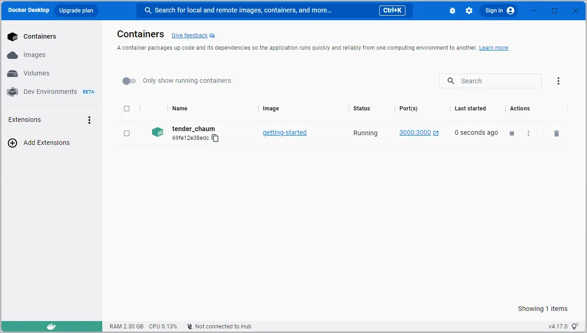

在本指南的其余部分，你将使用一个运行在 Node.js 上的简单待办事项管理器。如果你不熟悉 Node.js，也不用担心。本指南不需要任何 JavaScript 相关的先验经验。

## 先决条件

- 已安装最新版本的 [Docker Desktop](/get-started/get-docker.md)。
- 已安装 [Git 客户端](https://git-scm.com/downloads)。
- 有可用于编辑文件的 IDE 或文本编辑器。Docker 推荐使用 [Visual Studio Code](https://code.visualstudio.com/)。

## 获取示例应用

在运行应用之前，你需要将应用的源代码获取到本机。

1. 使用以下命令克隆 [getting-started-app 仓库](https://github.com/docker/getting-started-app/tree/main)：

   ```console
   $ git clone https://github.com/docker/getting-started-app.git
   ```

2. 查看已克隆仓库的内容。你应当能看到如下文件与子目录：

   ```text
   ├── getting-started-app/
   │ ├── .dockerignore
   │ ├── package.json
   │ ├── README.md
   │ ├── spec/
   │ ├── src/
   │ └── yarn.lock
   ```

## 构建应用镜像

要构建镜像，你需要一个 Dockerfile。Dockerfile 是一个没有文件扩展名的纯文本文件，里面包含一组构建指令。Docker 会根据这些指令来构建容器镜像。

1. 在 `getting-started-app` 目录（与 `package.json` 同级）下创建名为 `Dockerfile` 的文件，内容如下：

   ```dockerfile
   # syntax=docker/dockerfile:1

   FROM node:lts-alpine
   WORKDIR /app
   COPY . .
   RUN yarn install --production
   CMD ["node", "src/index.js"]
   EXPOSE 3000
   ```

   这个 Dockerfile 以 `node:lts-alpine` 作为基础镜像开始构建。它是一个轻量级的 Linux 镜像，预装了 Node.js 和 Yarn 包管理器。接着它会把所有源代码复制到镜像中，安装必要依赖，并启动应用。

2. 使用以下命令构建镜像：

   在终端中，确保你位于 `getting-started-app` 目录。将 `/path/to/getting-started-app` 替换为你本机的实际路径。

   ```console
   $ cd /path/to/getting-started-app
   ```

   构建镜像：

   ```console
   $ docker build -t getting-started .
   ```

   `docker build` 命令会根据 Dockerfile 构建一个新镜像。你可能注意到 Docker 下载了很多“层”（layers）。这是因为你告诉构建器要从 `node:lts-alpine` 镜像开始构建；由于你的本机尚未存在该镜像，Docker 需要先将其拉取下来。

   当基础镜像下载完成后，Docker 会按 Dockerfile 中的指令复制你的应用，并使用 `yarn` 安装应用依赖。`CMD` 指令用于指定从该镜像启动容器时的默认运行命令。

   最后，`-t` 标志用于给镜像打标签，可以把它理解为最终镜像的一个可读名称。既然你将镜像命名为 `getting-started`，在运行容器时就可以通过该名称来引用它。

   `docker build` 命令末尾的 `.` 告诉 Docker 到当前目录查找 `Dockerfile`。

## 启动应用容器

现在你已经有了镜像，可以使用 `docker run` 命令在容器中运行该应用。

1. 使用 `docker run` 命令运行容器，并指定刚刚创建的镜像名称：

   ```console
   $ docker run -d -p 127.0.0.1:3000:3000 getting-started
   ```

   `-d`（即 `--detach`）会让容器在后台运行。这意味着 Docker 会启动容器并将控制权返回到终端提示符，同时不会在终端输出日志。

   `-p`（即 `--publish`）用于在宿主机与容器之间创建端口映射。`-p` 接受 `HOST:CONTAINER` 形式的字符串，其中 `HOST` 是宿主机的地址，`CONTAINER` 是容器内的端口。上述命令将容器的 3000 端口映射到宿主机的 `127.0.0.1:3000`（即 `localhost:3000`）。如果不进行端口映射，你将无法从宿主机访问该应用。

2. 几秒钟后，在浏览器中打开 [http://localhost:3000](http://localhost:3000)。你应当能看到你的应用。

   

3. 添加一两条待办事项，确认其按预期工作。你可以将条目标记为完成并将其删除。前端已成功将条目存储到后端。

此时，你已经拥有一个正在运行的待办事项管理器，并包含一些条目。

如果快速查看当前容器，你应当能看到至少有一个容器正在使用 `getting-started` 镜像并监听 `3000` 端口。你可以使用 CLI 或 Docker Desktop 图形界面来查看容器。




在终端中运行 `docker ps` 命令以列出容器：

```console
$ docker ps
```

你会看到类似如下的输出：

```console
CONTAINER ID        IMAGE               COMMAND                  CREATED             STATUS              PORTS                      NAMES
df784548666d        getting-started     "docker-entrypoint.s…"   2 minutes ago       Up 2 minutes        127.0.0.1:3000->3000/tcp   priceless_mcclintock
```




在 Docker Desktop 中，选择 **Containers** 选项卡查看容器列表。






## 小结

本节中，你学习了如何编写 Dockerfile 来构建镜像。构建完成后，你启动了一个容器并验证了应用已成功运行。

相关信息：

- [Dockerfile reference](/reference/dockerfile/)
- [docker CLI reference](/reference/cli/docker/)

## 下一步

接下来，你将修改应用，并学习如何使用新镜像更新正在运行的应用。在此过程中，你还会掌握几个实用的命令。


