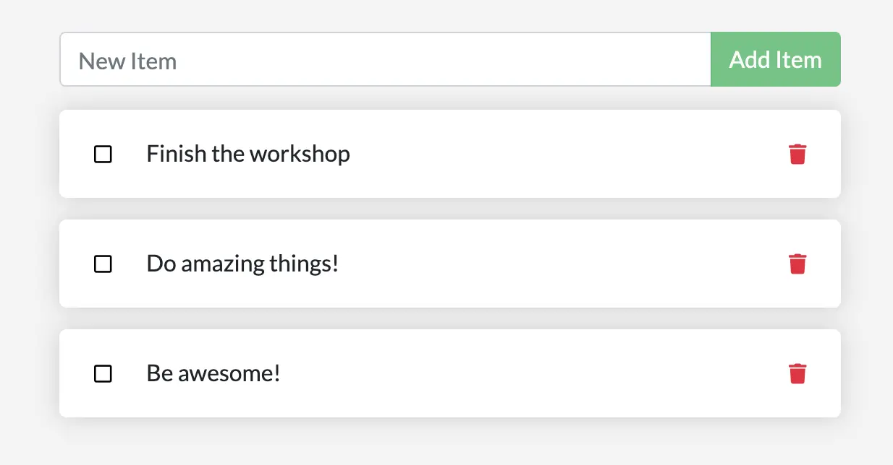

你可能已经注意到，每次启动容器时，待办列表都会是空的。为什么会这样？本节将带你深入理解容器的工作方式。

## 容器的文件系统

容器运行时，会将镜像中的各个分层作为其文件系统。同时，每个容器还会拥有自己的可写“临时层”（scratch space），用于创建、更新和删除文件。即便两个容器使用同一个镜像，它们彼此的改动也不会互相可见。

### 实操演示

为了直观理解上述行为，我们将启动两个容器：在第一个容器中创建一个文件，在第二个容器中检查该文件是否存在。

1. 启动一个 Alpine 容器，并在其中创建一个新文件。

    ```console
    $ docker run --rm alpine touch greeting.txt
    ```

    > [!TIP]
    > 在镜像名（此处为 `alpine`）后面指定的命令都会在容器内执行。本例中的 `touch greeting.txt` 会在容器文件系统中创建一个名为 `greeting.txt` 的文件。

2. 再启动一个新的 Alpine 容器，使用 `stat` 命令检查该文件是否存在。
   
   ```console
   $ docker run --rm alpine stat greeting.txt
   ```

   你会看到类似如下的输出，表明在新的容器中该文件并不存在：

   ```console
   stat: can't stat 'greeting.txt': No such file or directory
   ```

第一个容器创建的 `greeting.txt` 文件在第二个容器中并不存在。这是因为每个容器的可写“顶层”是相互隔离的。尽管它们共享构成基础镜像的底层分层，但每个容器的可写层都是独立的。

## 容器卷

通过上面的实验可以看出，每次启动容器，都是从镜像定义重新开始。容器虽然可以创建、更新、删除文件，但当容器被删除时，这些改动也随之消失，且这些改动只在该容器中有效。使用卷（volume）就可以改变这一点。

[卷](/manuals/engine/storage/volumes.md)允许将容器中的特定路径与主机相连。如果你在容器中挂载了某个目录，对该目录的改动也会在主机上可见。只要在容器重启后仍然挂载同一目录，你就会看到相同的文件。

卷主要有两种类型。我们最终都会用到，但本节先从卷挂载（volume mount）开始。

## 持久化 todo 数据

默认情况下，Todo 应用会将数据存储在容器文件系统的 `/etc/todos/todo.db`（一个 SQLite 数据库）中。如果你不熟悉 SQLite，也没关系！它只是一个把所有数据存储在单个文件中的关系型数据库。虽然不适合大规模应用，但对于小型演示完全够用。稍后我们会学习如何切换到其他的数据库引擎。

既然数据库就是一个文件，那么只要把这个文件持久化到主机，并让后续的容器能够访问到它，应用就可以“接着上次进度继续运行”。为此，你可以创建一个卷，并把它“挂载”到存放数据的目录上。当容器向 `todo.db` 写入时，数据就会通过该卷持久化到主机。

如前所述，我们将使用“卷挂载”。可以把卷挂载理解为一个不透明的数据“桶”。Docker 会全权管理该卷（包括磁盘上的存储位置），你只需要记住卷的名字即可。

### 创建卷并启动容器

你可以通过 CLI 或 Docker Desktop 的图形界面来创建卷并启动容器。




1. 使用 `docker volume create` 命令创建一个卷。

   ```console
   $ docker volume create todo-db
   ```

2. 使用 `docker rm -f <id>` 停止并删除当前正在运行的 Todo 应用容器（它仍未使用持久化卷）。

3. 启动 Todo 应用容器，并添加 `--mount` 选项来指定卷挂载。为卷命名，并将其挂载到容器内的 `/etc/todos`，从而接管该路径下的所有文件。

   ```console
   $ docker run -dp 127.0.0.1:3000:3000 --mount type=volume,src=todo-db,target=/etc/todos getting-started
   ```

   > [!NOTE]
   >
    > 如果你使用的是 Git Bash，需要使用不同的语法：
   >
   > ```console
   > $ docker run -dp 127.0.0.1:3000:3000 --mount type=volume,src=todo-db,target=//etc/todos getting-started
   > ```
   >
    > 有关 Git Bash 语法差异的更多信息，参阅
    > [Working with Git Bash](/desktop/troubleshoot-and-support/troubleshoot/topics/#docker-commands-failing-in-git-bash)。





创建卷：

1. 在 Docker Desktop 中进入 **Volumes**。
2. 在 **Volumes** 页面点击 **Create**。
3. 输入 `todo-db` 作为卷名，然后点击 **Create**。

停止并删除应用容器：

1. 在 Docker Desktop 中进入 **Containers**。
2. 在目标容器的 **Actions** 列点击 **Delete**。

以挂载卷的方式启动 Todo 应用容器：

1. 在 Docker Desktop 顶部点击搜索框。
2. 在搜索窗口切换到 **Images** 选项卡。
3. 在搜索框中输入镜像名 `getting-started`。

   > [!TIP]
   >
    > 使用搜索过滤器，仅显示 **Local images**。

4. 选择目标镜像并点击 **Run**。
5. 点击 **Optional settings**。
6. 在 **Host port** 中填写端口（例如 `3000`）。
7. 在 **Host path** 中填写卷名 `todo-db`。
8. 在 **Container path** 中填写 `/etc/todos`。
9. 点击 **Run**。




### 验证数据是否持久化

1. 容器启动后，打开应用，向待办列表添加几条数据。

    
    

2. 停止并删除 Todo 应用容器。可通过 Docker Desktop 或使用 `docker ps` 获取容器 ID，然后执行 `docker rm -f <id>` 删除。

3. 按前述步骤重新启动一个新容器。

4. 打开应用，你应能看到列表中仍保留着之前添加的条目。

5. 验证完毕后，可删除该容器。

至此，你已学会如何实现数据持久化。

## 深入了解卷

很多人经常会问：“使用卷时，Docker 到底把我的数据存在哪里？”你可以通过 `docker volume inspect` 命令来查看。

```console
$ docker volume inspect todo-db
```
你会看到类似如下的输出：
```console
[
    {
        "CreatedAt": "2019-09-26T02:18:36Z",
        "Driver": "local",
        "Labels": {},
        "Mountpoint": "/var/lib/docker/volumes/todo-db/_data",
        "Name": "todo-db",
        "Options": {},
        "Scope": "local"
    }
]
```

其中的 `Mountpoint` 表示数据在磁盘上的实际位置。注意，在大多数主机上，你需要具备 root 权限才能从主机访问该目录。

## 小结

本节介绍了如何让容器数据持久化。

相关信息：

 - [docker CLI reference](/reference/cli/docker/)
 - [Volumes](/manuals/engine/storage/volumes.md)

## 下一步

接下来，你将学习如何使用绑定挂载更高效地进行应用开发。


