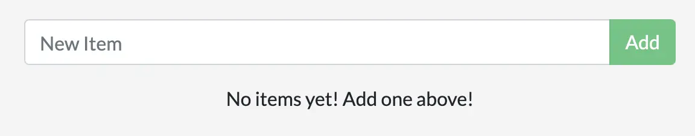

在[第 4 部分](./05_persisting_data.md)中，你使用了卷挂载来持久化数据库中的数据。当你需要一个持久化位置来存放应用数据时，使用卷挂载是一个非常合适的选择。

绑定挂载是另一种挂载方式，它允许你把主机文件系统中的某个目录共享到容器内。在开发应用时，你可以通过绑定挂载把源代码挂载到容器中。只要你在主机上保存文件，容器内就能立即看到代码的变化。这意味着你可以在容器内运行监听文件系统变化的进程并做出响应。

本章将展示如何使用绑定挂载配合一个名为 [nodemon](https://npmjs.com/package/nodemon) 的工具来监控文件变化，并自动重启应用。大多数其他语言与框架也有类似工具可用。

## 卷类型快速对比

下面是使用 `--mount` 的命名卷与绑定挂载示例：

- 命名卷：`type=volume,src=my-volume,target=/usr/local/data`
- 绑定挂载：`type=bind,src=/path/to/data,target=/usr/local/data`

下表概述了卷挂载与绑定挂载的主要区别。

|                                              | 命名卷                                             | 绑定挂载                                             |
| -------------------------------------------- | -------------------------------------------------- | ---------------------------------------------------- |
| 主机上的位置                                 | 由 Docker 决定                                     | 由你决定                                             |
| 新建卷是否用容器内容进行填充                 | 是                                                 | 否                                                   |
| 是否支持卷驱动                               | 是                                                 | 否                                                   |

## 尝试绑定挂载

在将绑定挂载用于应用开发之前，先通过一个小实验来直观了解绑定挂载的工作方式。

1. 确认你的 `getting-started-app` 目录位于 Docker Desktop 文件共享设置允许的路径下。该设置用于指定主机文件系统中哪些位置可以与容器共享。如何访问该设置，参见[文件共享](/manuals/desktop/settings-and-maintenance/settings.md#file-sharing)。

    > [!NOTE]
    > **File sharing** 选项卡仅在 Hyper-V 模式下可见；在 WSL 2 模式和 Windows 容器模式下，文件会自动共享。

2. 打开终端并切换到 `getting-started-app` 目录。

3. 运行以下命令，在 `ubuntu` 容器中以绑定挂载方式启动一个交互式 `bash` 会话。

   
   

   ```console
   $ docker run -it --mount type=bind,src="$(pwd)",target=/src ubuntu bash
   ```
   
   
   

   ```console
   $ docker run -it --mount "type=bind,src=%cd%,target=/src" ubuntu bash
   ```
   
   
   

   ```console
   $ docker run -it --mount type=bind,src="/$(pwd)",target=/src ubuntu bash
   ```
   
   
   

   ```console
   $ docker run -it --mount "type=bind,src=$($pwd),target=/src" ubuntu bash
   ```
   
   
   
   
   `--mount type=bind` 表示创建一个绑定挂载，其中 `src` 指向主机上的当前工作目录（`getting-started-app`），`target` 指定该目录在容器中的挂载位置（`/src`）。

4. 运行命令后，Docker 会在容器文件系统的根目录启动一个交互式 `bash` 会话。

   ```console
   root@ac1237fad8db:/# pwd
   /
   root@ac1237fad8db:/# ls
   bin   dev  home  media  opt   root  sbin  srv  tmp  var
   boot  etc  lib   mnt    proc  run   src   sys  usr
   ```

5. 切换到 `src` 目录。

   这是你在启动容器时挂载的目录。列出该目录内容，会看到与主机上 `getting-started-app` 目录相同的文件。

   ```console
   root@ac1237fad8db:/# cd src
   root@ac1237fad8db:/src# ls
   Dockerfile  node_modules  package.json  spec  src  yarn.lock
   ```

6. 新建一个名为 `myfile.txt` 的文件。

   ```console
   root@ac1237fad8db:/src# touch myfile.txt
   root@ac1237fad8db:/src# ls
   Dockerfile  myfile.txt  node_modules  package.json  spec  src  yarn.lock
   ```

7. 回到主机，打开 `getting-started-app` 目录，可以看到多了 `myfile.txt` 文件。

   ```text
   ├── getting-started-app/
   │ ├── Dockerfile
   │ ├── myfile.txt
   │ ├── node_modules/
   │ ├── package.json
   │ ├── spec/
   │ ├── src/
   │ └── yarn.lock
   ```

8. 在主机上删除 `myfile.txt` 文件。
9. 回到容器，再次列出 `src` 目录内容，可以发现该文件已消失。

   ```console
   root@ac1237fad8db:/src# ls
   Dockerfile  node_modules  package.json  spec  src  yarn.lock
   ```

10. 按 `Ctrl` + `D` 结束容器中的交互会话。

以上就是绑定挂载的快速演示。你看到了主机与容器之间如何共享文件，以及文件改动如何在两端即时生效。现在你可以用绑定挂载来进行软件开发了。

## 开发容器

在本地开发环境中使用绑定挂载非常普遍。其优势在于开发机器无需安装所有构建工具和运行环境；只需一条 docker run 命令，Docker 就会拉取所需依赖与工具。

### 在开发容器中运行你的应用

下面的步骤展示如何使用绑定挂载运行一个开发容器，实现以下目的：

- 将你的源代码挂载到容器中
- 安装所有依赖
- 启动 `nodemon` 监听文件系统变化

你可以使用 CLI 或 Docker Desktop，以绑定挂载的方式运行容器。




1. 确保没有正在运行的 `getting-started` 容器。

2. 在 `getting-started-app` 目录中运行以下命令。

   ```console
   $ docker run -dp 127.0.0.1:3000:3000 \
       -w /app --mount type=bind,src="$(pwd)",target=/app \
       node:lts-alpine \
       sh -c "yarn install && yarn run dev"
   ```

   命令说明：
   - `-dp 127.0.0.1:3000:3000`：与之前相同，后台运行并创建端口映射
   - `-w /app`：设置工作目录（命令的当前目录）
   - `--mount type=bind,src="$(pwd)",target=/app`：将主机当前目录以绑定挂载的方式挂载到容器内 `/app`
   - `node:lts-alpine`：使用的镜像；这是 Dockerfile 中应用所用的基础镜像
   - `sh -c "yarn install && yarn run dev"`：启动 `sh`（alpine 没有 `bash`），先执行 `yarn install` 安装依赖，再执行 `yarn run dev` 启动开发服务器。查看 `package.json` 可知，`dev` 脚本会启动 `nodemon`。

3. 使用 `docker logs <container-id>` 查看日志。当你看到如下内容时表示已经就绪：

   ```console
   $ docker logs -f <container-id>
   nodemon -L src/index.js
   [nodemon] 2.0.20
   [nodemon] to restart at any time, enter `rs`
   [nodemon] watching path(s): *.*
   [nodemon] watching extensions: js,mjs,json
   [nodemon] starting `node src/index.js`
   Using sqlite database at /etc/todos/todo.db
   Listening on port 3000
   ```

   查看完毕后，按 `Ctrl`+`C` 退出。




1. 确保没有正在运行的 `getting-started` 容器。

2. 在 `getting-started-app` 目录中运行以下命令。

   ```powershell
   $ docker run -dp 127.0.0.1:3000:3000 `
       -w /app --mount "type=bind,src=$pwd,target=/app" `
       node:lts-alpine `
       sh -c "yarn install && yarn run dev"
   ```

   命令说明：
   - `-dp 127.0.0.1:3000:3000`：后台运行并创建端口映射
   - `-w /app`：设置工作目录
   - `--mount "type=bind,src=$pwd,target=/app"`：将主机当前目录以绑定挂载方式挂载到容器内 `/app`
   - `node:lts-alpine`：使用的镜像；这是 Dockerfile 中的基础镜像
   - `sh -c "yarn install && yarn run dev"`：通过 `sh` 执行安装依赖并启动开发服务器，`dev` 脚本会启动 `nodemon`

3. 使用 `docker logs <container-id>` 查看日志，出现如下输出表示就绪：

   ```console
   $ docker logs -f <container-id>
   nodemon -L src/index.js
   [nodemon] 2.0.20
   [nodemon] to restart at any time, enter `rs`
   [nodemon] watching path(s): *.*
   [nodemon] watching extensions: js,mjs,json
   [nodemon] starting `node src/index.js`
   Using sqlite database at /etc/todos/todo.db
   Listening on port 3000
   ```

   查看完毕后，按 `Ctrl`+`C` 退出。




1. 确保没有正在运行的 `getting-started` 容器。

2. 在 `getting-started-app` 目录中运行以下命令。

   ```console
   $ docker run -dp 127.0.0.1:3000:3000 ^
       -w /app --mount "type=bind,src=%cd%,target=/app" ^
       node:lts-alpine ^
       sh -c "yarn install && yarn run dev"
   ```

   命令说明：
   - `-dp 127.0.0.1:3000:3000`：后台运行并创建端口映射
   - `-w /app`：设置工作目录
   - `--mount "type=bind,src=%cd%,target=/app"`：将主机当前目录以绑定挂载方式挂载到容器内 `/app`
   - `node:lts-alpine`：使用的镜像；为 Dockerfile 中的基础镜像
   - `sh -c "yarn install && yarn run dev"`：通过 `sh` 执行安装依赖并启动开发服务器，`dev` 脚本会启动 `nodemon`

3. 使用 `docker logs <container-id>` 查看日志，出现如下输出表示就绪：

   ```console
   $ docker logs -f <container-id>
   nodemon -L src/index.js
   [nodemon] 2.0.20
   [nodemon] to restart at any time, enter `rs`
   [nodemon] watching path(s): *.*
   [nodemon] watching extensions: js,mjs,json
   [nodemon] starting `node src/index.js`
   Using sqlite database at /etc/todos/todo.db
   Listening on port 3000
   ```

   查看完毕后，按 `Ctrl`+`C` 退出。




1. 确保没有正在运行的 `getting-started` 容器。

2. 在 `getting-started-app` 目录中运行以下命令。

   ```console
   $ docker run -dp 127.0.0.1:3000:3000 \
       -w //app --mount type=bind,src="/$(pwd)",target=/app \
       node:lts-alpine \
       sh -c "yarn install && yarn run dev"
   ```

   命令说明：
   - `-dp 127.0.0.1:3000:3000`：后台运行并创建端口映射
   - `-w //app`：设置工作目录
   - `--mount type=bind,src="/$(pwd)",target=/app`：将主机当前目录以绑定挂载方式挂载到容器内 `/app`
   - `node:lts-alpine`：使用的镜像；为 Dockerfile 中的基础镜像
   - `sh -c "yarn install && yarn run dev"`：通过 `sh` 执行安装依赖并启动开发服务器，`dev` 脚本会启动 `nodemon`

3. 使用 `docker logs <container-id>` 查看日志，出现如下输出表示就绪：

   ```console
   $ docker logs -f <container-id>
   nodemon -L src/index.js
   [nodemon] 2.0.20
   [nodemon] to restart at any time, enter `rs`
   [nodemon] watching path(s): *.*
   [nodemon] watching extensions: js,mjs,json
   [nodemon] starting `node src/index.js`
   Using sqlite database at /etc/todos/todo.db
   Listening on port 3000
   ```

   查看完毕后，按 `Ctrl`+`C` 退出。




确保没有正在运行的 `getting-started` 容器。

以绑定挂载方式运行该镜像。

1. 在 Docker Desktop 顶部点击搜索框。
2. 在搜索窗口中，切换到 **Images** 选项卡。
3. 在搜索框中输入容器名称 `getting-started`。

   > [!TIP]
   >
   > 使用搜索过滤器来筛选，只显示 **Local images**。

4. 选择你的镜像，然后点击 **Run**。
5. 点击 **Optional settings**。
6. 在 **Host path** 中，填写主机上 `getting-started-app` 目录的路径。
7. 在 **Container path** 中，填写 `/app`。
8. 点击 **Run**。

你可以在 Docker Desktop 中查看该容器的日志：

1. 在 Docker Desktop 中进入 **Containers**。
2. 选择你的容器名称。

当你看到如下输出时，表示已就绪：

```console
nodemon -L src/index.js
[nodemon] 2.0.20
[nodemon] to restart at any time, enter `rs`
[nodemon] watching path(s): *.*
[nodemon] watching extensions: js,mjs,json
[nodemon] starting `node src/index.js`
Using sqlite database at /etc/todos/todo.db
Listening on port 3000
```




### 使用开发容器开发你的应用

在主机上修改你的应用，可以看到这些改动会实时反映到容器内。

1. 在 `src/static/js/app.js` 文件的第 109 行，把 “Add Item” 按钮文本改为 “Add”：

   ```diff
   - {submitting ? 'Adding...' : 'Add Item'}
   + {submitting ? 'Adding...' : 'Add'}
   ```

   保存文件。

2. 在浏览器中刷新页面，你应当几乎立刻看到变化（因为绑定挂载实时生效）。Nodemon 会检测到变化并重启服务器。Node 服务器重启可能需要几秒钟，如果遇到错误，请稍后再刷新一次。

   

3. 你可以继续做更多改动。每次保存文件时，变更都会因为绑定挂载而体现在容器内。Nodemon 检测到变化后会自动重启容器内的应用。完成后，停止容器并构建新镜像：

   ```console
   $ docker build -t getting-started .
   ```

## 小结

至此，你无需重建镜像就可以在开发时实时看到应用变化，同时也能持久化数据库。

除了卷挂载与绑定挂载外，Docker 还支持其他类型的挂载与存储驱动，以满足更复杂与更专业的场景需求。

相关信息：

 - [docker CLI reference](/reference/cli/docker/)
 - [Manage data in Docker](https://docs.docker.com/storage/)

## 下一步

为了让应用走向生产环境，你需要把数据库从 SQLite 迁移到更易扩展的方案。为简单起见，我们仍然使用关系型数据库，并将应用切换为使用 MySQL。那么，MySQL 应该如何运行？容器之间如何互相通信？下一节会进行介绍。


