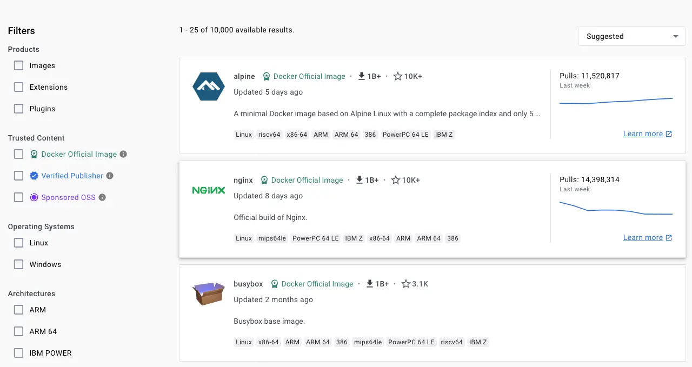

## 使用多阶段构建

多阶段构建通过将构建过程与最终产物明确分离，帮助你显著减少最终镜像体积。将 Dockerfile 指令划分到不同阶段，确保最终输出只包含运行应用所需的文件。

多阶段还可并行执行部分步骤，从而提升构建效率。

更多信息参见 [多阶段构建](/manuals/build/building/multi-stage.md)。

### 创建可复用阶段

如果多个镜像有大量共性，建议把共享组件放在一个可复用的阶段中，其他阶段基于它构建。公共阶段只需构建一次，这能更高效地使用主机内存并加快派生镜像的加载速度。

维护一个公共基础阶段（“不要重复自己”）也比在多个阶段中重复类似逻辑更易管理。

## 选择合适的基础镜像

构建安全镜像的第一步是选择合适的基础镜像。选择镜像时，应确保其来自可信来源并尽量保持精简。

- [Docker 官方镜像](https://hub.docker.com/search?image_filter=official)：经过精选、文档完善、倡导最佳实践并定期更新，为众多应用提供可信的起点。

- [经过验证的发布者](https://hub.docker.com/search?image_filter=store)镜像：由与 Docker 合作的组织发布与维护，Docker 会验证其仓库内容的真实性与可信度。

- [Docker 资助的开源项目](https://hub.docker.com/search?image_filter=open_source)：由 Docker 通过其[开源计划](../../docker-hub/image-library/trusted-content.md#docker-sponsored-open-source-software-images)资助的开源项目发布并维护。

挑选基础镜像时，留意标识徽章以确认该镜像属于上述项目。



当你从 Dockerfile 构建自有镜像时，请选择满足需求的最小化基础镜像。更小的基础镜像不仅便于分发与下载更快，还能减少最终镜像体积，并尽量降低依赖引入的漏洞数量。

同时可以考虑为不同阶段选择不同类型的基础镜像：一个用于构建与单元测试，另一个（通常更小）用于生产。开发后期通常不再需要编译器、构建系统、调试工具等。依赖更少的小镜像可显著降低攻击面。

## 频繁重建镜像

Docker 镜像是不可变的。构建镜像相当于在当下对其（以及所用的基础镜像、库与其他软件）拍了一个快照。为确保镜像最新且安全，请在依赖更新后频繁重建镜像。

为确保获取依赖的最新版本，可使用 `--no-cache` 以避免缓存命中。

```console
$ docker build --no-cache -t my-image:my-tag .
```

下面的 Dockerfile 使用 `ubuntu` 镜像的 `24.04` 标签。随着发布者不断用安全补丁与新库重建镜像，该标签可能会指向不同的底层版本。使用 `--no-cache` 可避免缓存命中，确保基础镜像与依赖被全新下载。

```dockerfile
# syntax=docker/dockerfile:1
FROM ubuntu:24.04
RUN apt-get -y update && apt-get install -y --no-install-recommends python3
```

同时也可考虑[固定基础镜像版本](#pin-base-image-versions)。

## 使用 .dockerignore 排除文件

若不想改动源码结构，又需要排除与构建无关的文件，请使用 `.dockerignore`。其排除模式与 `.gitignore` 类似。

例如，排除所有 `.md` 扩展名的文件：

```plaintext
*.md
```

如何创建与编写该文件，参见
[Dockerignore 文件](/manuals/build/concepts/context.md#dockerignore-files)。

## 创建短暂性容器

Dockerfile 定义的镜像应尽量生成“短暂性（ephemeral）”容器。即容器可被随时停止和销毁，再以最少的设置与配置重建并替换。

可参考《十二要素应用》中的[进程](https://12factor.net/processes)一节，理解以无状态方式运行容器的动机。

## 不要安装不必要的软件包

避免因为“可能有用”而安装额外或不必要的软件包。例如，数据库镜像中通常不需要包含文本编辑器。

避免不必要的软件包可降低镜像复杂度与依赖、减小镜像体积，并缩短构建时间。

## 解耦应用

每个容器应只聚焦一件事。将应用解耦为多个容器，便于水平扩展与复用。例如，一个 Web 应用栈可由三个容器组成，分别使用独立镜像管理 Web 应用、数据库与内存缓存。

将每个容器限制为一个进程是不错的经验法则，但并非硬性规定。例如，容器可以[以 init 进程启动](/manuals/engine/containers/multi-service_container.md)；某些程序也会自行派生额外进程，如 [Celery](https://docs.celeryq.dev/) 可启动多个 worker，[Apache](https://httpd.apache.org/) 可能为每个请求创建一条进程。

请根据具体情况尽量保持容器简洁与模块化。若容器间存在依赖，可使用 [Docker 容器网络](/manuals/engine/network/_index.md) 保障通信。

## 对多行参数排序

尽量按字母顺序对多行参数进行排序，以便维护。这有助于避免包名重复、简化更新列表，也能让评审更易读。反斜杠（`\`）前添加一个空格也有助于可读性。

如下示例来自 [buildpack-deps 镜像](https://github.com/docker-library/buildpack-deps)：

```dockerfile
RUN apt-get update && apt-get install -y --no-install-recommends \
  bzr \
  cvs \
  git \
  mercurial \
  subversion \
  && rm -rf /var/lib/apt/lists/*
```

## 善用构建缓存

构建镜像时，Docker 会按顺序执行 Dockerfile 中的每条指令。对每条指令，Docker 都会检查是否可以复用构建缓存。

理解构建缓存的工作机制与失效方式，对提升构建速度至关重要。更多内容参见[构建缓存](/manuals/build/cache/_index.md)。

## 固定基础镜像版本 {#pin-base-image-versions}

镜像标签是可变的，发布者可以更新同一标签以指向新的镜像版本。这便于发布者用同一标签提供更新版本；而对使用者而言，重建镜像时会自动获得新版本。

例如，Dockerfile 中指定 `FROM alpine:3.21`，该标签会解析为 3.21 的最新补丁版本。

```dockerfile
# syntax=docker/dockerfile:1
FROM alpine:3.21
```

某个时间点，`3.21` 标签可能指向 3.21.1；三个月后重建，同一标签可能已指向 3.21.4。该发布流程属于最佳实践，多数发布者采用此策略，但并非强制。

其缺点是你无法保证每次构建都得到完全一致的内容。这可能带来破坏性变更，也缺乏所用镜像版本的审计追踪。

若要更好地保障供应链完整性，可将镜像固定到特定摘要（digest）。这样即使发布者更新了标签，你仍会使用完全相同的镜像版本。如下 Dockerfile 仍使用 `3.21` 标签，但同时指定了摘要：

```dockerfile
# syntax=docker/dockerfile:1
FROM alpine:3.21@sha256:a8560b36e8b8210634f77d9f7f9efd7ffa463e380b75e2e74aff4511df3ef88c
```

这样即便发布者更新了 `3.21` 标签，你的构建仍会使用固定的镜像版本：
`a8560b36e8b8210634f77d9f7f9efd7ffa463e380b75e2e74aff4511df3ef88c`。

虽然这有助于避免意外变更，但每次升级都需手动查找与更新摘要，流程更繁琐；同时也意味着你不会自动获得安全修复（通常是你希望获得的）。

Docker Scout 默认的 [**最新基础镜像** 策略](../../scout/policy/_index.md#up-to-date-base-images) 会检查你所用的基础镜像是否为最新版本，也会校验 Dockerfile 中固定的摘要是否与正确版本对应。若发布者更新了你所固定的镜像，该策略会标记为不合规，提示需要更新。

Docker Scout 还支持自动修复流程，帮助保持基础镜像的最新状态。当有新的镜像摘要发布时，Docker Scout 可在你的仓库自动创建 PR，更新 Dockerfile 以使用最新版本。相比自动变动的标签方式，这种方案能让你掌控变更并保留完整审计记录。

关于使用 Docker Scout 自动更新基础镜像的更多信息，参见[修复](/manuals/scout/policy/remediation.md)。

## 在 CI 中构建并测试镜像

当代码提交或创建 Pull Request 时，使用 [GitHub Actions](../ci/github-actions/_index.md) 或其他 CI/CD 流水线自动构建并打标签，并对镜像进行测试。

## Dockerfile 指令

按照以下建议合理使用 [Dockerfile 指令](/reference/dockerfile.md)，以创建高效、可维护的 Dockerfile。

> [!TIP]
>
> 在 Visual Studio Code 中改进 Dockerfile 的语法检查、代码导航与漏洞扫描，请参见 [Docker VS Code 扩展](https://marketplace.visualstudio.com/items?itemName=docker.docker)。

### FROM

尽可能使用当前的官方镜像作为基础镜像。Docker 推荐使用 [Alpine 镜像](https://hub.docker.com/_/alpine/)：它体积小（目前不足 6 MB）、管控严格，同时仍是一个完整的 Linux 发行版。

关于 `FROM` 指令，参见 [Dockerfile 参考：FROM](/reference/dockerfile.md#from)。

### LABEL

你可以为镜像添加标签（label），用于按项目组织、记录许可证信息、辅助自动化等。每个标签以 `LABEL` 开头，后接一个或多个键值对。以下示例展示了多种可接受格式，并在行内附有说明注释。

包含空格的字符串必须加引号或转义空格；内部引号字符（`"`）也需转义。例如：

```dockerfile
# Set one or more individual labels
LABEL com.example.version="0.0.1-beta"
LABEL vendor1="ACME Incorporated"
LABEL vendor2=ZENITH\ Incorporated
LABEL com.example.release-date="2015-02-12"
LABEL com.example.version.is-production=""
```

一个镜像可以包含多个标签。Docker 1.10 之前建议将所有标签合并为一条 `LABEL` 指令以避免额外层产生；如今已不再必要，但仍然支持合并写法。例如：

```dockerfile
# Set multiple labels on one line
LABEL com.example.version="0.0.1-beta" com.example.release-date="2015-02-12"
```

上述示例也可写成：

```dockerfile
# Set multiple labels at once, using line-continuation characters to break long lines
LABEL vendor=ACME\ Incorporated \
      com.example.is-beta= \
      com.example.is-production="" \
      com.example.version="0.0.1-beta" \
      com.example.release-date="2015-02-12"
```

关于可接受的标签键与值，参见[理解对象标签](/manuals/engine/manage-resources/labels.md)；关于如何查询标签，参见[管理对象标签](/manuals/engine/manage-resources/labels.md#manage-labels-on-objects)中与过滤相关的内容。另见 Dockerfile 参考中的 [LABEL](/reference/dockerfile.md#label)。

### RUN

将较长或复杂的 `RUN` 语句使用反斜杠拆分为多行，使 Dockerfile 更易读、更易理解与维护。

例如，可以使用 `&&` 链接命令，并配合转义字符将长命令拆分为多行：

```dockerfile
RUN apt-get update && apt-get install -y --no-install-recommends \
    package-bar \
    package-baz \
    package-foo
```

默认情况下，反斜杠用于转义换行；你也可以通过 [`escape` 指令](/reference/dockerfile.md#escape) 更改该行为。

也可以使用 here document 在不通过管道连接的情况下运行多条命令：

```dockerfile
RUN <<EOF
apt-get update
apt-get install -y --no-install-recommends \
    package-bar \
    package-baz \
    package-foo
EOF
```

关于 `RUN` 指令，参见 [Dockerfile 参考：RUN](/reference/dockerfile.md#run)。

#### apt-get

在基于 Debian 的镜像中，`RUN` 的常见用法是通过 `apt-get` 安装软件。由于 `apt-get` 的特性，`RUN apt-get` 存在一些不直观的注意事项。

务必在同一条 `RUN` 中组合执行 `apt-get update` 与 `apt-get install`，例如：

```dockerfile
RUN apt-get update && apt-get install -y --no-install-recommends \
    package-bar \
    package-baz \
    package-foo
```

在单独的 `RUN` 中执行 `apt-get update` 会导致缓存问题，从而使后续的 `apt-get install` 失败。例如，下列 Dockerfile 中会出现该问题：

```dockerfile
# syntax=docker/dockerfile:1

FROM ubuntu:22.04
RUN apt-get update
RUN apt-get install -y --no-install-recommends curl
```

首次构建后，所有层已进入缓存。若随后修改 `apt-get install`（如下增加一个包）：

```dockerfile
# syntax=docker/dockerfile:1

FROM ubuntu:22.04
RUN apt-get update
RUN apt-get install -y --no-install-recommends curl nginx
```

Docker 会认为变更前后的相关步骤相同并复用缓存，导致 `apt-get update` 未被重新执行，从而可能安装到过期版本的 `curl` 与 `nginx`。

使用 `RUN apt-get update && apt-get install -y --no-install-recommends` 可在无需额外编码与人工干预的情况下安装最新版本。这种做法被称为“破坏缓存（cache busting）”。你也可以通过指定包版本来实现，称为“版本固定（version pinning）”，例如：

```dockerfile
RUN apt-get update && apt-get install -y --no-install-recommends \
    package-bar \
    package-baz \
    package-foo=1.3.*
```

版本固定会强制构建获取指定版本，而不受缓存影响。这也能减少因依赖包的非预期变更而导致的失败。

下面是一个良好实践的 `RUN` 示例，体现了上述 `apt-get` 相关建议：

```dockerfile
RUN apt-get update && apt-get install -y --no-install-recommends \
    aufs-tools \
    automake \
    build-essential \
    curl \
    dpkg-sig \
    libcap-dev \
    libsqlite3-dev \
    mercurial \
    reprepro \
    ruby1.9.1 \
    ruby1.9.1-dev \
    s3cmd=1.1.* \
    && rm -rf /var/lib/apt/lists/*
```

其中 `s3cmd` 指定了 `1.1.*` 版本。如果之前使用的是旧版本，那么指定新版本会触发 `apt-get update` 的缓存失效，确保安装最新版本。将软件包逐行列出也有助于避免重复。

此外，删除 `/var/lib/apt/lists` 清理 apt 缓存可以减小镜像大小（apt 缓存不会存入层）。由于 `RUN` 以 `apt-get update` 开始，`apt-get install` 之前的包索引始终是最新的。

官方 Debian 与 Ubuntu 镜像会[自动运行 `apt-get clean`](https://github.com/debuerreotype/debuerreotype/blob/c9542ab785e72696eb2908a6dbc9220abbabef39/scripts/debuerreotype-minimizing-config#L87-L109)，无需显式调用。

#### 使用管道

某些 `RUN` 命令依赖通过管道符（`|`）将一个命令的输出传递给另一个命令，例如：

```dockerfile
RUN wget -O - https://some.site | wc -l > /number
```

Docker 使用 `/bin/sh -c` 解释器执行这些命令，它只根据管道中最后一个命令的退出码来判断成功与否。在上面的例子里，只要 `wc -l` 成功，该步骤就会被视为成功，即使 `wget` 失败。

如果希望在管道任一阶段出错都能让命令失败，可在前面加上 `set -o pipefail &&`，以避免构建在异常情况下“误成功”。例如：

```dockerfile
RUN set -o pipefail && wget -O - https://some.site | wc -l > /number
```

> [!NOTE]
>
> 并非所有 shell 都支持 `-o pipefail` 选项。
>
> 在某些环境（如 Debian 系镜像中的 `dash`）下，可考虑使用 `RUN` 的 exec 形式显式选择支持 `pipefail` 的 shell。例如：
>
> ```dockerfile
> RUN ["/bin/bash", "-c", "set -o pipefail && wget -O - https://some.site | wc -l > /number"]
> ```

### CMD

`CMD` 用于指定运行镜像内软件及其参数。通常应采用 `CMD ["executable", "param1", "param2"]` 的形式。例如，服务类镜像（如 Apache、Rails）可以使用 `CMD ["apache2","-DFOREGROUND"]`。对服务型镜像，推荐使用该形式。

在其他多数情况下，可将 `CMD` 设为交互式 shell（如 bash、Python、perl），例如：`CMD ["perl", "-de0"]`、`CMD ["python"]`、`CMD ["php", "-a"]`。这样执行 `docker run -it python` 时会进入可用的 shell。
除非你与用户都非常熟悉 [`ENTRYPOINT`](/reference/dockerfile.md#entrypoint) 的工作方式，否则不建议将 `CMD` 写成 `CMD ["param", "param"]` 并与 `ENTRYPOINT` 搭配使用。

关于 `CMD` 指令，参见 [Dockerfile 参考：CMD](/reference/dockerfile.md#cmd)。

### EXPOSE

`EXPOSE` 指令声明容器监听的端口。请使用应用常见的默认端口。例如，Apache 使用 `EXPOSE 80`，MongoDB 使用 `EXPOSE 27017` 等。

对外访问时，用户可通过 `docker run` 的参数指定端口映射。对于容器间链接，Docker 提供了从接收方容器到源容器的环境变量（例如 `MYSQL_PORT_3306_TCP`）。

关于 `EXPOSE` 指令，参见 [Dockerfile 参考：EXPOSE](/reference/dockerfile.md#expose)。

### ENV

为使新安装的软件更易运行，你可以通过 `ENV` 更新 `PATH` 环境变量。例如，`ENV PATH=/usr/local/nginx/bin:$PATH` 可保证 `CMD ["nginx"]` 直接生效。

`ENV` 也适用于设置容器化服务所需的特定环境变量，例如 Postgres 的 `PGDATA`。

此外，你还可用 `ENV` 定义常用的版本号，以便集中维护版本升级，例如：

```dockerfile
ENV PG_MAJOR=9.3
ENV PG_VERSION=9.3.4
RUN curl -SL https://example.com/postgres-$PG_VERSION.tar.xz | tar -xJC /usr/src/postgres && …
ENV PATH=/usr/local/postgres-$PG_MAJOR/bin:$PATH
```

类似于程序中的常量，这种做法避免硬编码，只需修改一处 `ENV` 即可为容器内的软件完成版本升级。

每条 `ENV` 与 `RUN` 一样都会创建新的中间层。这意味着即便之后取消该环境变量，它仍保留在已有层中，并可被读取。你可以用如下 Dockerfile 验证这一点：

```dockerfile
# syntax=docker/dockerfile:1
FROM alpine
ENV ADMIN_USER="mark"
RUN echo $ADMIN_USER > ./mark
RUN unset ADMIN_USER
```

```console
$ docker run --rm test sh -c 'echo $ADMIN_USER'

mark
```

若要避免这一问题，可在同一条 `RUN` 中通过 shell 命令设置、使用并取消变量。命令可使用 `;` 或 `&&` 分隔。后者在任一命令失败时会使 `docker build` 失败，通常更好。Linux Dockerfile 中使用 `\` 作为续行符有助于可读性。你也可以把命令写成脚本，再通过 `RUN` 执行该脚本。

```dockerfile
# syntax=docker/dockerfile:1
FROM alpine
RUN export ADMIN_USER="mark" \
    && echo $ADMIN_USER > ./mark \
    && unset ADMIN_USER
CMD sh
```

```console
$ docker run --rm test sh -c 'echo $ADMIN_USER'

```

关于 `ENV` 指令，参见 [Dockerfile 参考：ENV](/reference/dockerfile.md#env)。

### ADD or COPY

`ADD` 与 `COPY` 在功能上类似。`COPY` 支持将文件从[构建上下文](/manuals/build/concepts/context.md)或[多阶段构建](/manuals/build/building/multi-stage.md)中的某阶段复制到容器；`ADD` 额外支持从远程 HTTPS 与 Git URL 拉取文件，并在从构建上下文添加时自动解压 tar 包。

在多阶段构建中，通常优先使用 `COPY` 在阶段之间复制文件。若仅为执行某次 `RUN` 临时将构建上下文中的文件放入容器，可考虑使用绑定挂载替代 `COPY`。例如，为 `RUN pip install` 临时引入 `requirements.txt`：

```dockerfile
RUN --mount=type=bind,source=requirements.txt,target=/tmp/requirements.txt \
    pip install --requirement /tmp/requirements.txt
```

相较 `COPY`，绑定挂载在引入构建上下文文件到容器时更高效。需注意，绑定挂载的文件仅在单次 `RUN` 中临时可见，最终镜像中不会保留；若需要保留，请使用 `COPY`。

当需要在构建过程中下载远程工件时，优先使用 `ADD`。与手动 `wget`/`tar` 相比，`ADD` 能更好地利用构建缓存；同时内置了远程资源校验以及解析 [Git URL](/reference/cli/docker/buildx/build.md#git-repositories) 中分支、标签与子目录的能力。

下面的示例使用 `ADD` 下载 .NET 安装包。结合多阶段构建，最终阶段仅保留 .NET 运行时，不含中间文件：

```dockerfile
# syntax=docker/dockerfile:1

FROM scratch AS src
ARG DOTNET_VERSION=8.0.0-preview.6.23329.7
ADD --checksum=sha256:270d731bd08040c6a3228115de1f74b91cf441c584139ff8f8f6503447cebdbb \
    https://dotnetcli.azureedge.net/dotnet/Runtime/$DOTNET_VERSION/dotnet-runtime-$DOTNET_VERSION-linux-arm64.tar.gz /dotnet.tar.gz

FROM mcr.microsoft.com/dotnet/runtime-deps:8.0.0-preview.6-bookworm-slim-arm64v8 AS installer

# Retrieve .NET Runtime
RUN --mount=from=src,target=/src <<EOF
mkdir -p /dotnet
tar -oxzf /src/dotnet.tar.gz -C /dotnet
EOF

FROM mcr.microsoft.com/dotnet/runtime-deps:8.0.0-preview.6-bookworm-slim-arm64v8

COPY --from=installer /dotnet /usr/share/dotnet
RUN ln -s /usr/share/dotnet/dotnet /usr/bin/dotnet
```

关于 `ADD` 与 `COPY`，参见：
- [Dockerfile 参考：ADD](/reference/dockerfile.md#add)
- [Dockerfile 参考：COPY](/reference/dockerfile.md#copy)


### ENTRYPOINT

`ENTRYPOINT` 最佳用法是设定镜像的主命令，使镜像像该命令一样被执行；随后用 `CMD` 指定默认参数。

以下是命令行工具 `s3cmd` 的镜像示例：

```dockerfile
ENTRYPOINT ["s3cmd"]
CMD ["--help"]
```

可通过以下命令运行镜像并显示帮助：

```console
$ docker run s3cmd
```

或者传入参数执行命令，例如：

```console
$ docker run s3cmd ls s3://mybucket
```

这种方式的好处是镜像名可直接作为可执行程序的引用，如上所示。

`ENTRYPOINT` 也可与辅助脚本配合使用，即便启动工具需要多步，也能以类似方式工作。

例如，[Postgres 官方镜像](https://hub.docker.com/_/postgres/) 将以下脚本作为 `ENTRYPOINT`：

```bash
#!/bin/bash
set -e

if [ "$1" = 'postgres' ]; then
    chown -R postgres "$PGDATA"

    if [ -z "$(ls -A "$PGDATA")" ]; then
        gosu postgres initdb
    fi

    exec gosu postgres "$@"
fi

exec "$@"
```


该脚本使用了 [Bash 的 `exec` 命令](https://wiki.bash-hackers.org/commands/builtin/exec)，使最终运行的应用成为容器的 PID 1，从而接收发往容器的 Unix 信号。更多信息参见 [`ENTRYPOINT` 参考](/reference/dockerfile.md#entrypoint)。

如下示例将辅助脚本复制进容器，并在容器启动时由 `ENTRYPOINT` 执行：

```dockerfile
COPY ./docker-entrypoint.sh /
ENTRYPOINT ["/docker-entrypoint.sh"]
CMD ["postgres"]
```

该脚本支持多种方式与 Postgres 交互。

可直接启动 Postgres：

```console
$ docker run postgres
```

也可启动 Postgres 并向服务器传参：

```console
$ docker run postgres postgres --help
```

最后，它还可以启动完全不同的工具，例如 Bash：

```console
$ docker run --rm -it postgres bash
```

关于 `ENTRYPOINT` 指令，参见 [Dockerfile 参考：ENTRYPOINT](/reference/dockerfile.md#entrypoint)。

### VOLUME

对于数据库存储、配置存储，或容器运行中创建的文件与目录，建议使用 `VOLUME` 暴露出来。强烈建议将镜像中需要修改或由用户维护的部分使用 `VOLUME` 管理。

关于 `VOLUME` 指令，参见 [Dockerfile 参考：VOLUME](/reference/dockerfile.md#volume)。

### USER

若服务无需特权即可运行，请使用 `USER` 切换到非 root 用户。可先在 Dockerfile 中创建用户与用户组，例如：

```dockerfile
RUN groupadd -r postgres && useradd --no-log-init -r -g postgres postgres
```

> [!NOTE]
>
> 建议显式指定 UID/GID。
>
> 镜像中的用户与用户组会被分配“非确定性”的 UID/GID（与是否重建无关，按“下一个”分配）。若对此有严格要求，请显式指定。

> [!NOTE]
>
> 由于 Go archive/tar 在处理稀疏文件时存在[未解决的缺陷](https://github.com/golang/go/issues/13548)，在容器内创建 UID 特别大的用户可能导致磁盘耗尽（容器层的 `/var/log/faillog` 被填充为大量空字符 \0）。可通过为 `useradd` 传入 `--no-log-init` 规避。Debian/Ubuntu 的 `adduser` 包装脚本不支持该参数。

避免安装或使用 `sudo`，其 TTY 与信号转发行为在容器中不可预期。若确有需要（如以 root 初始化守护进程、随后降权运行），建议使用 [gosu](https://github.com/tianon/gosu)。

此外，为减少层数与复杂度，避免频繁切换 `USER`。

关于 `USER` 指令，参见 [Dockerfile 参考：USER](/reference/dockerfile.md#user)。

### WORKDIR

为清晰与可靠起见，应始终为 `WORKDIR` 使用绝对路径。同时，优先使用 `WORKDIR`，不要扩散类似 `RUN cd … && do-something` 的写法——那样不易读、不易排障与维护。

关于 `WORKDIR` 指令，参见 [Dockerfile 参考：WORKDIR](/reference/dockerfile.md#workdir)。

### ONBUILD

`ONBUILD` 命令会在当前 Dockerfile 构建完成后触发，且会在任何基于当前镜像派生的子镜像中执行。可以将 `ONBUILD` 理解为父 Dockerfile 传递给子 Dockerfile 的“延迟指令”。

在子 Dockerfile 中，`ONBUILD` 会先于其他指令执行。

`ONBUILD` 适合作为“父镜像”的场景，例如语言栈镜像：用户在其 Dockerfile 中构建用该语言编写的软件（参考 [Ruby 的 `ONBUILD` 变体](https://github.com/docker-library/ruby/blob/c43fef8a60cea31eb9e7d960a076d633cb62ba8d/2.4/jessie/onbuild/Dockerfile)）。

使用了 `ONBUILD` 的镜像应当使用单独的标签，例如 `ruby:1.9-onbuild` 或 `ruby:2.0-onbuild`。

在 `ONBUILD` 中使用 `ADD` 或 `COPY` 需谨慎：如果后续构建上下文缺少被添加的资源，基于该镜像的构建会严重失败。采用独立标签（如上所述）有助于让 Dockerfile 作者明确选择，降低风险。

关于 `ONBUILD` 指令，参见 [Dockerfile 参考：ONBUILD](/reference/dockerfile.md#onbuild)。
