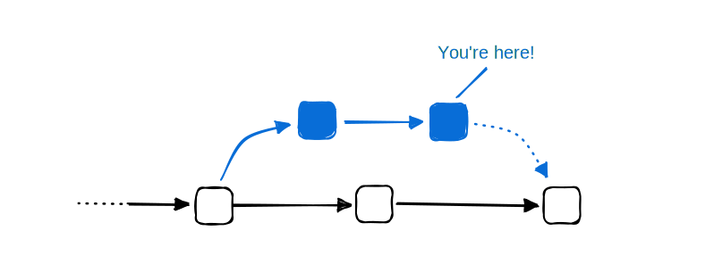

Continuous Integration（CI，持续集成）是开发流程中将代码变更持续合并到项目主分支的阶段。在此阶段，团队会运行测试与构建，以验证改动不会引入不期望或意外的行为。

即便最终不把应用打包为容器镜像，在这个阶段也有多种场景可以使用 Docker。

## 将 Docker 用作构建环境

容器提供可复现、相互隔离的环境，能够带来可预测的结果。在 Docker 容器中构建和测试应用，有助于预防意外行为的发生。通过 Dockerfile，你可以精确声明构建环境所需的内容，包括编程运行时、操作系统、二进制依赖等。

用 Docker 管理构建环境还能简化维护。例如，升级到新的编程运行时版本，通常只需在 Dockerfile 中更换一个标签或摘要（digest）。无需再 SSH 登录到一台手工维护的专用 VM，去手动重装并更新相关配置文件。

此外，就像你期望第三方开源包是安全的一样，构建环境也应如此。你可以像对待任何容器化应用一样，对构建器镜像进行扫描与索引。

以下链接展示了如何在 CI 中使用 Docker 构建你的应用：

- [GitHub Actions](https://docs.github.com/en/actions/creating-actions/creating-a-docker-container-action)
- [GitLab](https://docs.gitlab.com/runner/executors/docker.html)
- [Circle CI](https://circleci.com/docs/using-docker/)
- [Render](https://render.com/docs/docker)

### Docker in Docker

你也可以在容器化的构建环境中使用 Docker 来构建容器镜像。也就是说，构建环境本身运行在一个容器里，并具备执行 Docker 构建所需的能力。这种方式被称为“Docker in Docker”。

Docker 提供了一个官方的 [Docker 镜像](https://hub.docker.com/_/docker)，可直接用于该场景。

## 下一步

Docker 维护了一组官方的 GitHub Actions，可用于在 GitHub Actions 平台上构建、注解并推送容器镜像。参阅[GitHub Actions 简介](github-actions/_index.md)以了解更多并开始上手。
