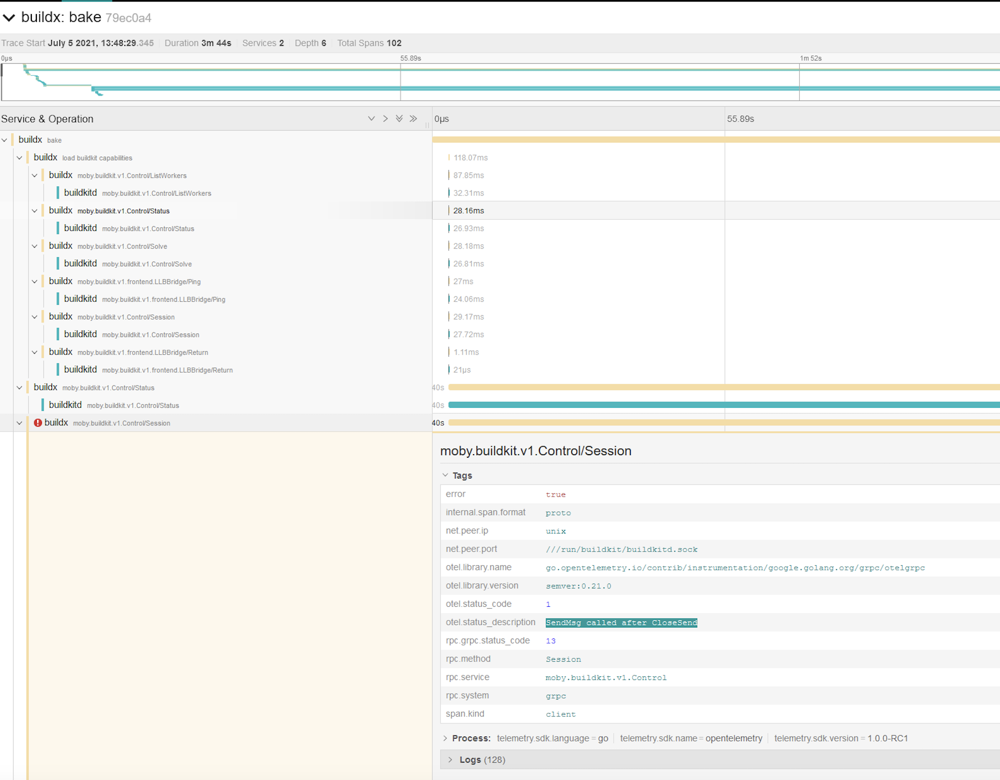

Buildx 与 BuildKit 均支持 [OpenTelemetry](https://opentelemetry.io/)。

要将追踪数据发送到 [Jaeger](https://github.com/jaegertracing/jaeger)，
请使用 `driver-opt` 设置 `JAEGER_TRACE` 环境变量为收集端地址。

首先，启动一个 Jaeger 容器：

```console
$ docker run -d --name jaeger -p "6831:6831/udp" -p "16686:16686" --restart unless-stopped jaegertracing/all-in-one
```

然后[创建一个 `docker-container` builder](/manuals/build/builders/drivers/docker-container.md)，
通过 `JAEGER_TRACE` 环境变量使用该 Jaeger 实例：

```console
$ docker buildx create --use \
  --name mybuilder \
  --driver docker-container \
  --driver-opt "network=host" \
  --driver-opt "env.JAEGER_TRACE=localhost:6831"
```

引导并[检查 `mybuilder`](/reference/cli/docker/buildx/inspect.md)：

```console
$ docker buildx inspect --bootstrap
```

现在，可在 `http://127.0.0.1:16686/` 查看 Buildx 命令的追踪信息：


