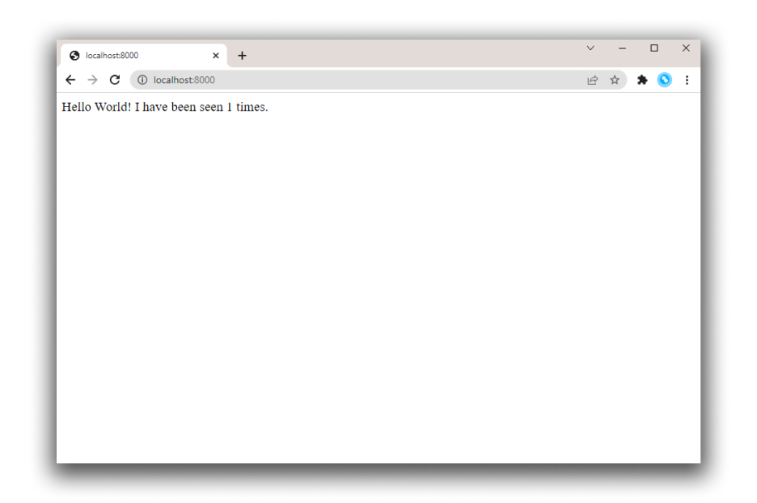

本教程将通过开发一个基础的 Python Web 应用，带你了解 Docker Compose 的基本概念。 

该应用使用 Flask 框架，并在 Redis 中实现一个访问计数器，展示了 Docker Compose 在 Web 开发场景中的实际用法。 

即使你不熟悉 Python，也能理解这里演示的概念。 

这是一份示例性（非规范性）的教程，用于演示 Compose 的核心功能。 

## 前提条件

请确保你已：

- [安装了最新版本的 Docker Compose](/manuals/compose/install/_index.md)
- 对 Docker 的基础概念与工作原理有基本了解

## 步骤 1：项目初始化

1. 为项目创建一个目录：

   ```console
   $ mkdir composetest
   $ cd composetest
   ```

2. 在项目目录中新建 `app.py`，并粘贴以下代码：

   ```python
   import time

   import redis
   from flask import Flask

   app = Flask(__name__)
   cache = redis.Redis(host='redis', port=6379)

   def get_hit_count():
       retries = 5
       while True:
           try:
               return cache.incr('hits')
           except redis.exceptions.ConnectionError as exc:
               if retries == 0:
                   raise exc
               retries -= 1
               time.sleep(0.5)

   @app.route('/')
   def hello():
       count = get_hit_count()
       return f'Hello World! I have been seen {count} times.\n'
    ```

   在此示例中，`redis` 是应用网络中 Redis 容器的主机名，使用默认端口 `6379`。

> [!NOTE]
>
> 注意 `get_hit_count` 的写法。这个简单的重试循环会在 Redis 服务不可用时多次尝试请求。
> 它在应用启动阶段很有用，也能在运行期间提升对 Redis 重启的容错性；在集群场景下，
> 也有助于应对节点之间的瞬时连接中断。

3. 在项目目录中新建 `requirements.txt`，并粘贴以下内容：

   ```text
   flask
   redis
   ```

4. 创建 `Dockerfile` 并粘贴以下内容：

   ```dockerfile
   # syntax=docker/dockerfile:1
   FROM python:3.10-alpine
   WORKDIR /code
   ENV FLASK_APP=app.py
   ENV FLASK_RUN_HOST=0.0.0.0
   RUN apk add --no-cache gcc musl-dev linux-headers
   COPY requirements.txt requirements.txt
   RUN pip install -r requirements.txt
   EXPOSE 5000
   COPY . .
   CMD ["flask", "run", "--debug"]
   ```

   

   这段文件的含义如下：

   * 基于 Python 3.10 镜像构建一个新镜像。
   * 将工作目录设置为 `/code`。
   * 设置 `flask` 命令所需的环境变量。
   * 安装 gcc 等依赖。
   * 复制 `requirements.txt` 并安装 Python 依赖。
   * 为镜像添加元数据，说明容器监听 5000 端口。
   * 将项目当前目录 `.` 复制到镜像内的工作目录 `.`。
   * 将容器的默认启动命令设置为 `flask run --debug`。

   

   > [!IMPORTANT]
   >
   > 请确认 `Dockerfile` 没有诸如 `.txt` 的扩展名。部分编辑器可能会自动追加扩展名，
   > 这会导致你在运行应用时出错。

   关于如何编写 Dockerfile，参见 [Dockerfile 参考](/reference/dockerfile/)。

## 步骤 2：在 Compose 文件中定义服务

Compose 简化了整个应用栈的管理，你可以在一个清晰易读的 YAML 配置文件中统一管理服务、网络和卷。

在项目目录中新建 `compose.yaml`，并粘贴以下内容：

```yaml
services:
  web:
    build: .
    ports:
      - "8000:5000"
  redis:
    image: "redis:alpine"
```

该 Compose 文件定义了两个服务：`web` 与 `redis`。 

其中，`web` 服务使用当前目录中的 `Dockerfile` 构建镜像；随后将容器端口映射到主机的 `8000` 端口。本示例使用 Flask Web 服务器的默认端口 `5000`。

而 `redis` 服务使用来自 Docker Hub 的公共 [Redis](https://registry.hub.docker.com/_/redis/) 
镜像。

关于 `compose.yaml` 的更多信息，参见《[Compose 的工作原理](compose-application-model.md)》。

## 步骤 3：使用 Compose 构建并运行应用

只需一条命令，你就可以根据配置文件创建并启动所有服务。

1. 在项目根目录执行 `docker compose up` 启动应用。

   ```console
   $ docker compose up

   Creating network "composetest_default" with the default driver
   Creating composetest_web_1 ...
   Creating composetest_redis_1 ...
   Creating composetest_web_1
   Creating composetest_redis_1 ... done
   Attaching to composetest_web_1, composetest_redis_1
   web_1    |  * Running on http://0.0.0.0:5000/ (Press CTRL+C to quit)
   redis_1  | 1:C 17 Aug 22:11:10.480 # oO0OoO0OoO0Oo Redis is starting oO0OoO0OoO0Oo
   redis_1  | 1:C 17 Aug 22:11:10.480 # Redis version=4.0.1, bits=64, commit=00000000, modified=0, pid=1, just started
   redis_1  | 1:C 17 Aug 22:11:10.480 # Warning: no config file specified, using the default config. In order to specify a config file use redis-server /path/to/redis.conf
   web_1    |  * Restarting with stat
   redis_1  | 1:M 17 Aug 22:11:10.483 * Running mode=standalone, port=6379.
   redis_1  | 1:M 17 Aug 22:11:10.483 # WARNING: The TCP backlog setting of 511 cannot be enforced because /proc/sys/net/core/somaxconn is set to the lower value of 128.
   web_1    |  * Debugger is active!
   redis_1  | 1:M 17 Aug 22:11:10.483 # Server initialized
   redis_1  | 1:M 17 Aug 22:11:10.483 # WARNING you have Transparent Huge Pages (THP) support enabled in your kernel. This will create latency and memory usage issues with Redis. To fix this issue run the command 'echo never > /sys/kernel/mm/transparent_hugepage/enabled' as root, and add it to your /etc/rc.local in order to retain the setting after a reboot. Redis must be restarted after THP is disabled.
   web_1    |  * Debugger PIN: 330-787-903
   redis_1  | 1:M 17 Aug 22:11:10.483 * Ready to accept connections
   ```

   Compose 会拉取 Redis 镜像、为你的代码构建镜像，并启动你定义的各个服务。
   本例中，代码会在构建阶段以静态复制的方式被打包进镜像。

2. 在浏览器访问 `http://localhost:8000/` 查看应用运行情况。

   若无法访问，也可尝试 `http://127.0.0.1:8000`。

   你应当在浏览器中看到类似信息：

   ```text
   Hello World! I have been seen 1 times.
   ```

   

3. 刷新页面。

   计数应当递增。

   ```text
   Hello World! I have been seen 2 times.
   ```

   

4. 切换到另一个终端，执行 `docker image ls` 列出本地镜像。

   此时应能看到 `redis` 与 `web`。

   ```console
   $ docker image ls

   REPOSITORY        TAG           IMAGE ID      CREATED        SIZE
   composetest_web   latest        e2c21aa48cc1  4 minutes ago  93.8MB
   python            3.4-alpine    84e6077c7ab6  7 days ago     82.5MB
   redis             alpine        9d8fa9aa0e5b  3 weeks ago    27.5MB
   ```

   可通过 `docker inspect <标签或 ID>` 查看镜像详情。

5. 停止应用：可以在第二个终端的项目目录执行 `docker compose down`，
   或在最初启动应用的终端中按下 `CTRL+C`。

## 步骤 4：编辑 Compose 文件以使用 Compose Watch

编辑项目中的 `compose.yaml`，启用 `watch`，这样当你编辑并保存代码时，运行中的 Compose 服务会自动更新，便于你预览变更：

```yaml
services:
  web:
    build: .
    ports:
      - "8000:5000"
    develop:
      watch:
        - action: sync
          path: .
          target: /code
  redis:
    image: "redis:alpine"
```

每当文件发生变化，Compose 会将其同步到容器内 `/code` 的对应位置。同步完成后，打包器会在无需重启的情况下更新正在运行的应用。

关于 Compose Watch 的工作方式，参见《[使用 Compose Watch](/manuals/compose/how-tos/file-watch.md)》。
或者参见《[在容器中管理数据](/manuals/engine/storage/volumes.md)》了解其他方案。

> [!NOTE]
>
> 为使本示例生效，`Dockerfile` 中添加了 `--debug` 选项。Flask 的 `--debug` 会启用代码自动重载，
> 使你无需重启或重建容器即可迭代后端 API。修改 `.py` 文件后，后续 API 调用将使用新代码，
> 但在本小示例中浏览器界面不会自动刷新。大多数前端开发服务器都原生支持可与 Compose 协作的实时刷新。

## 步骤 5：重新构建并在 watch 模式下运行应用

在项目目录执行 `docker compose watch` 或 `docker compose up --watch`，以构建并启动应用，并开启文件监视模式。

```console
$ docker compose watch
[+] Running 2/2
 ✔ Container docs-redis-1 Created                                                                                                                                                                                                        0.0s
 ✔ Container docs-web-1    Recreated                                                                                                                                                                                                      0.1s
Attaching to redis-1, web-1
         ⦿ watch enabled
...
```

再次在浏览器查看 `Hello World` 提示，并刷新以观察计数递增。

## 步骤 6：更新应用

体验 Compose Watch 的效果：

1. 修改 `app.py` 中的问候语并保存。例如，将 `Hello World!` 改为 `Hello from Docker!`：

   ```python
   return f'Hello from Docker! I have been seen {count} times.\n'
   ```

2. 在浏览器中刷新应用。问候语应当已更新，计数仍会继续递增。

   

3. 完成体验后，运行 `docker compose down` 结束。

## 步骤 7：拆分服务

使用多个 Compose 文件可以针对不同环境或工作流定制应用。这对由数十个容器组成、由多个团队协同维护的大型应用尤其有用。 

1. 在项目目录中新建一个名为 `infra.yaml` 的 Compose 文件。

2. 将 `compose.yaml` 中的 Redis 服务剪切并粘贴到新的 `infra.yaml` 中。注意在文件顶部添加顶级属性 `services`。你的 `infra.yaml` 应类似如下：

   ```yaml
   services:
     redis:
       image: "redis:alpine"
   ```

3. 在 `compose.yaml` 中，添加顶级属性 `include`，并引用 `infra.yaml` 的路径。

   ```yaml
   include:
      - infra.yaml
   services:
     web:
       build: .
       ports:
         - "8000:5000"
       develop:
         watch:
           - action: sync
             path: .
             target: /code
   ```

4. 运行 `docker compose up`，使用更新后的 Compose 文件构建并启动应用。你应能在浏览器中看到 `Hello world` 信息。 

这只是一个简化示例，但足以展示 `include` 的基本原理，以及它如何帮助将复杂应用模块化为多个子 Compose 文件。关于 `include` 与多 Compose 文件的更多信息，参见《[使用多个 Compose 文件](/manuals/compose/how-tos/multiple-compose-files/_index.md)》。

## 步骤 8：尝试其他命令

- 如需在后台运行服务，可为 `docker compose up` 添加 `-d`（分离模式），并用 `docker compose ps` 查看当前运行中的服务：

   ```console
   $ docker compose up -d

   Starting composetest_redis_1...
   Starting composetest_web_1...

   $ docker compose ps

          Name                      Command               State           Ports         
   -------------------------------------------------------------------------------------
   composetest_redis_1   docker-entrypoint.sh redis ...   Up      6379/tcp              
   composetest_web_1     flask run                        Up      0.0.0.0:8000->5000/tcp
   ```

- 运行 `docker compose --help` 查看其他可用命令。

- 若使用 `docker compose up -d` 启动，完成后可停止服务：

   ```console
   $ docker compose stop
   ```

- 使用 `docker compose down` 可以完全移除容器并清理环境。 

## 下一步

- 试试这些 [Compose 示例应用](https://github.com/docker/awesome-compose)
- [查看完整的 Compose 命令列表](/reference/cli/docker/compose.md)
- [查阅 Compose 文件参考](/reference/compose-file/_index.md)
- [在 LinkedIn Learning 上观看《Learning Docker Compose》课程](https://www.linkedin.com/learning/learning-docker-compose/)
