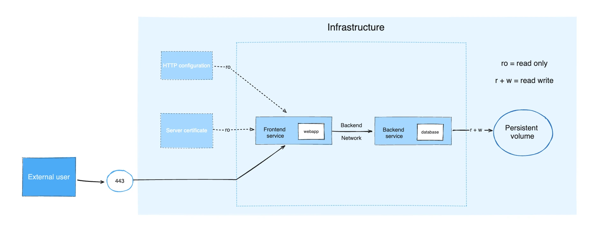

使用 Docker Compose 时，你会借助一个 YAML 配置文件（即[Compose 文件](#the-compose-file)）来定义应用的各个服务，然后通过 [Compose CLI](#cli) 根据配置创建并启动所有服务。

Compose 文件（`compose.yaml`）遵循[Compose 规范](/reference/compose-file/_index.md)来定义多容器应用。本文所述是 Docker Compose 对正式[Compose 规范](https://github.com/compose-spec/compose-spec)的实现。



应用的计算组件以[服务](/reference/compose-file/services.md)的形式定义。服务是一个抽象概念，平台通过运行同一容器镜像及其配置（一次或多次）来实现。

服务之间通过[网络](/reference/compose-file/networks.md)进行通信。在 Compose 规范中，网络是平台能力的抽象，用于在同一项目中的服务容器之间建立 IP 路由。

服务使用[卷](/reference/compose-file/volumes.md)存储与共享持久化数据。规范将此类数据描述为具备全局选项的高层级文件系统挂载。

部分服务需要与运行时或平台相关的配置数据。为此，规范定义了专门的 [configs](/reference/compose-file/configs.md) 概念。在容器内部，配置的表现类似卷——以文件形式挂载。但在平台层面，配置的定义方式有所不同。

[秘密](/reference/compose-file/secrets.md) 用于存放不应未经安全控制而暴露的敏感数据。Secrets 以文件的形式挂载到容器中供服务使用；鉴于其安全与平台特性，Compose 规范将其作为独立概念进行定义。

> [!NOTE]
>
> 对于卷、配置与秘密，你可以在顶层进行简要声明，再在服务级别补充平台特定的信息。

项目是在某个平台上对应用规范的一次独立部署。项目名称通过顶层属性 [`name`](/reference/compose-file/version-and-name.md) 指定，用于对资源进行分组，并将其与其他应用或同一应用的不同安装实例（参数不同）隔离开来。如果你在某个平台上创建资源，应当为资源名称添加项目名前缀，并设置标签 `com.docker.compose.project`。

Compose 允许设置自定义项目名并在运行时覆盖它，这样在同一基础设施上，只需传入不同的名称，就能在不修改 `compose.yaml` 的情况下部署两份实例。

 

## Compose 文件 {#the-compose-file}

Compose 文件的默认路径为工作目录下的 `compose.yaml`（推荐）或 `compose.yml`。
为向后兼容早期版本，还支持 `docker-compose.yaml` 与 `docker-compose.yml`。
如果两类文件同时存在，Compose 会优先使用规范的 `compose.yaml`。

你可以使用[片段](/reference/compose-file/fragments.md)与[扩展](/reference/compose-file/extension.md)来保持 Compose 文件的高效与易维护。

你可以将多个 Compose 文件[合并](/reference/compose-file/merge.md)来定义应用模型。YAML 的合并依据你设定的 Compose 文件顺序进行追加或覆盖：
简单属性与映射会被优先级更高的文件覆盖，列表通过追加进行合并。若被合并的补充文件位于其他目录，相关相对路径以第一个 Compose 文件的父目录为基准进行解析。由于某些 Compose 元素既可写作简单字符串也可写作复杂对象，合并时以展开后的形式为准。更多信息参见《[使用多个 Compose 文件](/manuals/compose/how-tos/multiple-compose-files/_index.md)》。

若希望复用其他 Compose 文件，或将应用模型的部分拆分到独立文件中，你也可以使用 [`include`](/reference/compose-file/include.md)。当你的 Compose 应用依赖于由其他团队维护的另一个应用，或需要共享某些模块时，这会非常有用。

## CLI {#cli}

通过 Docker CLI 的 `docker compose` 及其子命令，你可以与 Docker Compose 应用进行交互。若你使用 Docker Desktop，则默认已包含 Compose CLI。

借助 CLI，你可以管理 `compose.yaml` 中定义的多容器应用生命周期，轻松完成启动、停止与配置等操作。

### 常用命令 

启动 `compose.yaml` 中定义的所有服务：

```console
$ docker compose up
```

停止并移除正在运行的服务：

```console
$ docker compose down 
```

如需监控正在运行容器的输出并进行调试，可查看日志： 

```console
$ docker compose logs
```

列出所有服务及其当前状态：

```console
$ docker compose ps
```

完整命令列表参见《[命令参考](/reference/cli/docker/compose/_index.md)》。

## 示例说明

以下示例展示了上文提到的 Compose 概念。该示例仅用于说明，并非规范性内容。

假设一个应用由前端 Web 应用与后端服务构成。

前端在运行时通过由基础设施管理的 HTTP 配置文件进行配置，提供外部域名；同时平台会通过安全的秘密存储注入 HTTPS 服务器证书。

后端将数据存储在持久卷中。

两个服务通过隔离的后端网络互通；前端同时连接到前端网络，并对外暴露 443 端口。



该示例应用由以下部分组成：

- 两个使用 Docker 镜像的服务：`webapp` 与 `database`
- 一个秘密（HTTPS 证书），注入到前端
- 一个配置（HTTP），注入到前端
- 一个持久卷，挂载到后端
- 两个网络

```yml
services:
  frontend:
    image: example/webapp
    ports:
      - "443:8043"
    networks:
      - front-tier
      - back-tier
    configs:
      - httpd-config
    secrets:
      - server-certificate

  backend:
    image: example/database
    volumes:
      - db-data:/etc/data
    networks:
      - back-tier

volumes:
  db-data:
    driver: flocker
    driver_opts:
      size: "10GiB"

configs:
  httpd-config:
    external: true

secrets:
  server-certificate:
    external: true

networks:
  # 仅需声明这些对象即可完成定义
  front-tier: {}
  back-tier: {}
```

`docker compose up` 会启动 `frontend` 与 `backend` 服务，创建所需的网络与卷，并将配置与秘密注入到前端服务中。

`docker compose ps` 提供服务当前状态的快照，便于查看哪些容器正在运行、状态如何，以及使用的端口：

```text
$ docker compose ps

NAME                IMAGE                COMMAND                  SERVICE             CREATED             STATUS              PORTS
example-frontend-1  example/webapp       "nginx -g 'daemon of…"   frontend            2 minutes ago       Up 2 minutes        0.0.0.0:443->8043/tcp
example-backend-1   example/database     "docker-entrypoint.s…"   backend             2 minutes ago       Up 2 minutes
```

## 下一步 

- [试试快速开始](/manuals/compose/gettingstarted.md)
- [查看一些示例应用](/manuals/compose/support-and-feedback/samples-for-compose.md)
- [熟悉 Compose 规范](/reference/compose-file/_index.md)
