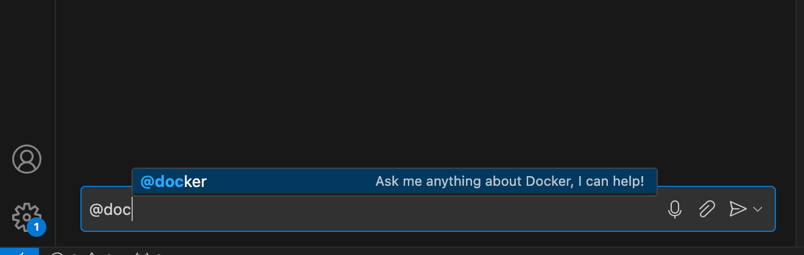



Docker for GitHub Copilot 扩展提供了一个聊天界面，您可以使用它与 Docker 代理交互。您可以提出问题并获取项目容器化的帮助。

Docker 代理经过训练，能够理解与 Docker 相关的问题，并为 Dockerfile、Docker Compose 文件和其他 Docker 资源提供指导。

## 设置

在开始与 Docker 代理交互之前，请确保您已为您的组织[安装](./install.md)了该扩展。

### 在编辑器或 IDE 中启用 GitHub Copilot 聊天

有关如何在您的编辑器中使用 Docker for GitHub Copilot 扩展的说明，请参阅：

- [Visual Studio Code](https://docs.github.com/en/copilot/github-copilot-chat/copilot-chat-in-ides/using-github-copilot-chat-in-your-ide?tool=vscode)
- [Visual Studio](https://docs.github.com/en/copilot/github-copilot-chat/copilot-chat-in-ides/using-github-copilot-chat-in-your-ide?tool=visualstudio)
- [Codespaces](https://docs.github.com/en/codespaces/reference/using-github-copilot-in-github-codespaces)

### 验证设置

您可以通过在 Copilot 聊天窗口中输入 `@docker` 来验证扩展是否已正确安装。当您输入时，应该会看到 Docker 代理出现在聊天界面中。

首次与代理交互时，系统会提示您登录并使用您的 Docker 账户授权 Copilot 扩展。

## 在编辑器中提出 Docker 问题

要在编辑器或 IDE 中与 Docker 代理交互：

1. 在编辑器中打开您的项目。
2. 打开 Copilot 聊天界面。
3. 通过标记 `@docker` 来与 Docker 代理交互，然后输入您的问题。

## 在 GitHub.com 上提出 Docker 问题

要通过 GitHub Web 界面与 Docker 代理交互：

1. 访问 [github.com](https://github.com/) 并登录您的账户。
2. 进入任何仓库。
3. 选择站点菜单中的 Copilot 徽标，或选择浮动的 Copilot 小部件，以打开聊天界面。

   

4. 通过标记 `@docker` 来与 Docker 代理交互，然后输入您的问题。
