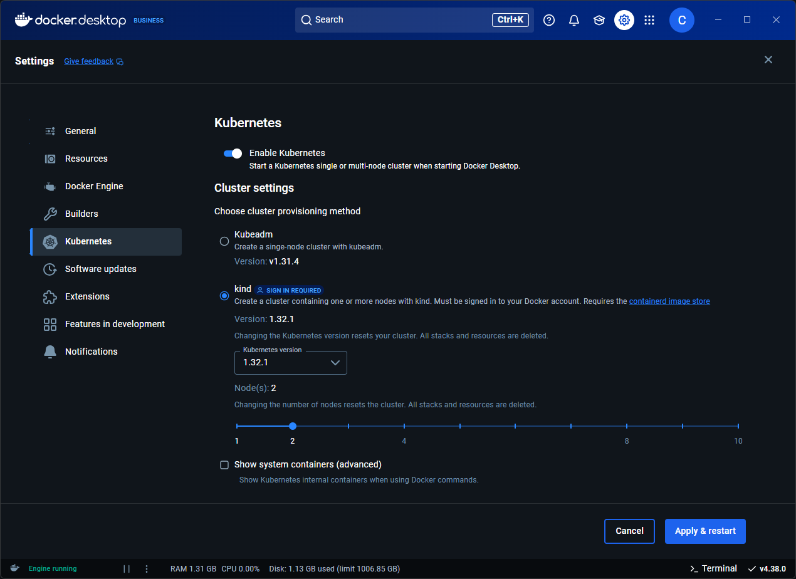

Docker Desktop 内置独立的 Kubernetes 服务器与客户端，并与 Docker CLI 集成，使你可以在本机直接进行 Kubernetes 的本地开发与测试。

Kubernetes 服务器以单节点或多节点集群的形式在 Docker 容器中运行。该轻量化方案便于你探索 Kubernetes 功能、测试工作负载，并可与其他 Docker 能力并行使用。

Docker Desktop 上的 Kubernetes 可与其他工作负载并行运行，包括 Swarm 服务与独立容器。



## 在 Docker Desktop 中启用 Kubernetes 会发生什么？

在 Docker Desktop 的后端与虚拟机中会触发以下操作：

- 生成证书与集群配置
- 下载并安装 Kubernetes 的内部组件
- 启动集群
- 安装用于网络与存储的额外控制器

在 Docker Desktop 中开启或关闭 Kubernetes 服务器，不会影响其他工作负载。

## 安装并开启 Kubernetes

1. 打开 Docker Desktop 仪表板并进入 **Settings**。
2. 选择 **Kubernetes** 选项卡。
3. 打开 **Enable Kubernetes** 开关。
4. 选择你的[集群初始化方式](#cluster-provisioning-method)。
5. 点击 **Apply** 保存设置。

此操作会准备以容器形式运行 Kubernetes 服务器所需的镜像，并在你的系统中安装 `kubectl` 命令行工具：Mac 安装到 `/usr/local/bin/kubectl`，Windows 安装到 `C:\Program Files\Docker\Docker\resources\bin\kubectl.exe`。

   > [!NOTE]
   >
   > Linux 版 Docker Desktop 默认不包含 `kubectl`。你可以按照 [Kubernetes 安装指南](https://kubernetes.io/docs/tasks/tools/install-kubectl-linux/) 单独安装。请确保 `kubectl` 可执行文件位于 `/usr/local/bin/kubectl`。

启用 Kubernetes 后，其状态会显示在 Docker Desktop 仪表板页脚与 Docker 菜单中。

你可以使用以下命令查看当前 Kubernetes 版本：

```console
$ kubectl version
```

### 集群初始化方式

Docker Desktop 的 Kubernetes 可通过 `kubeadm` 或 `kind` 进行集群初始化。

`kubeadm` 是较早的初始化方式。它仅支持单节点集群，无法选择 Kubernetes 版本，初始化速度慢于 `kind`，且不受 [增强容器隔离](/manuals/enterprise/security/hardened-desktop/enhanced-container-isolation/index.md)（ECI）保护（即开启 ECI 时集群可以工作，但不受 ECI 保护）。

`kind` 是较新的初始化方式，登录账户并使用 Docker Desktop 4.38 或更高版本即可使用。它支持多节点集群（更贴近真实环境），可选择 Kubernetes 版本，初始化速度快于 `kubeadm`，并受 ECI 保护（即开启 ECI 后，Kubernetes 集群运行在非特权 Docker 容器中，更加安全）。注意：`kind` 要求 Docker Desktop 配置为使用 [containerd 镜像存储](containerd.md)（在 4.34 及更高版本中为默认）。

下表总结了两者的对比：

| 特性 | `kubeadm` | `kind` |
| :------ | :-----: | :--: |
| 可用性 | Docker Desktop 4.0+ | Docker Desktop 4.38+（需登录） |
| 多节点集群支持 | 否 | 是 |
| 可选择 Kubernetes 版本 | 否 | 是 |
| 初始化速度 | 约 1 分钟 | 约 30 秒 |
| 支持 ECI | 否 | 是 |
| 兼容 containerd 镜像存储 | 是 | 是 |
| 兼容 Docker 镜像存储 | 是 | 否 |

## 使用 kubectl 命令

Kubernetes 集成会自动安装 Kubernetes CLI：在 Mac 上位于 `/usr/local/bin/kubectl`，在 Windows 上位于 `C:\Program Files\Docker\Docker\Resources\bin\kubectl.exe`。该路径可能不在你的 shell `PATH` 变量中，你可能需要输入完整路径或将其加入 `PATH`。

如果你已安装过 `kubectl`，并且其当前指向其他环境（如 `minikube` 或 Google Kubernetes Engine 集群），请切换上下文，使其指向 `docker-desktop`：

```console
$ kubectl config get-contexts
$ kubectl config use-context docker-desktop
```

> [!TIP]
>
> 如果 `kubectl` config get-contexts 返回空结果，尝试：
>
> - 在命令提示符或 PowerShell 中执行命令。
> - 设置 `KUBECONFIG` 环境变量，指向你的 `.kube/config` 文件。

### 验证安装

要确认 Kubernetes 正在运行，可列出可用节点：

```console
$ kubectl get nodes
NAME                 STATUS    ROLES            AGE       VERSION
docker-desktop       Ready     control-plane    3h        v1.29.1
```

如果你通过 Homebrew 或其他方式安装了 `kubectl` 并发生冲突，请删除 `/usr/local/bin/kubectl`。

关于 `kubectl` 的更多信息，请参阅
[`kubectl` 文档](https://kubernetes.io/docs/reference/kubectl/overview/)。

## 升级集群

Kubernetes 集群不会随 Docker Desktop 升级而自动更新。若需升级集群，请在设置中手动选择 **Reset Kubernetes Cluster**。

## 其他设置

### 查看系统容器

默认情况下，Kubernetes 系统容器处于隐藏状态。若需查看这些容器，请启用 **Show system containers (advanced)**。

此后，你可以通过 `docker ps` 或在 Docker Desktop 仪表板中查看正在运行的 Kubernetes 容器。

### 为 Kubernetes 控制平面镜像配置自定义镜像仓库

Docker Desktop 通过容器运行 Kubernetes 控制平面。默认情况下，Docker Desktop 会从 Docker Hub 拉取相关的容器镜像。具体拉取哪些镜像取决于[集群初始化方式](#cluster-provisioning-method)。

例如，在 `kind` 模式下需要以下镜像：

```console
docker.io/kindest/node:<tag>
docker.io/envoyproxy/envoy:<tag>
docker.io/docker/desktop-cloud-provider-kind:<tag>
docker.io/docker/desktop-containerd-registry-mirror:<tag>
```

在 `kubeadm` 模式下需要以下镜像：

```console
docker.io/registry.k8s.io/kube-controller-manager:<tag>
docker.io/registry.k8s.io/kube-apiserver:<tag>
docker.io/registry.k8s.io/kube-scheduler:<tag>
docker.io/registry.k8s.io/kube-proxy
docker.io/registry.k8s.io/etcd:<tag>
docker.io/registry.k8s.io/pause:<tag>
docker.io/registry.k8s.io/coredns/coredns:<tag>
docker.io/docker/desktop-storage-provisioner:<tag>
docker.io/docker/desktop-vpnkit-controller:<tag>
docker.io/docker/desktop-kubernetes:<tag>
```

镜像的标签由 Docker Desktop 根据多种因素自动选择，包括所使用的 Kubernetes 版本。不同镜像的标签并不相同。

对于无法访问 Docker Hub 的场景，管理员可以通过 [KubernetesImagesRepository](/manuals/enterprise/security/hardened-desktop/settings-management/configure-json-file.md#kubernetes) 设置，将上述镜像改为从其他镜像仓库（例如镜像站）拉取。

镜像名称可拆分为 `[registry[:port]/][namespace/]repository[:tag]` 组成部分。
`KubernetesImagesRepository` 允许你覆盖镜像名称中的 `[registry[:port]/][namespace]` 部分。

例如，若 Docker Desktop Kubernetes 处于 `kind` 模式，并将 `KubernetesImagesRepository` 设置为 `my-registry:5000/kind-images`，则 Docker Desktop 将从以下地址拉取镜像：

```console
my-registry:5000/kind-images/node:<tag>
my-registry:5000/kind-images/envoy:<tag>
my-registry:5000/kind-images/desktop-cloud-provider-kind:<tag>
my-registry:5000/kind-images/desktop-containerd-registry-mirror:<tag>
```

这些镜像应从 Docker Hub 上相应的镜像进行克隆或镜像，且标签必须与 Docker Desktop 的期望一致。

推荐的配置步骤如下：

1) 启动 Docker Desktop。

2) 在 Settings > Kubernetes 中启用 *Show system containers* 设置。

3) 在 Settings > Kubernetes 中，使用所需的集群初始化方式启动 Kubernetes：`kubeadm` 或 `kind`。

4) 等待 Kubernetes 启动完成。

5) 使用 `docker ps` 查看 Docker Desktop 的 Kubernetes 控制平面所使用的容器镜像。

6) 将这些镜像（包含匹配的标签）克隆/镜像到你的自定义镜像仓库。

7) 停止 Kubernetes 集群。

8) 配置 `KubernetesImagesRepository`，指向你的自定义仓库。

9) 重启 Docker Desktop。

10) 使用 `docker ps` 验证 Kubernetes 集群是否使用了自定义仓库镜像。

> [!NOTE]
>
> `KubernetesImagesRepository` 仅适用于 Docker Desktop 用于搭建 Kubernetes 集群的控制平面镜像，对其他 Kubernetes Pod 无影响。

> [!NOTE]
>
> 在 Docker Desktop 4.43 或更早版本中，若使用了 `KubernetesImagesRepository` 且启用了 [增强容器隔离（ECI）](/manuals/enterprise/security/hardened-desktop/enhanced-container-isolation/_index.md)，需要将以下镜像加入[ECI Docker 套接字挂载镜像列表](/manuals/enterprise/security/hardened-desktop/settings-management/configure-json-file.md#enhanced-container-isolation)：
>
> `[imagesRepository]/desktop-cloud-provider-kind:`
> `[imagesRepository]/desktop-containerd-registry-mirror:`
>
> 这些容器会挂载 Docker 套接字，因此必须将镜像加入 ECI 镜像列表。否则，ECI 将阻止挂载，Kubernetes 将无法启动。

## 故障排查

- 如果 Kubernetes 启动失败，请确保 Docker Desktop 分配了足够的资源。检查 **Settings** > **Resources**。
- 如果 `kubectl` 命令报错，确认上下文是否设置为 `docker-desktop`
   ```console
   $ kubectl config use-context docker-desktop
   ```
   若已启用相关设置，可尝试查看[系统容器日志](#viewing-system-containers)。
- 如果升级后遇到集群问题，请重置 Kubernetes 集群。重置可将集群还原到干净状态，清除可能导致问题的错误配置、损坏数据或卡住的资源。若问题仍存，在清理数据后重启 Docker Desktop。

## 关闭并卸载 Kubernetes

在 Docker Desktop 中关闭 Kubernetes：

1. 在 Docker Desktop 仪表板中，选择 **Settings** 图标。
2. 选择 **Kubernetes** 选项卡。
3. 取消勾选 **Enable Kubernetes**。
4. 点击 **Apply** 保存设置。此操作会停止并移除 Kubernetes 容器，同时移除 `/usr/local/bin/kubectl` 命令。
