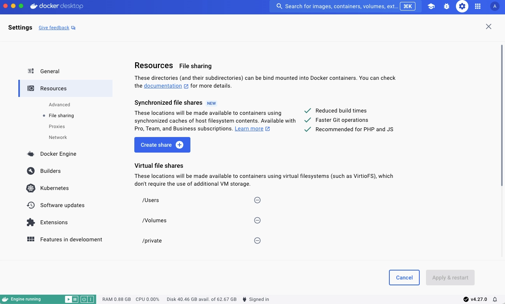



同步文件共享是一种替代性的文件共享机制，提供快速而灵活的主机到虚拟机的文件共享，并通过同步的文件系统缓存提升绑定挂载（bind mount）的性能。

 
## 适用人群

同步文件共享非常适合以下类型的开发者： 
- 拥有大型仓库或 monorepo（文件数超过 10 万个，体量达数百 MB 甚至 GB）。
- 使用 VirtioFS、gRPC FUSE、osxfs 等虚拟文件系统，且这些方案在当前代码规模下扩展性已不足。
- 经常遭遇文件共享带来的性能瓶颈。
- 不希望操心文件属主问题，或在修改多个容器时花费时间处理属主信息冲突。

## 工作原理

同步文件共享的行为与虚拟文件共享类似，但它利用高性能、低延迟的代码同步引擎，在 Docker Desktop VM 内的 ext4 文件系统上创建主机文件的同步缓存。无论你在主机还是在 VM 中的容器里进行文件系统更改，都会通过双向同步进行传播。

创建文件共享实例后，凡是使用绑定挂载且其宿主机路径与指定的同步文件共享位置（或其子目录）匹配的容器，都会自动启用同步文件共享功能。不满足该条件的绑定挂载将回退到常规虚拟文件系统的[绑定挂载机制](/manuals/engine/storage/bind-mounts.md)，例如 VirtioFS 或 gRPC-FUSE。

> [!NOTE]
>
> 在 Docker Desktop 中，Kubernetes 的 `hostPath` 卷不会使用同步文件共享。

> [!IMPORTANT]
>
> 同步文件共享在 WSL 环境或使用 Windows 容器时不可用。 

## 创建文件共享实例 

创建文件共享实例：
1. 登录 Docker Desktop。
2. 在 **Settings** 中，进入 **Resources** 下的 **File sharing** 选项卡。 
3. 在 **Synchronized file shares** 区域选择 **Create share**。
4. 选择要共享的主机文件夹。同步文件共享将初始化并可用。

首次创建时需要数秒来初始化，因为系统会将文件复制到 Docker Desktop VM。在此期间，状态指示会显示 **Preparing**。Docker Desktop 仪表板页脚也会显示状态图标以便查看进度。

当状态指示显示 **Watching for filesystem changes** 时，你的文件即可通过所有标准的绑定挂载机制供 VM 使用，无论是命令行中的 `-v`，还是在 `compose.yml` 中指定的挂载。

> [!NOTE]
>
> 在创建新服务时，如果将[绑定挂载的一致性选项](/reference/cli/docker/service/create.md#options-for-bind-mounts)设置为 `:consistent`，会绕过同步文件共享。 

> [!TIP]
>
> Docker Compose 可以为绑定挂载自动创建文件共享。
> 请确保你已登录具有付费订阅的 Docker 账户，并已在 Docker Desktop 设置中启用 **Access experimental features** 与 **Manage Synchronized file shares with Compose**。

## 查看文件共享实例

**Synchronized file shares** 区域会展示你创建的所有文件共享实例，并提供以下信息：
- 文件共享内容的来源
- 实时状态
- 每个文件共享占用的空间大小
- 文件系统条目数量
- 符号链接数量
- 正在使用该文件共享实例的容器

选择某个文件共享实例可展开下拉面板查看上述信息。

## 使用 `.syncignore`

你可以在每个文件共享的根目录放置 `.syncignore` 文件，以将本地文件排除在共享实例之外。其语法与 `.dockerignore` 相同，可用于排除或重新包含路径；放在根目录之外的位置将不会被识别。
 
你可能希望在 `.syncignore` 中加入以下示例条目：
- 体积较大的依赖目录，例如 `node_modules` 与 `composer` 目录（除非需要通过绑定挂载访问它们）
- `.git` 目录（除非确有需要）

总体来说，建议将与你的工作流非关键、且同步速度较慢或占用大量存储的内容排除在外。

## 已知问题

- 修改 `.syncignore` 并不会立刻触发删除，除非重新创建文件共享实例。换言之，由于 `.syncignore` 变更而新近被忽略的文件会保留在当前位置，但在随后的同步中将不再更新。

- 每个文件共享实例目前大约限制在 200 万个文件以内。为获得最佳性能，若接近该规模，建议按各绑定挂载位置拆分为多个共享实例。

- 由于 Linux 区分大小写，而 macOS/Windows 仅保留大小写，可能出现大小写冲突，并在 GUI 中显示为 **File exists**。一般可忽略；若持续出现，可反馈问题。

- 同步文件共享会主动报告临时性问题，因此在同步期间，GUI 中偶尔会出现 **Conflict** 或 **Problem** 指示。一般可忽略；若持续出现，可反馈问题。

- 在 Windows 上如果从 WSL2 切换到 Hyper-V，需要完全重启 Docker Desktop。

- 不支持 POSIX 风格的 Windows 路径。请避免在 Docker Compose 中设置 [`COMPOSE_CONVERT_WINDOWS_PATHS`](/manuals/compose/how-tos/environment-variables/envvars.md#compose_convert_windows_paths) 环境变量。

- 如果没有创建符号链接的权限，而容器尝试在文件共享实例中创建符号链接，会出现 **unable to create symbolic link** 错误。Windows 用户请参阅微软的[创建符号链接文档](https://learn.microsoft.com/en-us/previous-versions/windows/it-pro/windows-10/security/threat-protection/security-policy-settings/create-symbolic-links)，了解最佳实践与 **Create symbolic links** 安全策略设置的位置。Mac 与 Linux 用户请检查对该文件夹是否拥有写权限。
