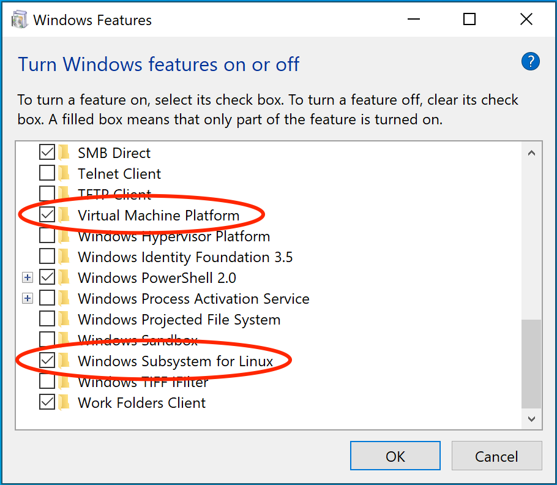
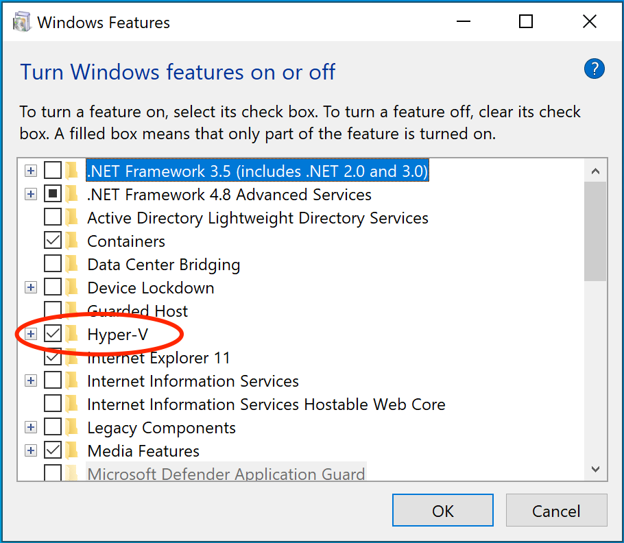

> [!TIP]
>
> 如果在故障排查中没有找到解决方案，可以浏览 GitHub 代码仓库或创建新的 issue：
>
> - [docker/for-mac](https://github.com/docker/for-mac/issues)
> - [docker/for-win](https://github.com/docker/for-win/issues)
> - [docker/for-linux](https://github.com/docker/for-linux/issues)

## 所有平台通用主题

### 证书配置不正确

#### 错误消息

使用 `docker run` 从仓库拉取镜像时，可能会遇到以下错误：

```console
Error response from daemon: Get http://192.168.203.139:5858/v2/: malformed HTTP response "\x15\x03\x01\x00\x02\x02"
```

此外，仓库的日志可能显示：

```console
2017/06/20 18:15:30 http: TLS handshake error from 192.168.203.139:52882: tls: client didn't provide a certificate
2017/06/20 18:15:30 http: TLS handshake error from 192.168.203.139:52883: tls: first record does not look like a TLS handshake
```

#### 可能原因

- Docker Desktop 会忽略列在不安全仓库中的证书。
- 客户端证书不会发送到不安全的仓库，导致握手失败。

#### 解决方案

- 确保您的仓库已正确配置有效的 SSL 证书。
- 如果您的仓库使用自签名证书，请将证书添加到 Docker 的证书目录（Linux 上为 /etc/docker/certs.d/）以配置 Docker 信任该证书。
- 如果问题仍然存在，请检查您的 Docker 守护进程配置并启用 TLS 身份验证。

### Docker Desktop 界面显示为绿色、扭曲或出现视觉错误

#### 原因

Docker Desktop 默认使用硬件加速图形，这可能会导致某些 GPU 出现问题。

#### 解决方案

禁用硬件加速：

1. 编辑 Docker Desktop 的 `settings-store.json` 文件（对于 Docker Desktop 4.34 及更早版本为 `settings.json`）。您可以在以下位置找到此文件：

   - Mac：`~/Library/Group Containers/group.com.docker/settings-store.json`
   - Windows：`C:\Users\[USERNAME]\AppData\Roaming\Docker\settings-store.json`
   - Linux：`~/.docker/desktop/settings-store.json.`

2. 添加以下条目：

   ```JSON
   $ "disableHardwareAcceleration": true
   ```

3. 保存文件并重启 Docker Desktop。

### 使用挂载卷时出现运行时错误，提示找不到应用程序文件、拒绝访问卷挂载或服务无法启动

#### 原因

如果您的项目目录位于主目录（`/home/<user>`）之外，Docker Desktop 需要文件共享权限才能访问它。

#### 解决方案

在 Docker Desktop for Mac 和 Linux 中启用文件共享：

1. 导航到**设置**，选择**资源**，然后选择**文件共享**。
2. 添加包含 Dockerfile 和卷挂载路径的驱动器或文件夹。

在 Docker Desktop for Windows 中启用文件共享：

1. 在**设置**中，选择**共享文件夹**。
2. 共享包含 Dockerfile 和卷挂载路径的文件夹。

### `port already allocated` 错误

#### 错误消息

启动容器时，您可能会看到类似以下的错误：

```text
Bind for 0.0.0.0:8080 failed: port is already allocated
```

或

```text
listen tcp:0.0.0.0:8080: bind: address is already in use
```

#### 原因

- 系统上的另一个应用程序已经在使用指定的端口。
- 之前运行的容器未正确停止，仍然绑定到该端口。

#### 解决方案

要查找使用该端口的软件，可以采用以下任一方法：
- 使用 `resmon.exe` GUI，选择**网络**，然后选择**侦听端口**
- 在 PowerShell 中，使用 `netstat -aon | find /i "listening "` 来查找当前使用该端口的进程 PID（PID 是最右列的数字）。

然后，决定是关闭另一个进程，还是在 Docker 应用中使用不同的端口。

## Linux 和 Mac 主题

### Docker Desktop 在 Mac 或 Linux 平台上启动失败

#### 错误消息

由于 Unix 域套接字路径长度限制，Docker 启动失败：

```console
[vpnkit-bridge][F] listen unix <HOME>/Library/Containers/com.docker.docker/Data/http-proxy-control.sock: bind: invalid argument
```

```console
[com.docker.backend][E] listen(vsock:4099) failed: listen unix <HOME>/Library/Containers/com.docker.docker/Data/vms/0/00000002.00001003: bind: invalid argument
```

#### 原因

在 Mac 和 Linux 上，Docker Desktop 会创建用于进程间通信的 Unix 域套接字。这些套接字在用户的主目录下创建。

Unix 域套接字有最大路径长度限制：
 - Mac 上为 104 个字符
 - Linux 上为 108 个字符

如果您的主目录路径太长，Docker Desktop 将无法创建必要的套接字。

#### 解决方案

确保您的用户名足够短，以保持路径在允许的限制内：
 - Mac：用户名应 ≤ 33 个字符
 - Linux：用户名应 ≤ 55 个字符

## Mac 专属主题

### 升级需要管理员权限

#### 原因

在 macOS 上，没有管理员权限的用户无法从 Docker Desktop Dashboard 执行应用内升级。

#### 解决方案

> [!IMPORTANT]
>
> 不要在升级前卸载当前版本。这样做会删除所有本地 Docker 容器、镜像和卷。

升级 Docker Desktop：

- 请管理员在现有版本上安装新版本。
- 如果适合您的配置，可以使用 [`--user` 安装标志](/manuals/desktop/setup/install/mac-install.md#security-and-access)。

### 持续收到通知，提示某个应用程序更改了我的 Desktop 配置

#### 原因

您收到此通知是因为配置完整性检查功能检测到第三方应用程序更改了您的 Docker Desktop 配置。这通常是由于符号链接不正确或缺失导致的。该通知确保您了解这些更改，以便您可以检查并修复任何潜在问题，从而保持系统可靠性。

打开通知会显示一个弹出窗口，其中提供有关检测到的完整性问题的详细信息。

#### 解决方案

如果您选择忽略该通知，它只会在下次 Docker Desktop 启动时再次显示。如果您选择修复配置，则不会再次提示。

如果您想关闭配置完整性检查通知，请导航到 Docker Desktop 的设置，在**常规**选项卡中，清除**自动检查配置**设置。 

### 退出应用后 `com.docker.vmnetd` 仍在运行

特权帮助进程 `com.docker.vmnetd` 由 `launchd` 启动并在后台运行。除非 `Docker.app` 连接到它，否则该进程不会消耗任何资源，因此可以安全地忽略它。

### 检测到不兼容的 CPU

#### 原因

Docker Desktop 需要支持虚拟化的处理器（CPU），更具体地说，需要支持 [Apple Hypervisor 框架](https://developer.apple.com/library/mac/documentation/DriversKernelHardware/Reference/Hypervisor/)。

#### 解决方案

检查以下内容：

 - 您已为您的架构安装了正确的 Docker Desktop
 - 您的 Mac 支持 Apple 的 Hypervisor 框架。要检查您的 Mac 是否支持 Hypervisor 框架，请在终端窗口中运行以下命令。

   ```console
   $ sysctl kern.hv_support
   ```

   如果您的 Mac 支持 Hypervisor 框架，该命令会输出 `kern.hv_support: 1`。

   如果不支持，该命令会输出 `kern.hv_support: 0`。

另请参阅 Apple 文档中的 [Hypervisor Framework Reference](https://developer.apple.com/library/mac/documentation/DriversKernelHardware/Reference/Hypervisor/) 以及 Docker Desktop [Mac 系统要求](/manuals/desktop/setup/install/mac-install.md#system-requirements)。

### VPNKit 持续出现故障

#### 原因

在 Docker Desktop 4.19 版本中，gVisor 取代了 VPNKit，以在 macOS 13 及更高版本上使用虚拟化框架时增强 VM 网络性能。

#### 解决方案

要继续使用 VPNKit：

1. 打开位于 `~/Library/Group Containers/group.com.docker/settings-store.json` 的 `settings-store.json` 文件
2. 添加：

   ```JSON
   $ "networkType":"vpnkit"
   ```
3. 保存文件并重启 Docker Desktop。

## Windows 专属主题

### 安装杀毒软件时 Docker Desktop 启动失败

#### 原因

某些杀毒软件可能与 Hyper-V 和 Microsoft Windows 10 版本不兼容。冲突通常发生在 Windows 更新之后，表现为 Docker 守护进程的错误响应和 Docker Desktop 启动失败。

#### 解决方案

作为临时解决方法，可以卸载杀毒软件，或将 Docker 添加到杀毒软件的排除/例外列表中。

### 共享卷的数据目录权限错误

#### 原因

从 Windows 共享文件时，Docker Desktop 会将[共享卷](/manuals/desktop/settings-and-maintenance/settings.md#file-sharing)的权限设置为默认值 [0777](https://chmodcommand.com/chmod-0777/)（对 `user` 和 `group` 具有 `read`、`write`、`execute` 权限）。

共享卷的默认权限不可配置。

#### 解决方案

如果您使用的应用程序需要不同的权限，可以采用以下任一方法：
 - 使用非主机挂载的卷
 - 找到一种方法使应用程序能够使用默认文件权限

### 意外的语法错误，容器中的文件请使用 Unix 风格的行尾

#### 原因

Docker 容器期望使用 Unix 风格的行尾 `\n`，而不是 Windows 风格的 `\r\n`。这包括在命令行中引用的构建文件以及 Docker 文件中 RUN 命令中的文件。

在使用 Windows 工具编写 shell 脚本等文件时请记住这一点，因为默认情况下可能使用 Windows 风格的行尾。这些命令最终会被传递给基于 Unix 的容器内的 Unix 命令（例如，传递给 `/bin/sh` 的 shell 脚本）。如果使用 Windows 风格的行尾，`docker run` 会因语法错误而失败。

#### 解决方案

 - 使用以下命令将文件转换为 Unix 风格的行尾：
   
   ```console
   $ dos2unix script.sh
   ```
- 在 VS Code 中，将行尾设置为 `LF`（Unix）而不是 `CRLF`（Windows）。

### Windows 上的路径转换错误

#### 原因

与 Linux 不同，Windows 需要显式的路径转换才能进行卷挂载。

在 Linux 上，系统会自动处理将一个路径挂载到另一个路径。例如，当您在 Linux 上运行以下命令时：

```console
$ docker run --rm -ti -v /home/user/work:/work alpine
```

它会在目标容器中添加一个 `/work` 目录来镜像指定的路径。

#### 解决方案

更新源路径。例如，如果您使用的是传统 Windows shell（`cmd.exe`），可以使用以下命令：

```console
$ docker run --rm -ti -v C:\Users\user\work:/work alpine
```

这将启动容器并确保卷可用。这是可行的，因为 Docker Desktop 会检测 Windows 风格的路径并提供适当的转换来挂载目录。

Docker Desktop 还允许您使用 Unix 风格的路径转换为适当的格式。例如：

```console
$ docker run --rm -ti -v /c/Users/user/work:/work alpine ls /work
```

### Git Bash 中 Docker 命令失败

#### 错误消息

```console
$ docker run --rm -ti -v C:\Users\user\work:/work alpine
docker: Error response from daemon: mkdir C:UsersUserwork: Access is denied.
```

```console
$ docker run --rm -ti -v $(pwd):/work alpine
docker: Error response from daemon: OCI runtime create failed: invalid mount {Destination:\Program Files\Git\work Type:bind Source:/run/desktop/mnt/host/c/Users/user/work;C Options:[rbind rprivate]}: mount destination \Program Files\Git\work not absolute: unknown.
```

#### 原因

Git Bash（或 MSYS）在 Windows 上提供类似 Unix 的环境。这些工具会对命令行应用自己的预处理。

这会影响 `$(pwd)`、冒号分隔的路径和波浪号（`~`）

此外，`\` 字符在 Git Bash 中有特殊含义。

#### 解决方案

 - 临时禁用 Git Bash 路径转换。例如，在禁用 MSYS 路径转换的情况下运行命令：
    ```console
    $ MSYS_NO_PATHCONV=1 docker run --rm -ti -v $(pwd):/work alpine
    ```
 - 使用正确的路径格式：
    - 使用双正斜杠和反斜杠（`\\` `//`）而不是单个（`\` `/`）。
    - 如果引用 `$(pwd)`，添加一个额外的 `/`：

脚本的可移植性不受影响，因为 Linux 将多个 `/` 视为单个条目。

### Docker Desktop 因虚拟化不工作而失败

#### 错误消息

典型的错误消息是 "Docker Desktop - Unexpected WSL error"，其中提到错误代码 `Wsl/Service/RegisterDistro/CreateVm/HCS/HCS_E_HYPERV_NOT_INSTALLED`。手动执行 `wsl` 命令也会失败，显示相同的错误代码。

#### 原因

- BIOS 中的虚拟化设置被禁用。
- Windows Hyper-V 或 WSL 2 组件缺失。

请注意，某些第三方软件（如 Android 模拟器）会在安装时禁用 Hyper-V。

#### 解决方案

您的机器必须具备以下功能才能使 Docker Desktop 正常工作：

##### WSL 2 和 Windows Home

1. 虚拟机平台
2. [Windows Subsystem for Linux](https://docs.microsoft.com/en-us/windows/wsl/install-win10)
3. [在 BIOS 中启用虚拟化](https://support.microsoft.com/en-gb/windows/enable-virtualization-on-windows-c5578302-6e43-4b4b-a449-8ced115f58e1)
   请注意，许多 Windows 设备已经启用了虚拟化，因此这可能不适用。
4. 在 Windows 启动时启用虚拟机监控程序



必须能够无错误地运行 WSL 2 命令，例如：

```console
PS C:\users\> wsl -l -v
  NAME              STATE           VERSION
* Ubuntu            Running         2
  docker-desktop    Stopped         2
PS C:\users\> wsl -d docker-desktop echo WSL 2 is working
WSL 2 is working
```

如果功能已启用但命令无法工作，请首先检查[虚拟化是否已启用](#virtualization-must-be-turned-on)，然后在需要时[在 Windows 启动时启用虚拟机监控程序](#hypervisor-enabled-at-windows-startup)。如果在虚拟机中运行 Docker Desktop，请确保[虚拟机监控程序已启用嵌套虚拟化](#turn-on-nested-virtualization)。

##### Hyper-V

在 Windows 10 Pro 或 Enterprise 上，您还可以使用启用了以下功能的 Hyper-V：

1. [Hyper-V](https://docs.microsoft.com/en-us/windows-server/virtualization/hyper-v/hyper-v-technology-overview) 已安装并正常工作
2. [在 BIOS 中启用虚拟化](https://support.microsoft.com/en-gb/windows/enable-virtualization-on-windows-c5578302-6e43-4b4b-a449-8ced115f58e1)
   请注意，许多 Windows 设备已经启用了虚拟化，因此这可能不适用。
3. 在 Windows 启动时启用虚拟机监控程序



Docker Desktop 需要安装并启用 Hyper-V 以及适用于 Windows PowerShell 的 Hyper-V 模块。Docker Desktop 安装程序会为您启用它。

Docker Desktop 还需要两个 CPU 硬件功能才能使用 Hyper-V：虚拟化和二级地址转换（SLAT），也称为快速虚拟化索引（RVI）。在某些系统上，必须在 BIOS 中启用虚拟化。所需的步骤因供应商而异，但通常 BIOS 选项称为 `Virtualization Technology (VTx)` 或类似名称。运行命令 `systeminfo` 以检查所有必需的 Hyper-V 功能。有关更多详细信息，请参阅 [Windows 10 上 Hyper-V 的先决条件](https://docs.microsoft.com/en-us/virtualization/hyper-v-on-windows/reference/hyper-v-requirements)。

要手动安装 Hyper-V，请参阅[在 Windows 10 上安装 Hyper-V](https://msdn.microsoft.com/en-us/virtualization/hyperv_on_windows/quick_start/walkthrough_install)。安装后*必须*重启。如果安装 Hyper-V 后不重启，Docker Desktop 将无法正常工作。

从开始菜单中，输入**启用或关闭 Windows 功能**并按回车键。
在随后的屏幕中，验证 Hyper-V 是否已启用。

##### 必须启用虚拟化

除了 [Hyper-V](#hyper-v) 或 [WSL 2](/manuals/desktop/features/wsl/_index.md) 之外，还必须启用虚拟化。请检查任务管理器中的性能选项卡。或者，您可以在终端中输入 `systeminfo`。如果您看到 `Hyper-V Requirements: A hypervisor has been detected. Features required for Hyper-V will not be displayed`，则表示虚拟化已启用。


如果您手动卸载 Hyper-V、WSL 2 或关闭虚拟化，Docker Desktop 将无法启动。

要启用嵌套虚拟化，请参阅[在 VM 或 VDI 环境中运行 Docker Desktop for Windows](/manuals/desktop/setup/vm-vdi.md#turn-on-nested-virtualization)。

##### 在 Windows 启动时启用虚拟机监控程序

如果您已完成前面的步骤但仍然遇到 Docker Desktop 启动问题，这可能是因为虚拟机监控程序已安装，但在 Windows 启动期间未启动。某些工具（如旧版本的 Virtual Box）和视频游戏安装程序会在启动时关闭虚拟机监控程序。要重新启用它：

1. 打开管理员控制台提示符。
2. 运行 `bcdedit /set hypervisorlaunchtype auto`。
3. 重启 Windows。

您还可以参考关于代码流保护（CFG）设置的 [Microsoft TechNet 文章](https://social.technet.microsoft.com/Forums/en-US/ee5b1d6b-09e2-49f3-a52c-820aafc316f9/hyperv-doesnt-work-after-upgrade-to-windows-10-1809?forum=win10itprovirt)。

##### 启用嵌套虚拟化

如果您使用的是 Hyper-V，并且在 VDI 环境中运行 Docker Desktop 时收到以下错误消息：

```console
The Virtual Machine Management Service failed to start the virtual machine 'DockerDesktopVM' because one of the Hyper-V components is not running
```

请尝试[启用嵌套虚拟化](/manuals/desktop/setup/vm-vdi.md#turn-on-nested-virtualization)。

### 使用 Windows 容器的 Docker Desktop 失败并显示 "The media is write protected"

#### 错误消息

`FSCTL_EXTEND_VOLUME \\?\Volume{GUID}: The media is write protected`

#### 原因

如果您在运行带有 Windows 容器的 Docker Desktop 时遇到失败，这可能是由于特定的 Windows 配置策略：FDVDenyWriteAccess。

启用此策略后，Windows 会将所有未使用 BitLocker 加密的固定驱动器挂载为只读。这也会影响虚拟机卷，因此 Docker Desktop 可能无法启动或正确运行容器，因为它需要对这些卷具有读写访问权限。

FDVDenyWriteAccess 是一个 Windows 组策略设置，启用后会阻止对未受 BitLocker 保护的固定数据驱动器进行写访问。这通常在注重安全的环境中使用，但可能会干扰 Docker 等开发工具。
在 Windows 注册表中，它位于 `HKEY_LOCAL_MACHINE\SYSTEM\CurrentControlSet\Policies\Microsoft\FVE\FDVDenyWriteAccess`。

#### 解决方案

Docker Desktop 不支持在启用了 FDVDenyWriteAccess 的系统上运行 Windows 容器。此设置会干扰 Docker 正确挂载卷的能力，这对容器功能至关重要。

要在 Windows 容器中使用 Docker Desktop，请确保禁用 FDVDenyWriteAccess。您可以在注册表中或通过组策略编辑器（`gpedit.msc`）检查和更改此设置，路径为：

**计算机配置** > **管理模板** > **Windows 组件** > **BitLocker 驱动器加密** > **固定数据驱动器** > **拒绝对不受 BitLocker 保护的固定驱动器的写访问**

> [!NOTE]
>
> 修改组策略设置可能需要管理员权限，并且应遵守您组织的 IT 策略。如果设置在一段时间后被重置，这通常意味着它被 IT 部门的集中配置覆盖了。在进行任何更改之前，请与他们沟通。

### 启动 Docker Desktop 时出现 `Docker Desktop Access Denied` 错误消息

#### 错误消息

启动 Docker Desktop 时，出现以下错误：

```text
Docker Desktop - Access Denied
```

#### 原因

用户不是 `docker-users` 组的成员，而该组是获得权限所必需的。

#### 解决方案

如果您的管理员账户与用户账户不同，请添加它：

1. 以管理员身份运行**计算机管理**。
2. 导航到**本地用户和组** > **组** > **docker-users**。
3. 右键单击以将用户添加到组中。
4. 注销并重新登录以使更改生效
