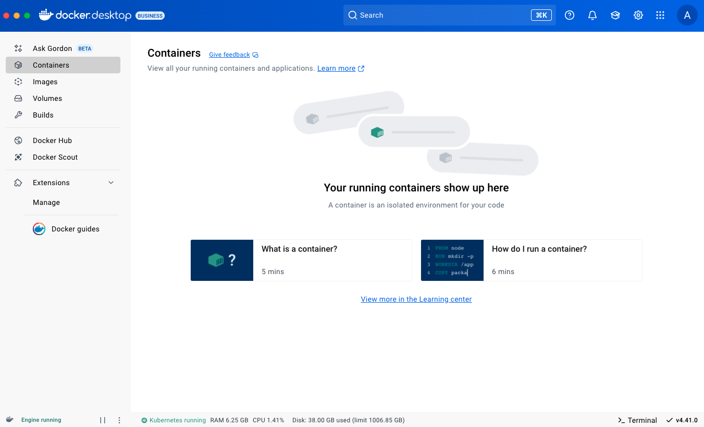

当你打开 Docker Desktop 时，会显示 Docker Desktop 仪表板。

它提供一个集中式界面，帮助你管理[容器](container.md)、[镜像](images.md)、[卷](volumes.md)与[构建](builds.md)。

此外，Docker Desktop 仪表板还能让你：

- 使用 [Ask Gordon](/manuals/ai/gordon/_index.md)，这是嵌入在 Docker Desktop 和 Docker CLI 中的个人人工智能助手，可帮助你简化工作流并充分利用 Docker 生态。
- 打开 **Settings**（设置）菜单配置 Docker Desktop。在仪表板页眉选择 **Settings** 图标。
- 进入 **Troubleshoot**（疑难解答）菜单进行调试与重启操作。在仪表板页眉选择 **Troubleshoot** 图标。
- 在 **Notifications center**（通知中心）中查看新版本提示、安装进度更新等。在仪表板右下角选择铃铛图标进入通知中心。
- 从仪表板页眉进入 **Learning center**（学习中心）。它提供内置的新手引导与其他学习资源，帮助你快速上手。

  如需更完整的新手指南，请参阅[快速开始](/get-started/introduction/_index.md)。
- 访问 [Docker Hub](/manuals/docker-hub/_index.md)，以搜索、浏览、拉取、运行或查看镜像详情。
- 进入 [Docker Scout](../../scout/_index.md) 仪表板。
- 导航到 [Docker Extensions](/manuals/extensions/_index.md)。

## Docker 终端

你可以在 Docker 仪表板页脚直接使用内置终端。

该内置终端：

- 即使你在仪表板内跳转到其他页面再返回，也能保留你的会话。
- 支持复制、粘贴、搜索以及清空会话。

#### 打开内置终端

要打开内置终端，你可以：

- 将鼠标悬停在正在运行的容器上，在 **Actions**（操作）列选择 **Show container actions** 菜单，并在下拉菜单中选择 **Open in terminal**。
- 或者，点击右下角版本号旁的 **Terminal** 图标。

若要使用外部终端，请前往 **Settings** > **General**，在 **Choose your terminal** 下选择 **System default**。

## 快速搜索

使用位于仪表板页眉的快速搜索，可查找：

- 本地系统上的任意容器或 Compose 应用。你可以查看关联环境变量的概览，或执行启动、停止、删除等快捷操作。

- 公共 Docker Hub 镜像、本地镜像以及远程仓库中的镜像（你所在组织在 Hub 上的私有仓库）。根据所选镜像类型，你可以按标签拉取、查看文档、跳转至 Docker Hub 获取详情，或基于该镜像运行新容器。

- 扩展。从这里可以进一步了解扩展，并一键安装；如果已安装扩展，也可直接从搜索结果中打开。

- 任意卷。可查看其关联的容器。

- 文档。在 Docker Desktop 内直接查找 Docker 官方文档的帮助信息。

## Docker 菜单

Docker Desktop 还包含一个托盘图标，即 Docker 菜单 ，便于快速访问。

在任务栏选择  图标，可打开以下选项：

- **Dashboard**：跳转至 Docker Desktop 仪表板。
- **Sign in/Sign up**（登录/注册）
- **Settings**（设置）
- **Check for updates**（检查更新）
- **Troubleshoot**（疑难解答）
- **Give feedback**（提交反馈）
- **Switch to Windows containers**（切换到 Windows 容器，适用于 Windows）
- **About Docker Desktop**（关于）：包含当前版本信息及订阅服务协议等链接。
- **Docker Hub**
- **Documentation**（文档）
- **Extensions**（扩展）
- **Kubernetes**
- **Restart**（重启）
- **Quit Docker Desktop**（退出 Docker Desktop）
