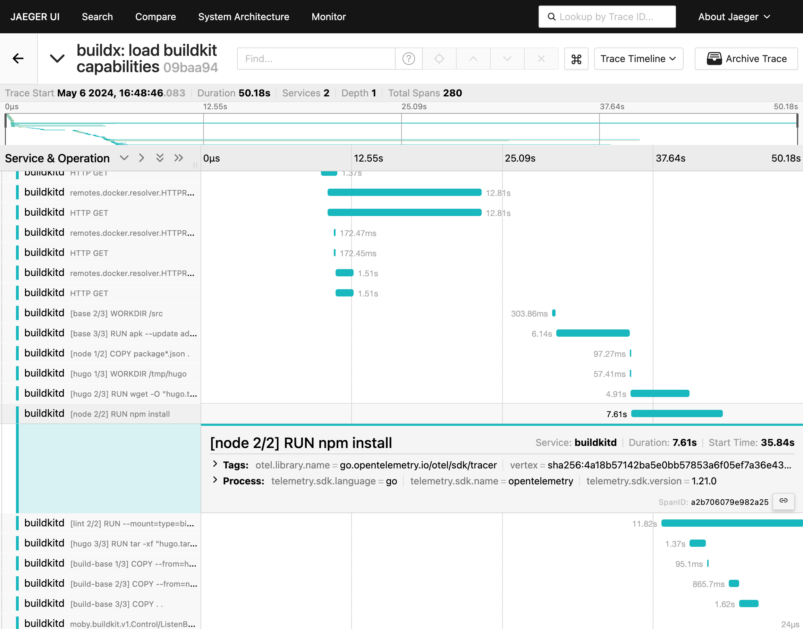

**Builds** 视图提供交互式界面，便于在 Docker Desktop 中直接查看构建历史、监控活跃构建并管理构建器（builders）。

默认情况下，**Build history** 选项卡会按时间（最新优先）显示已完成的构建列表。切换到 **Active builds** 选项卡可查看正在进行的构建。

如果你通过 [Docker Build Cloud](../../build-cloud/_index.md) 连接了云端构建器，Builds 视图也会显示连接到同一云端构建器的团队成员所触发的活跃或已完成的云构建。

> [!NOTE]
>
> 使用 `docker build` 构建 Windows 容器镜像时，会使用旧版 builder，无法在 **Builds** 视图中显示。
> 如需切换到 BuildKit，可：
> - 在构建命令中设置 `DOCKER_BUILDKIT=1`，如 `DOCKER_BUILDKIT=1 docker build .`；或
> - 使用 `docker buildx build` 命令。

## 查看构建列表

在 Docker 仪表板中打开 **Builds** 视图，你可以访问：

- **Build history**：已完成的构建，可查看日志、依赖、跟踪等信息
- **Active builds**：当前进行中的构建

仅会显示活跃、正在运行的构建器产生的构建；已移除或已停止的构建器产生的构建不会显示。

### 构建器设置

右上角会显示当前选定的构建器名称；通过 **Builder settings** 按钮可在 Docker Desktop 设置中[管理构建器](#manage-builders)。

### 导入构建



**Import builds** 按钮允许你导入他人或 CI 环境的构建记录。导入后，你可以在 Docker Desktop 内直接查看该构建的日志、跟踪与其他数据。

`docker/build-push-action` 与 `docker/bake-action` 的 GitHub Actions [构建摘要](/manuals/build/ci/github-actions/build-summary.md)包含下载构建记录的链接，可用于在 Docker Desktop 中检查 CI 任务。

## 检查构建

在列表中选择目标构建即可检查。检查视图包含多个选项卡。

**Info** 选项卡显示构建详情。

如果你正在检查多平台构建，可通过该选项卡右上角的下拉菜单筛选到特定平台：

**Source details** 部分显示关于 [frontend](/manuals/build/buildkit/frontend.md) 的信息，以及（若可用）用于构建的源码仓库。

### 构建时序（Build timing）

Info 选项卡中的 **Build timing** 部分通过图表展示构建执行在多个维度的时间分布。

- **Real time**：完成构建所消耗的实际时间。
- **Accumulated time**：所有步骤的 CPU 总时间。
- **Cache usage**：构建操作被缓存的程度。
- **Parallel execution**：并行执行步骤所占用的构建时间比例。

图表的颜色与图例代表不同的构建操作。构建操作定义如下：

| 构建操作              | 描述                                                                                                                                                                           |
| :------------------- | :------------------------------------------------------------------------------------------------------------------------------------------------------------------------------ |
| Local file transfers | 将本地文件从客户端传输到构建器所花费的时间。                                                                                                                                    |
| File operations      | 构建中涉及创建与复制文件的所有操作。例如，在 Dockerfile frontend 中，`COPY`、`WORKDIR`、`ADD` 指令都会产生文件操作。                                                               |
| Image pulls          | 拉取镜像所花费的时间。                                                                                                                                                          |
| Executions           | 容器执行操作，例如 Dockerfile frontend 中 `RUN` 指令定义的命令。                                                                                                                |
| HTTP                 | 使用 `ADD` 下载远程制品所花费的时间。                                                                                                                                            |
| Git                  | 与 **HTTP** 相同，但针对 Git URL。                                                                                                                                             |
| Result exports       | 导出构建结果所花费的时间。                                                                                                                                                       |
| SBOM                 | 生成[SBOM 证明](/manuals/build/metadata/attestations/sbom.md)所花费的时间。                                                                                                     |
| Idle                 | 构建工作器的空闲时间，例如当你配置了[最大并行度限制](/manuals/build/buildkit/configure.md#max-parallelism)时可能出现。                                                               |

### 构建依赖（Build dependencies）

**Dependencies** 部分显示构建过程中使用的镜像与远程资源，包括：

- 构建过程中使用的容器镜像
- 通过 Dockerfile `ADD` 指令引入的 Git 仓库
- 通过 Dockerfile `ADD` 指令引入的远程 HTTPS 资源

### 构建参数、机密与其他参数

Info 选项卡中的 **Configuration** 部分展示传递给构建的参数：

- 构建参数（包含解析后的值）
- 机密（包含其 ID，但不包含其值）
- SSH 套接字
- 标签
- [附加上下文](/reference/cli/docker/buildx/build/#build-context)

### 输出与制品（artifacts）

**Build results** 部分显示生成的构建制品摘要，包括镜像清单详情、证明（attestations）与构建跟踪。

证明（attestation）是附加到容器镜像的元数据记录，用于描述镜像的相关信息，例如它是如何构建的或包含哪些软件包。更多信息参见[构建证明](/manuals/build/metadata/attestations/_index.md)。

构建跟踪记录了 Buildx 与 BuildKit 中构建执行步骤的信息。跟踪支持两种格式：OTLP 与 Jaeger。你可以在 Docker Desktop 的操作菜单中选择所需格式进行下载。

#### 使用 Jaeger 检查构建跟踪

使用 Jaeger 客户端，你可以导入并检查来自 Docker Desktop 的构建跟踪。以下步骤展示如何在 Docker Desktop 中导出跟踪，并在 [Jaeger](https://www.jaegertracing.io/) 中查看：

1. 启动 Jaeger UI：

   ```console
   $ docker run -d --name jaeger -p "16686:16686" jaegertracing/all-in-one
   ```

2. 在 Docker Desktop 中打开 Builds 视图，选择一个已完成的构建。

3. 前往 **Build results** 部分，打开操作菜单并选择 **Download as Jaeger format**。

   <video controls>
     <source src="/assets/video/build-jaeger-export.mp4" type="video/mp4" />
   </video>

4. 在浏览器访问 <http://localhost:16686> 打开 Jaeger UI。

5. 选择 **Upload** 选项卡并打开刚导出的 Jaeger 构建跟踪。

现在你可以使用 Jaeger UI 分析构建跟踪：



### Dockerfile 源码与错误

当检查已成功完成的构建或正在进行的构建时，**Source** 选项卡会显示用于创建该构建的 [frontend](/manuals/build/buildkit/frontend.md)。

如果构建失败，会显示 **Error** 选项卡以替代 **Source**。错误信息会内联在 Dockerfile 源码中，指出失败位置与原因。

### 构建日志

**Logs** 选项卡用于展示构建日志。对于正在进行的构建，日志会实时更新。

你可以在 **List view** 与 **Plain-text view** 两种日志视图间切换。

- **List view**：以可折叠的格式展示所有构建步骤，并提供时间轴用于浏览日志。

- **Plain-text view**：以纯文本形式展示日志。

通过 **Copy** 按钮可将纯文本版本的日志复制到剪贴板。

### 构建历史

**History** 选项卡展示关于已完成构建的统计数据。

时间序列图展示相关构建在持续时间、构建步骤与缓存使用方面的趋势，帮助你识别随时间变化的模式与变化。例如，构建时长的显著增长或大量缓存未命中，可能意味着存在优化 Dockerfile 的机会。

你可以在图表中选择某个相关构建进入检查，或在图表下方的 **Past builds** 列表中访问。

## 管理构建器

**Settings** 中的 **Builder** 选项卡可以：

- 查看活跃构建器的状态与配置
- 启动与停止构建器
- 删除构建历史
- 添加或移除构建器（云构建器则为连接与断开）

关于管理构建器的更多信息，参见[更改设置](/manuals/desktop/settings-and-maintenance/settings.md#builders)
