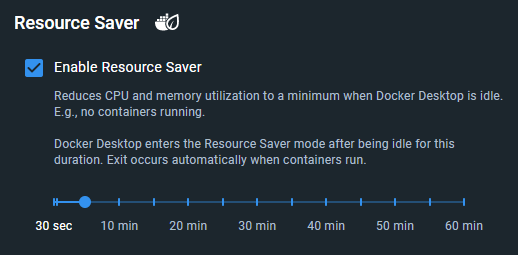

Resource Saver 模式会在一段时间内没有容器运行时自动停止 Docker Desktop 的 Linux 虚拟机，从而显著降低宿主机上的 CPU 与内存占用（通常可减少 2 GB 及以上）。默认超时时间为 5 分钟，你可以按需调整。

启用 Resource Saver 模式后，Docker Desktop 在空闲时仅占用极少系统资源，这有助于延长笔记本电池续航并改善多任务体验。

## 配置 Resource Saver 

Resource Saver 默认开启，你也可以在 **Settings** 的 **Resources** 选项卡中将其关闭。你还可以按下图配置空闲计时器。

如果界面提供的可选值无法满足需求，你可以在 Docker Desktop 的 `settings-store.json`（4.34 及更早版本为 `settings.json`）中修改 `autoPauseTimeoutSeconds`，将其设置为任意大于 30 秒的数值： 

  - Mac：`~/Library/Group Containers/group.com.docker/settings-store.json`
  - Windows：`C:\Users\[USERNAME]\AppData\Roaming\Docker\settings-store.json`
  - Linux：`~/.docker/desktop/settings-store.json`

修改后无需重启 Docker Desktop。 

当 Docker Desktop 进入 Resource Saver 模式时： 
- 状态栏以及系统托盘中的 Docker 图标会显示叶子图标。下图展示了在 Resource Saver 模式开启时，Linux VM 的 CPU 与内存占用降至 0。 

   

- 不会运行容器的 Docker 命令（例如列出镜像或卷）通常不会触发退出 Resource Saver 模式，因为 Docker Desktop 可以在不唤醒 Linux VM 的情况下处理这些命令。

> [!NOTE]
>
> Docker Desktop 会在需要时自动退出 Resource Saver 模式。触发退出的命令执行时间会稍长（约 3 至 10 秒），因为 Docker Desktop 需要重启 Linux VM。在 Mac 与 Linux 上通常更快，而在启用 Hyper‑V 的 Windows 上相对较慢。Linux VM 重启完成后，后续的容器运行会立即恢复正常。

## Resource Saver 与 Pause 的区别

Resource Saver 的优先级高于较早的 [Pause](pause.md) 功能。这意味着当 Docker Desktop 处于 Resource Saver 模式时，无法手动暂停（实际上也没有必要，因为 Resource Saver 会停止 Docker Desktop 的 Linux VM）。总体建议保持 Resource Saver 启用，而不是关闭它并使用手动 Pause，因为前者能带来更好的 CPU 与内存节省效果。

## Windows 上的 Resource Saver 模式

在启用 WSL 的 Windows 上，Resource Saver 的工作方式有所不同。它不会停止 WSL 的 VM，而是仅暂停 `docker-desktop` WSL 发行版内的 Docker 引擎。这是因为 WSL 中所有发行版共享同一个 Linux VM，Docker Desktop 无法停止该 Linux VM（WSL 的 Linux VM 并不归 Docker Desktop 管理）。因此，Resource Saver 在 WSL 上可降低 CPU 占用，但不会降低 Docker 的内存占用。 

若要降低 WSL 中的内存占用，建议启用 WSL 的 `autoMemoryReclaim` 功能，详见[Docker Desktop 的 WSL 文档](/manuals/desktop/features/wsl/_index.md)。最后，由于 Docker Desktop 不会在 WSL 上停止 Linux VM，退出 Resource Saver 模式是即时的（无退出延迟）。
