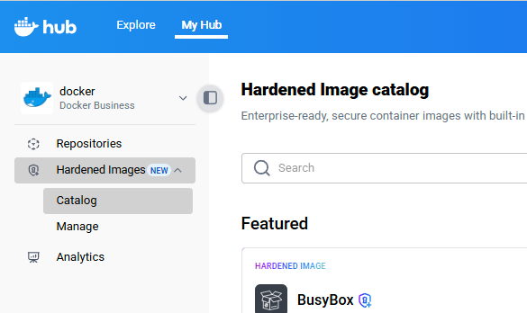
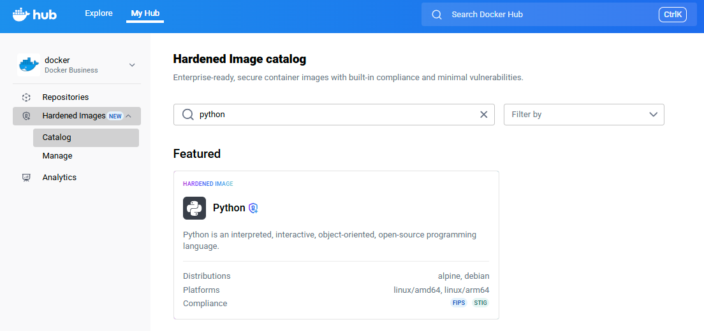
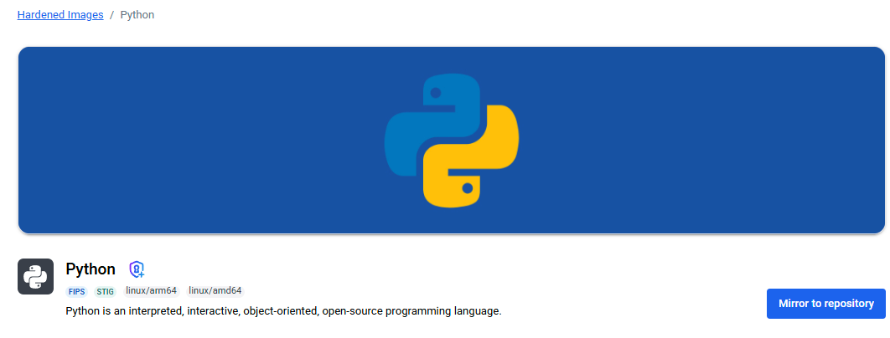
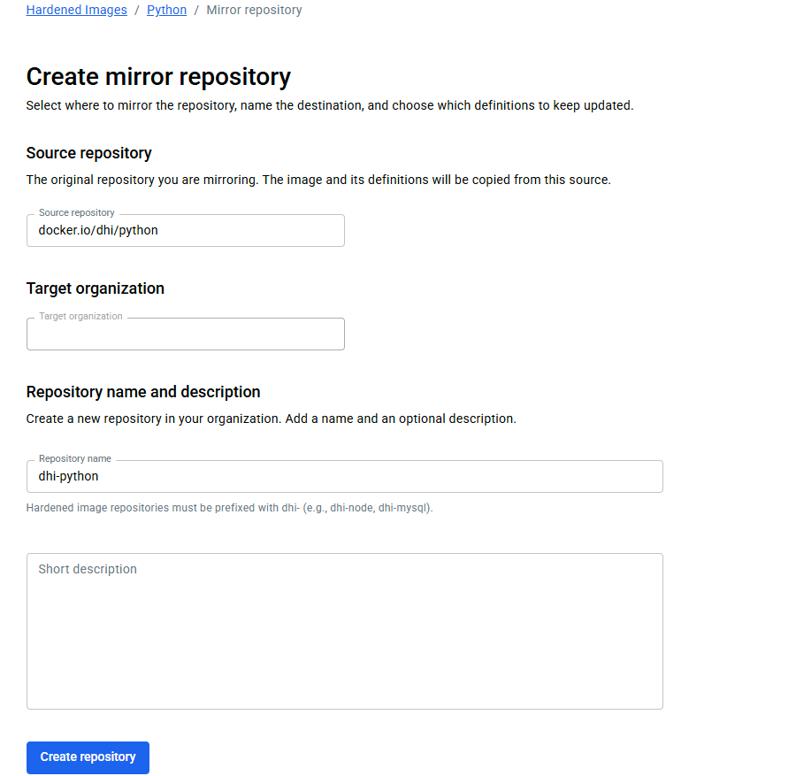
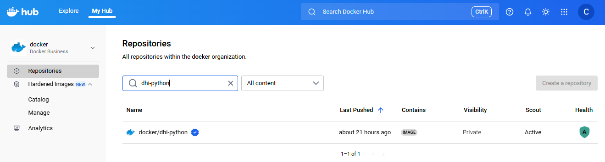



本指南将通过一个实际示例，带你从零开始运行 Docker Hardened Image（DHI）。虽然步骤中使用了特定镜像作为示例，但同样适用于任何 DHI。

> [!TIP]
>
> 当你从 Docker Hub 上的其他镜像（如 Bitnami 公共目录镜像）迁移到 DHI 时，可以继续使用已熟悉的工具与工作流。另请注意，[Bitnami 公告](https://github.com/bitnami/charts/issues/35164)其公共目录镜像将于 2025 年 9 月 29 日后不再提供。
>
> 在大多数情况下，迁移只需在配置或命令中更新镜像引用。可先按照本指南操作，再参阅[迁移指南](./how-to/migrate.md)获取更多细节与示例。

## 步骤 1：开启免费试用以访问 DHI

无需订阅即可浏览 Docker Hardened Images 目录，但若要使用镜像，你需要[联系销售进行订阅](https://www.docker.com/products/hardened-images/#getstarted)或为[组织](/admin/organization/)开启免费试用。本指南将引导你启动免费试用。

开始免费试用：

1. 前往 [Docker Hub](https://hub.docker.com/hardened-images/catalog) 的 Hardened Images 目录并登录。
2. 选择 **Start trial**，按屏幕指引完成流程。

## 步骤 2：查找要使用的镜像

1. 前往 [Docker Hub](https://hub.docker.com/hardened-images/catalog) 的 Hardened Images 目录并登录。
2. 在左侧边栏选择具备 DHI 访问权限的组织。
3. 在左侧边栏选择 **Hardened Images** > **Catalog**。

   

4. 使用搜索框或筛选器查找镜像（例如 `python`、`node`、`golang`）。本指南以 Python 镜像为例。

    

5. 选择 Python 仓库并查看详情。

继续下一步以创建镜像副本。若想进一步了解镜像探索，参见 [Explore Docker Hardened Images](./how-to/explore.md)。

## 步骤 3：镜像到组织

要使用 Docker Hardened Image，必须将其镜像到你的组织。仅组织所有者可执行此操作。镜像操作会在你组织的命名空间中创建一份副本，团队成员即可拉取并使用。

1. 在镜像仓库页面选择 **Mirror to repository**。
   
   

   > [!NOTE]
   >
   > 如果没有看到 **Mirror to repository** 按钮，可能是该仓库已被镜像到你的组织。此时可选择 **View in repository** 查看镜像位置，或镜像到其他仓库。
  
2. 根据屏幕指引选择名称。本指南示例使用 `dhi-python`。注意名称必须以 `dhi-` 开头。

   

3. 选择 **Create repository** 开始镜像流程。

所有标签完成镜像可能需要几分钟。完成后，该镜像仓库会出现在你组织的命名空间下。例如，在 [Docker Hub](https://hub.docker.com) 中进入 **My Hub** > ***YOUR_ORG*** > **Repositories**，即可看到 `dhi-python`；此时你可以像使用其他镜像一样拉取它。



继续下一步以拉取并运行该镜像。关于镜像操作的更多内容，参见[镜像 DHI 仓库](./how-to/mirror.md)。

## 步骤 4：拉取并运行镜像

将镜像镜像到组织后，你可以像其他 Docker 镜像一样拉取并运行它。请注意，Docker Hardened Images 注重最小化与安全性，因此可能不包含你在常见镜像中预期的全部工具或库。典型差异可参考[采用 DHI 的注意事项](./how-to/use.md#considerations-when-adopting-dhis)。

以下示例演示了如何运行该 Python 镜像并执行一个简单的 Python 命令，就像使用其他 Docker 镜像一样：

1. 拉取已镜像的镜像。打开终端并运行以下命令，将 `<your-namespace>` 替换为你组织的命名空间：

   ```console
   $ docker pull <your-namespace>/dhi-python:3.13
   ```

2. 运行镜像以确认一切正常：

    ```console
    $ docker run --rm <your-namespace>/dhi-python:3.13 python -c "print('Hello from DHI')"
    ```
  
    该命令会基于 `dhi-python:3.13` 镜像启动容器，并运行一段简单的 Python 脚本输出 `Hello from DHI`。

更多使用方法参见[使用 Docker Hardened Image](./how-to/use.md)。

## 下一步

你已经拉取并运行了第一个 Docker Hardened Image。接下来可以：

- [将现有应用迁移到 DHI](./how-to/migrate.md)：了解如何更新 Dockerfile 以使用 DHI 作为基础镜像。

- [验证 DHI](./how-to/verify.md)：使用 [Docker Scout](/scout/) 或 Cosign 等工具检查并验证签名声明（如 SBOM 与来源证明）。

- [扫描 DHI](./how-to/scan.md)：使用 Docker Scout 或其他扫描器分析镜像，识别已知 CVE。