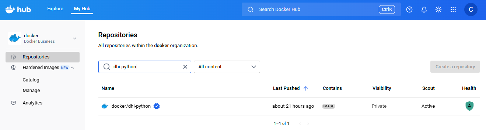



在使用 Docker 加固镜像（DHI）之前，您必须将其仓库镜像到您的组织。只有组织所有者才能执行此操作。镜像完成后，镜像将在您的组织命名空间中可用，有权限的用户即可开始拉取和使用。

镜像仓库会自动保持最新状态。Docker 会持续从上游 DHI 目录同步新标签和镜像更新，确保您始终能够获取最新的安全版本。

## 前提条件

- 要管理镜像，您必须是[组织所有者](/admin/)。
- 您的组织必须[注册](https://www.docker.com/products/hardened-images/#getstarted)使用 Docker 加固镜像。

## 镜像镜像仓库

要镜像 Docker 加固镜像仓库：

1. 访问 [Docker Hub](https://hub.docker.com) 并登录。
2. 选择 **我的 Hub**。
3. 在命名空间下拉菜单中，选择有 DHI 访问权限的组织。
4. 选择 **加固镜像** > **目录**。
5. 选择一个 DHI 仓库查看详细信息。
6. 选择 **镜像到仓库** 并按照屏幕上的说明操作。

所有标签完成镜像可能需要几分钟时间。镜像完成后，**镜像到仓库** 按钮会变为 **在仓库中查看**。选择 **在仓库中查看** 会打开一个下拉列表，显示该镜像已镜像到的仓库。从这个下拉列表中，您可以：

- 选择现有的镜像仓库查看详细信息
- 再次选择 **镜像到仓库** 将镜像到额外的仓库

镜像仓库后，该仓库会以您指定的名称（前缀为 `dhi-`）出现在组织的仓库列表中。它将继续接收更新的镜像。



> [!重要]
>
> 镜像仓库的可见性必须保持私有。将其可见性更改为公有将停止接收镜像更新。

镜像完成后，镜像仓库就像 Docker Hub 上的其他私有仓库一样工作。有权限的团队成员现在可以拉取和使用镜像。要了解如何管理访问权限、查看标签或配置设置，请参阅[仓库](/manuals/docker-hub/repos.md)。

### Webhook 集成用于同步和告警

为了让外部仓库或系统与您的镜像 Docker 加固镜像保持同步，并在更新时接收通知，您可以在 Docker Hub 上的镜像仓库配置 [webhook](/docker-hub/repos/manage/webhooks/)。每当新镜像标签被推送或更新时，webhook 会向您定义的 URL 发送 `POST` 请求。

例如，您可以配置一个 webhook，在每次镜像新标签时调用 CI/CD 系统 `https://ci.example.com/hooks/dhi-sync`。由该 webhook 触发的自动化可以从 Docker Hub 拉取更新的镜像并推送到内部仓库，如 Amazon ECR、Google Artifact Registry 或 GitHub Container Registry。

其他常见的 webhook 用例包括：

- 触发验证或漏洞扫描工作流
- 签名或提升镜像
- 向下游系统发送通知

#### Webhook 载荷示例

当 webhook 被触发时，Docker Hub 会发送如下 JSON 载荷：

```json
{
  "callback_url": "https://registry.hub.docker.com/u/exampleorg/dhi-python/hook/abc123/",
  "push_data": {
    "pushed_at": 1712345678,
    "pusher": "trustedbuilder",
    "tag": "3.13-alpine3.21"
  },
  "repository": {
    "name": "dhi-python",
    "namespace": "exampleorg",
    "repo_name": "exampleorg/dhi-python",
    "repo_url": "https://hub.docker.com/r/exampleorg/dhi-python",
    "is_private": true,
    "status": "Active",
    ...
  }
}
```

## 停止镜像镜像仓库

只有组织所有者才能停止镜像仓库。停止镜像后，仓库仍然存在，但将不再接收更新。您仍然可以拉取最后镜像的镜像，但仓库不会从原始仓库接收新标签或更新。

要停止镜像镜像仓库：

1. 访问 [Docker Hub](https://hub.docker.com) 并登录。
2. 选择 **我的 Hub**。
3. 在命名空间下拉菜单中，选择有 DHI 访问权限的组织。
4. 选择 **加固镜像** > **管理**。
5. 在您要停止镜像的仓库的最右侧列中，选择菜单图标。
6. 选择 **停止镜像**。

停止镜像仓库后，您可以选择另一个 DHI 仓库进行镜像。

## 从 Docker Hub 镜像到其他仓库

> [!IMPORTANT]
>
> 要继续接收镜像更新并保持对 Docker 加固镜像的访问，请确保推送到其他仓库的副本保持私有。

将 Docker 加固镜像仓库镜像到组织在 Docker Hub 上的命名空间后，您可以选择将其镜像到另一个容器仓库，如 Amazon ECR、Google Artifact Registry、GitHub Container Registry 或私有 Harbor 实例。

您可以使用任何标准工作流来镜像镜像，如 [Docker CLI](/reference/cli/docker/_index.md)、[Docker Hub Registry API](/reference/api/registry/latest/)、第三方仓库工具或 CI/CD 自动化。

然而，为了保持完整的安全上下文（包括证明），您还必须镜像其关联的 OCI 工件。Docker 加固镜像将镜像层存储在 Docker Hub (`docker.io`) 上，将签名证明存储在单独的仓库 (`registry.scout.docker.com`) 中。

要同时复制两者，您可以使用 [`regctl`](https://regclient.org/cli/regctl/)，这是一个支持镜像镜像及附加工件（如 SBOM、漏洞报告和 SLSA 证明）的 OCI 感知 CLI。对于持续同步，您可以使用 [`regsync`](https://regclient.org/cli/regsync/)。

### 使用 `regctl` 镜像示例

以下示例展示如何使用 `regctl` 将 Docker 加固镜像的特定标签从 Docker Hub 镜像到另一个仓库，同时包含其关联的证明。您必须先[安装 `regctl`](https://github.com/regclient/regclient)。

1. 为您的特定环境设置环境变量。将占位符替换为您的实际值。

   在此示例中，您使用 Docker 用户名代表 Docker Hub 组织中镜像 DHI 仓库的成员。为用户准备[个人访问令牌 (PAT)](../../security/access-tokens.md)，具有`只读`权限。或者，您可以使用组织命名空间和[组织访问令牌 (OAT)](../../enterprise/security/access-tokens.md)登录 Docker Hub，但 OAT 尚不支持 `registry.scout.docker.com`。

   ```console
   $ export DOCKER_USERNAME="YOUR_DOCKER_USERNAME"
   $ export DOCKER_PAT="YOUR_DOCKER_PAT"
   $ export DOCKER_ORG="YOUR_DOCKER_ORG"
   $ export DEST_REG="registry.example.com"
   $ export DEST_REPO="mirror/dhi-python"
   $ export DEST_REG_USERNAME="YOUR_DESTINATION_REGISTRY_USERNAME"
   $ export DEST_REG_TOKEN="YOUR_DESTINATION_REGISTRY_TOKEN"
   $ export SRC_REPO="docker.io/${DOCKER_ORG}/dhi-python"
   $ export SRC_ATT_REPO="registry.scout.docker.com/${DOCKER_ORG}/dhi-python"
   $ export TAG="3.13-alpine3.21"
   ```

2. 通过 `regctl` 登录 Docker Hub、包含证明的 Scout 仓库和目标仓库。

   ```console
   $ echo $DOCKER_PAT | regctl registry login -u "$DOCKER_USERNAME" --pass-stdin docker.io
   $ echo $DOCKER_PAT | regctl registry login -u "$DOCKER_USERNAME" --pass-stdin registry.scout.docker.com
   $ echo $DEST_REG_TOKEN | regctl registry login -u "$DEST_REG_USERNAME" --pass-stdin "$DEST_REG"
   ```

3. 使用 `--referrers` 和引用端点镜像镜像和证明：

   ```console
   $ regctl image copy \
        "${SRC_REPO}:${TAG}" \
        "${DEST_REG}/${DEST_REPO}:${TAG}" \
        --referrers \
        --referrers-src "${SRC_ATT_REPO}" \
        --referrers-tgt "${DEST_REG}/${DEST_REPO}" \
        --force-recursive
   ```

4. 验证工件是否已保留。

   首先，获取特定标签和平台的摘要。例如，`linux/amd64`。

   ```console
   DIGEST="$(regctl manifest head "${DEST_REG}/${DEST_REPO}:${TAG}" --platform linux/amd64)"
   ```

   列出附加的工件（SBOM、证明、VEX、漏洞报告）。

   ```console
   $ regctl artifact list "${DEST_REG}/${DEST_REPO}@${DIGEST}"
   ```

   或者，使用 `docker scout` 列出附加的工件。

   ```console
   $ docker scout attest list "registry://${DEST_REG}/${DEST_REPO}@${DIGEST}"
   ```

### 使用 `regsync` 持续镜像示例

`regsync` 自动从您在 Docker Hub 上的组织镜像 DHI 仓库拉取并推送到外部仓库（包括证明）。它读取 YAML 配置文件并可以过滤标签。

以下示例使用 `regsync.yaml` 文件同步 Node 24 和 Python 3.12 Debian 13 变体，排除 Alpine 和 Debian 12。

```yaml{title="regsync.yaml"}
version: 1
# 可选：如果不依赖先前的 CLI 登录，可以内联凭据
# creds:
#   - registry: docker.io
#     user: <your-docker-username>
#     pass: "{{file \"/run/secrets/docker_token\"}}"
#   - registry: registry.scout.docker.com
#     user: <your-docker-username>
#     pass: "{{file \"/run/secrets/docker_token\"}}"
#   - registry: registry.example.com
#     user: <service-user>
#     pass: "{{file \"/run/secrets/dest_token\"}}"

sync:
  - source: docker.io/<your-org>/dhi-node
    target: registry.example.com/mirror/dhi-node
    type: repository
    fastCopy: true
    referrers: true
    referrerSource: registry.scout.docker.com/<your-org>/dhi-node
    referrerTarget: registry.example.com/mirror/dhi-node
    tags:
      allow: [ "24.*" ]
      deny: [ ".*alpine.*", ".*debian12.*" ]

  - source: docker.io/<your-org>/dhi-python
    target: registry.example.com/mirror/dhi-python
    type: repository
    fastCopy: true
    referrers: true
    referrerSource: registry.scout.docker.com/<your-org>/dhi-python
    referrerTarget: registry.example.com/mirror/dhi-python
    tags:
      allow: [ "3.12.*" ]
      deny: [ ".*alpine.*", ".*debian12.*" ]
```

要使用配置文件进行试运行，您可以运行以下命令。您必须先[安装 `regsync`](https://github.com/regclient/regclient)。

```console
$ regsync check -c regsync.yaml
```

要使用配置文件运行同步：

```console
$ regsync once -c regsync.yaml
```

## 下一步

镜像镜像仓库后，您可以开始[使用镜像](./use.md)。