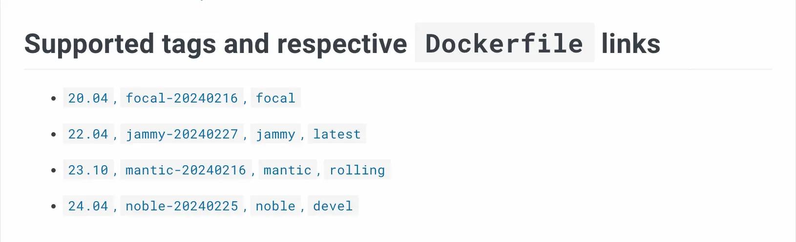

Docker Hub 的可信内容提供经过策展的高质量与安全镜像，旨在让开发者对所用资源的可靠性与安全性更有信心。这些镜像稳定、定期更新，并遵循行业最佳实践，是构建与部署应用的坚实基础。可信内容包含 Docker 官方镜像、Verified Publisher 镜像与 Docker 赞助的开源软件镜像。

## Docker 官方镜像（Docker Official Images）

> [!NOTE]
>
> Docker 将逐步停用 Docker Official Images（DOI）的 Docker Content Trust（DCT）。自 2025 年 8 月 8 日起，最早的一批 DOI DCT 签名证书将陆续过期。如果你在 DOI 上使用 `docker trust` 命令，可能已经开始看到过期警告。这些证书一旦被 Docker 客户端缓存，之后不会自动刷新，导致证书轮换不可行。如果你设置了 `DOCKER_CONTENT_TRUST=1`，对 DOI 的拉取将开始失败。临时解决方案是取消设置 `DOCKER_CONTENT_TRUST` 环境变量。同样，`docker trust inspect` 的使用也将开始失败，不再适用于 DOI。
>
> 详情参见
> https://www.docker.com/blog/retiring-docker-content-trust/。

Docker 官方镜像是一组由 Docker 托管、经过严格策展的镜像仓库集合。

Docker 推荐在你的项目中使用官方镜像。这些镜像具备清晰的文档、倡导最佳实践并定期更新，覆盖多数常见场景，对新手尤其友好。高级用户也能通过更专业的变体获益，同时可将官方镜像作为学习 `Dockerfile` 的参考范本。

> [!NOTE]
>
> 使用 Docker 官方镜像需遵守 [Docker 服务条款](https://www.docker.com/legal/docker-terms-service/)。

这些镜像提供了必需的基础仓库，作为绝大多数用户的起点。

例如操作系统镜像：[Ubuntu](https://hub.docker.com/_/ubuntu/)、[Alpine](https://hub.docker.com/_/alpine/)，编程语言运行时镜像：[Python](https://hub.docker.com/_/python)、[Node](https://hub.docker.com/_/node)，以及其他常用工具：[memcached](https://hub.docker.com/_/memcached)、[MySQL](https://hub.docker.com/_/mysql) 等。

这些镜像属于 Docker Hub 上[安全性最高的镜像](https://www.docker.com/blog/enhancing-security-and-transparency-with-docker-official-images/)之一。这一点尤为重要，因为官方镜像在 Docker Hub 上最为流行。通常，官方镜像包含的 CVE 相关软件包很少甚至没有。

这些镜像示范了 [Dockerfile 最佳实践](/manuals/build/building/best-practices.md)，并提供清晰文档，可作为其他 Dockerfile 作者的参考。

参与该计划的镜像在 Docker Hub 上会显示特殊徽章，便于识别官方镜像项目。


### 支持的标签与对应 Dockerfile 链接

每个 Docker 官方镜像的仓库描述中都包含“**支持的标签与对应 Dockerfile 链接**”部分，列出当前所有标签以及用于生成这些镜像的 Dockerfile 链接。该部分旨在展示可用的镜像变体。



同一行列出的多个标签均指向同一底层镜像。多个标签可以同时指向同一镜像。例如，在上文 `ubuntu` 官方镜像仓库的截图中，`24.04`、`noble-20240225`、`noble` 与 `devel` 都指向相同镜像。

Docker 官方镜像中的 `latest` 标签通常针对易用性进行了优化，并包含大量实用软件（例如开发与构建工具）。将镜像标记为 `latest` 的含义，通常是维护者建议将其作为默认版本。换言之，如果你不确定该使用哪个标签，或对底层软件不够熟悉，建议从 `latest` 开始。随着你对软件与镜像变体的理解加深，可能会发现其他变体更适合你的需求。

### Slim 镜像

部分语言栈（如 [Node.js](https://hub.docker.com/_/node/)、[Python](https://hub.docker.com/_/python/)、[Ruby](https://hub.docker.com/_/ruby/)）提供了 `slim` 变体，旨在以更少的软件包提供轻量、可用于生产的基础镜像。

`slim` 镜像的典型用法，是作为[多阶段构建](https://docs.docker.com/build/building/multi-stage/)的最终阶段基础镜像。例如：你可以在第一阶段使用 `latest` 变体进行构建，然后在最终阶段基于 `slim` 变体，将构建产物复制进去。示例 `Dockerfile` 如下：

```dockerfile
FROM node:latest AS build
WORKDIR /app
COPY package.json package-lock.json ./
RUN npm ci
COPY . ./
FROM node:slim
WORKDIR /app
COPY --from=build /app /app
CMD ["node", "app.js"]
```

### Alpine 镜像

许多官方镜像仓库也提供 `alpine` 变体。这些镜像基于 [Alpine Linux](https://www.alpinelinux.org/) 构建（而非 Debian 或 Ubuntu）。Alpine Linux 专注于为容器镜像提供更小、更简单且更安全的基础；官方镜像的 `alpine` 变体通常仅安装必要的软件包，因此通常比 `slim` 变体更小。

需要注意的主要问题是：Alpine Linux 使用 [musl libc](https://musl.libc.org/) 而非 [glibc](https://www.gnu.org/software/libc/)。此外，为了最小化镜像大小，基于 Alpine 的镜像通常不会默认包含 Git 或 Bash 等工具。根据你的程序对 libc 的依赖程度或假设，可能会因缺少库或工具而遇到问题。

当你使用 Alpine 镜像作为基础镜像时，可考虑以下选项以使程序与 Alpine Linux 及 musl 兼容：

- 针对 musl libc 重新编译你的程序
- 将 glibc 以静态链接方式集成进你的程序
- 尽量避免对 C 依赖（例如构建 Go 程序时禁用 CGO）
- 在 Dockerfile 中自行安装所需软件

如果不熟悉在 Alpine 中安装软件包的方式，请参考 Docker Hub 上 `alpine` 镜像的[说明](https://hub.docker.com/_/alpine)。

### 代号（Codenames）

带有“玩具总动员”角色名（如 `bookworm`、`bullseye`、`trixie`）或形容词（如 `jammy`、`noble`）的标签，通常表示其所基于的 Linux 发行版的代号。Debian 的发行版代号[源自玩具总动员角色](https://en.wikipedia.org/wiki/Debian_version_history#Naming_convention)，而 Ubuntu 的格式为“形容词 + 动物”。例如，Ubuntu 24.04 的代号是 “Noble Numbat”。

了解 Linux 发行版的代号很有帮助，因为许多官方镜像基于多个不同版本的底层发行版提供了变体（例如 `postgres:bookworm` 与 `postgres:bullseye`）。

### 其他标签

除了上述内容外，官方镜像的标签还可能包含其他暗示变体用途的信息。通常，这些变体会在官方镜像仓库的文档中进行说明。查阅“如何使用该镜像（How to use this image）”与“镜像变体（Image Variants）”部分，有助于理解如何正确使用这些变体。

## Verified Publisher 镜像

Docker Verified Publisher 项目提供来自经 Docker 验证的商业发布者的高质量镜像。

这些镜像有助于开发团队构建安全的软件供应链，从流程早期降低暴露于恶意内容的风险，进而节省后续的时间与成本。

参与该计划的镜像在 Docker Hub 上会显示特殊徽章，便于用户识别由 Docker 验证的高质量商业发布者项目。


## Docker 赞助的开源软件（OSS）镜像

Docker 赞助的开源软件（OSS）计划提供由 Docker 赞助的开源项目发布与维护的镜像。

参与该计划的镜像在 Docker Hub 上会显示特殊徽章，便于用户识别经 Docker 验证为可信、安全且活跃的开源项目。

