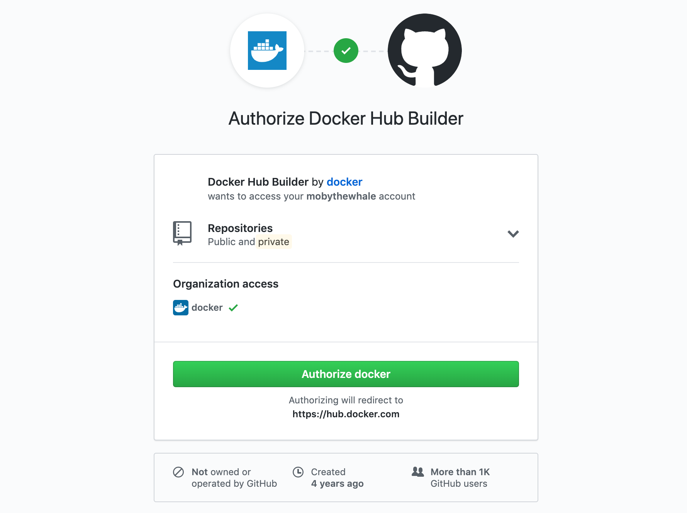

> [!NOTE]
>
> 使用自动构建需要 Docker Pro、Team 或 Business 订阅。

要实现镜像的自动构建与测试，需要将托管的源代码服务与 Docker Hub 关联，使其能够访问你的源代码存储库。该关联既可配置在个人账户，也可配置在组织下。

如果你要为团队启用自动构建，请先按照说明为团队[创建服务账户](index.md#service-users-for-team-autobuilds)，再按照下文所述关联账户。

## 关联 GitHub 用户账户

1. 登录 Docker Hub。

2. 选择 **My Hub** > **Settings** > **Linked accounts**。

3. 在要关联的源码提供方处选择 **Link provider**。

    如果你想先解绑当前 GitHub 账号并改为关联另一个 GitHub 账号，请先从 [GitHub](https://github.com/) 完全登出，然后再通过 Docker Hub 进行关联。

4. 查看 **Docker Hub Builder** OAuth 应用的授权设置。

    

    > [!NOTE]
    >
    > 如果你拥有任何 GitHub 组织，此页面可能会提供授予 Docker Hub 访问这些组织的选项。你也可以在组织的第三方访问设置中单独授权或撤销 Docker Hub 的访问。参见[向 GitHub 组织授予访问权限](link-source.md#grant-access-to-a-github-organization)。

5. 选择 **Authorize docker** 保存关联。

### 向 GitHub 组织授予访问权限

如果你是某个 GitHub 组织的所有者，你可以授予或撤销 Docker Hub 对该组织存储库的访问权限。是否需要组织所有者权限取决于该组织的设置。

如果组织此前未对该应用进行过专门的授权或撤销，通常可以在关联你的用户账户时一并完成授权。在关联账户界面中，组织名称旁会出现 **Grant access** 按钮，如下图所示。若未出现该按钮，则需要手动授予应用访问权限。

手动向 GitHub 组织授予 Docker Hub 访问权限：

1. 按上述步骤先完成你的用户账户关联。

2. 在 GitHub 账户设置中，找到左下角的 **Organization settings**。

3. 选择你希望授予 Docker Hub 访问权限的组织。

4. 选择 **Third-party access**。

    页面会显示第三方应用及其访问状态列表。

5. 点击 **Docker Hub Builder** 旁的铅笔图标。

6. 在组织条目旁选择 **Grant access**。

### 撤销对 GitHub 组织的访问权限

要撤销 Docker Hub 对某个组织 GitHub 存储库的访问：

1. 在 GitHub 账户设置中，找到左下角的 **Organization settings**。

2. 选择你要撤销 Docker Hub 访问权限的组织。

3. 在组织资料菜单中，选择 **Third-party access**。页面将显示第三方应用及其访问状态。

4. 点击 Docker Hub Builder 旁的铅笔图标。

5. 在后续页面选择 **Deny access**。

### 解绑 GitHub 用户账户

若要撤销 Docker Hub 对你 GitHub 账户的访问，需要同时在 Docker Hub 与 GitHub 两侧完成解绑。

1. 选择 **My Hub** > **Settings** > **Linked accounts**。

2. 在要移除的源码提供方条目旁选择 **Unlink provider**。

3. 前往你的 GitHub 账户的 **Settings** 页面。

4. 在左侧导航中选择 **Applications**。

5. 在 Docker Hub Builder 应用右侧选择 `...` 菜单，然后点击 **Revoke**。

> [!NOTE]
>
> 每个配置为自动构建来源的存储库都包含一个 webhook，用于在存储库发生更改时通知 Docker Hub。撤销对源码提供方的访问后，该 webhook 不会自动移除。

## 关联 Bitbucket 用户账户

1. 使用你的 Docker ID 登录 Docker Hub。

2. 选择 **My Hub** > **Settings** > **Linked accounts**。

3. 在要关联的源码提供方处选择 **Link provider**。

4. 如有需要，登录 Bitbucket。

5. 在出现的页面中选择 **Grant access**。

### 解绑 Bitbucket 用户账户

若要永久撤销 Docker Hub 对你 Bitbucket 账户的访问，需要在 Docker Hub 侧解绑，并在 Bitbucket 账户中撤销授权。

1. 登录 Docker Hub。

2. 选择 **My Hub** > **Settings** > **Linked accounts**。

3. 在要移除的源码提供方条目旁选择 **Unlink provider**。

> [!IMPORTANT]
> 在 Docker Hub 侧解绑后，还需在 Bitbucket 侧撤销授权。

在 Bitbucket 账户中撤销授权：

1. 前往你的 Bitbucket 账户并打开[**Bitbucket settings**](https://bitbucket.org/account/settings/app-authorizations/)。

2. 在出现的页面中选择 **OAuth**。

3. 在 Docker Hub 条目旁选择 **Revoke**。

> [!NOTE]
>
> 每个配置为自动构建来源的存储库都包含一个 webhook，用于在存储库发生更改时通知 Docker Hub。撤销对源码提供方的访问后，该 webhook 不会自动移除。
