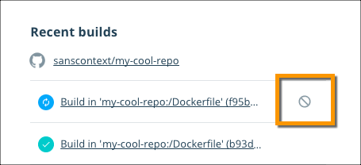
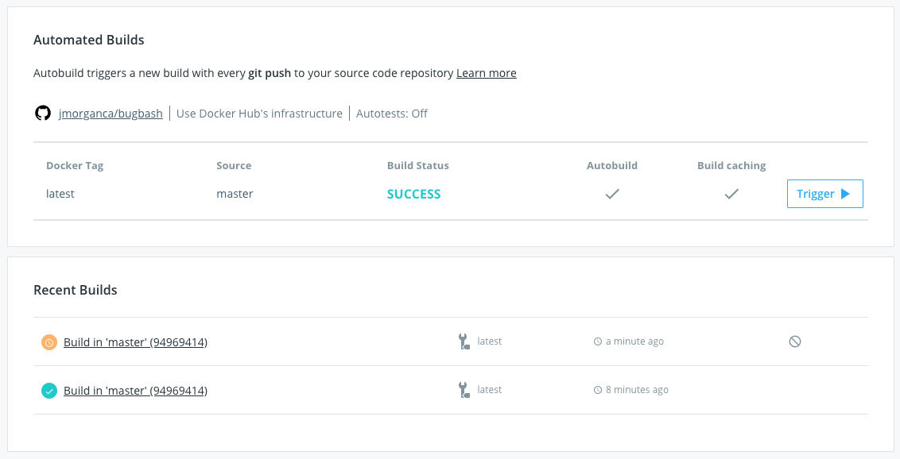
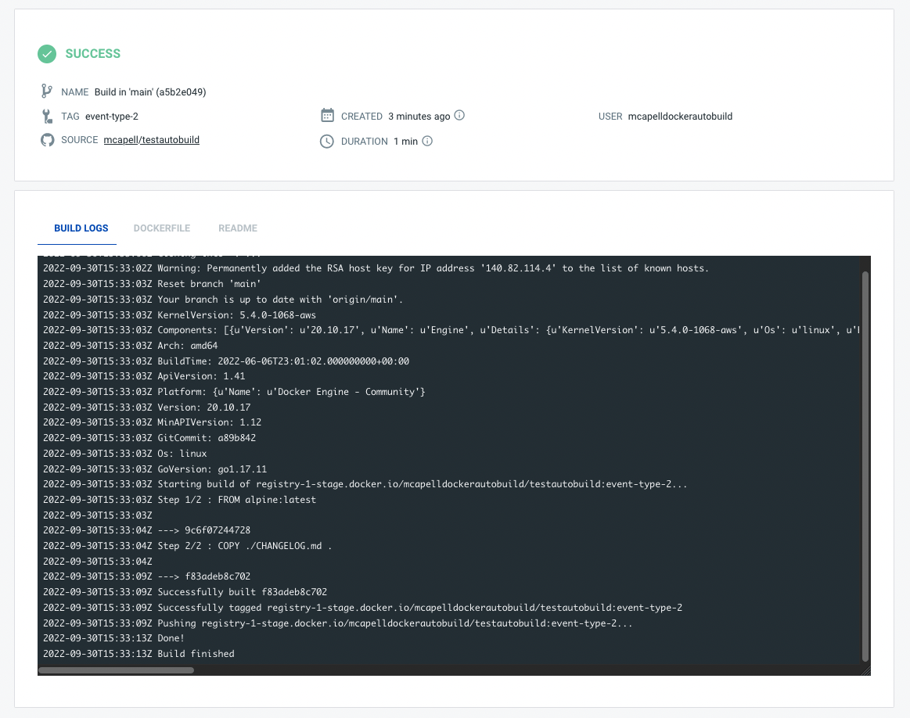

> [!NOTE]
>
> 使用自动构建需要 Docker Pro、Team 或 Business 订阅。

## 取消或重试构建

当某个构建处于排队或运行中时，在 **General** 选项卡与 **Builds** 选项卡的构建报告链接旁会出现 **Cancel** 图标。你也可以在 **Build report** 页面，或 **Timeline** 选项卡的日志视图中选择 **Cancel**。

## 查看当前活跃的构建

某个存储库的构建摘要会同时显示在该存储库的 **General** 与 **Builds** 选项卡中。**Builds** 选项卡还会以颜色编码的柱状图展示构建排队时间与持续时间。这两处都会展示该存储库各标签的待处理、进行中、成功与失败的构建。

你可以在任一位置选择某个构建任务以查看其构建报告。构建报告包含该任务的详细信息：源代码仓库与分支或标签、构建日志、构建时长、创建时间与位置，以及执行构建的用户账号。

> [!NOTE]
>
> 现在在刷新 **Builds** 页面时，你可以每 30 秒查看一次构建进度。通过实时的构建日志，你可以在构建尚未完成时先行调试。

## 禁用自动构建

自动构建是按分支或标签启用的，你可以随时禁用或重新启用。例如在进行大规模重构、希望阶段性只进行手动构建时就很有用。禁用自动构建不会影响[自动测试](automated-testing.md)。

要禁用某个自动构建：

1. 在 [Docker Hub](https://hub.docker.com) 中，前往 **My Hub** > **Repositories**，选择目标存储库并进入 **Builds** 选项卡。

2. 选择 **Configure automated builds** 以编辑该存储库的构建设置。

3. 在 **Build Rules** 区域，找到你不再希望自动构建的分支或标签。

4. 切换该配置行旁的 **Autobuild** 开关；禁用后该开关会呈灰色。

5. 点击 **Save** 保存。
