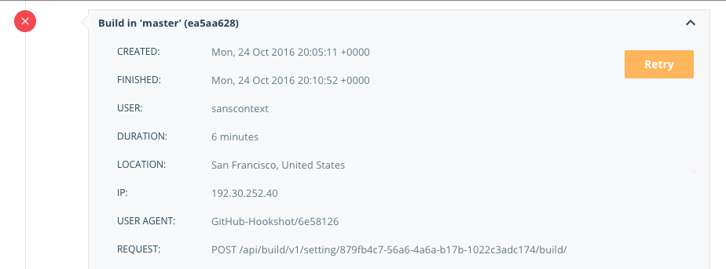

> [!NOTE]
>
> 使用自动构建需要 Docker Pro、Team 或 Business 订阅。

## 构建失败（Failing builds）

当构建失败时，在 **General** 与 **Builds** 选项卡的构建报告行旁会出现 **Retry** 图标。在 **Build report** 页面与 **Timeline logs** 中也会显示 **Retry** 按钮。



> [!NOTE]
>
> 如果你查看的是隶属某个组织的存储库的构建详情，只有当你对该存储库拥有 `Read & Write` 权限时，才会看到 **Cancel** 与 **Retry** 按钮。

自动构建有 4 小时的执行时限。若构建达到该时限，将被自动取消，且构建日志会显示如下消息：

```text
2022-11-02T17:42:27Z The build was cancelled or exceeded the maximum execution time.
```

该日志消息与你主动取消构建时相同。要判断构建是否因超时被自动取消，请查看构建时长。

## 构建包含私有子模块的存储库

Docker Hub 会在你的源代码存储库中设置一个部署密钥（deploy key），以便克隆并构建该存储库。该密钥仅适用于单个特定代码存储库。如果你的存储库使用了私有 Git 子模块，或构建需要克隆其他私有存储库，Docker Hub 无法访问这些附加存储库，导致构建无法完成，并在构建时间线中记录错误。

为解决该问题，你可以在自动构建中使用 `SSH_PRIVATE` 环境变量覆盖部署密钥，从而授予 Docker Hub 的构建系统访问这些存储库的权限。

> [!NOTE]
>
> 如果你在团队中使用自动构建，请改用下述流程，并为你的源码提供方配置一个服务账户。即便是个人账户，也可以使用服务账户方式以限制 Docker Hub 对源存储库的访问范围。

1. 生成一对仅用于构建的 SSH 密钥，并将公钥添加到你的源码提供方账户。

    该步骤可选，但这样做可以在不影响其他访问的情况下，单独撤销这对仅用于构建的密钥。

2. 复制该密钥对中的私钥内容到剪贴板。
3. 在 Docker Hub 中，打开包含私有子模块的存储库的构建页面（如有需要，先按[此处](index.md#configure-automated-builds)步骤配置自动构建）。
4. 在页面底部，点击 **Build Environment variables** 旁的 **plus** 图标。
5. 新增环境变量名为 `SSH_PRIVATE`。
6. 将私钥内容粘贴到 **Value** 字段。
7. 选择 **Save**，或选择 **Save and Build** 以验证构建是否可以完成。

> [!NOTE]
>
> 你的私有 git 子模块必须通过 SSH 方式进行克隆（`git@submodule.tld:some-submodule.git`），而不是通过 HTTPS。
