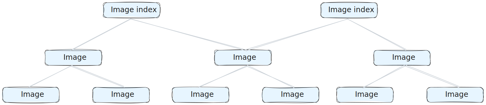



在存储库中，镜像与镜像索引构成容器镜像内容的基础。
下图展示了镜像与镜像索引之间的关系。

  

该结构允许通过单一引用来支持多架构。
需要注意的是，镜像并不总是由镜像索引引用。
图中包含以下对象：

- 镜像索引（Image index）：一种“指向多个特定架构镜像”的镜像（如 AMD、ARM），
  通过单一引用实现跨平台支持。
- 镜像（Image）：针对某一特定架构与操作系统，包含实际配置与层（layers）的容器镜像。

## 管理存储库中的镜像与镜像索引

1. 登录 [Docker Hub](https://hub.docker.com)。
2. 选择 **My Hub** > **Repositories**。
3. 在列表中选择一个存储库。
4. 进入 **Image Management**。
5. 搜索、筛选或排序条目。
   - 搜索：在列表上方的搜索框中输入关键词。
   - 筛选：在 **Filter by** 下拉中选择 **Tagged**、**Image index** 或 **Image**。
   - 排序：点击 **Size**、**Last pushed** 或 **Last pulled** 列头。

   > [!NOTE]
   >
   > 超过 6 个月未被拉取的镜像会在 **Status** 列标记为 **Stale**。

6. 可选：删除一个或多个条目。
   1. 勾选列表中目标条目旁的复选框。若选择顶层索引，
      还会移除未被其他位置引用的底层镜像。
   2. 选择 **Preview and delete**。
   3. 在弹出的窗口中，确认将被删除的条目与可回收的存储空间。
   4. 点击 **Delete forever**。

  
   > [!NOTE]
   >
   > 如果需要批量删除，请使用[删除 API 端点](/reference/api/registry/latest/#tag/delete)。
