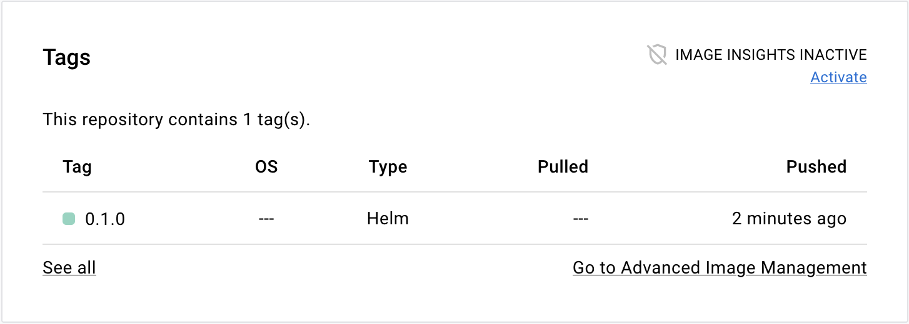
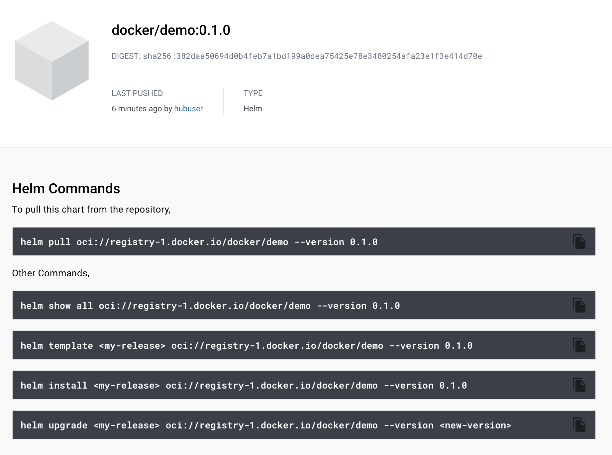
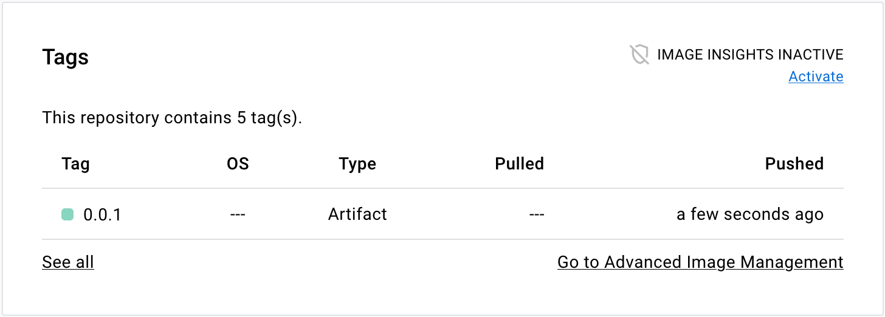

在 Docker Hub 中，你可以存储的不仅仅是容器镜像，还包括各种类型的软件工件（software artifact）。
软件工件是指在软件开发过程中产出的、用于创建、维护或理解软件的任何项目。
Docker Hub 通过利用镜像清单（image manifest）中的 config 属性来支持 OCI 工件。

## 什么是 OCI 工件？

OCI 工件是与软件应用相关的任意文件，例如：

- Helm charts
- Software Bill of Materials（SBOM，软件物料清单）
- Digital signatures
- Provenance data
- Attestations
- Vulnerability reports

Docker Hub 支持 OCI 工件意味着你可以在同一个存储库中存储与分发容器镜像及其他资产。

OCI 工件的一个常见用例是
[Helm charts](https://helm.sh/docs/topics/charts/)。Helm Chart 是一种为应用定义 Kubernetes 部署的打包格式。
由于 Kubernetes 是流行的容器运行时，将应用镜像与部署模板托管在同一位置是合理的选择。

## 在 Docker Hub 中使用 OCI 工件

在 Docker Hub 上管理 OCI 工件的方式与管理容器镜像类似。

向注册表推送/拉取 OCI 工件通常借助注册表客户端完成。
[ORAS CLI](https://oras.land/docs/installation) 是一个命令行工具，
可用于在注册表中管理 OCI 工件。
如果你使用 Helm Chart，
[Helm CLI](https://helm.sh/docs/intro/install/) 也提供了将 Chart 推送/拉取到注册表的内置功能。

这些注册表客户端会向 Docker Hub 的 Registry API 发起 HTTP 请求。
该 API 遵循
[OCI 分发规范（OCI distribution specification）](https://github.com/opencontainers/distribution-spec) 所定义的标准协议。

## 示例

本节展示在 Docker Hub 中使用 OCI 工件的一些示例。

### 推送一个 Helm Chart

以下步骤演示如何将 Helm Chart 作为 OCI 工件推送到 Docker Hub。

前提条件：

- Helm version 3.0.0 or later

步骤：

1. 创建一个新的 Helm Chart

   ```console
   $ helm create demo
   ```

   该命令会生成一个样板 Chart。

2. 将 Helm Chart 打包为 tarball。

   ```console
   $ helm package demo
   Successfully packaged chart and saved it to: /Users/hubuser/demo-0.1.0.tgz
   ```

3. 使用 Docker 凭据通过 Helm 登录 Docker Hub。

   ```console
   $ helm registry login registry-1.docker.io -u hubuser
   ```

4. 将该 Chart 推送到 Docker Hub 的某个存储库。

   ```console
   $ helm push demo-0.1.0.tgz oci://registry-1.docker.io/docker
   ```

   这会把 Helm Chart 的压缩包上传到 `docker` 命名空间下的 `demo` 存储库。

5. 前往 Docker Hub 上该存储库的页面。页面中的 **Tags** 区域会显示该 Helm Chart 的标签。

   

6. 点击某个标签名进入该标签详情页。

   该页面会列出几个用于处理 Helm Chart 的常用命令。

   

### 推送一个卷（volume）

以下步骤演示如何将容器卷作为 OCI 工件推送到 Docker Hub。

前提条件：

- ORAS CLI version 0.15 or later

步骤：

1. 创建一个占位文件作为卷内容。

   ```console
   $ touch myvolume.txt
   ```

2. 使用 ORAS CLI 登录 Docker Hub。

   ```console
   $ oras login -u hubuser registry-1.docker.io
   ```

3. 将该文件推送到 Docker Hub。

   ```console
   $ oras push registry-1.docker.io/docker/demo:0.0.1 \
     --artifact-type=application/vnd.docker.volume.v1+tar.gz \
     myvolume.txt:text/plain
   ```

   这会把该卷上传到 `docker` 命名空间下的 `demo` 存储库。
   其中 `--artifact-type` 标志指定了特殊的媒体类型，使 Docker Hub 将该工件识别为“容器卷”。

4. 前往 Docker Hub 上该存储库页面。页面中的 **Tags** 区域会显示该卷的标签。

   

### 推送通用工件文件

以下步骤演示如何将通用 OCI 工件推送到 Docker Hub。

前提条件：

- ORAS CLI version 0.15 or later

步骤：

1. 创建你的工件文件。

   ```console
   $ touch myartifact.txt
   ```

2. 使用 ORAS CLI 登录 Docker Hub。

   ```console
   $ oras login -u hubuser registry-1.docker.io
   ```

3. 将该文件推送到 Docker Hub。

   ```console
   $ oras push registry-1.docker.io/docker/demo:0.0.1 myartifact.txt:text/plain
   ```

4. 前往 Docker Hub 上该存储库页面。页面中的 **Tags** 区域会显示该工件的标签。

   
