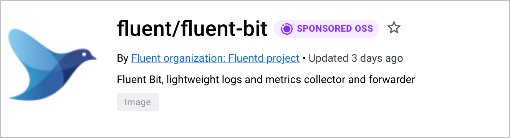

[Docker 赞助开源镜像](https://hub.docker.com/search?q=&image_filter=open_source) 由参加该计划并获得 Docker 赞助的开源项目发布与维护。

属于该计划的镜像在 Docker Hub 上会带有特殊徽章，便于用户识别由 Docker 验证过的值得信赖、安全且活跃的开源项目。

Docker 赞助开源（DSOS）计划为非商业开源开发者提供多项功能与权益。

符合条件的项目可享有如下权益：

- 存储库徽标
- 已验证的 Docker 赞助开源徽章
- 洞察与分析
- 访问 [Docker Scout](#docker-scout) 以进行软件供应链管理
- 取消对开发者的速率限制
- 在 Docker Hub 上获得更好的可发现性

上述权益有效期为一年；若项目仍符合计划要求，发布者可按年续期。计划成员以及从该项目命名空间拉取公共镜像的所有用户，均可享受无限次拉取与无限出站流量。

### 存储库徽标

DSOS 组织可以在 Docker Hub 为单个存储库上传自定义图像。
这允许你在存储库级别覆盖组织级的默认徽标。

只有对该存储库拥有管理权限的用户（所有者或拥有管理员权限的团队成员）
可以更改存储库徽标。

#### 图像要求

- 徽标图像支持 JPEG 与 PNG 格式。
- 最小允许尺寸为 120×120 像素。
- 最大允许尺寸为 1000×1000 像素。
- 最大允许文件大小为 5MB。

#### 设置存储库徽标

1. 登录 [Docker Hub](https://hub.docker.com)。
2. 前往你希望更改徽标的存储库页面。
3. 选择上传徽标按钮（以相机图标表示，
   ），
   位于当前存储库徽标之上。
4. 在弹出的对话框中选择要上传的 PNG 图像，将其设置为该存储库的徽标。

#### 移除徽标

选择 **Clear** 按钮（）即可移除徽标。

移除徽标后，若组织设置了组织徽标，则存储库将回退为组织徽标；
否则将使用以下默认徽标。

### 已验证的 Docker 赞助开源徽章

Docker 验证带有该徽章的镜像为活跃的开源项目，开发者可以在 Docker Hub 上放心使用。

### 洞察与分析

[洞察与分析](/docker-hub/publish/insights-analytics) 服务提供社区如何使用 Docker 镜像的使用指标，
帮助理解用户行为。

这些指标展示按标签或按摘要统计的镜像拉取次数，以及按地理位置、云服务商、客户端等维度的细分数据。

你可以选择要查看分析数据的时间范围；也可以将数据导出为摘要或原始格式。

### Docker Scout

DSOS 项目可以免费在最多 100 个存储库上启用 Docker Scout。
Docker Scout 提供自动化镜像分析、策略评估以改进供应链管理，
以及与 CI 平台和源代码管理等第三方系统的集成等能力。

你可以按存储库粒度启用 Docker Scout。有关使用方法，请参阅 [Docker Scout 文档](/scout/)。

### 谁符合 Docker 赞助开源计划的资格？

要符合该计划的资格，发布者必须在公共存储库中共享项目命名空间，
符合[开放源代码促进会的定义](https://opensource.org/docs/osd)，
并处于活跃开发中且没有商业化路径。

前往 [Docker 赞助开源计划](https://www.docker.com/community/open-source/application/) 申请页了解更多信息。
