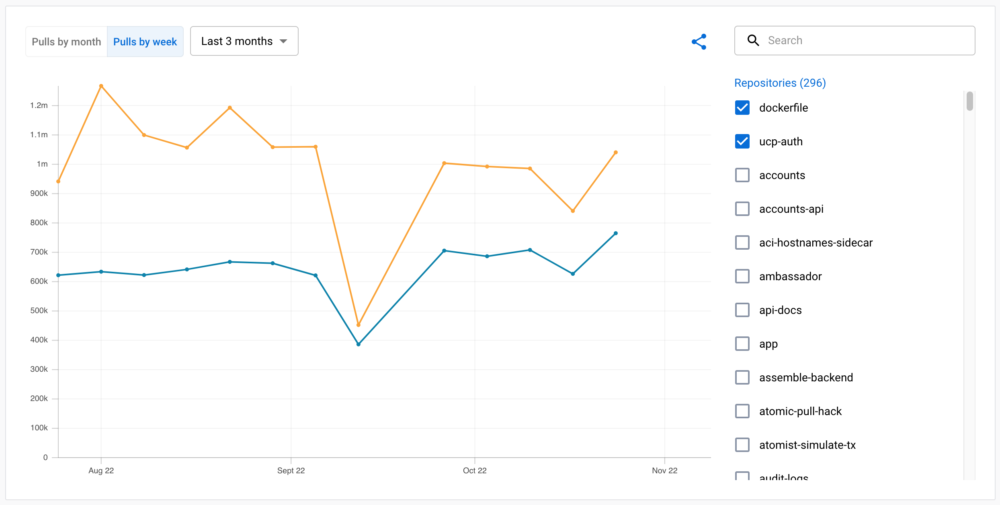
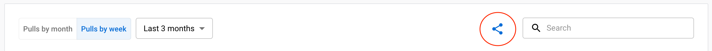
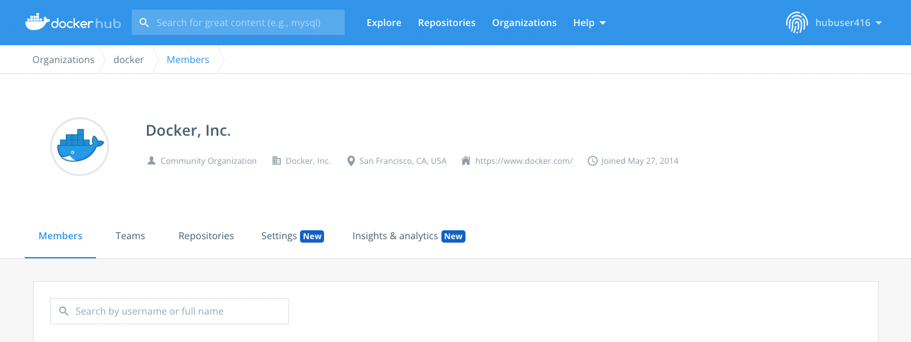
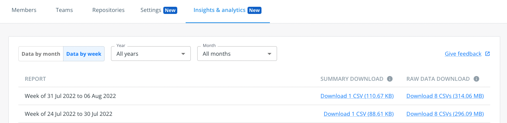

“洞察与分析”为 Docker Hub 上的 Docker 验证发布者（DVP）与 Docker 赞助开源（DSOS）镜像提供使用分析。
这包括在所选时间范围内自助获取镜像与扩展的使用度量。你还可以按标签或摘要显示镜像的拉取次数，
并按地理位置、云服务商、客户端等维度查看细分数据。

<!-- prettier-ignore -->
> [!TIP]
>
> 前往 [Docker 验证发布者计划](https://www.docker.com/partners/programs/) 或
> [Docker 赞助开源](https://www.docker.com/community/open-source/application/#) 页面了解这些计划的更多信息。

## 查看镜像的分析数据

你可以在以下 URL 的 **Insights and analytics（洞察与分析）** 控制台中查看你的存储库分析数据：
`https://hub.docker.com/orgs/{namespace}/insights/images`。
该控制台包含使用数据的可视化图表，以及可下载 CSV 文件的数据表格。

要在图表中查看数据：

- 选择数据粒度：每周或每月
- 选择时间范围：3、6 或 12 个月
- 在列表中选择一个或多个存储库

<!-- prettier-ignore -->
> [!TIP]
>
> 将光标悬停在图表上会显示提示信息，呈现某个时间点的精确数据。

### 共享分析数据

你可以使用图表上方的 **Share（分享）** 图标，将该可视化与他人共享。
这是与你的组织内他人共享统计数据的便捷方式。

选择该图标会生成一个链接并复制到你的剪贴板。该链接会保留你所做的显示选项。
他人打开该链接时，**Insights and analytics** 页面将按你创建链接时的相同配置显示图表。

## 扩展的分析数据

如果你在扩展市场发布了 Docker 扩展，也可以获取扩展使用情况的分析数据（CSV 文件形式）。
你可以从以下 URL 的 **Insights and analytics** 控制台下载扩展相关的 CSV 报告：
`https://hub.docker.com/orgs/{namespace}/insights/extensions`。
如果你的 Docker 命名空间下包含在市场中已知的扩展，你将看到一个 **Extensions** 选项卡，列出你的扩展的 CSV 文件。

## 导出分析数据

你可以通过 Web 控制台或使用 [DVP 数据 API](/reference/api/dvp/latest.md) 导出分析数据。
组织的所有成员都可以访问这些分析数据。

数据可作为可下载的 CSV 文件提供，格式为每周（周一至周日）或每月。
月度数据会在下一个自然月的第一天可用。你可以将这些数据导入到自有系统，
或作为电子表格手动分析。

### 导出数据

在 Docker Hub 网站导出你组织的镜像使用数据，请按以下步骤操作：

1.  登录 [Docker Hub](https://hub.docker.com/)，选择 **My Hub**。

2.  选择你的组织，然后选择 **Analytics**。

    

3.  设置你希望导出分析数据的时间范围。

    可下载的摘要与原始数据的 CSV 文件会显示在右侧。

    

### 使用 API 导出数据

HTTP API 端点如下：
`https://hub.docker.com/api/publisher/analytics/v1`。
如何使用 API 导出数据，请参阅 [DVP 数据 API 文档](/reference/api/dvp/latest.md)。

## 数据点（Data points）

导出的数据包含两种格式：原始数据与汇总数据。不同格式包含的数据点与结构不同。

下文分别说明各格式中可用的数据点。表格中的 **Date added** 列表示该字段首次引入的日期。

### 镜像拉取原始数据（Image pulls raw data）

原始数据格式包含以下数据点。CSV 文件中的每一行代表一次镜像拉取。

| Data point                    | Description                                                                                                  | Date added        |
| ----------------------------- | ------------------------------------------------------------------------------------------------------------ | ----------------- |
| Action                        | Request type, see [Action classification rules][1]. One of `pull_by_tag`, `pull_by_digest`, `version_check`. | January 1, 2022   |
| Action day                    | The date part of the timestamp: `YYYY-MM-DD`.                                                                 | January 1, 2022   |
| Country                       | Request origin country.                                                                                      | January 1, 2022   |
| Digest                        | Image digest.                                                                                                | January 1, 2022   |
| HTTP method                   | HTTP method used in the request, see [registry API documentation][2] for details.                            | January 1, 2022   |
| Host                          | The cloud service provider used in an event.                                                                 | January 1, 2022   |
| Namespace                     | Docker [organization][3] (image namespace).                                                                  | January 1, 2022   |
| Reference                     | Image digest or tag used in the request.                                                                     | January 1, 2022   |
| Repository                    | Docker [repository][4] (image name).                                                                         | January 1, 2022   |
| Tag (included when available) | Tag name that's only available if the request referred to a tag.                                             | January 1, 2022   |
| Timestamp                     | Date and time of the request: `YYYY-MM-DD 00:00:00`.                                                          | January 1, 2022   |
| Type                          | The industry from which the event originates. One of `business`, `isp`, `hosting`, `education`, `null`.       | January 1, 2022   |
| User agent tool               | The application a user used to pull an image (for example, `docker` or `containerd`).                        | January 1, 2022   |
| User agent version            | The version of the application used to pull an image.                                                        | January 1, 2022   |
| Domain                        | Request origin domain, see [Privacy](#privacy).                                                              | October 11, 2022  |
| Owner                         | The name of the organization that owns the repository.                                                       | December 19, 2022 |

[1]: #image-pulls-action-classification-rules
[2]: /registry/spec/api/
[3]: /admin/organization/orgs/
[4]: /docker-hub/repos/

### 镜像拉取汇总数据（Image pulls summary data）

汇总数据提供两个层级：

- 存储库层级：对每个命名空间与存储库的汇总
- 标签或摘要层级：对每个命名空间、存储库与引用（标签或摘要）的汇总

在所选时间范围内，汇总数据格式包含以下数据点：

| Data point        | Description                                             | Date added        |
| ----------------- | ------------------------------------------------------- | ----------------- |
| Unique IP address | Number of unique IP addresses, see [Privacy](#privacy). | January 1, 2022   |
| Pull by tag       | GET request, by digest or by tag.                       | January 1, 2022   |
| Pull by digest    | GET or HEAD request by digest, or HEAD by digest.       | January 1, 2022   |
| Version check     | HEAD by tag, not followed by a GET                      | January 1, 2022   |
| Owner             | The name of the organization that owns the repository.  | December 19, 2022 |

### 镜像拉取行为分类规则（Image pulls action classification rules）

一次动作（action）表示与一次 `docker pull` 相关的多个请求事件。
为了更有助于理解用户行为与意图，系统会将拉取按类别分组。类别包括：

- 版本检查（Version check）
- 按标签拉取（Pull by tag）
- 按摘要拉取（Pull by digest）

自动化系统会频繁检查你的镜像是否有新版本。能区分 CI 中的“版本检查”与用户实际镜像拉取，
可以让你更好地洞察用户行为。

下表描述了用于判断拉取意图的规则。如需就这些规则提供反馈或提问，
请[填写此 Google 表单](https://forms.gle/nb7beTUQz9wzXy1b6)。

| Starting event | Reference | Followed by                                                     | Resulting action | Use case(s)                                                                                                    | Notes                                                                                                                                                                                                                                                                                 |
| :------------- | :-------- | :-------------------------------------------------------------- | :--------------- | :------------------------------------------------------------------------------------------------------------- | :------------------------------------------------------------------------------------------------------------------------------------------------------------------------------------------------------------------------------------------------------------------------------------ |
| HEAD           | tag       | N/A                                                             | Version check    | User already has all layers existing on local machine                                                          | This is similar to the use case of a pull by tag when the user already has all the image layers existing locally, however, it differentiates the user intent and classifies accordingly.                                                                                              |
| GET            | tag       | N/A                                                             | Pull by tag      | User already has all layers existing on local machine and/or the image is single-arch                          |                                                                                                                                                                                                                                                                                       |
| GET            | tag       | Get by different digest                                         | Pull by tag      | Image is multi-arch                                                                                            | Second GET by digest must be different from the first.                                                                                                                                                                                                                                |
| HEAD           | tag       | GET by same digest                                              | Pull by tag      | Image is multi-arch but some or all image layers already exist on the local machine                            | The HEAD by tag sends the most current digest, the following GET must be by that same digest. There may occur an additional GET, if the image is multi-arch (see the next row in this table). If the user doesn't want the most recent digest, then the user performs HEAD by digest. |
| HEAD           | tag       | GET by the same digest, then a second GET by a different digest | Pull by tag      | Image is multi-arch                                                                                            | The HEAD by tag sends the most recent digest, the following GET must be by that same digest. Since the image is multi-arch, there is a second GET by a different digest. If the user doesn't want the most recent digest, then the user performs HEAD by digest.                      |
| HEAD           | tag       | GET by same digest, then a second GET by different digest       | Pull by tag      | Image is multi-arch                                                                                            | The HEAD by tag sends the most current digest, the following GET must be by that same digest. Since the image is multi-arch, there is a second GET by a different digest. If the user doesn't want the most recent digest, then the user performs HEAD by digest.                     |
| GET            | digest    | N/A                                                             | Pull by digest   | User already has all layers existing on local machine and/or the image is single-arch                          |                                                                                                                                                                                                                                                                                       |
| HEAD           | digest    | N/A                                                             | Pull by digest   | User already has all layers existing on their local machine                                                    |                                                                                                                                                                                                                                                                                       |
| GET            | digest    | GET by different digest                                         | Pull by digest   | Image is multi-arch                                                                                            | The second GET by digest must be different from the first.                                                                                                                                                                                                                            |
| HEAD           | digest    | GET by same digest                                              | Pull by digest   | Image is single-arch and/or image is multi-arch but some part of the image already exists on the local machine |                                                                                                                                                                                                                                                                                       |
| HEAD           | digest    | GET by same digest, then a second GET by different digest       | Pull by Digest   | Image is multi-arch                                                                                            |                                                                                                                                                                                                                                                                                       |

### 扩展汇总数据（Extension Summary data）

扩展汇总数据提供两个层级：

- 核心汇总（Core summary）：基础的扩展使用信息，包括扩展安装数、卸载数与历史总安装数

在所选时间范围内，核心汇总数据文件包含以下数据点：

| 数据点            | 描述                                                    | 添加日期          |
| ----------------- | ------------------------------------------------------- | ----------------- |
| Installs          | 扩展的安装次数                                          | Feb 1, 2024       |
| TotalInstalls     | 扩展的历史总安装次数                                    | Feb 1, 2024       |
| Uninstalls        | 扩展的卸载次数                                          | Feb 1, 2024       |
| TotalUninstalls   | 扩展的历史总卸载次数                                    | Feb 1, 2024       |
| Updates           | 扩展的更新次数                                          | Feb 1, 2024       |

- 高级汇总（Premium summary）：高级的扩展使用信息，包括按唯一用户统计的安装、卸载，以及按唯一用户统计的扩展打开次数。

在所选时间范围内，高级汇总数据文件包含以下数据点：

| 数据点            | 描述                                                    | 添加日期          |
| ----------------- | ------------------------------------------------------- | ----------------- |
| Installs          | 扩展的安装次数                                          | Feb 1, 2024       |
| UniqueInstalls    | 安装该扩展的唯一用户数                                  | Feb 1, 2024       |
| Uninstalls        | 扩展的卸载次数                                          | Feb 1, 2024       |
| UniqueUninstalls  | 卸载该扩展的唯一用户数                                  | Feb 1, 2024       |
| Usage             | 扩展选项卡被打开的次数                                  | Feb 1, 2024       |
| UniqueUsers       | 打开扩展选项卡的唯一用户数                              | Feb 1, 2024       |

## 数据随时间的变化（Changes in data over time）

“洞察与分析”服务会持续改进，以提升对发布者的价值。
这可能包括新增数据点，或改进现有数据以提升其实用性。

数据集中的变更（如新增或移除字段）通常仅自该字段首次引入之日起生效，并向后生效。

请参阅[数据点](#data-points)章节中的表格，查看特定数据点从何时开始可用。

## 隐私（Privacy）

本节介绍保护隐私的措施，确保在 Docker Hub 上消费内容的用户保持完全匿名。

<!-- prettier-ignore -->
> [!IMPORTANT]
>
> Docker 不会在分析数据中共享任何可识别个人身份的信息（PII）。

镜像拉取汇总数据集包含“唯一 IP 地址计数”。该数据点仅统计请求某镜像的不同唯一 IP 数，
不会共享任何单个 IP 地址。

镜像拉取原始数据集包含“用户 IP 域名”这一数据点，即用于拉取镜像的 IP 地址所关联的域名。
如果 IP 类型是 `business`，该域名代表与该 IP 地址关联的公司或组织（例如 `docker.com`）。
对于其他非 `business` 的 IP 类型，域名代表用于发起请求的互联网服务提供商或托管服务商。
平均而言，约只有 30% 的拉取会被归类为 `business` IP 类型（不同发布者与镜像之间会有所差异）。
