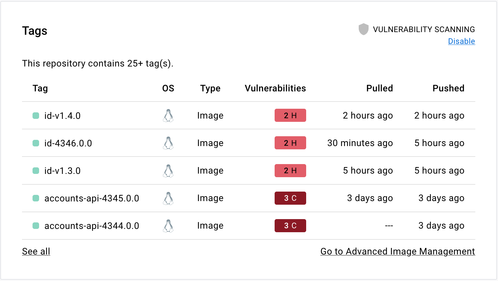
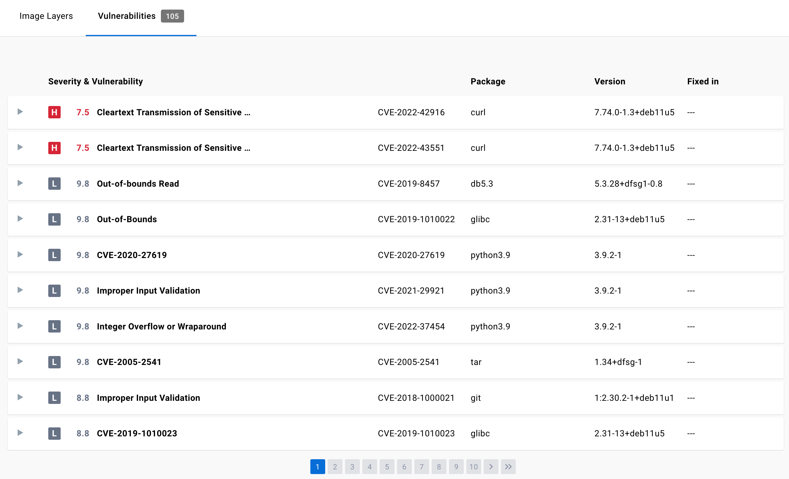

借助 Docker Hub 的镜像安全洞察提升镜像安全性。
你可以选择进行“时点”的静态漏洞扫描，或启用 Docker Scout，以获取持续更新的镜像分析结果。

## Docker Scout 镜像分析

开启 Docker Scout 镜像分析后，Docker Scout 会自动分析你在 Docker Hub 存储库中的镜像。

镜像分析会提取软件物料清单（Software Bill of Material，SBOM）与其他镜像元数据，
并对照安全通告中的漏洞数据进行评估。

下文介绍如何在某个 Docker Hub 存储库上开启或关闭 Docker Scout 镜像分析。
关于镜像分析的更多信息，参见 [Docker Scout](/manuals/scout/_index.md)。

### 开启 Docker Scout 镜像分析

1. 登录 [Docker Hub](https://hub.docker.com)。
2. 选择 **My Hub** > **Repositories**。

   随即显示你的存储库列表。

3. 选择一个存储库。

   将进入该存储库的 **General** 页面。

4. 切换到 **Settings** 选项卡。
5. 在 **Image security insight settings** 下，选择 **Docker Scout image analysis**。
6. 点击 **Save**。

### 关闭 Docker Scout 镜像分析

1. 登录 [Docker Hub](https://hub.docker.com)。
2. 选择 **My Hub** > **Repositories**。

   随即显示你的存储库列表。

3. 选择一个存储库。

   将进入该存储库的 **General** 页面。

4. 切换到 **Settings** 选项卡。
5. 在 **Image security insight settings** 下，选择 **None**。
6. 点击 **Save**。

## 静态漏洞扫描

> [!NOTE]
>
> Docker Hub 的静态漏洞扫描功能需订阅 Docker Pro、Team 或 Business。

启用静态扫描后，将镜像推送到相应的 Docker Hub 存储库会自动触发扫描，以识别其中的漏洞。
扫描结果反映的是“扫描执行当时”的镜像安全状态。

扫描结果包括：

- 漏洞来源，例如操作系统（OS）软件包或库；
- 引入漏洞的版本；
- 若可用，推荐的修复版本，以便进行漏洞修复。

### Docker Hub 静态扫描的变更

自 2023 年 2 月 27 日起，Docker 更换了支撑 Docker Hub 静态扫描功能的底层技术。
此后静态扫描由 Docker 原生提供，不再依赖第三方。

受此变更影响，扫描粒度较以往更细，报告中的漏洞数量可能随之上升。
如果你在 2023 年 2 月 27 日之前使用过漏洞扫描，之后的新报告可能显示更多漏洞，
原因在于分析更为全面。

你无需做任何额外操作。扫描将如常运行，且不会中断或变更价格；历史数据仍可访问。

### 开启静态漏洞扫描

存储库所有者与管理员可以为某个存储库开启静态漏洞扫描。
如果你隶属于 Team 或 Business 订阅，请确保目标存储库在 Team 或 Business 等级下。

当存储库启用了扫描，任何拥有推送权限的用户都可以通过推送镜像触发扫描。

启用静态漏洞扫描：

> [!NOTE]
>
> 静态漏洞扫描目前支持架构为 AMD64、系统为 Linux，且镜像大小小于 10 GB 的镜像。

1. 登录 [Docker Hub](https://hub.docker.com)。
2. 选择 **My Hub** > **Repositories**。

   随即显示你的存储库列表。

3. 选择一个存储库。

   将进入该存储库的 **General** 页面。

4. 切换到 **Settings** 选项卡。
5. 在 **Image security insight settings** 下，选择 **Static scanning**。
6. 点击 **Save**。

### 扫描镜像

要对镜像进行漏洞扫描，请将镜像推送到已启用扫描的 Docker Hub 存储库。

### 查看漏洞报告

查看漏洞报告：

1. 登录 [Docker Hub](https://hub.docker.com)。
2. 选择 **My Hub** > **Repositories**。

   随即显示你的存储库列表。

3. 选择一个存储库。

   将进入该存储库的 **General** 页面。
   漏洞报告可能需要几分钟才会在你的存储库中显示。

   

4. 依次选择 **Tags**、**Digest**、**Vulnerabilities** 查看详细扫描报告。

   扫描报告会按严重性对检测到的漏洞排序（最严重的排在最前）。
   报告包含漏洞所在的软件包信息、引入该漏洞的版本，以及该漏洞是否已在后续版本中修复。

   

关于此视图的更多信息，参见
[镜像详情视图](/manuals/scout/explore/image-details-view.md)。

### 漏洞检查

漏洞报告会基于严重性进行排序，并显示包含漏洞的软件包、引入漏洞的版本，
以及该漏洞是否已在后续版本中修复。

漏洞扫描报告还可帮助开发与安全负责人在不同标签之间比较漏洞数量，
从而观察漏洞随时间的变化趋势（上升或下降）。

### 修复漏洞

确认漏洞列表后，你可以采取以下操作进行修复，例如：

1. 在 Dockerfile 中指定更新后的基础镜像，检查应用层依赖，重建镜像并推送至 Docker Hub。
2. 重建镜像，更新操作系统软件包，然后推送更高版本的镜像到 Docker Hub。
3. 编辑 Dockerfile，手动移除或升级存在漏洞的特定库，重建并推送新镜像到 Docker Hub。

Docker Scout 可为提升镜像安全提供更具上下文的具体修复建议。
更多信息参见 [Docker Scout](/manuals/scout/_index.md)。

### 关闭静态漏洞扫描

存储库所有者与管理员可以关闭某存储库的静态漏洞扫描：

1. 登录 [Docker Hub](https://hub.docker.com)。
2. 选择 **My Hub** > **Repositories**。

   随即显示你的存储库列表。

3. 选择一个存储库。

   将进入该存储库的 **General** 页面。

4. 切换到 **Settings** 选项卡。
5. 在 **Image security insight settings** 下，选择 **None**。
6. 点击 **Save**。
