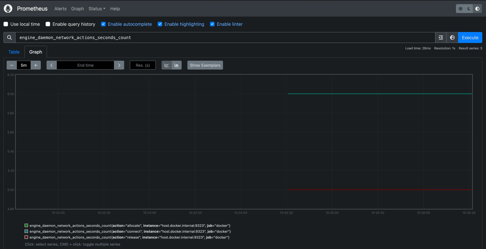
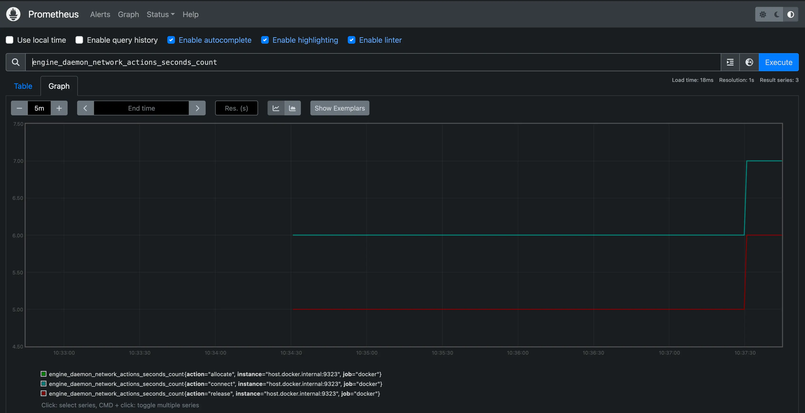

[Prometheus](https://prometheus.io/) 是一个开源的系统监控与告警工具集。
你可以将 Docker 配置为 Prometheus 的抓取目标。

> [!WARNING]
>
> 可用的指标及其名称仍在不断演进，可能随时发生变更。

目前，你只能监控 Docker 本身；暂不支持通过 Docker 目标直接监控你的应用。

## 示例

下面的示例演示如何配置 Docker 守护进程、在本机以容器方式运行 Prometheus，
并通过 Prometheus 监控你的 Docker 实例。

### 配置守护进程

要将 Docker 守护进程配置为 Prometheus 目标，需要在 `daemon.json` 中设置 `metrics-address`。
默认情况下，该文件位于以下位置之一；如不存在，请新建。

- **Linux**：`/etc/docker/daemon.json`
- **Windows Server**：`C:\\ProgramData\\docker\\config\\daemon.json`
- **Docker Desktop**：打开 Docker Desktop 设置，选择 **Docker Engine** 进行编辑。

添加如下配置：

```json
{
  "metrics-addr": "127.0.0.1:9323"
}
```

保存文件；在 Docker Desktop for Mac / Windows 上则保存配置。然后重启 Docker。

此时 Docker 会通过回环地址在 9323 端口暴露 Prometheus 兼容的指标。
也可以将地址改为通配 `0.0.0.0`，但这会将该端口暴露给更广泛的网络范围。
请结合你的威胁模型谨慎选择。

### 创建 Prometheus 配置

复制以下配置文件，保存到任意位置（如 `/tmp/prometheus.yml`）。
这是一个标准的 Prometheus 配置，仅在底部额外添加了 `docker` 抓取任务。

```yml
# 全局配置
global:
  scrape_interval: 15s # 抓取间隔为 15 秒（默认 1 分钟）
  evaluation_interval: 15s # 规则评估间隔为 15 秒（默认 1 分钟）
  # 抓取超时使用全局默认值（10 秒）

  # 与外部系统（联邦、远端存储、Alertmanager）交互时，附加到时序/告警的数据标签
  external_labels:
    monitor: "codelab-monitor"

# 仅加载一次规则，并按全局 evaluation_interval 定期评估
rule_files:
  # - "first.rules"
  # - "second.rules"

# 抓取配置：此示例包含一个抓取端点（Prometheus 自身）
scrape_configs:
  # 该 job 名会作为标签 `job=<job_name>` 附加到所有被抓取的时序中
  - job_name: prometheus

    # metrics_path 默认为 '/metrics'
    # scheme 默认为 'http'

    static_configs:
      - targets: ["localhost:9090"]

  - job_name: docker
      # metrics_path 默认为 '/metrics'
      # scheme 默认为 'http'

    static_configs:
      - targets: ["host.docker.internal:9323"]
```

### 以容器运行 Prometheus

接着使用该配置启动一个 Prometheus 容器：

```console
$ docker run --name my-prometheus \
    --mount type=bind,source=/tmp/prometheus.yml,destination=/etc/prometheus/prometheus.yml \
    -p 9090:9090 \
    --add-host host.docker.internal=host-gateway \
    prom/prometheus
```

如果你使用的是 Docker Desktop，`--add-host` 标志是可选的。
该标志用于确保宿主机的内部 IP 对 Prometheus 容器可用。Docker Desktop 默认会这样处理，
并将宿主机 IP 暴露为主机名 `host.docker.internal`，与前一步 `prometheus.yml` 的配置一致。

### 打开 Prometheus 仪表盘

访问 `http://localhost:9090/targets/`，确认能看到 Docker 目标。


> [!NOTE]
>
> 如果使用 Docker Desktop，无法直接访问此页面中列出的端点 URL。

### 使用 Prometheus

创建一个图表：在 Prometheus UI 中选择 **Graphs**，从 **Execute** 右侧的下拉框中选择一个指标，
点击 **Execute**。下图展示了 `engine_daemon_network_actions_seconds_count` 指标的曲线。



如果你的系统没有运行活跃的任务，图表通常会显示较为空闲的状态。

为使图表更有变化，可以运行一个会产生网络行为的容器，例如使用包管理器下载若干软件包：

```console
$ docker run --rm alpine apk add git make musl-dev go
```

等待数秒（默认抓取间隔 15 秒）后刷新图表，你应能看到曲线出现上升，
这反映了刚才运行的容器带来的网络流量增加。



## 进一步阅读

本文示例展示了如何在本地系统中以容器方式运行 Prometheus。实际使用中，你可能会在
其他服务器或云服务上部署 Prometheus。在这些场景下，同样可以将 Docker 守护进程
设置为 Prometheus 的抓取目标：配置守护进程的 `metrics-addr`，并在 Prometheus 配置中
将该地址添加为抓取端点。

```yaml
- job_name: docker
  static_configs:
    - targets: ["docker.daemon.example:<PORT>"]
```

更多 Prometheus 相关信息，参阅
[Prometheus 文档](https://prometheus.io/docs/introduction/overview/)
