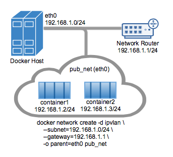

IPvlan 驱动为用户提供对 IPv4 与 IPv6 地址分配的完全控制。基于此，VLAN 驱动进一步为运维人员提供对二层 VLAN 打标以及 IPvlan 三层路由的完整控制，适用于需要与底层（underlay）网络集成的场景。若需要抽象物理约束的跨主机部署，请参见[多主机 overlay](/manuals/engine/network/tutorials/overlay.md) 驱动。

IPvlan 是对成熟网络虚拟化技术的一种新演绎。其 Linux 实现非常轻量：并非借助传统 Linux bridge 进行隔离，而是直接关联到某个 Linux 以太网接口或子接口，以此在不同网络之间实现隔离，并与物理网络连通。

IPvlan 通过多种模式提供了一系列独特特性与扩展空间。其高层优势主要体现在两点：
1) 绕过 Linux bridge 带来的性能收益；
2) 组件更少，架构更简洁。
移除传统位于主机网卡与容器接口之间的 bridge 后，容器接口可直接连接到 Docker 主机接口。对于对外服务而言，这种方式更易访问，因为在这类场景下通常无需端口映射。

## 选项

下表列出了使用 `ipvlan` 驱动创建网络时，可通过 `--opt` 传入的驱动特定选项：

| 选项           | 默认值   | 说明                                                                 |
| -------------- | -------- | -------------------------------------------------------------------- |
| `ipvlan_mode`  | `l2`     | 设置 IPvlan 的工作模式，可选：`l2`、`l3`、`l3s`                      |
| `ipvlan_flag`  | `bridge` | 设置 IPvlan 的模式标志，可选：`bridge`、`private`、`vepa`            |
| `parent`       |          | 指定要使用的父接口。                                                 |

## 示例

### 先决条件

- 本页示例均为单主机场景。
- 所有示例都可以在一台运行 Docker 的主机上完成。示例中使用的子接口（如 `eth0.10`）可替换为 `eth0` 或主机上任意合法的父接口。带有 `.` 的子接口会按需动态创建。也可以在 `docker network create` 中省略 `-o parent`，驱动会自动创建一个 `dummy` 接口以便在本机完成示例。
- 内核要求：
    - IPvlan 需要 Linux 内核 v4.2+（更早版本虽有支持但存在缺陷）。使用 `uname -r` 可查看当前内核版本。

### IPvlan L2 模式示例用法

下图展示了 IPvlan `L2` 模式的拓扑示例。
创建网络时通过 `-d driver_name` 指定驱动，本示例为 `-d ipvlan`。



下例中的父接口（`-o parent=eth0`）配置如下：

```console
$ ip addr show eth0
3: eth0: <BROADCAST,MULTICAST,UP,LOWER_UP> mtu 1500 qdisc pfifo_fast state UP group default qlen 1000
    inet 192.168.1.250/24 brd 192.168.1.255 scope global eth0
```

在执行 `docker network create` 时，将主机接口所在的网络用作 `--subnet`。
通过 `-o parent=` 指定的父接口，容器将连接到与该主机接口相同的网络。

创建 IPvlan 网络并启动容器连接到该网络：

```console
# IPvlan  (-o ipvlan_mode= Defaults to L2 mode if not specified)
$ docker network create -d ipvlan \
    --subnet=192.168.1.0/24 \
    --gateway=192.168.1.1 \
    -o ipvlan_mode=l2 \
    -o parent=eth0 db_net

# Start a container on the db_net network
$ docker run --net=db_net -it --rm alpine /bin/sh

# NOTE: the containers can NOT ping the underlying host interfaces as
# they are intentionally filtered by Linux for additional isolation.
```

IPvlan 的默认模式是 `l2`。如果未指定 `-o ipvlan_mode=`，将使用默认模式。
同样地，如果未指定 `--gateway`，网段中的第一个可用地址会作为网关。
例如，当指定的子网为 `--subnet=192.168.1.0/24` 时，容器获得的网关为 `192.168.1.1`。

为了帮助理解该模式与其他主机的交互，下图展示了两个 Docker 主机处于同一二层网络段、并使用 IPvlan L2 模式的情形。


以下命令将创建与前面 `db_net` 相同的网络，驱动将默认设置 `--gateway=192.168.1.1` 与 `-o ipvlan_mode=l2`。

```console
# IPvlan  (-o ipvlan_mode= Defaults to L2 mode if not specified)
$ docker network create -d ipvlan \
    --subnet=192.168.1.0/24 \
    -o parent=eth0 db_net_ipv

# Start a container with an explicit name in daemon mode
$ docker run --net=db_net_ipv --name=ipv1 -itd alpine /bin/sh

# Start a second container and ping using the container name
# to see the docker included name resolution functionality
$ docker run --net=db_net_ipv --name=ipv2 -it --rm alpine /bin/sh
$ ping -c 4 ipv1

# NOTE: the containers can NOT ping the underlying host interfaces as
# they are intentionally filtered by Linux for additional isolation.
```

这些驱动同样支持 `--internal` 标志，可将某个网络中的容器与外部通信完全隔离。
由于网络隔离与父接口紧密相关，因此在执行 `docker network create` 时省略 `-o parent=`，效果与使用 `--internal` 相同。
未指定父接口或使用 `--internal` 时，驱动会为你创建一个 netlink 类型的 `dummy` 父接口，作为该网络的父接口，从而实现完全隔离。

下面两条 `docker network create` 命令将创建等效的网络，容器连接效果相同：

```console
# Empty '-o parent=' creates an isolated network
$ docker network create -d ipvlan \
    --subnet=192.168.10.0/24 isolated1

# Explicit '--internal' flag is the same:
$ docker network create -d ipvlan \
    --subnet=192.168.11.0/24 --internal isolated2

# Even the '--subnet=' can be left empty and the default
# IPAM subnet of 172.18.0.0/16 will be assigned
$ docker network create -d ipvlan isolated3

$ docker run --net=isolated1 --name=cid1 -it --rm alpine /bin/sh
$ docker run --net=isolated2 --name=cid2 -it --rm alpine /bin/sh
$ docker run --net=isolated3 --name=cid3 -it --rm alpine /bin/sh

# To attach to any use `docker exec` and start a shell
$ docker exec -it cid1 /bin/sh
$ docker exec -it cid2 /bin/sh
$ docker exec -it cid3 /bin/sh
```

### IPvlan 802.1Q trunk L2 模式示例

从架构上看，IPvlan 的 L2 模式在中继（trunk）场景下与 Macvlan 在网关与二层路径隔离方面一致。也存在一些差异点，例如在 ToR 交换机的 CAM 表压力、每端口单 MAC、父网卡可能出现 MAC 枯竭等方面的权衡。802.1Q trunk 场景的外观相同。两种模式都遵循标准的打标方式，并能与物理网络无缝集成，便于与底层网络及硬件厂商插件集成。

同一 VLAN 内的主机通常处于同一子网，且几乎总是根据安全策略被分组。在多数场景下，多层应用会被划分到不同子网，因为各个进程的安全属性需要隔离。例如，将信用卡处理与前端 Web 服务器放在同一虚拟网络上会引发合规性问题，也违背了长期以来分层纵深防御的最佳实践。VLAN（或在 Overlay 驱动下的等价概念 VNI，虚拟网络标识）是隔离租户流量的第一步。


带 VLAN 标签的 Linux 子接口既可以事先存在，也可以在执行 `docker network create` 时由驱动创建。执行 `docker network rm` 时会删除该子接口。注意父接口（如 `eth0`）不会被删除，只会删除 netlink 父索引 > 0 的子接口。

为了让驱动自动添加/删除 VLAN 子接口，接口命名需要采用 `接口名. VLAN 标签` 的格式（例如 `eth0.10`）。也可以使用其他命名作为父接口，但当调用 `docker network rm` 时，这类链路不会被自动删除。

你既可以使用已有的父 VLAN 子接口，也可以交由 Docker 管理。这样一来，既支持完全由你管理 Linux 接口与网络，也支持让 Docker 通过 netlink `ip link` 创建/删除 VLAN 父子接口，减轻运维负担。

例如：`eth0.10` 表示 `eth0` 的一个子接口，并打上 VLAN ID `10`。等价的 `ip link` 命令为：`ip link add link eth0 name eth0.10 type vlan id 10`。

下面的示例会创建带 VLAN 标签的网络，并启动两个容器以测试容器间连通性。在没有路由器进行跨网段转发的情况下，不同 VLAN 之间无法互相 ping 通。按照 IPvlan 的设计，默认命名空间不可达，以便将容器命名空间与底层主机隔离。

#### VLAN ID 20

在第一个由 Docker 主机打标并隔离的网络中，通过 `-o parent=eth0.20` 指定父接口 `eth0.20`，其 VLAN ID 为 `20`。也可以使用其他命名格式，但需要手动通过 `ip link` 或 Linux 配置文件添加/删除链路。只要 `-o parent` 指定的接口存在且符合 Linux netlink，即可使用。

```console
# now add networks and hosts as you would normally by attaching to the master (sub)interface that is tagged
$ docker network create -d ipvlan \
    --subnet=192.168.20.0/24 \
    --gateway=192.168.20.1 \
    -o parent=eth0.20 ipvlan20

# in two separate terminals, start a Docker container and the containers can now ping one another.
$ docker run --net=ipvlan20 -it --name ivlan_test1 --rm alpine /bin/sh
$ docker run --net=ipvlan20 -it --name ivlan_test2 --rm alpine /bin/sh
```

#### VLAN ID 30

在第二个由 Docker 主机打标并隔离的网络中，通过 `-o parent=eth0.30` 指定父接口 `eth0.30`，其 VLAN ID 为 `30`。`ipvlan_mode=` 默认为 L2（`ipvlan_mode=l2`），也可以显式指定，效果相同。

```console
# now add networks and hosts as you would normally by attaching to the master (sub)interface that is tagged.
$ docker network create -d ipvlan \
    --subnet=192.168.30.0/24 \
    --gateway=192.168.30.1 \
    -o parent=eth0.30 \
    -o ipvlan_mode=l2 ipvlan30

# in two separate terminals, start a Docker container and the containers can now ping one another.
$ docker run --net=ipvlan30 -it --name ivlan_test3 --rm alpine /bin/sh
$ docker run --net=ipvlan30 -it --name ivlan_test4 --rm alpine /bin/sh
```

容器内的默认网关会被设置为该网络的网关地址。该网关通常是网络中的外部路由器。

```console
$$ ip route
  default via 192.168.30.1 dev eth0
  192.168.30.0/24 dev eth0  src 192.168.30.2
```

示例：IPvlan L2 模式下的多子网用法，在同一子网上启动两个容器并相互 ping 通。若要从 `192.168.114.0/24` 访问 `192.168.116.0/24`，需要在 L2 模式下由外部路由器转发。而在 L3 模式下，只要共享相同的 `-o parent=`，即可在不同子网间路由单播流量。

当地址空间耗尽时，在网络路由器上为某个 L3 VLAN 接口（常称为 “交换虚接口”，SVI）添加次级地址是很常见的做法。

```console
$ docker network create -d ipvlan \
    --subnet=192.168.114.0/24 --subnet=192.168.116.0/24 \
    --gateway=192.168.114.254 --gateway=192.168.116.254 \
    -o parent=eth0.114 \
    -o ipvlan_mode=l2 ipvlan114

$ docker run --net=ipvlan114 --ip=192.168.114.10 -it --rm alpine /bin/sh
$ docker run --net=ipvlan114 --ip=192.168.114.11 -it --rm alpine /bin/sh
```

要点在于：运维人员可以把物理网络映射到虚拟网络，将容器无缝纳入现有环境，无需大的运维改造。网络运维（NetOps）向 Docker 主机下发一个 802.1Q trunk，该虚拟链路即是在创建网络时通过 `-o parent=` 指定的接口。对于无标记（非 VLAN）的链路，只需 `-o parent=eth0`；对于带 VLAN ID 的 802.1Q trunk，则将各网络映射到相应的 VLAN/子网。

例如：NetOps 提供通过以太网链路传入 Docker 主机的 VLAN ID 及其对应子网。预配 Docker 网络时，将这些值填入 `docker network create` 命令。这些配置是持久的，每次 Docker 引擎启动都会生效，从而避免维护复杂的配置文件。也可以手动管理网络接口（预先创建），Docker 网络不会修改这些接口，而是将其作为父接口使用。如下是 NetOps 配置到 Docker 命令的示例映射：

- VLAN: 10, Subnet: 172.16.80.0/24, Gateway: 172.16.80.1
    - `--subnet=172.16.80.0/24 --gateway=172.16.80.1 -o parent=eth0.10`
- VLAN: 20, IP subnet: 172.16.50.0/22, Gateway: 172.16.50.1
    - `--subnet=172.16.50.0/22 --gateway=172.16.50.1 -o parent=eth0.20`
- VLAN: 30, Subnet: 10.1.100.0/16, Gateway: 10.1.100.1
    - `--subnet=10.1.100.0/16 --gateway=10.1.100.1 -o parent=eth0.30`

### IPvlan L3 模式示例

IPvlan 要求将路由分发到各个端点。该驱动仅创建 IPvlan L3 模式的端口，并将容器附着到该接口；在集群范围内分发路由超出了这个单主机范围驱动的初始实现。在 L3 模式中，Docker 主机的角色类似于在容器中“开辟新网络”的路由器；如果不进行路由分发，上游网络并不了解这些网络。以下示例有助于理解 IPvlan L3 在容器网络中的定位。


IPvlan L3 模式会丢弃所有广播与组播流量。仅此一点就使其非常适合追求海量规模与可预期网络集成的场景。由于不涉及桥接，网络行为更可预测，也更有助于稳定运行。桥接环路常导致难以定位的重大故障（取决于故障域大小），这源于 BPDU（桥端口数据单元）在广播域（VLAN）内的泛洪以探测并阻断拓扑环路。消除桥接域，或至少将其隔离在一对 ToR（机架顶交换机）范围内，有助于降低桥接不稳定带来的排障难度。IPvlan L2 模式适合仅中继至一对 ToR 的隔离 VLAN，从而提供无环、非阻塞的网络结构；进一步的做法是在边缘通过 IPvlan L3 进行路由，将故障域限定在本地主机。

- L3 模式需要与默认命名空间使用不同的子网，因为它需要在默认命名空间下存在一条指向 IPvlan 父接口的 netlink 路由。
- 本示例中父接口为 `eth0`，其所在子网为 `192.168.1.0/24`。注意 `docker network` 与 `eth0` 不在同一子网。
- 与 IPvlan L2 模式不同，只要共享相同的父接口 `-o parent=`，不同子网/网络之间可以互相 ping 通。

```console
$$ ip a show eth0
3: eth0: <BROADCAST,MULTICAST,UP,LOWER_UP> mtu 1500 qdisc pfifo_fast state UP group default qlen 1000
    link/ether 00:50:56:39:45:2e brd ff:ff:ff:ff:ff:ff
    inet 192.168.1.250/24 brd 192.168.1.255 scope global eth0
```

- 对于 L3 模式的 IPvlan 接口，传统意义上的网关并不重要，因为不允许广播流量。因此，容器的默认网关会指向容器自身的 `eth0` 设备。详见下文 L3 容器内执行 `ip route` 或 `ip -6 route` 的输出。

由于 IPvlan 的默认模式为 `l2`，因此必须显式指定 `-o ipvlan_mode=l3`。

下面的示例未指定父接口。驱动不会拒绝创建该网络，而是为你创建一个 dummy 类型的链路；这样容器会彼此可达，但与外界隔离。

```console
# Create the IPvlan L3 network
$ docker network create -d ipvlan \
    --subnet=192.168.214.0/24 \
    --subnet=10.1.214.0/24 \
    -o ipvlan_mode=l3 ipnet210

# Test 192.168.214.0/24 connectivity
$ docker run --net=ipnet210 --ip=192.168.214.10 -itd alpine /bin/sh
$ docker run --net=ipnet210 --ip=10.1.214.10 -itd alpine /bin/sh

# Test L3 connectivity from 10.1.214.0/24 to 192.168.214.0/24
$ docker run --net=ipnet210 --ip=192.168.214.9 -it --rm alpine ping -c 2 10.1.214.10

# Test L3 connectivity from 192.168.214.0/24 to 10.1.214.0/24
$ docker run --net=ipnet210 --ip=10.1.214.9 -it --rm alpine ping -c 2 192.168.214.10

```

> [!NOTE]
>
> 注意网络创建命令中没有 `--gateway=`。在 `l3` 模式下，即使指定该字段也会被忽略。可以在容器内查看路由表：
>
> ```console
> # Inside an L3 mode container
> $$ ip route
>  default dev eth0
>   192.168.214.0/24 dev eth0  src 192.168.214.10
> ```

若希望从远端 Docker 主机 ping 到容器，或让容器 ping 远端主机，则需要在远端主机或中间物理网络上，添加一条指向容器所在 Docker 主机网卡 IP 的路由。

### 双栈 IPv4/IPv6 的 IPvlan L2 模式

– Libnetwork 不仅让你完全掌控 IPv4 地址分配，也同样支持对 IPv6 的完全控制，并在两类地址族之间保持功能一致。

– 下一个示例从仅 IPv6 开始：在同一 VLAN `139` 上启动两个容器并互相 ping。由于未指定 IPv4 子网，默认 IPAM 会分配一个默认 IPv4 子网；除非上游网络对 VLAN `139` 显式路由，否则该子网将保持隔离。

```console
# Create a v6 network
$ docker network create -d ipvlan \
    --ipv6 --subnet=2001:db8:abc2::/64 --gateway=2001:db8:abc2::22 \
    -o parent=eth0.139 v6ipvlan139

# Start a container on the network
$ docker run --net=v6ipvlan139 -it --rm alpine /bin/sh
```

查看容器内 eth0 接口与 IPv6 路由表：

```console
# Inside the IPv6 container
$$ ip a show eth0
75: eth0@if55: <BROADCAST,MULTICAST,UP,LOWER_UP> mtu 1500 qdisc noqueue state UNKNOWN group default
    link/ether 00:50:56:2b:29:40 brd ff:ff:ff:ff:ff:ff
    inet 172.18.0.2/16 scope global eth0
       valid_lft forever preferred_lft forever
    inet6 2001:db8:abc4::250:56ff:fe2b:2940/64 scope link
       valid_lft forever preferred_lft forever
    inet6 2001:db8:abc2::1/64 scope link nodad
       valid_lft forever preferred_lft forever

$$ ip -6 route
2001:db8:abc4::/64 dev eth0  proto kernel  metric 256
2001:db8:abc2::/64 dev eth0  proto kernel  metric 256
default via 2001:db8:abc2::22 dev eth0  metric 1024
```

再启动第二个容器并 ping 第一个容器的 v6 地址：

```console
# Test L2 connectivity over IPv6
$ docker run --net=v6ipvlan139 -it --rm alpine /bin/sh

# Inside the second IPv6 container
$$ ip a show eth0
75: eth0@if55: <BROADCAST,MULTICAST,UP,LOWER_UP> mtu 1500 qdisc noqueue state UNKNOWN group default
    link/ether 00:50:56:2b:29:40 brd ff:ff:ff:ff:ff:ff
    inet 172.18.0.3/16 scope global eth0
       valid_lft forever preferred_lft forever
    inet6 2001:db8:abc4::250:56ff:fe2b:2940/64 scope link tentative dadfailed
       valid_lft forever preferred_lft forever
    inet6 2001:db8:abc2::2/64 scope link nodad
       valid_lft forever preferred_lft forever

$$ ping6 2001:db8:abc2::1
PING 2001:db8:abc2::1 (2001:db8:abc2::1): 56 data bytes
64 bytes from 2001:db8:abc2::1%eth0: icmp_seq=0 ttl=64 time=0.044 ms
64 bytes from 2001:db8:abc2::1%eth0: icmp_seq=1 ttl=64 time=0.058 ms

2 packets transmitted, 2 packets received, 0% packet loss
round-trip min/avg/max/stddev = 0.044/0.051/0.058/0.000 ms
```

接下来使用 VLAN ID `140` 演示搭建双栈 IPv4/IPv6 网络：

创建一个包含两个 IPv4 子网和一个 IPv6 子网的网络，并为三者显式指定网关：

```console
$ docker network create -d ipvlan \
    --subnet=192.168.140.0/24 --subnet=192.168.142.0/24 \
    --gateway=192.168.140.1 --gateway=192.168.142.1 \
    --subnet=2001:db8:abc9::/64 --gateway=2001:db8:abc9::22 \
    -o parent=eth0.140 \
    -o ipvlan_mode=l2 ipvlan140
```

启动容器并查看 eth0、IPv4 与 IPv6 路由表：

```console
$ docker run --net=ipvlan140 --ip6=2001:db8:abc2::51 -it --rm alpine /bin/sh

$ ip a show eth0
78: eth0@if77: <BROADCAST,MULTICAST,UP,LOWER_UP> mtu 1500 qdisc noqueue state UNKNOWN group default
    link/ether 00:50:56:2b:29:40 brd ff:ff:ff:ff:ff:ff
    inet 192.168.140.2/24 scope global eth0
       valid_lft forever preferred_lft forever
    inet6 2001:db8:abc4::250:56ff:fe2b:2940/64 scope link
       valid_lft forever preferred_lft forever
    inet6 2001:db8:abc9::1/64 scope link nodad
       valid_lft forever preferred_lft forever

$$ ip route
default via 192.168.140.1 dev eth0
192.168.140.0/24 dev eth0  proto kernel  scope link  src 192.168.140.2

$$ ip -6 route
2001:db8:abc4::/64 dev eth0  proto kernel  metric 256
2001:db8:abc9::/64 dev eth0  proto kernel  metric 256
default via 2001:db8:abc9::22 dev eth0  metric 1024
```

启动第二个容器并指定 `--ip`，使用 IPv4 数据包 ping 第一个主机：

```console
$ docker run --net=ipvlan140 --ip=192.168.140.10 -it --rm alpine /bin/sh
```

> [!NOTE]
>
> 在 IPvlan `L2` 模式中，同一父接口上的不同子网无法互相 ping 通。需要由路由器使用次级子网进行 Proxy ARP 才能转发请求。
> 但在 IPvlan `L3` 模式中，只要共享相同的 `-o parent` 父链路，就能在不同子网间路由单播流量。

### 双栈 IPv4/IPv6 的 IPvlan L3 模式

示例：IPvlan L3 模式（双栈 IPv4/IPv6，多子网，802.1Q VLAN 标签：118）

与其他示例一样，不必须使用打过标签的 VLAN 接口。子接口可以替换为主机上的 `eth0`、`eth1`、`bond0` 或任何合法接口（不包括回环 `lo`）。

主要区别在于：L3 模式不会创建带下一跳的默认路由，而是仅设置一个指向 `dev eth` 的默认路由，因为根据设计，ARP/广播/组播都被 Linux 过滤。由于父接口本质上充当路由器，父接口的 IP 与子网需要与容器网络不同。这与 bridge 与 L2 模式相反，后两者需要位于同一子网（广播域）才能转发广播与组播数据包。

```console
# Create an IPv6+IPv4 Dual Stack IPvlan L3 network
# Gateways for both v4 and v6 are set to a dev e.g. 'default dev eth0'
$ docker network create -d ipvlan \
    --subnet=192.168.110.0/24 \
    --subnet=192.168.112.0/24 \
    --subnet=2001:db8:abc6::/64 \
    -o parent=eth0 \
    -o ipvlan_mode=l3 ipnet110


# Start a few of containers on the network (ipnet110)
# in separate terminals and check connectivity
$ docker run --net=ipnet110 -it --rm alpine /bin/sh
# Start a second container specifying the v6 address
$ docker run --net=ipnet110 --ip6=2001:db8:abc6::10 -it --rm alpine /bin/sh
# Start a third specifying the IPv4 address
$ docker run --net=ipnet110 --ip=192.168.112.30 -it --rm alpine /bin/sh
# Start a 4th specifying both the IPv4 and IPv6 addresses
$ docker run --net=ipnet110 --ip6=2001:db8:abc6::50 --ip=192.168.112.50 -it --rm alpine /bin/sh
```

接口与路由表输出如下：

```console
$$ ip a show eth0
63: eth0@if59: <BROADCAST,MULTICAST,NOARP,UP,LOWER_UP> mtu 1500 qdisc noqueue state UNKNOWN group default
    link/ether 00:50:56:2b:29:40 brd ff:ff:ff:ff:ff:ff
    inet 192.168.112.2/24 scope global eth0
       valid_lft forever preferred_lft forever
    inet6 2001:db8:abc4::250:56ff:fe2b:2940/64 scope link
       valid_lft forever preferred_lft forever
    inet6 2001:db8:abc6::10/64 scope link nodad
       valid_lft forever preferred_lft forever

# Note the default route is the eth device because ARPs are filtered.
$$ ip route
  default dev eth0  scope link
  192.168.112.0/24 dev eth0  proto kernel  scope link  src 192.168.112.2

$$ ip -6 route
2001:db8:abc4::/64 dev eth0  proto kernel  metric 256
2001:db8:abc6::/64 dev eth0  proto kernel  metric 256
default dev eth0  metric 1024
```

> [!NOTE]
>
> 当指定 `--ip6=` 地址时，可能存在一个缺陷：删除具有该 v6 地址的容器后，若立即使用相同 v6 地址启动新容器，可能会报错，似乎地址未正确释放回 v6 地址池，从而导致容器卸载失败并处于异常状态。

```console
docker: Error response from daemon: Address already in use.
```

### 手动创建 802.1Q 链路

#### VLAN ID 40

如果不希望由驱动创建 VLAN 子接口，则需要在运行 `docker network create` 之前自行创建。即便子接口命名不是 `接口名.VLAN_ID`，只要接口存在且已启用，也可以在 `-o parent=` 选项中使用。

手动创建的链路可按任意名称命名，只要在创建网络时它们存在即可。无论名称如何，当使用 `docker network rm` 删除网络时，这些手动创建的链路不会被删除。

```console
# create a new sub-interface tied to dot1q vlan 40
$ ip link add link eth0 name eth0.40 type vlan id 40

# enable the new sub-interface
$ ip link set eth0.40 up

# now add networks and hosts as you would normally by attaching to the master (sub)interface that is tagged
$ docker network create -d ipvlan \
    --subnet=192.168.40.0/24 \
    --gateway=192.168.40.1 \
    -o parent=eth0.40 ipvlan40

# in two separate terminals, start a Docker container and the containers can now ping one another.
$ docker run --net=ipvlan40 -it --name ivlan_test5 --rm alpine /bin/sh
$ docker run --net=ipvlan40 -it --name ivlan_test6 --rm alpine /bin/sh
```

示例：使用任意名称手动创建 VLAN 子接口：

```console
# create a new sub interface tied to dot1q vlan 40
$ ip link add link eth0 name foo type vlan id 40

# enable the new sub-interface
$ ip link set foo up

# now add networks and hosts as you would normally by attaching to the master (sub)interface that is tagged
$ docker network create -d ipvlan \
    --subnet=192.168.40.0/24 --gateway=192.168.40.1 \
    -o parent=foo ipvlan40

# in two separate terminals, start a Docker container and the containers can now ping one another.
$ docker run --net=ipvlan40 -it --name ivlan_test5 --rm alpine /bin/sh
$ docker run --net=ipvlan40 -it --name ivlan_test6 --rm alpine /bin/sh
```

可用以下命令清理手动创建的链路：

```console
$ ip link del foo
```

与其他 Libnetwork 驱动一样，你可以自由混用，甚至与第三方生态驱动并行运行，为 Docker 用户提供最大的灵活性。
