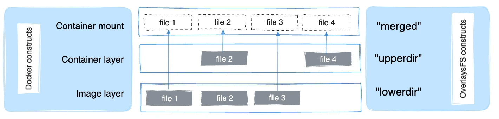

OverlayFS 是一种联合（union）文件系统。

本文将 Linux 内核驱动称为 `OverlayFS`，将 Docker 的存储驱动称为 `overlay2`。

> [!NOTE]
>
> 关于 `fuse-overlayfs` 驱动，请参见[无根模式文档](/manuals/engine/security/rootless.md)。

## 先决条件

OverlayFS 是推荐的存储驱动，满足以下条件即可受支持：

- Linux 内核版本 4.0 及以上；或 RHEL/CentOS 使用内核版本 3.10.0-514 及以上。
- 在 `xfs` 作为后端文件系统时支持 `overlay2` 驱动，但必须启用 `d_type=true`。

  使用 `xfs_info` 验证 `ftype` 是否为 `1`。正确格式化 `xfs` 文件系统时，请使用 `-n ftype=1`。

- 更换存储驱动会导致本机现有容器与镜像不可访问。请在更改前使用 `docker save` 备份自建镜像，或推送到 Docker Hub/私有仓库，以免之后需要重新创建。

## 配置 Docker 使用 `overlay2` 存储驱动

<a name="configure-docker-with-the-overlay-or-overlay2-storage-driver"></a>

在执行以下步骤前，请先满足[先决条件](#先决条件)。

以下步骤展示如何配置 `overlay2` 存储驱动：

1. 停止 Docker。

   ```console
   $ sudo systemctl stop docker
   ```

2. 将 `/var/lib/docker` 的内容复制到临时位置。

   ```console
   $ cp -au /var/lib/docker /var/lib/docker.bk
   ```

3. 如果你想使用与 `/var/lib/` 不同的后端文件系统，请先格式化该文件系统并将其挂载到 `/var/lib/docker`，并在 `/etc/fstab` 中添加该挂载以确保重启后仍然生效。

4. 编辑 `/etc/docker/daemon.json`（不存在则创建）。若文件为空，添加如下内容：

   ```json
   {
     "storage-driver": "overlay2"
   }
   ```

   如果 `daemon.json` 包含无效 JSON，Docker 将无法启动。

5. 启动 Docker。

   ```console
   $ sudo systemctl start docker
   ```

6. 验证守护进程是否正在使用 `overlay2`。使用 `docker info` 并检查 `Storage Driver` 与 `Backing filesystem`：

   ```console
   $ docker info

   Containers: 0
   Images: 0
   Storage Driver: overlay2
    Backing Filesystem: xfs
    Supports d_type: true
    Native Overlay Diff: true
   <...>
   ```

至此，Docker 将使用 `overlay2` 存储驱动，并自动创建包含 `lowerdir`、`upperdir`、`merged` 与 `workdir` 的 overlay 挂载。

继续阅读以了解 OverlayFS 在 Docker 容器中的工作方式、性能建议，以及其与不同后端文件系统的兼容性限制。

## `overlay2` 的工作原理

OverlayFS 会在同一台 Linux 主机上将两个目录“叠加”为一个目录对外呈现。这些目录被称为层（layer），其统一视图的挂载过程称为联合挂载（union mount）。OverlayFS 将下层目录称为 `lowerdir`，上层目录称为 `upperdir`，统一后的视图通过 `merged` 目录对外提供。

`overlay2` 原生支持最多 128 个下层 OverlayFS 层。这有助于提升与层相关的 Docker 命令（如 `docker build`、`docker commit`）的性能，并减少后端文件系统的 inode 消耗。

### 磁盘上的镜像与容器层

使用 `docker pull ubuntu` 下载一个包含五层的镜像后，你会在 `/var/lib/docker/overlay2` 下看到 6 个目录。

> [!WARNING]
>
> 请勿直接操作 `/var/lib/docker/` 下的任何文件或目录，这些均由 Docker 管理。

```console
$ ls -l /var/lib/docker/overlay2

total 24
drwx------ 5 root root 4096 Jun 20 07:36 223c2864175491657d238e2664251df13b63adb8d050924fd1bfcdb278b866f7
drwx------ 3 root root 4096 Jun 20 07:36 3a36935c9df35472229c57f4a27105a136f5e4dbef0f87905b2e506e494e348b
drwx------ 5 root root 4096 Jun 20 07:36 4e9fa83caff3e8f4cc83693fa407a4a9fac9573deaf481506c102d484dd1e6a1
drwx------ 5 root root 4096 Jun 20 07:36 e8876a226237217ec61c4baf238a32992291d059fdac95ed6303bdff3f59cff5
drwx------ 5 root root 4096 Jun 20 07:36 eca1e4e1694283e001f200a667bb3cb40853cf2d1b12c29feda7422fed78afed
drwx------ 2 root root 4096 Jun 20 07:36 l
```

新的 `l`（小写字母 L）目录以符号链接的形式保存了缩短后的层标识。这些标识用于避免 `mount` 命令参数长度受页面大小限制。

```console
$ ls -l /var/lib/docker/overlay2/l

total 20
lrwxrwxrwx 1 root root 72 Jun 20 07:36 6Y5IM2XC7TSNIJZZFLJCS6I4I4 -> ../3a36935c9df35472229c57f4a27105a136f5e4dbef0f87905b2e506e494e348b/diff
lrwxrwxrwx 1 root root 72 Jun 20 07:36 B3WWEFKBG3PLLV737KZFIASSW7 -> ../4e9fa83caff3e8f4cc83693fa407a4a9fac9573deaf481506c102d484dd1e6a1/diff
lrwxrwxrwx 1 root root 72 Jun 20 07:36 JEYMODZYFCZFYSDABYXD5MF6YO -> ../eca1e4e1694283e001f200a667bb3cb40853cf2d1b12c29feda7422fed78afed/diff
lrwxrwxrwx 1 root root 72 Jun 20 07:36 NFYKDW6APBCCUCTOUSYDH4DXAT -> ../223c2864175491657d238e2664251df13b63adb8d050924fd1bfcdb278b866f7/diff
lrwxrwxrwx 1 root root 72 Jun 20 07:36 UL2MW33MSE3Q5VYIKBRN4ZAGQP -> ../e8876a226237217ec61c4baf238a32992291d059fdac95ed6303bdff3f59cff5/diff
```

最底层包含一个名为 `link` 的文件（保存缩短后的标识名），以及一个名为 `diff` 的目录（保存该层内容）。

```console
$ ls /var/lib/docker/overlay2/3a36935c9df35472229c57f4a27105a136f5e4dbef0f87905b2e506e494e348b/

diff  link

$ cat /var/lib/docker/overlay2/3a36935c9df35472229c57f4a27105a136f5e4dbef0f87905b2e506e494e348b/link

6Y5IM2XC7TSNIJZZFLJCS6I4I4

$ ls  /var/lib/docker/overlay2/3a36935c9df35472229c57f4a27105a136f5e4dbef0f87905b2e506e494e348b/diff

bin  boot  dev  etc  home  lib  lib64  media  mnt  opt  proc  root  run  sbin  srv  sys  tmp  usr  var
```

次底层及更高层包含一个名为 `lower` 的文件（指向其父层），以及一个名为 `diff` 的目录（保存该层内容）。此外还包含 `merged` 目录（父层与自身合并后的视图）与 `work` 目录（供 OverlayFS 内部使用）。

```console
$ ls /var/lib/docker/overlay2/223c2864175491657d238e2664251df13b63adb8d050924fd1bfcdb278b866f7

diff  link  lower  merged  work

$ cat /var/lib/docker/overlay2/223c2864175491657d238e2664251df13b63adb8d050924fd1bfcdb278b866f7/lower

l/6Y5IM2XC7TSNIJZZFLJCS6I4I4

$ ls /var/lib/docker/overlay2/223c2864175491657d238e2664251df13b63adb8d050924fd1bfcdb278b866f7/diff/

etc  sbin  usr  var
```

要查看使用 `overlay` 存储驱动时的挂载情况，可使用 `mount` 命令。下方输出为便于阅读已截断。

```console
$ mount | grep overlay

overlay on /var/lib/docker/overlay2/9186877cdf386d0a3b016149cf30c208f326dca307529e646afce5b3f83f5304/merged
type overlay (rw,relatime,
lowerdir=l/DJA75GUWHWG7EWICFYX54FIOVT:l/B3WWEFKBG3PLLV737KZFIASSW7:l/JEYMODZYFCZFYSDABYXD5MF6YO:l/UL2MW33MSE3Q5VYIKBRN4ZAGQP:l/NFYKDW6APBCCUCTOUSYDH4DXAT:l/6Y5IM2XC7TSNIJZZFLJCS6I4I4,
upperdir=9186877cdf386d0a3b016149cf30c208f326dca307529e646afce5b3f83f5304/diff,
workdir=9186877cdf386d0a3b016149cf30c208f326dca307529e646afce5b3f83f5304/work)
```

第二行的 `rw` 表示该 `overlay` 挂载为可读写。

下图展示了 Docker 镜像与容器的分层关系。镜像层对应 `lowerdir`，容器层对应 `upperdir`。若镜像包含多层，则会使用多个 `lowerdir` 目录。统一视图通过 `merged` 目录对外呈现，它事实上就是容器的挂载点。



当镜像层与容器层包含同名文件时，以容器层（`upperdir`）为准，它会遮蔽镜像层中的同名文件。

创建容器时，`overlay2` 会组合镜像顶层目录与一个新的容器目录。镜像的各层作为 overlay 的 `lowerdirs`（只读），新建的容器目录为 `upperdir`（可写）。

### 磁盘上的镜像与容器层

下面的 `docker pull` 命令展示了主机下载一个包含五层的 Docker 镜像：

```console
$ docker pull ubuntu

Using default tag: latest
latest: Pulling from library/ubuntu

5ba4f30e5bea: Pull complete
9d7d19c9dc56: Pull complete
ac6ad7efd0f9: Pull complete
e7491a747824: Pull complete
a3ed95caeb02: Pull complete
Digest: sha256:46fb5d001b88ad904c5c732b086b596b92cfb4a4840a3abd0e35dbb6870585e4
Status: Downloaded newer image for ubuntu:latest
```

#### 镜像层

每个镜像层在 `/var/lib/docker/overlay/` 下都有自己的目录，目录中存放该层的内容，如下例所示。注意层 ID 与目录名并不一一对应。

> [!WARNING]
>
> 请勿直接操作 `/var/lib/docker/` 下的任何文件或目录，这些均由 Docker 管理。

```console
$ ls -l /var/lib/docker/overlay/

total 20
drwx------ 3 root root 4096 Jun 20 16:11 38f3ed2eac129654acef11c32670b534670c3a06e483fce313d72e3e0a15baa8
drwx------ 3 root root 4096 Jun 20 16:11 55f1e14c361b90570df46371b20ce6d480c434981cbda5fd68c6ff61aa0a5358
drwx------ 3 root root 4096 Jun 20 16:11 824c8a961a4f5e8fe4f4243dab57c5be798e7fd195f6d88ab06aea92ba931654
drwx------ 3 root root 4096 Jun 20 16:11 ad0fe55125ebf599da124da175174a4b8c1878afe6907bf7c78570341f308461
drwx------ 3 root root 4096 Jun 20 16:11 edab9b5e5bf73f2997524eebeac1de4cf9c8b904fa8ad3ec43b3504196aa3801
```

镜像层目录既包含该层特有的文件，也包含指向更低层共享数据的硬链接。这种设计可以更高效地利用磁盘空间。

```console
$ ls -i /var/lib/docker/overlay2/38f3ed2eac129654acef11c32670b534670c3a06e483fce313d72e3e0a15baa8/root/bin/ls

19793696 /var/lib/docker/overlay2/38f3ed2eac129654acef11c32670b534670c3a06e483fce313d72e3e0a15baa8/root/bin/ls

$ ls -i /var/lib/docker/overlay2/55f1e14c361b90570df46371b20ce6d480c434981cbda5fd68c6ff61aa0a5358/root/bin/ls

19793696 /var/lib/docker/overlay2/55f1e14c361b90570df46371b20ce6d480c434981cbda5fd68c6ff61aa0a5358/root/bin/ls
```

#### 容器层

容器也会以文件形式存在于宿主机的文件系统中，路径位于 `/var/lib/docker/overlay/`。对一个正在运行的容器目录执行 `ls -l`，你会看到三个目录与一个文件：

```console
$ ls -l /var/lib/docker/overlay2/<directory-of-running-container>

total 16
-rw-r--r-- 1 root root   64 Jun 20 16:39 lower-id
drwxr-xr-x 1 root root 4096 Jun 20 16:39 merged
drwxr-xr-x 4 root root 4096 Jun 20 16:39 upper
drwx------ 3 root root 4096 Jun 20 16:39 work
```

`lower-id` 文件保存了该容器所基于镜像的顶层 ID，对应 OverlayFS 的 `lowerdir`。

```console
$ cat /var/lib/docker/overlay2/ec444863a55a9f1ca2df72223d459c5d940a721b2288ff86a3f27be28b53be6c/lower-id

55f1e14c361b90570df46371b20ce6d480c434981cbda5fd68c6ff61aa0a5358
```

`upper` 目录包含容器读写层的内容，对应 OverlayFS 的 `upperdir`。

`merged` 目录是 `lowerdir` 与 `upperdir` 的联合挂载，代表运行中容器内部看到的文件系统视图。

`work` 目录供 OverlayFS 内部使用。

要查看在使用 `overlay2` 存储驱动时的挂载情况，可使用 `mount` 命令。下方输出为便于阅读已截断：

```console
$ mount | grep overlay

overlay on /var/lib/docker/overlay2/l/ec444863a55a.../merged
type overlay (rw,relatime,lowerdir=/var/lib/docker/overlay2/l/55f1e14c361b.../root,
upperdir=/var/lib/docker/overlay2/l/ec444863a55a.../upper,
workdir=/var/lib/docker/overlay2/l/ec444863a55a.../work)
```

第二行的 `rw` 表示该 `overlay` 挂载为可读写。

## 使用 `overlay2` 时容器的读写机制

<a name="how-container-reads-and-writes-work-with-overlay-or-overlay2"></a>

### 读取文件

下面以三种场景说明容器在 overlay 上以只读方式打开文件：

#### 文件不存在于容器层

当容器以只读方式打开某文件且该文件不在容器层（`upperdir`）中时，将从镜像层（`lowerdir`）读取。这几乎没有额外的性能开销。

#### 文件仅存在于容器层

当文件仅存在于容器层（`upperdir`）而不在镜像层（`lowerdir`）时，将直接从容器层读取。

#### 文件同时存在于容器层与镜像层

当文件同时存在于镜像层与容器层时，将读取容器层中的版本。容器层（`upperdir`）会遮蔽镜像层（`lowerdir`）中的同名文件。

### 修改文件或目录

下面说明容器中修改文件时的若干场景。

#### 首次写入现有文件

容器首次向某个现有文件写入时，该文件尚不存在于容器层（`upperdir`）。`overlay2` 会执行一次 `copy_up`，将文件从镜像层（`lowerdir`）复制到容器层（`upperdir`），之后容器对复制到容器层的文件进行写入。

需要注意的是，OverlayFS 在文件级工作，而非块级。这意味着 `copy_up` 总是复制整个文件，即使文件很大且仅修改了很小一部分。这会对容器写入性能产生可感知的影响。不过，有两点需要注意：

- `copy_up` 只会在某个文件第一次被写入时发生。后续对同一文件的写入都直接作用于已经复制到容器层的副本。

- OverlayFS 支持多层叠加。当镜像层数较多时，查找文件可能带来一定性能影响。

#### 删除文件与目录

- 当在容器内删除“文件”时，会在容器层（`upperdir`）创建一个“白化”（whiteout）文件。镜像层（`lowerdir`）中的该文件不会被删除（因为 `lowerdir` 为只读），但白化文件会使其对容器不可见。

- 当在容器内删除“目录”时，会在容器层（`upperdir`）创建一个“不透明目录”（opaque directory）。其效果与白化文件类似：即便该目录仍存在于镜像层（`lowerdir`），也无法从容器中访问。

#### 重命名目录

只有当源路径与目标路径都位于顶层时，才允许对目录调用 `rename(2)`。否则会返回 `EXDEV`（不允许跨设备链接）。你的应用需要处理 `EXDEV`，并回退到“复制并删除”的策略。

## OverlayFS 与 Docker 性能

`overlay2` 可能比 `btrfs` 表现更好。但请注意以下细节：

### 页面缓存（Page caching）

OverlayFS 支持页面缓存共享。多个容器访问同一文件时，共享该文件的同一页缓存条目。这使得 `overlay2` 在内存使用上更高效，适合 PaaS 等高密度场景。

### Copy-up（复制上移）

与其他写时复制文件系统类似，容器第一次写入某个文件时，OverlayFS 会执行一次 copy-up。这会为写入引入额外延迟，尤其是大文件。但文件一旦被复制上移，后续对该文件的写入都会发生在上层，无需再次执行 copy-up。

### 性能最佳实践

以下是适用于 OverlayFS 的通用性能建议：

#### 使用更快的存储

固态硬盘（SSD）通常比机械硬盘提供更快的读写性能。

#### 写入密集型工作负载优先使用卷

对于写入密集型工作负载，卷通常提供最佳且更可预测的性能。这是因为卷绕过了存储驱动，避免了精简配置与写时复制带来的潜在开销。卷还具备其他优势，例如支持在容器间共享数据，并在没有容器使用时仍能持久保存数据。

## OverlayFS 的兼容性限制

以下总结了 OverlayFS 与其他文件系统不兼容的方面：

[`open(2)`](https://linux.die.net/man/2/open)
: OverlayFS 仅实现了 POSIX 的子集，因此某些操作可能不完全符合 POSIX。例如 copy-up：假设应用先调用 `fd1=open("foo", O_RDONLY)`，随后 `fd2=open("foo", O_RDWR)`，按预期 `fd1` 与 `fd2` 应指向同一文件。但由于第二次 `open(2)` 后触发了 copy-up，两个描述符将指向不同文件：`fd1` 仍指向镜像（`lowerdir`）中的文件，而 `fd2` 指向容器（`upperdir`）中的文件。一个规避方式是先对目标文件执行 `touch`，触发 copy-up；此后所有 `open(2)`（无论读/写）都会引用容器层（`upperdir`）中的文件。

  `yum` 已知会受到影响，除非安装了 `yum-plugin-ovl`。若你的发行版（如 RHEL/CentOS 6.8 或 7.2 之前）不提供该插件，可能需要在执行 `yum install` 前先运行 `touch /var/lib/rpm/*`。该插件即为 `yum` 实现了上述 `touch` 规避方式。

[`rename(2)`](https://linux.die.net/man/2/rename)
: OverlayFS 并不完全支持 `rename(2)` 系统调用。你的应用需要检测失败并回退到“复制并删除”的策略。
