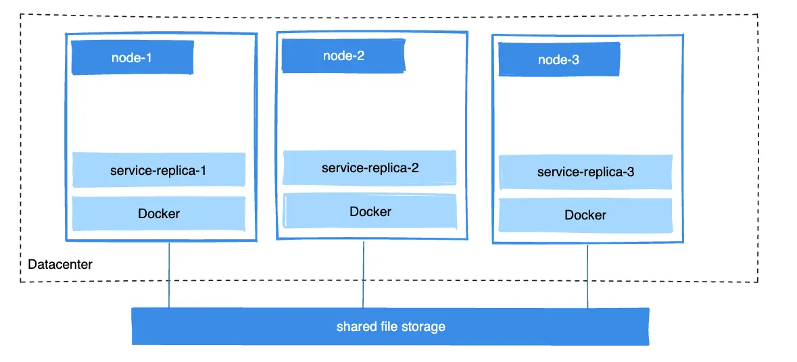

卷（Volumes）是由 Docker 创建并管理的持久化数据存储机制，用于为容器提供数据持久化能力。你可以通过 `docker volume create` 命令显式创建卷，也可以在创建容器或服务时由 Docker 自动创建。

卷创建后会存放在 Docker 宿主机上的某个目录中。当你将卷挂载到容器时，本质上是把这个目录挂载到容器内部。这种方式与绑定挂载（bind mount）类似，但卷由 Docker 统一管理，并且与宿主机的核心功能保持相对隔离。

## 何时使用卷

卷是持久化容器数据的首选机制。与依赖宿主机目录结构和操作系统的[绑定挂载](bind-mounts.md)不同，卷由 Docker 全权管理。以下场景更适合使用卷：

- 相比绑定挂载，更易于备份与迁移。
- 可通过 Docker CLI 或 Docker API 进行统一管理。
- 同时支持 Linux 和 Windows 容器。
- 在多个容器之间共享时更加安全。
- 新建的卷可由容器或构建过程预先填充内容。
- 适用于对 I/O 性能有较高要求的场景。

如果你需要从宿主机直接访问文件，则不宜使用卷，因为卷由 Docker 完全管理。在这种情况下，请使用[绑定挂载](bind-mounts.md)，以便容器与宿主机可以访问同一份文件或目录。

相较于直接写入容器的可写层，卷往往是更好的选择：卷不会增加使用它的容器体积，并且读写速度通常也更快。向容器可写层写入数据时，需要由[存储驱动](/manuals/engine/storage/drivers/_index.md)管理文件系统，存储驱动依赖 Linux 内核提供的联合文件系统（union filesystem）。这一层额外的抽象往往比直接写入宿主机文件系统（使用卷的方式）更慢。

如果容器生成的是非持久性状态数据，可以考虑使用 [tmpfs 挂载](tmpfs.md)，这样可以避免数据被永久存储，并通过不写入容器可写层来提升性能。

卷使用 `rprivate`（递归私有）的绑定传播（bind propagation）模式，并且不支持自定义传播模式。

## 卷的生命周期

卷的内容独立于任何单个容器的生命周期。当容器被销毁时，其可写层会被删除；而使用卷可以确保即便容器被移除，数据仍然会保留。

同一个卷可以同时挂载到多个容器。即使没有运行中的容器正在使用某个卷，该卷依然对 Docker 可见，不会被自动删除。你可以使用 `docker volume prune` 命令删除未使用的卷。

## 在已有数据之上挂载卷

如果把一个“非空卷”挂载到容器内某个已存在文件或目录的路径上，该路径下的原有文件会被挂载点遮蔽（shadowed）。这类似于在 Linux 宿主机上向 `/mnt` 目录保存文件后，再把 U 盘挂载到 `/mnt`；在卸载 U 盘之前，`/mnt` 下看到的是 U 盘的内容，而非原有文件。

在容器中，你无法像在宿主机那样直接“卸载挂载”以重新显示被遮蔽的文件。最稳妥的方式是重新创建一个不包含该挂载的容器。

如果把一个“空卷”挂载到容器内某个已存在文件或目录的路径上，Docker 默认会将该路径下的文件或目录复制到卷中。同样，如果你在启动容器时指定了一个尚不存在的卷，Docker 会为你创建一个空卷。这是为其他容器预先填充数据的好方法。

如果你不希望 Docker 将容器中已有的文件复制到空卷中，可以使用 `volume-nocopy` 选项，具体请参见 [--mount 的可选项](#options-for---mount)。

## 命名卷与匿名卷

卷可以是命名卷或匿名卷。匿名卷会被分配一个在该 Docker 宿主机上唯一的随机名称。与命名卷一样，匿名卷在使用它的容器被删除后仍会保留，除非在创建容器时使用了 `--rm` 选项，此时与该容器关联的匿名卷会一并被删除。具体请参见[删除匿名卷](#remove-anonymous-volumes)。

如果连续创建多个使用匿名卷的容器，每个容器都会创建自己独立的卷。匿名卷不会被自动复用或在容器之间共享。如果你需要在多个容器之间共享匿名卷，必须通过该卷的随机 ID 进行挂载。

## 语法

使用 `docker run` 挂载卷时，可以使用 `--mount` 或 `--volume` 参数。

```console
$ docker run --mount type=volume,src=<volume-name>,dst=<mount-path>
$ docker run --volume <volume-name>:<mount-path>
```

推荐优先使用 `--mount` 参数。它的语义更加清晰，并且支持所有可用选项。

在以下场景下必须使用 `--mount`：

- 指定[卷驱动选项](#use-a-volume-driver)
- 挂载[卷的子目录](#mount-a-volume-subdirectory)
- 在 Swarm 服务中挂载卷

### --mount 的可选项 {#options-for---mount}

`--mount` 参数由多个键值对组成，以逗号分隔，每一项的格式为 `<key>=<value>`；键值对的顺序不影响使用。

```console
$ docker run --mount type=volume[,src=<volume-name>],dst=<mount-path>[,<key>=<value>...]
```

`--mount type=volume` 的有效选项包括：

| 选项                           | 说明                                                                                                               |
| ------------------------------ | ------------------------------------------------------------------------------------------------------------------ |
| `source`, `src`                | 挂载的来源。对于命名卷，此处为卷名；对于匿名卷，该字段省略。                                                       |
| `destination`, `dst`, `target` | 卷在容器内的挂载路径。                                                                                             |
| `volume-subpath`               | 要挂载到容器内的卷中子目录路径。该子目录必须在卷中预先存在。具体请参见[挂载卷的子目录](#mount-a-volume-subdirectory)。   |
| `readonly`, `ro`               | 指定后将卷[以只读方式挂载](#use-a-read-only-volume)。                                                              |
| `volume-nocopy`                | 指定后，如果卷为空，则不会将容器目标路径下的数据复制到卷中。默认情况下，如果卷为空，会将目标路径的内容复制到卷中。 |
| `volume-opt`                   | 可多次指定，使用键值对形式传入驱动选项的名称与值。                                                                   |

```console {title="Example"}
$ docker run --mount type=volume,src=myvolume,dst=/data,ro,volume-subpath=/foo
```

### --volume 的可选项

`--volume`（或简写 `-v`）由三个以冒号（`:`）分隔的字段组成，字段顺序固定。

```console
$ docker run -v [<volume-name>:]<mount-path>[:opts]
```

对于命名卷，第一个字段是卷名，且在同一宿主机上唯一；对于匿名卷，第一个字段省略。第二个字段是卷在容器内的挂载路径。

第三个字段可选，为逗号分隔的选项列表。在卷场景下，`--volume` 支持的选项包括：

| 选项             | 说明                                                                                                               |
| ---------------- | ------------------------------------------------------------------------------------------------------------------ |
| `readonly`, `ro` | 指定后将卷[以只读方式挂载](#use-a-read-only-volume)。                                                              |
| `volume-nocopy`  | 指定后，如果卷为空，则不会将容器目标路径下的数据复制到卷中。默认情况下，如果卷为空，会将目标路径的内容复制到卷中。 |

```console {title="Example"}
$ docker run -v myvolume:/data:ro
```

## 创建与管理卷

与绑定挂载不同，你可以在不依赖任何容器的情况下创建和管理卷。

创建卷：

```console
$ docker volume create my-vol
```

列出卷：

```console
$ docker volume ls

local               my-vol
```

查看卷详情：

```console
$ docker volume inspect my-vol
[
    {
        "Driver": "local",
        "Labels": {},
        "Mountpoint": "/var/lib/docker/volumes/my-vol/_data",
        "Name": "my-vol",
        "Options": {},
        "Scope": "local"
    }
]
```

删除卷：

```console
$ docker volume rm my-vol
```

## 使用卷启动容器

如果你使用一个尚不存在的卷来启动容器，Docker 会为你自动创建该卷。下面示例将卷 `myvol2` 挂载到容器内的 `/app/` 目录。

以下 `-v` 和 `--mount` 两种写法的效果完全相同。注意，除非先删除 `devtest` 容器和 `myvol2` 卷，否则不要同时运行这两个命令。




```console
$ docker run -d \
  --name devtest \
  --mount source=myvol2,target=/app \
  nginx:latest
```




```console
$ docker run -d \
  --name devtest \
  -v myvol2:/app \
  nginx:latest
```




使用 `docker inspect devtest` 命令验证 Docker 是否已创建并正确挂载该卷。查看输出中的 `Mounts` 区域：

```json
"Mounts": [
    {
        "Type": "volume",
        "Name": "myvol2",
        "Source": "/var/lib/docker/volumes/myvol2/_data",
        "Destination": "/app",
        "Driver": "local",
        "Mode": "",
        "RW": true,
        "Propagation": ""
    }
],
```

这表明挂载类型为卷（volume），来源（Source）与目标路径（Destination）都正确，并且该挂载为读写模式（RW: true）。

停止容器并删除卷。注意，删除卷需要单独执行。

```console
$ docker container stop devtest

$ docker container rm devtest

$ docker volume rm myvol2
```

## 在 Docker Compose 中使用卷

下面示例展示了一个包含卷的单服务 Compose 配置：

```yaml
services:
  frontend:
    image: node:lts
    volumes:
      - myapp:/home/node/app
volumes:
  myapp:
```

首次运行 `docker compose up` 时会创建该卷；之后再次运行时，Docker 会复用同一个卷。

你也可以在 Compose 之外使用 `docker volume create` 命令先创建卷，然后在 `compose.yaml` 中引用它：

```yaml
services:
  frontend:
    image: node:lts
    volumes:
      - myapp:/home/node/app
volumes:
  myapp:
    external: true
```

关于在 Compose 中使用卷的更多详细信息，请参见 Compose 规范中的 [Volumes](/reference/compose-file/volumes.md) 部分。

### 使用卷启动服务

当你为服务定义卷并启动它时，每个服务副本都会使用自己的本地卷。如果使用 `local` 卷驱动，这些容器之间无法共享数据；不过部分卷驱动支持共享存储。

下面示例启动一个包含 4 个副本的 `nginx` 服务，每个副本都使用名为 `myvol2` 的本地卷。

```console
$ docker service create -d \
  --replicas=4 \
  --name devtest-service \
  --mount source=myvol2,target=/app \
  nginx:latest
```

使用 `docker service ps devtest-service` 命令验证服务是否正在运行：

```console
$ docker service ps devtest-service

ID                  NAME                IMAGE               NODE                DESIRED STATE       CURRENT STATE            ERROR               PORTS
4d7oz1j85wwn        devtest-service.1   nginx:latest        moby                Running             Running 14 seconds ago
```

删除服务以停止所有正在运行的任务：

```console
$ docker service rm devtest-service
```

删除服务不会删除该服务创建的任何卷。卷的删除需要单独执行。

### 使用容器为卷预填充内容

如果你启动一个容器并创建了一个新卷，而容器在将要挂载的目录（如 `/app/`）下已有文件或目录，Docker 会将该目录的内容复制到卷中。随后容器会挂载并使用该卷，其他使用该卷的容器也能访问这些预先填充的内容。

下面示例启动一个 `nginx` 容器，并将容器内 `/usr/share/nginx/html` 目录的内容复制到新卷 `nginx-vol` 中。该目录是 Nginx 默认存放 HTML 内容的位置。

`--mount` 与 `-v` 两种写法的效果一致。




```console
$ docker run -d \
  --name=nginxtest \
  --mount source=nginx-vol,destination=/usr/share/nginx/html \
  nginx:latest
```




```console
$ docker run -d \
  --name=nginxtest \
  -v nginx-vol:/usr/share/nginx/html \
  nginx:latest
```




运行任一示例后，使用以下命令清理容器与卷。注意，删除卷需要单独执行。

```console
$ docker container stop nginxtest

$ docker container rm nginxtest

$ docker volume rm nginx-vol
```

## 使用只读卷 {#use-a-read-only-volume}

在某些开发场景中，容器需要写入绑定挂载，以便变更能够回传到宿主机；而在另一些场景中，容器只需读取数据。多个容器可以同时挂载同一个卷；你可以在不同容器中分别将同一卷以“读写”或“只读”的方式挂载。

下面示例在前面基础上进行改造：在挂载选项中添加 `ro`（多个选项用逗号分隔），将该目录以只读卷方式挂载。

`--mount` 与 `-v` 的效果相同。




```console
$ docker run -d \
  --name=nginxtest \
  --mount source=nginx-vol,destination=/usr/share/nginx/html,readonly \
  nginx:latest
```




```console
$ docker run -d \
  --name=nginxtest \
  -v nginx-vol:/usr/share/nginx/html:ro \
  nginx:latest
```




使用 `docker inspect nginxtest` 命令验证只读挂载是否创建成功。查看输出中的 `Mounts` 区域：

```json
"Mounts": [
    {
        "Type": "volume",
        "Name": "nginx-vol",
        "Source": "/var/lib/docker/volumes/nginx-vol/_data",
        "Destination": "/usr/share/nginx/html",
        "Driver": "local",
        "Mode": "",
        "RW": false,
        "Propagation": ""
    }
],
```

停止并移除容器，然后删除卷。卷的删除需要单独执行。

```console
$ docker container stop nginxtest

$ docker container rm nginxtest

$ docker volume rm nginx-vol
```

## 挂载卷的子目录 {#mount-a-volume-subdirectory}

将卷挂载到容器时，你可以通过 `--mount` 的 `volume-subpath` 参数指定仅使用卷中的某个子目录。该子目录需要在挂载前已存在于卷中，否则挂载会失败。

当你只需共享卷中的一部分数据时，这个功能非常有用。比如你有多个容器在运行，并希望将它们的日志存放在同一个共享卷中。你可以在卷里为每个容器创建一个子目录，然后将对应的子目录分别挂载给各个容器。

下面示例创建 `logs` 卷，并在卷中初始化 `app1` 与 `app2` 两个子目录。随后启动两个容器，将 `logs` 卷的不同子目录分别挂载给它们。示例假设容器内的进程分别将日志写入 `/var/log/app1` 和 `/var/log/app2`。

```console
$ docker volume create logs
$ docker run --rm \
  --mount src=logs,dst=/logs \
  alpine mkdir -p /logs/app1 /logs/app2
$ docker run -d \
  --name=app1 \
  --mount src=logs,dst=/var/log/app1,volume-subpath=app1 \
  app1:latest
$ docker run -d \
  --name=app2 \
  --mount src=logs,dst=/var/log/app2,volume-subpath=app2 \
  app2:latest
```

这样，两个容器会将日志写入 `logs` 卷下各自的子目录，彼此无法访问对方的日志。

## 在多台机器间共享数据

为了构建高可用或容错的应用，你可能需要让同一服务的多个副本访问同一份文件。



常见的做法包括：在应用中加入逻辑，将文件存储到云对象存储（如 Amazon S3）；或者使用支持将数据写入外部存储系统（如 NFS 或 Amazon S3）的卷驱动来创建卷。

卷驱动可以将底层存储系统与应用逻辑解耦。例如，当服务使用带 NFS 驱动的卷时，你可以将服务切换到另一个驱动（如云端存储驱动），而无需修改应用逻辑。

## 使用卷驱动 {#use-a-volume-driver}

无论是通过 `docker volume create` 创建卷，还是在启动容器时使用尚不存在的卷，都可以指定卷驱动。下面示例使用 `rclone/docker-volume-rclone` 卷驱动：先演示创建独立卷的方式，再演示启动容器并创建新卷的方式。

> [!NOTE]
>
> 如果你的卷驱动的某个选项值本身就是逗号分隔的列表，那么必须处理外层 CSV 解析时的转义问题。对 `volume-opt` 的值使用双引号（`"`）包裹，并用单引号（`'`）包裹整个 `--mount` 参数。
>
> 例如，`local` 驱动通过 `o` 参数接收以逗号分隔的挂载选项。下面演示了正确的转义方式：
>
> ```console
> $ docker service create \
>  --mount 'type=volume,src=<VOLUME-NAME>,dst=<CONTAINER-PATH>,volume-driver=local,volume-opt=type=nfs,volume-opt=device=<nfs-server>:<nfs-path>,"volume-opt=o=addr=<nfs-address>,vers=4,soft,timeo=180,bg,tcp,rw"' \
>  --name myservice \
>  <IMAGE>
> ```

### 初始准备

假设你有两个节点：第一个是 Docker 宿主机，并可以通过 SSH 连接到第二个节点。

在 Docker 宿主机上安装 `rclone/docker-volume-rclone` 插件：

```console
$ docker plugin install --grant-all-permissions rclone/docker-volume-rclone --aliases rclone
```

### 使用卷驱动创建卷

该示例将宿主机 `1.2.3.4` 上的 `/remote` 目录通过卷驱动挂载为名为 `rclonevolume` 的卷。不同的卷驱动可能有各自可配置的选项，通过多次使用 `-o` 参数指定。

```console
$ docker volume create \
  -d rclone \
  --name rclonevolume \
  -o type=sftp \
  -o path=remote \
  -o sftp-host=1.2.3.4 \
  -o sftp-user=user \
  -o "sftp-password=$(cat file_containing_password_for_remote_host)"
```

该卷随后即可挂载到容器中使用。

### 启动容器并使用卷驱动创建卷

> [!NOTE]
>
> 如果卷驱动需要传递任何选项，你必须使用 `--mount` 挂载卷，而不能使用 `-v`。

```console
$ docker run -d \
  --name rclone-container \
  --mount type=volume,volume-driver=rclone,src=rclonevolume,target=/app,volume-opt=type=sftp,volume-opt=path=remote, volume-opt=sftp-host=1.2.3.4,volume-opt=sftp-user=user,volume-opt=-o "sftp-password=$(cat file_containing_password_for_remote_host)" \
  nginx:latest
```

### 创建 NFS 卷的服务示例

以下示例展示在创建服务时如何创建 NFS 卷。这里使用 `10.0.0.10` 作为 NFS 服务器，并使用其导出的目录 `/var/docker-nfs`。注意，这里使用的卷驱动是 `local`。

#### NFSv3

```console
$ docker service create -d \
  --name nfs-service \
  --mount 'type=volume,source=nfsvolume,target=/app,volume-driver=local,volume-opt=type=nfs,volume-opt=device=:/var/docker-nfs,volume-opt=o=addr=10.0.0.10' \
  nginx:latest
```

#### NFSv4

```console
$ docker service create -d \
    --name nfs-service \
    --mount 'type=volume,source=nfsvolume,target=/app,volume-driver=local,volume-opt=type=nfs,volume-opt=device=:/var/docker-nfs,"volume-opt=o=addr=10.0.0.10,rw,nfsvers=4,async"' \
    nginx:latest
```

### 创建 CIFS/Samba 卷

无需在宿主机上预先配置挂载点，你可以直接在 Docker 中挂载 Samba 共享：

```console
$ docker volume create \
	--driver local \
	--opt type=cifs \
	--opt device=//uxxxxx.your-server.de/backup \
	--opt o=addr=uxxxxx.your-server.de,username=uxxxxxxx,password=*****,file_mode=0777,dir_mode=0777 \
	--name cifs-volume
```

当使用主机名而非 IP 地址时，必须指定 `addr` 选项，以便 Docker 能够进行主机名解析。

### 块设备

你可以将块存储设备（例如外接磁盘或磁盘分区）挂载到容器。下面的例子演示如何使用一个文件来模拟块设备、构建文件系统，并将其作为容器卷进行挂载。

> [!IMPORTANT]
>
> 下面的流程仅用于演示目的；不建议作为通用实践。
> 如非必要且对相关原理没有足够把握，请勿尝试。

#### 挂载块设备的原理

在使用 `local` 存储驱动时，`--mount` 实际上调用的是 Linux 的 `mount` 系统调用，并原样转发你传入的选项。Docker 并未在 Linux 内核原生挂载功能之上增加额外的能力。

如果你熟悉 [Linux `mount` 命令](https://man7.org/linux/man-pages/man8/mount.8.html)，可以将 `--mount` 的选项理解为被转化成如下命令行：

```console
$ mount -t <mount.volume-opt.type> <mount.volume-opt.device> <mount.dst> -o <mount.volume-opts.o>
```

例如，下述命令将设备 `/dev/loop5` 挂载到系统的 `/external-drive` 目录：

```console
$ mount -t ext4 /dev/loop5 /external-drive
```

从容器的视角来看，下面的 `docker run` 命令可以达到类似的效果。该 `--mount` 会将挂载配置成类似于上面 `mount` 命令的结果：

```console
$ docker run \
  --mount='type=volume,dst=/external-drive,volume-driver=local,volume-opt=device=/dev/loop5,volume-opt=type=ext4'
```

你无法直接在容器内运行 `mount` 命令，因为容器无法访问宿主机的 `/dev/loop5` 设备。这也是为什么需要在 `docker run` 中使用 `--mount` 参数。

#### 示例：在容器中挂载块设备

下面的步骤演示如何在一个文件上创建 `ext4` 文件系统，并将其挂载到容器中。系统支持的文件系统类型取决于所用的 Linux 内核版本。

1. 创建一个文件并分配空间：

   ```console
   $ fallocate -l 1G disk.raw
   ```

2. 在 `disk.raw` 文件上构建文件系统：

   ```console
   $ mkfs.ext4 disk.raw
   ```

3. 创建一个 loop 设备：

   ```console
   $ losetup -f --show disk.raw
   /dev/loop5
   ```

   > [!NOTE]
   >
   > `losetup` 创建的是临时 loop 设备，系统重启后会消失，或者你也可以通过 `losetup -d` 手动移除。

4. 启动容器并将该 loop 设备作为卷挂载：

   ```console
   $ docker run -it --rm \
     --mount='type=volume,dst=/external-drive,volume-driver=local,volume-opt=device=/dev/loop5,volume-opt=type=ext4' \
     ubuntu bash
   ```

当容器启动后，`/external-drive` 将以块设备的方式挂载宿主机文件系统中的 `disk.raw` 文件。

5. 完成后（并在容器中卸载了该设备之后），从宿主机移除 loop 设备：

   ```console
   $ losetup -d /dev/loop5
   ```

## 备份、还原或迁移数据卷

卷非常适合用于备份、还原与迁移。你可以使用 `--volumes-from` 参数启动新容器，并挂载另一个容器的卷。

### 备份卷

例如，先创建一个名为 `dbstore` 的容器：

```console
$ docker run -v /dbdata --name dbstore ubuntu /bin/bash
```

接下来：

- 启动一个新容器，并从 `dbstore` 容器挂载卷
- 将当前宿主机目录挂载为容器内的 `/backup`
- 执行命令：将 `dbdata` 卷的内容打包为 `backup.tar`，并存放到 `/backup` 目录

```console
$ docker run --rm --volumes-from dbstore -v $(pwd):/backup ubuntu tar cvf /backup/backup.tar /dbdata
```

当命令完成并且容器退出后，`dbdata` 卷的备份文件即已创建完成。

### 从备份还原卷

使用刚刚创建的备份，你可以将其还原到同一个容器，或还原到在别处创建的其他容器。

例如，创建一个名为 `dbstore2` 的新容器：

```console
$ docker run -v /dbdata --name dbstore2 ubuntu /bin/bash
```

然后，将备份文件解包到新容器的数据卷：

```console
$ docker run --rm --volumes-from dbstore2 -v $(pwd):/backup ubuntu bash -c "cd /dbdata && tar xvf /backup/backup.tar --strip 1"
```

你可以将这些技巧与你常用的工具配合使用，自动化执行备份、迁移与还原测试。

## 删除卷

Docker 数据卷在删除容器后仍会保留。有两种类型的卷需要考虑：

- 命名卷有明确的外部来源，例如 `awesome:/bar`。
- 匿名卷没有明确的外部来源。因此，当容器被删除时，可以指示 Docker Engine 守护进程一并删除它们。

### 删除匿名卷 {#remove-anonymous-volumes}

要自动删除匿名卷，请使用 `--rm` 选项。例如，下面的命令会创建一个匿名的 `/foo` 卷。当删除容器时，Docker Engine 会删除 `/foo` 卷，但不会删除 `awesome` 卷。

```console
$ docker run --rm -v /foo -v awesome:/bar busybox top
```

> [!NOTE]
>
> 如果另一个容器通过 `--volumes-from` 绑定了这些卷，那么卷的定义会被“复制”。在第一个容器被删除后，该匿名卷仍会保留。

### 删除所有未使用的卷

删除所有未使用的卷以释放空间：

```console
$ docker volume prune
```

## 进一步阅读

- 了解[绑定挂载](bind-mounts.md)。
- 了解[tmpfs 挂载](tmpfs.md)。
- 了解[存储驱动](/engine/storage/drivers/)。
- 了解[第三方卷驱动插件](/engine/extend/legacy_plugins/)。
