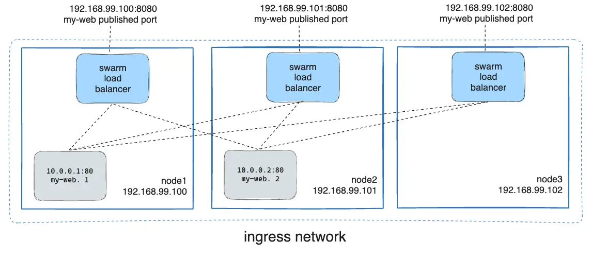

Docker Engine 的 Swarm 模式可轻松为服务发布端口，使其对 swarm 之外的资源可访问。所有节点都会参与到入口（ingress）路由网格中。借助路由网格，swarm 中的每个节点都可以在已发布端口上为任意服务接受连接，即便该节点上并未运行该服务的任务。路由网格会将所有到达可用节点上已发布端口的请求，转发到一个处于活动状态的容器。

要在 swarm 中使用 ingress 网络，需要在启用 Swarm 模式之前，确保在各个 swarm 节点之间打开以下端口：

* 端口 `7946`（TCP/UDP）：用于容器网络发现。
* 端口 `4789`（UDP，可配置）：用于容器 ingress 网络。

在为 Swarm 设置网络时需要格外注意。可参考[教程](swarm-tutorial/_index.md#open-protocols-and-ports-between-the-hosts)获取概览。

还需要在 swarm 节点与需要访问该端口的外部资源之间（例如外部负载均衡器）打开已发布的端口。

你也可以为某个服务[绕过路由网格](#bypass-the-routing-mesh)。

## 为服务发布端口

创建服务时使用 `--publish` 标志发布端口。`target` 用于指定容器内部监听的端口，`published` 用于指定在路由网格上绑定的端口。如果省略 `published` 端口，则每个服务任务都会分配一个随机的高位端口。此时需要通过检查任务来确定端口号。

```console
$ docker service create \
  --name <SERVICE-NAME> \
  --publish published=<PUBLISHED-PORT>,target=<CONTAINER-PORT> \
  <IMAGE>
```

> [!NOTE]
>
> 早期的语法是以冒号分隔的字符串，已发布端口在前，目标端口在后，例如 `-p 8080:80`。推荐使用新的长语法，因为其更易读，也更灵活。

`<PUBLISHED-PORT>` 是 swarm 对外提供服务的端口；若省略，将绑定一个随机高位端口。`<CONTAINER-PORT>` 是容器监听的端口，该参数必填。

例如，以下命令将 Nginx 容器的 80 端口发布为 swarm 中任意节点上的 8080 端口：

```console
$ docker service create \
  --name my-web \
  --publish published=8080,target=80 \
  --replicas 2 \
  nginx
```

当你访问任意节点的 8080 端口时，Docker 会把请求路由到一个活动容器。在 swarm 节点本身上，8080 端口可能并未真正绑定，但路由网格知道如何转发流量，并避免端口冲突。

路由网格会在节点上分配的任意 IP 地址上监听已发布端口。对于可对外路由的 IP，端口可在宿主之外访问；对于其他 IP，端口仅能在宿主内部访问。



你也可以为一个已存在的服务发布端口：

```console
$ docker service update \
  --publish-add published=<PUBLISHED-PORT>,target=<CONTAINER-PORT> \
  <SERVICE>
```

可使用 `docker service inspect` 查看服务的已发布端口。例如：

```console
$ docker service inspect --format="{{json .Endpoint.Spec.Ports}}" my-web

[{"Protocol":"tcp","TargetPort":80,"PublishedPort":8080}]
```

输出中展示了容器的 `<CONTAINER-PORT>`（字段名 `TargetPort`）与各节点监听请求的 `<PUBLISHED-PORT>`（字段名 `PublishedPort`）。

### 仅发布 TCP 或仅发布 UDP 端口

默认情况下，发布的是 TCP 端口。你也可以仅发布 UDP 端口，或者同时发布 TCP 与 UDP 端口。当同时发布 TCP 与 UDP 时，如果省略协议，端口将按 TCP 发布。使用推荐的长语法时，可通过 `protocol` 指定为 `tcp` 或 `udp`。

#### 仅 TCP

长语法：

```console
$ docker service create --name dns-cache \
  --publish published=53,target=53 \
  dns-cache
```

短语法：

```console
$ docker service create --name dns-cache \
  -p 53:53 \
  dns-cache
```

#### 同时 TCP 与 UDP

长语法：

```console
$ docker service create --name dns-cache \
  --publish published=53,target=53 \
  --publish published=53,target=53,protocol=udp \
  dns-cache
```

短语法：

```console
$ docker service create --name dns-cache \
  -p 53:53 \
  -p 53:53/udp \
  dns-cache
```

#### 仅 UDP

长语法：

```console
$ docker service create --name dns-cache \
  --publish published=53,target=53,protocol=udp \
  dns-cache
```

短语法：

```console
$ docker service create --name dns-cache \
  -p 53:53/udp \
  dns-cache
```

## 绕过路由网格 {#bypass-the-routing-mesh}

默认情况下，发布端口的 swarm 服务会使用路由网格。当你连接到任意 swarm 节点上的已发布端口（无论该节点是否运行该服务），都会被透明地转发到运行该服务的工作节点。实际上，Docker 充当了 swarm 服务的负载均衡器。

你可以绕过路由网格，使你访问某个节点上绑定的端口时，总是连接到该节点上运行的该服务实例。这种模式称为 `host` 模式。需注意：

- 若你访问的节点未运行该服务任务，则该端口上不会有服务在监听。可能是没有任何进程监听，或是完全不同的应用在监听。
- 如果你预期每个节点上会运行多个服务任务（例如 5 个节点运行 10 个副本），则不能指定静态的目标端口。要么让 Docker 分配随机高位端口（省略 `published`），要么确保每个节点仅运行一个实例（例如使用全局服务而非副本服务，或使用放置约束）。

要绕过路由网格，必须使用长 `--publish` 语法，并将 `mode` 设为 `host`。如果省略 `mode` 或将其设为 `ingress`，则会使用路由网格。下面的命令创建了一个使用 `host` 模式的全局服务，从而绕过路由网格：

```console
$ docker service create --name dns-cache \
  --publish published=53,target=53,protocol=udp,mode=host \
  --mode global \
  dns-cache
```

## 配置外部负载均衡器

可以为 swarm 服务配置外部负载均衡器，既可以与路由网格配合使用，也可以完全不使用路由网格。

### 搭配路由网格

你可以将外部负载均衡器配置为把请求路由到某个 swarm 服务。例如，可以配置 [HAProxy](https://www.haproxy.org) 将请求均衡到发布在 8080 端口的 Nginx 服务。


此时，需要在负载均衡器与 swarm 节点之间开放 8080 端口。swarm 节点可以位于仅对代理服务器可达的私有网络中，而无需公网可达。

你可以将负载均衡器配置为在 swarm 的每个节点之间分发请求，即便某些节点上并未调度该服务的任务。例如，可以在 `/etc/haproxy/haproxy.cfg` 中使用如下 HAProxy 配置：

```bash
global
        log /dev/log    local0
        log /dev/log    local1 notice
...snip...

# Configure HAProxy to listen on port 80
frontend http_front
   bind *:80
   stats uri /haproxy?stats
   default_backend http_back

# Configure HAProxy to route requests to swarm nodes on port 8080
backend http_back
   balance roundrobin
   server node1 192.168.99.100:8080 check
   server node2 192.168.99.101:8080 check
   server node3 192.168.99.102:8080 check
```

当你访问负载均衡器的 80 端口时，它会把请求转发到 swarm 中的节点；而 swarm 的路由网格会将请求再路由到一个活动任务。如果由于某种原因，swarm 调度器将任务迁移到了不同的节点，你无需重新配置负载均衡器。

你可以选择任意类型的负载均衡器将请求路由到 swarm 节点。更多关于 HAProxy 的信息，请参阅[HAProxy 文档](https://cbonte.github.io/haproxy-dconv/)。

### 不使用路由网格

若要在不使用路由网格的情况下使用外部负载均衡器，可将 `--endpoint-mode` 设为 `dnsrr`，替代默认的 `vip`。此模式下不会存在单个虚拟 IP；Docker 会为该服务设置 DNS 记录，使针对服务名的 DNS 查询返回一个 IP 列表，客户端可直接连接其中任意一个。

`--endpoint-mode dnsrr` 不能与 `--publish mode=ingress` 一起使用。你必须在服务前放置自有的负载均衡器。在 Docker 宿主上对服务名进行 DNS 查询时，会返回运行该服务的各节点 IP 列表。将你的负载均衡器配置为消费该列表，并在各节点之间分发流量。参见[配置服务发现](networking.md#configure-service-discovery)。

## 了解更多

* [将服务部署到 swarm](services.md)
