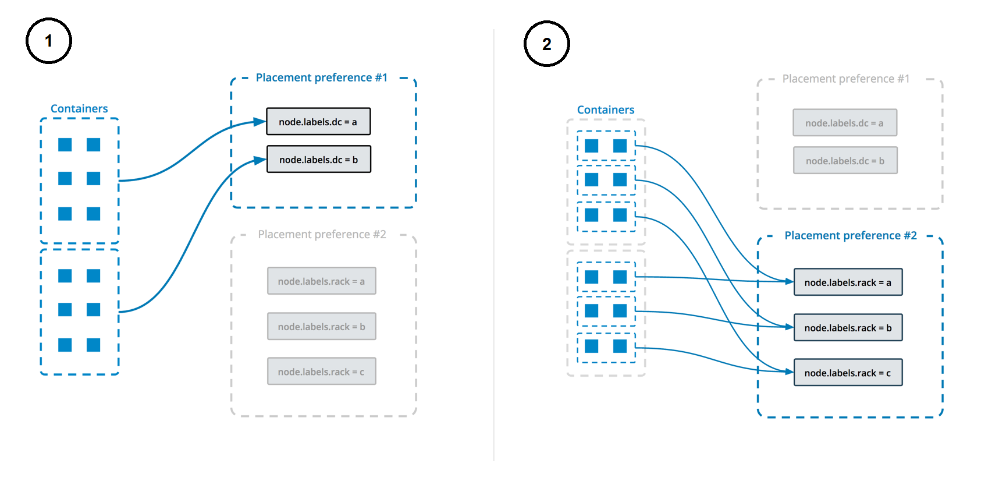

Swarm 服务采用“声明式”模型：你定义服务的期望状态，并由 Docker 负责维持这一状态。期望状态包括（但不限于）：

- 服务容器应运行的镜像名称与标签
- 参与该服务的容器数量
- 是否向 Swarm 外部客户端暴露端口
- Docker 启动时该服务是否应自动启动
- 服务重启时的具体行为（例如是否采用滚动重启）
- 服务可运行节点的特征（如资源约束与放置偏好）

想要了解 Swarm 模式的整体概念，请参阅《[Swarm 模式关键概念](key-concepts.md)》。
了解服务工作方式，请参阅《[服务的工作原理](how-swarm-mode-works/services.md)》。

## 创建服务

如果只需一个副本且无需额外配置，只需提供镜像名称即可。下面的命令会启动一个未发布端口、随机命名的 Nginx 服务。该示例较为简单，因为无法直接与该服务交互。

```console
$ docker service create nginx
```

服务会调度到某个可用节点上。使用 `docker service ls` 可确认服务是否创建并成功启动：

```console
$ docker service ls

ID                  NAME                MODE                REPLICAS            IMAGE                                                                                             PORTS
a3iixnklxuem        quizzical_lamarr    replicated          1/1                 docker.io/library/nginx@sha256:41ad9967ea448d7c2b203c699b429abe1ed5af331cd92533900c6d77490e0268
```

新建的服务并不总是立即运行。如果镜像不可用、或没有节点满足服务的配置要求（等多种原因），服务可能会处于 pending 状态。参见《[挂起中的服务](how-swarm-mode-works/services.md#pending-services)》。

使用 `--name` 为服务指定名称：

```console
$ docker service create --name my_web nginx
```

与独立容器类似，你可以在镜像名之后追加要运行的命令。以下示例创建名为 `helloworld` 的服务，使用 `alpine` 镜像并运行 `ping docker.com`：

```console
$ docker service create --name helloworld alpine ping docker.com
```

你也可以指定镜像标签。如下对上例进行修改，使用 `alpine:3.6`：

```console
$ docker service create --name helloworld alpine:3.6 ping docker.com
```

关于镜像标签解析的更多细节，参见「[指定服务应使用的镜像版本](#specify-the-image-version-a-service-should-use)」。

### 在 Swarm 中使用 gMSA

> [!NOTE]
>
> 下述示例仅适用于 Windows 容器。

Swarm 现已支持将 Docker config 用作 gMSA 的凭据规范（credential spec），以满足使用 Active Directory 进行身份验证的应用需求。这减少了在各节点分发凭据规范文件的负担。

以下示例假设 gMSA 及其凭据规范文件（credspec.json）已存在，且待部署的节点已正确配置好 gMSA 环境。

要将 config 用作凭据规范，先创建一个包含该规范内容的 Docker config：

```console
$ docker config create credspec credspec.json
```

现在你已有名为 credspec 的 Docker config，可以据此创建服务。通过 `--credential-spec` 指定该 config 名称，例如：

```console
$ docker service create --credential-spec="config://credspec" <your image>
```

服务启动时会使用 gMSA 凭据规范。不同于常规的 Docker config（通过 `--config` 挂载到容器内），凭据规范不会被挂载进容器。

### 使用私有仓库镜像创建服务

如果镜像存放在需要登录的私有仓库，请先登录，并在 `docker service create` 时使用 `--with-registry-auth`。假设镜像位于私有仓库 `registry.example.com`，可执行：

```console
$ docker login registry.example.com

$ docker service  create \
  --with-registry-auth \
  --name my_service \
  registry.example.com/acme/my_image:latest
```

该操作会将本地客户端的登录令牌通过加密的 WAL 日志传递给部署服务的 Swarm 节点，使这些节点能够登录仓库并拉取镜像。

### 为托管服务账户提供凭据规范

 在 Enterprise Edition 3.0 中，可通过 Docker config 实现 gMSA 凭据的集中分发与管理，从而提升安全性。Swarm 支持使用 Docker config 作为 gMSA 凭据规范，减少在各节点分发凭据规范的负担。

> [!NOTE]
>
> 此选项仅适用于使用 Windows 容器的服务。

 运行时会应用凭据规范文件，无需在宿主机上保存规范文件或注册表项——工作节点的磁盘不会写入 gMSA 凭据。你可以在容器启动前，将凭据规范提供给运行在工作节点的 Docker Engine；部署使用 gMSA 配置的服务时，凭据规范会直接传递给容器运行时。

 `--credential-spec` 的取值必须符合以下格式之一：

- `file://<filename>`：引用的文件必须位于 Docker 数据目录下的 `CredentialSpecs` 子目录中，Windows 默认路径为 `C:\ProgramData\Docker\`。例如，指定 `file://spec.json` 将加载 `C:\ProgramData\Docker\CredentialSpecs\spec.json`。
- `registry://<value-name>`：从守护进程所在主机的 Windows 注册表读取凭据规范。
- `config://<config-name>`：CLI 会自动将 config 名转换为其 ID，并使用该 `config` 中包含的凭据规范。

 下面是一个从 Active Directory（AD）中获取 gMSA 名称与 JSON 内容的简单示例：

 ```console
$ name="mygmsa"
$ contents="{...}"
$ echo $contents > contents.json
```

 请确保目标节点已正确配置 gMSA。

 若要使用 config 作为凭据规范，请将凭据规范内容保存到 `credpspec.json` 并创建 Docker config。`config` 的名称可自行指定。

```console
$ docker config create --label com.docker.gmsa.name=mygmsa credspec credspec.json
```

随后即可使用该凭据规范创建服务。通过 `--credential-spec` 指定该 config 名称：

```console
$ docker service create --credential-spec="config://credspec" <your image>
```

 服务启动时会使用 gMSA 凭据规范，但不同于使用 `--config` 的常规 Docker config，凭据规范不会挂载到容器内。

## 更新服务

使用 `docker service update` 可以修改现有服务的大多数配置。更新时，Docker 会停止其容器并以新配置重启。

对于 Nginx 这类 Web 服务，通常需要对外发布 80 端口。你可以在创建服务时通过 `-p` 或 `--publish` 指定；更新已有服务时使用 `--publish-add`，若要移除已发布端口则使用 `--publish-rm`。

假设上一节创建的 `my_web` 服务仍存在，可用以下命令为其发布 80 端口：

```console
$ docker service update --publish-add 80 my_web
```

使用 `docker service ls` 验证是否生效：

```console
$ docker service ls

ID                  NAME                MODE                REPLICAS            IMAGE                                                                                             PORTS
4nhxl7oxw5vz        my_web              replicated          1/1                 docker.io/library/nginx@sha256:41ad9967ea448d7c2b203c699b429abe1ed5af331cd92533900c6d77490e0268   *:0->80/tcp
```

关于端口发布的工作原理，参见「[发布端口](#publish-ports)」。

你可以更新服务的大多数细节，包括其运行的镜像名称与标签。详见「[在创建后更新服务镜像](#update-a-services-image-after-creation)」。

## 删除服务

要删除服务，使用 `docker service remove`。可以通过服务 ID 或名称删除（可在 `docker service ls` 的输出中查到）。例如：

```console
$ docker service remove my_web
```

## 服务配置详解

以下章节详细介绍服务配置。本文不可能覆盖所有标志或场景；通常，凡是在创建服务时可设置的配置，都可以通过类似方式在事后更新。

可参考命令行文档：
[`docker service create`](/reference/cli/docker/service/create.md) 与
[`docker service update`](/reference/cli/docker/service/update.md)，或直接使用 `--help` 查看帮助。

### 配置运行时环境

你可以为容器的运行时环境配置以下选项：

* 通过 `--env` 设置环境变量
* 通过 `--workdir` 设置容器内工作目录
* 通过 `--user` 设置用户名或 UID

下面的示例将容器环境变量 `$MYVAR` 设为 `myvalue`，工作目录为 `/tmp/`，并以 `my_user` 用户运行：

```console
$ docker service create --name helloworld \
  --env MYVAR=myvalue \
  --workdir /tmp \
  --user my_user \
  alpine ping docker.com
```

### 更新现有服务的启动命令

可通过 `--args` 更新现有服务的启动命令。以下示例将名为 `helloworld` 的服务改为运行 `ping docker.com`：

```console
$ docker service update --args "ping docker.com" helloworld
```

### 指定服务应使用的镜像版本

如果创建服务时未指定镜像版本，默认使用带 `latest` 标签的版本。根据需求，你可以用不同方式固定服务使用的镜像版本。

镜像版本可以用多种方式表达：

- 如果指定标签，管理节点（或在启用[内容信任](../security/trust/_index.md)时由 Docker 客户端）会将该标签解析为摘要（digest）。工作节点接收到创建任务请求时仅看到摘要，而非标签。

  ```console
  $ docker service create --name="myservice" ubuntu:16.04
  ```

  一些标签代表明确的发行版本，如 `ubuntu:16.04`，通常会解析为稳定的摘要。建议尽量使用此类标签。

  另一些标签如 `latest` 或 `nightly` 可能频繁变化，具体取决于镜像作者的更新频率。为避免不同副本使用不同版本，不建议用此类频繁变动的标签运行服务。

- 如果完全不指定版本，按约定会解析为 `latest` 的摘要；工作节点据此拉取镜像用于创建任务。

  因此，下面两条命令等价：

  ```console
  $ docker service create --name="myservice" ubuntu

  $ docker service create --name="myservice" ubuntu:latest
  ```

- 如果直接指定摘要，创建任务时将始终使用该确切版本：

  ```console
  $ docker service create \
      --name="myservice" \
      ubuntu:16.04@sha256:35bc48a1ca97c3971611dc4662d08d131869daa692acb281c7e9e052924e38b1
  ```

创建服务时，镜像标签会被解析为当时对应的具体摘要；除非你显式更新服务，否则工作节点会一直使用该摘要。这一点对 `latest` 等经常变化的标签尤为重要，确保任务使用一致的镜像版本。

> [!NOTE]
>
> If [content trust](../security/trust/_index.md) is
> enabled, the client actually resolves the image's tag to a digest before
> contacting the swarm manager, to verify that the image is signed.
> Thus, if you use content trust, the swarm manager receives the request
> pre-resolved. In this case, if the client cannot resolve the image to a
> digest, the request fails.

如果管理节点无法将标签解析为摘要，则由各个工作节点自行解析，可能导致不同节点使用不同的镜像版本。出现这种情况时会记录类似如下的警告：

```text
unable to pin image <IMAGE-NAME> to digest: <REASON>
```

要查看镜像当前摘要，可执行 `docker inspect <IMAGE>:<TAG>` 并查找 `RepoDigests` 字段。以下为撰写本文时 `ubuntu:latest` 的示例输出（已截断）：

```console
$ docker inspect ubuntu:latest
```

```json
"RepoDigests": [
    "ubuntu@sha256:35bc48a1ca97c3971611dc4662d08d131869daa692acb281c7e9e052924e38b1"
],
```

创建服务后，除非显式使用 `docker service update --image`，否则服务镜像不会自动更新。其他更新操作（如扩缩容、增删网络/卷、重命名服务等）不会影响镜像版本。

### 创建后更新服务镜像

每个标签对应一个摘要，类似 Git 的哈希。有些标签（如 `latest`）会频繁更新，指向新的摘要；另一些（如 `ubuntu:16.04`）代表发布版本，通常不会频繁变更。服务创建后会固定使用当时的摘要，直到你用 `service update --image` 更新为止。

运行 `service update --image` 时，管理节点会查询 Docker Hub 或私有仓库获取该标签当前指向的摘要，并更新服务任务使用该摘要。

> [!NOTE]
>
> 若启用[内容信任](../security/trust/_index.md)，由 Docker 客户端解析镜像，管理节点接收的是镜像与摘要，而非标签。

Usually, the manager can resolve the tag to a new digest and the service
updates, redeploying each task to use the new image. If the manager can't
resolve the tag or some other problem occurs, the next two sections outline what
to expect.

#### 当管理节点可解析该标签时

如果管理节点可将镜像标签解析为摘要，它会指示工作节点重新部署任务并使用该摘要对应的镜像。

– 若工作节点本地已缓存该摘要的镜像，直接使用。

– 否则尝试从 Docker Hub 或私有仓库拉取；

  – 拉取成功则用新镜像部署任务；

  – 拉取失败则该节点上的部署失败，Docker 会重试，可能调度到其他节点。

#### 当管理节点无法解析该标签时

若管理节点无法将镜像解析为摘要，并非无计可施：

– 管理节点会指示工作节点使用该标签重新部署任务；

– 若工作节点本地缓存了与该标签匹配的镜像，则直接使用；

– 若未缓存，则尝试从 Docker Hub 或私有仓库拉取该标签的镜像；

  – 拉取成功则使用该镜像；

  – 拉取失败则任务部署失败，管理节点会再次尝试部署，可能调度到其他节点。

### 发布端口

创建 Swarm 服务时，你可以通过两种方式将其端口发布到集群外部：

- [依赖路由网格](#publish-a-services-ports-using-the-routing-mesh)：发布后，目标端口会在每个节点上可达，无论该节点是否运行有该服务任务。实现简单，适用于多数场景。

- [直接在运行任务的节点上发布端口](#publish-a-services-ports-directly-on-the-swarm-node)：绕过路由网格，提供最大灵活性（可自建路由框架）。但你需要自行跟踪任务运行位置、请求路由与节点间负载均衡。

下文将分别介绍两种方式的细节与适用场景。

#### 使用路由网格发布端口

要将服务端口对外发布，使用 `--publish <PUBLISHED-PORT>:<SERVICE-PORT>`。发布后，任意节点上的该端口都可访问；路由网格会将外部连接路由到某个任务。外部客户端无需了解任务的内部 IP 或端口。更多网络细节见《[管理 Swarm 服务网络](networking.md)》。

##### 示例：在 10 节点集群上运行 3 个副本的 Nginx 服务

假设你有一个由 10 个节点组成的 Swarm，并部署一个包含 3 个任务的 Nginx 服务：

```console
$ docker service create --name my_web \
                        --replicas 3 \
                        --publish published=8080,target=80 \
                        nginx
```

这 3 个任务会运行在最多 3 台节点上。你无需关心任务具体在哪些节点；访问任意节点的 8080 端口都会路由到其中一个 `nginx` 任务。可用 `curl` 进行测试。下面示例假设 `localhost` 即其中一个 Swarm 节点；若不是，请替换为对应的 IP 或可解析的主机名。

The HTML output is truncated:

```console
$ curl localhost:8080

<!DOCTYPE html>
<html>
<head>
<title>Welcome to nginx!</title>
...truncated...
</html>
```

后续的连接可能路由到同一节点，也可能是不同节点。

#### 直接在 Swarm 节点上发布端口

如果你需要基于应用状态做路由决策，或需要完全控制请求到任务的路由过程，则不适合使用路由网格。此时可选择在任务所在节点上直接发布端口：在 `--publish` 中使用 `mode=host`。

> [!NOTE]
>
> 使用 `mode=host` 并显式设置 `published=<PORT>` 时，隐含约束是在单个节点上该服务只能运行一个任务。可通过省略 `published` 的端口号来规避，令 Docker 为每个任务分配随机端口。
>
> 另外，如果使用 `mode=host` 且未使用 `--mode=global`，将更难判断哪些节点在运行该服务，以便对其路由请求。

##### 示例：在每个 Swarm 节点上运行一个 `nginx` Web 服务

[nginx](https://hub.docker.com/_/nginx/) 是开源的反向代理、负载均衡、HTTP 缓存与 Web 服务器。若通过路由网格发布 nginx 服务，访问任意节点的 nginx 端口，实际上会看到某个随机节点上的页面。

下面示例将在 Swarm 的每个节点上运行一个 nginx 服务，并在各节点本地暴露端口：

```console
$ docker service create \
  --mode global \
  --publish mode=host,target=80,published=8080 \
  --name=nginx \
  nginx:latest
```

现在可以通过每个节点的 8080 端口访问 nginx。如果向集群添加节点，会在其上自动启动一个 nginx 任务。同时请注意，你不能在任何节点上再启动绑定到 8080 端口的其他服务或容器。

> [!NOTE]
>
> 以上仅为演示示例。为多层应用构建应用层路由框架较为复杂，超出本文范围。

### 将服务连接到 overlay 网络

你可以使用 overlay 网络连接 Swarm 内的一项或多项服务。

首先在管理节点上使用 `docker network create --driver overlay` 创建网络：

```console
$ docker network create --driver overlay my-network
```

在 Swarm 模式下创建 overlay 网络后，所有管理节点都能访问该网络。

创建服务时使用 `--network` 将其连接到该 overlay 网络：

```console
$ docker service create \
  --replicas 3 \
  --network my-network \
  --name my-web \
  nginx
```

Swarm 会将 `my-network` 扩展到运行该服务的每个节点上。

你也可以通过 `--network-add` 将现有服务连接到 overlay 网络：

```console
$ docker service update --network-add my-network my-web
```

要将运行中的服务从网络断开，使用 `--network-rm`：

```console
$ docker service update --network-rm my-network my-web
```

更多关于 overlay 网络与服务发现的信息，参阅《[将服务连接到 overlay 网络](networking.md)》与《[Swarm 模式 overlay 网络安全模型](/manuals/engine/network/drivers/overlay.md)》。

### 授予服务访问 secrets 的权限

创建服务并授予其访问 Docker 管理的 secrets，请使用 `--secret`。详见《[使用 Docker Secrets 管理敏感数据](secrets.md)》。

### 自定义服务的隔离模式

> [!IMPORTANT]
>
> 仅适用于 Windows 宿主机；在 Linux 上会被忽略。

Docker 允许为 Swarm 服务指定隔离模式，可选值如下：

- `default`：使用该宿主机上的默认隔离模式。该默认值由 `daemon.json` 中的 `-exec-opt` 或 `exec-opts` 指定。若未指定，Windows Server 默认 `process`，Windows 10 默认且仅支持 `hyperv`。

- `process`：以独立进程的形式在宿主机上运行任务。

  > [!NOTE]
  >
  > `process` 隔离仅支持 Windows Server；Windows 10 仅支持 `hyperv`。

- `hyperv`：以隔离的 `hyperv` 任务运行，开销更大但隔离更强。

通过 `--isolation` 可在创建或更新服务时指定隔离模式。

### 控制服务放置

Swarm 服务提供多种方式控制服务在不同节点上的规模与放置策略。

- 你可以指定服务运行固定数量的副本，或以全局模式在每个工作节点上运行。参见「[副本服务与全局服务](#replicated-or-global-services)」。

- 你可以配置服务的[CPU 或内存需求](#reserve-memory-or-cpus-for-a-service)，服务仅会在满足要求的节点上运行。

- 使用[放置约束](#placement-constraints)可限制服务仅在具有特定（自定义）元数据的节点上运行；若无匹配节点则部署失败。例如，可要求仅在带有 `pci_compliant=true` 标签的节点上运行。

- 使用[放置偏好](#placement-preferences)可在每个节点上定义一个取值范围的标签，并通过算法将任务均衡地分布到这些节点。目前仅支持 `spread` 算法（尽量平均分布）。例如，若每个节点都有 `rack=1..10` 标签，并以 `rack` 作为放置偏好键，则在考虑其他约束之后，任务会尽可能平均分布到带有该标签的节点上。

  与“约束”不同，放置偏好是尽力而为；即使没有节点满足偏好，部署也不会失败。指定偏好后，匹配的节点会在调度时获得更高优先级；高可用等因素也会影响调度决策。例如，若有 N 台带有 `rack` 标签的节点（以及其他若干节点），且服务配置为 N+1 个副本，那么额外的 1 个副本会优先调度到尚未运行该服务的节点上，无论其是否带有 `rack` 标签。


#### 副本服务与全局服务

Swarm 模式有两类服务：副本（replicated）与全局（global）。对于副本服务，你需要指定副本任务数，调度器会将这些任务分配到可用节点；对于全局服务，凡是满足[放置约束](#placement-constraints)与[资源需求](#reserve-memory-or-cpus-for-a-service)的节点都会运行 1 个任务。

使用 `--mode` 指定服务类型；默认是 `replicated`。对于副本服务，使用 `--replicas` 指定副本数。例如，启动一个 3 副本的 nginx 服务：

```console
$ docker service create \
  --name my_web \
  --replicas 3 \
  nginx
```

若要在每个可用节点上运行全局服务，请在 `docker service create` 中使用 `--mode global`。每当有新节点可用，调度器都会在其上放置一个任务。例如，让每个节点都运行一个 alpine：

```console
$ docker service create \
  --name myservice \
  --mode global \
  alpine top
```

服务放置约束允许你设置节点必须满足的条件后，调度器才会在其上部署服务。约束既可基于节点属性与元数据，也可基于引擎元数据。详见 `docker service create` 的《[CLI 参考](/reference/cli/docker/service/create.md)》。

#### 为服务预留内存或 CPU

使用 `--reserve-memory` 或 `--reserve-cpu` 为服务预留内存或 CPU。如果没有节点满足需求（例如请求 4 个 CPU 而集群中没有任何节点拥有 4 个 CPU），该服务将保持挂起，直到有合适节点可用。

##### 内存不足异常（OOME）

如果服务尝试使用超过节点可用内存，可能会触发内存不足异常（OOME），导致容器或 Docker 守护进程被内核的 OOM killer 杀死。为避免此情况，请确保应用运行在内存充足的主机上，并参阅《[了解内存耗尽的风险](/manuals/engine/containers/resource_constraints.md#understand-the-risks-of-running-out-of-memory)》。

Swarm 服务支持使用资源约束、放置偏好与标签，帮助你将服务部署到合适的节点上。

#### 放置约束

放置约束用于控制服务可被分配到哪些节点。如下示例仅在带有 `region=east` [标签](manage-nodes.md#add-or-remove-label-metadata) 的节点上运行。如果没有匹配节点，任务将处于 `Pending`。`--constraint` 使用等式操作符（`==` 或 `!=`）。对于副本服务，可能所有副本都在同一节点，或每节点一个，或部分节点没有副本；对于全局服务，凡满足放置约束与[资源需求](#reserve-memory-or-cpus-for-a-service)的节点都会运行任务。

```console
$ docker service create \
  --name my-nginx \
  --replicas 5 \
  --constraint node.labels.region==east \
  nginx
```

在 `compose.yaml` 中也可通过服务级的 `constraint` 键定义约束。

如果设置了多个放置约束，只有同时满足所有约束的节点才会部署。如下示例限制服务只运行在 `region=east` 且 `type!=devel` 的节点上：

```console
$ docker service create \
  --name my-nginx \
  --mode global \
  --constraint node.labels.region==east \
  --constraint node.labels.type!=devel \
  nginx
```

放置约束可以与放置偏好、CPU/内存约束搭配使用。请注意避免设置无法满足的组合。

更多约束用法，参阅 `docker service create` 的《[CLI 参考](/reference/cli/docker/service/create.md)》。

#### 放置偏好

与[放置约束](#placement-constraints)将可运行节点进行限制不同，放置偏好会通过算法（当前仅支持平均分布）尽量将任务放在“更合适”的节点上。例如，为每个节点设置 `rack` 标签后，可配置按 `rack` 值进行分布；即使某一机架故障，服务仍可在其他机架上的节点运行。

放置偏好并非强制。如果没有任何节点满足该偏好，服务仍会部署（等同未设置偏好）。

> [!NOTE]
>
> 放置偏好对全局服务无效。

下面示例按 `datacenter` 标签的值进行分布：若一部分节点 `datacenter=us-east`，另一部分为 `us-west`，则任务会尽量在两组节点间平均分布。

```console
$ docker service create \
  --replicas 9 \
  --name redis_2 \
  --placement-pref 'spread=node.labels.datacenter' \
  redis:7.4.0
```

> [!NOTE]
>
> 不带该标签的节点依然可能接收到任务。从整体看，这些节点会与任一标签值组按相同比例接收任务。从某种意义上讲，“缺失标签”等于带有该标签但为空值。若你希望服务只运行在带有该标签的节点上，应将放置偏好与放置约束结合使用。

你可以指定多个放置偏好，它们按出现顺序依次生效。如下示例先按数据中心分布，再按机架分布：

```console
$ docker service create \
  --replicas 9 \
  --name redis_2 \
  --placement-pref 'spread=node.labels.datacenter' \
  --placement-pref 'spread=node.labels.rack' \
  redis:7.4.0
```

放置偏好也可与放置约束、CPU/内存约束组合使用。注意避免无法满足的配置。

下图展示了放置偏好的工作方式：



使用 `docker service update` 更新服务时，`--placement-pref-add` 会在已有偏好之后追加新的放置偏好；`--placement-pref-rm` 用于移除与参数匹配的现有放置偏好。


### 配置服务的更新行为

创建服务时，你可以指定滚动更新策略，用于在执行 `docker service update` 时应用变更。同样，这些参数也可以在更新时传入。

`--update-delay` 用于配置任务（或任务集合）之间的更新间隔。时间 `T` 可用秒 `Ts`、分 `Tm`、时 `Th` 的组合表示，如 `10m30s` 表示延迟 10 分 30 秒。

默认情况下调度器一次更新 1 个任务。通过 `--update-parallelism` 可设置并行更新的最大任务数。

当某个任务更新后进入 `RUNNING` 状态，调度器会继续更新下一个，直至全部完成。若期间有任务进入 `FAILED`，更新将被暂停。可通过 `docker service create` 或 `docker service update` 的 `--update-failure-action` 控制此行为。

如下示例中，调度器每次最多并行更新 2 个副本；当某个任务返回 `RUNNING` 或 `FAILED` 后，调度器会等待 10 秒再继续停止下一个任务进行更新：

```console
$ docker service create \
  --replicas 10 \
  --name my_web \
  --update-delay 10s \
  --update-parallelism 2 \
  --update-failure-action continue \
  alpine
```

`--update-max-failure-ratio` 控制在一次更新中允许失败的任务比例。比如设置 `--update-max-failure-ratio 0.1 --update-failure-action pause`，当失败达到 10% 时暂停更新。

若任务未能启动，或在 `--update-monitor` 监控时间内停止运行，则视为该任务更新失败。`--update-monitor` 默认 30 秒，即在启动后 30 秒内失败会计入失败阈值，之后的失败不计入。

### 回滚到上一个服务版本

如果服务更新后行为异常，可以使用 `docker service update --rollback` 手动回滚到上一个版本，恢复到上一次更新前的配置。

`--rollback` 可与其他参数组合使用，例如 `--update-delay 0s` 以在任务间不引入延迟：

```console
$ docker service update \
  --rollback \
  --update-delay 0s
  my_web
```

你也可以配置服务在更新失败时自动回滚。参见「[更新失败时自动回滚](#automatically-roll-back-if-an-update-fails)」。

手动回滚在服务端执行，因此可遵循新设置的回滚参数。注意：`--rollback` 不能与 `docker service update` 的其他标志同时使用。

### 更新失败时自动回滚

你可以配置服务在因更新导致重新部署失败时自动回滚到先前配置，以保护服务可用性。可在创建或更新时设置以下一个或多个标志；未设置时使用默认值。

| Flag                           | Default | Description                                                                                                                                                                                                                                                                                                             |
|:-------------------------------|:--------|:------------------------------------------------------------------------------------------------------------------------------------------------------------------------------------------------------------------------------------------------------------------------------------------------------------------------|
| `--rollback-delay`             | `0s`    | Amount of time to wait after rolling back a task before rolling back the next one. A value of `0` means to roll back the second task immediately after the first rolled-back task deploys.                                                                                                                              |
| `--rollback-failure-action`    | `pause` | When a task fails to roll back, whether to `pause` or `continue` trying to roll back other tasks.                                                                                                                                                                                                                       |
| `--rollback-max-failure-ratio` | `0`     | The failure rate to tolerate during a rollback, specified as a floating-point number between 0 and 1. For instance, given 5 tasks, a failure ratio of `.2` would tolerate one task failing to roll back. A value of `0` means no failure are tolerated, while a value of `1` means any number of failure are tolerated. |
| `--rollback-monitor`           | `5s`    | Duration after each task rollback to monitor for failure. If a task stops before this time period has elapsed, the rollback is considered to have failed.                                                                                                                                                               |
| `--rollback-parallelism`       | `1`     | The maximum number of tasks to roll back in parallel. By default, one task is rolled back at a time. A value of `0` causes all tasks to be rolled back in parallel.                                                                                                                                                     |

下面示例配置 `redis` 服务在 `docker service update` 部署失败时自动回滚；每次最多并行回滚 2 个任务；回滚后监控 20 秒确保不退出；允许的失败比例为 20%。`--rollback-delay` 与 `--rollback-failure-action` 使用默认值。

```console
$ docker service create --name=my_redis \
                        --replicas=5 \
                        --rollback-parallelism=2 \
                        --rollback-monitor=20s \
                        --rollback-max-failure-ratio=.2 \
                        redis:latest
```

### 为服务提供对数据卷或绑定挂载的访问

为获得更好的性能与可移植性，请避免将重要数据写入容器的可写层；应使用数据卷或绑定挂载。服务同样遵循这一原则。

在 Swarm 中可为服务创建两类挂载：`volume` 与 `bind`。无论哪种类型，创建服务时使用 `--mount`，更新服务时使用 `--mount-add` 或 `--mount-rm`。若未指定类型，默认使用数据卷。

#### 数据卷（Data volumes）

数据卷独立于容器而存在。在 Swarm 服务下，数据卷的生命周期与在普通容器中类似：它们独立于任务与服务存在，删除需要单独管理。数据卷可以在部署服务前创建；若在某节点调度任务时卷不存在，会按服务的卷定义自动创建。

要在服务中挂载已有数据卷，使用 `--mount`：

```console
$ docker service create \
  --mount src=<VOLUME-NAME>,dst=<CONTAINER-PATH> \
  --name myservice \
  <IMAGE>
```

如果在某节点调度任务时不存在名为 `<VOLUME-NAME>` 的卷，将自动创建。默认卷驱动为 `local`。若要在按需创建时使用其他驱动，请在 `--mount` 中指定驱动及其选项：

```console
$ docker service create \
  --mount type=volume,src=<VOLUME-NAME>,dst=<CONTAINER-PATH>,volume-driver=<DRIVER>,volume-opt=<KEY0>=<VALUE0>,volume-opt=<KEY1>=<VALUE1>
  --name myservice \
  <IMAGE>
```

关于创建数据卷与卷驱动的更多信息，参见《[使用卷](/manuals/engine/storage/volumes.md)》。


#### 绑定挂载（Bind mounts）

绑定挂载将任务所在宿主机的文件系统路径挂载到容器中。该路径必须在 Swarm 初始化该任务的容器之前就已存在。

以下示例展示绑定挂载的语法：

- 挂载读写绑定：

  ```console
  $ docker service create \
    --mount type=bind,src=<HOST-PATH>,dst=<CONTAINER-PATH> \
    --name myservice \
    <IMAGE>
  ```

- 挂载只读绑定：

  ```console
  $ docker service create \
    --mount type=bind,src=<HOST-PATH>,dst=<CONTAINER-PATH>,readonly \
    --name myservice \
    <IMAGE>
  ```

> [!IMPORTANT]
>
> 绑定挂载虽有用，但也可能带来问题。多数情况下建议从架构上避免依赖宿主机路径。主要风险包括：
>
> - 若将宿主机路径绑定到服务容器，该路径必须存在于每个 Swarm 节点上。调度器可能把任务分配到任一满足资源与约束的机器。
>
> - 运行中的服务容器可能因不健康或不可达而被调度器随时迁移。
>
> - 绑定挂载不可移植。开发与生产环境可能行为不一致。

### 使用模板创建服务

在 `service create` 的部分标志中可以使用模板，语法遵循 Go 的 [text/template](https://golang.org/pkg/text/template/) 包。

支持以下标志：

- `--hostname`
- `--mount`
- `--env`

可用的模板占位符包括：

| Placeholder       | Description    |
|:------------------|:---------------|
| `.Service.ID`     | Service ID     |
| `.Service.Name`   | Service name   |
| `.Service.Labels` | Service labels |
| `.Node.ID`        | Node ID        |
| `.Node.Hostname`  | Node hostname  |
| `.Task.Name`      | Task name      |
| `.Task.Slot`      | Task slot      |

#### 模板示例

下面示例根据服务名称与容器运行所在节点的 ID 设置容器主机名模板：


```console
$ docker service create --name hosttempl \
                        --hostname="{{.Node.ID}}-{{.Service.Name}}"\
                         busybox top
```


可通过 `docker service ps` 与 `docker inspect` 查看模板应用结果。

```console
$ docker service ps va8ew30grofhjoychbr6iot8c

ID            NAME         IMAGE                                                                                   NODE          DESIRED STATE  CURRENT STATE               ERROR  PORTS
wo41w8hg8qan  hosttempl.1  busybox:latest@sha256:29f5d56d12684887bdfa50dcd29fc31eea4aaf4ad3bec43daf19026a7ce69912  2e7a8a9c4da2  Running        Running about a minute ago
```


```console
$ docker inspect --format="{{.Config.Hostname}}" hosttempl.1.wo41w8hg8qanxwjwsg4kxpprj
```


## 延伸阅读

* [Swarm 管理指南](admin_guide.md)
* [Docker Engine 命令行参考](/reference/cli/docker/)
* [Swarm 模式入门教程](swarm-tutorial/_index.md)
