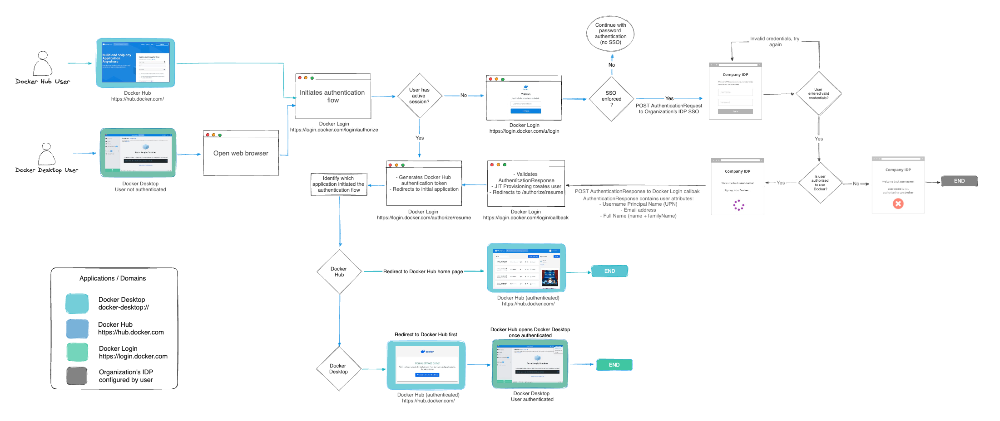



单点登录（SSO）允许用户通过其身份提供商（IdP）进行身份验证来访问 Docker。SSO 可以为整个公司（包括所有关联组织）或拥有 Docker Business 订阅的单个组织进行配置。

## SSO 工作原理

启用 SSO 后，Docker 支持非 IdP 发起的用户登录流程。用户不再使用 Docker 用户名和密码登录，而是被重定向到您的 IdP 登录页面。用户必须通过登录 Docker Hub 或 Docker Desktop 来启动 SSO 身份验证流程。

下图说明了 SSO 在 Docker Hub、Docker Desktop 和您的 IdP 之间的运作和管理方式。

## 设置 SSO

要在 Docker 中配置 SSO，请按照以下步骤操作：

1. 通过创建和验证来[配置您的域](configure.md)。
1. 在 Docker 和您的 IdP 中[创建 SSO 连接](connect.md)。
1. 将 Docker 链接到您的身份提供商。
1. 测试您的 SSO 连接。
1. 在 Docker 中配置用户。
1. 可选。[强制登录](../enforce-sign-in/_index.md)。
1. [管理您的 SSO 配置](manage.md)。

配置完成后，用户可以使用其公司电子邮件地址登录 Docker 服务。登录后，用户将被添加到您的公司、分配到组织并加入团队。

## 先决条件

在开始之前，请确保满足以下条件：

- 通知您的公司即将进行的 SSO 登录流程。
- 确保所有用户已安装 Docker Desktop 4.42 或更高版本。
- 确认每个 Docker 用户都有一个有效的 IdP 账户，该账户使用与其唯一主要标识符(UPN)相同的电子邮件地址。
- 如果您计划[强制执行 SSO](/manuals/enterprise/security/single-sign-on/connect.md#optional-enforce-sso)，通过 CLI 访问 Docker 的用户必须[创建个人访问令牌(PAT)](/docker-hub/access-tokens/)。PAT 将替代其用户名和密码进行身份验证。
- 确保 CI/CD 流水线使用 PAT 或 OAT 而不是密码。

> [!IMPORTANT]
>
> Docker 计划在未来的版本中弃用基于密码的 CLI 登录。使用 PAT 可确保持续的 CLI 访问。有关更多信息，请参阅[安全公告](/manuals/security/security-announcements.md#deprecation-of-password-logins-on-cli-when-sso-enforced)。

## 进一步阅读

- 开始[配置 SSO](configure.md)。
- 阅读[常见问题解答](/manuals/security/faqs/single-sign-on/faqs.md)。
- [排查](/manuals/enterprise/troubleshoot/troubleshoot-sso.md) SSO 问题。
