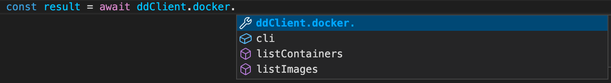
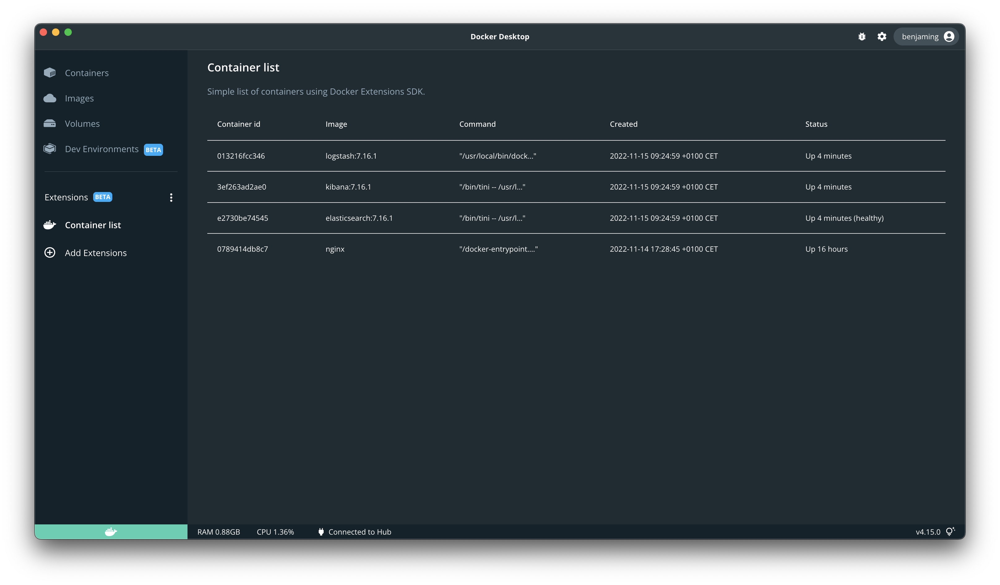

要开始创建扩展，首先需要一个包含各种文件的目录，这些文件范围从扩展的源代码到所需的扩展特定文件。本页面提供了有关如何设置具有更高级前端的扩展的信息。

在开始之前，请确保已安装最新版本的 [Docker Desktop](/manuals/desktop/release-notes.md)。

## 扩展文件夹结构

创建新扩展的最快方法是运行 `docker extension init my-extension`，如
[快速入门](../quickstart.md) 中所述。这将创建一个名为 `my-extension` 的新目录，其中包含一个功能完整的扩展。

> [!TIP]
>
> `docker extension init` 命令会生成基于 React 的扩展。但您仍然可以将其用作自己扩展的起点，并使用任何其他前端框架，如 Vue、Angular、Svelte 等，甚至可以使用原生 Javascript。

虽然您可以从空目录或 `react-extension` [示例文件夹](https://github.com/docker/extensions-sdk/tree/main/samples) 开始，
但强烈建议您从 `docker extension init` 命令开始，然后根据需要进行修改。

```bash
.
├── Dockerfile # (1)
├── ui # (2)
│   ├── public # (3)
│   │   └── index.html
│   ├── src # (4)
│   │   ├── App.tsx
│   │   ├── index.tsx
│   ├── package.json
│   └── package-lock.lock
│   ├── tsconfig.json
├── docker.svg # (5)
└── metadata.json # (6)
```

1. 包含构建扩展并在 Docker Desktop 中运行它所需的一切。
2. 包含前端应用程序源代码的高级文件夹。
3. 存储未经编译或动态生成的资源。这些可以是静态资源，如徽标或 robots.txt 文件。
4. src 或源代码文件夹包含所有 React 组件、外部 CSS 文件以及引入到组件文件中的动态资源。
5. 显示在 Docker Desktop 仪表板左侧菜单中的图标。
6. 提供有关扩展信息的文件，如名称、描述和版本。

## 调整 Dockerfile

> [!NOTE]
>
> 使用 `docker extension init` 时，它会创建一个 `Dockerfile`，其中已包含 React 扩展所需的内容。

创建扩展后，您需要配置 `Dockerfile` 来构建扩展，并配置用于在市场中填充扩展卡片的标签。以下是 React 扩展的 `Dockerfile` 示例：




```Dockerfile
# syntax=docker/dockerfile:1
FROM --platform=$BUILDPLATFORM node:18.9-alpine3.15 AS client-builder
WORKDIR /ui
# 在层中缓存包
COPY ui/package.json /ui/package.json
COPY ui/package-lock.json /ui/package-lock.json
RUN --mount=type=cache,target=/usr/src/app/.npm \
    npm set cache /usr/src/app/.npm && \
    npm ci
# 安装
COPY ui /ui
RUN npm run build

FROM alpine
LABEL org.opencontainers.image.title="My extension" \
    org.opencontainers.image.description="Your Desktop Extension Description" \
    org.opencontainers.image.vendor="Awesome Inc." \
    com.docker.desktop.extension.api.version="0.3.3" \
    com.docker.desktop.extension.icon="https://www.docker.com/wp-content/uploads/2022/03/Moby-logo.png" \
    com.docker.extension.screenshots="" \
    com.docker.extension.detailed-description="" \
    com.docker.extension.publisher-url="" \
    com.docker.extension.additional-urls="" \
    com.docker.extension.changelog=""

COPY metadata.json .
COPY docker.svg .
COPY --from=client-builder /ui/build ui

```
> 注意
>
> 在示例 Dockerfile 中，您可以看到镜像标签 `com.docker.desktop.extension.icon` 设置为图标 URL。扩展市场会在不安装扩展的情况下显示此图标。Dockerfile 还包含 `COPY docker.svg .` 以将图标文件复制到镜像内部。安装扩展后，第二个图标文件用于在仪表板中显示扩展 UI。




> [!IMPORTANT]
>
> 我们还没有适用于 Vue 的可用 Dockerfile。[填写此表单](https://docs.google.com/forms/d/e/1FAIpQLSdxJDGFJl5oJ06rG7uqtw1rsSBZpUhv_s9HHtw80cytkh2X-Q/viewform?usp=pp_url&entry.1333218187=Vue)
> 让我们知道您是否需要 Vue 的 Dockerfile。




> [!IMPORTANT]
>
> 我们还没有适用于 Angular 的可用 Dockerfile。[填写此表单](https://docs.google.com/forms/d/e/1FAIpQLSdxJDGFJl5oJ06rG7uqtw1rsSBZpUhv_s9HHtw80cytkh2X-Q/viewform?usp=pp_url&entry.1333218187=Angular)
> 让我们知道您是否需要 Angular 的 Dockerfile。




> [!IMPORTANT]
>
> 我们还没有适用于 Svelte 的可用 Dockerfile。[填写此表单](https://docs.google.com/forms/d/e/1FAIpQLSdxJDGFJl5oJ06rG7uqtw1rsSBZpUhv_s9HHtw80cytkh2X-Q/viewform?usp=pp_url&entry.1333218187=Svelte)
> 让我们知道您是否需要 Svelte 的 Dockerfile。




## 配置元数据文件

要在 Docker Desktop 中为您的扩展添加选项卡，您必须在扩展目录根目录中的 `metadata.json` 文件中进行配置。

```json
{
  "icon": "docker.svg",
  "ui": {
    "dashboard-tab": {
      "title": "UI Extension",
      "root": "/ui",
      "src": "index.html"
    }
  }
}
```

`title` 属性是显示在 Docker Desktop 仪表板左侧菜单中的扩展名称。
`root` 属性是扩展容器文件系统中前端应用程序的路径，系统使用该路径将其部署到主机上。
`src` 属性是前端应用程序在 `root` 文件夹内的 HTML 入口点路径。

有关 `metadata.json` 中 `ui` 部分的更多信息，请参阅 [元数据](../architecture/metadata.md#ui-section)。

## 构建并安装扩展

现在您已经配置了扩展，需要构建 Docker Desktop 将用于安装它的扩展镜像。

```bash
docker build --tag=awesome-inc/my-extension:latest .
```

这构建了一个标记为 `awesome-inc/my-extension:latest` 的镜像，您可以运行 `docker inspect
awesome-inc/my-extension:latest` 查看有关它的更多详细信息。

最后，您可以安装扩展并看到它出现在 Docker Desktop 仪表板中。

```bash
docker extension install awesome-inc/my-extension:latest
```

## 使用扩展 API 客户端

要使用扩展 API 并执行与 Docker Desktop 相关的操作，扩展必须首先导入
`@docker/extension-api-client` 库。要安装它，请运行以下命令：

```bash
npm install @docker/extension-api-client
```

然后调用 `createDockerDesktopClient` 函数创建客户端对象来调用扩展 API。

```js
import { createDockerDesktopClient } from '@docker/extension-api-client';

const ddClient = createDockerDesktopClient();
```

使用 Typescript 时，您还可以安装 `@docker/extension-api-client-types` 作为开发依赖项。这将为您提供扩展 API 的类型定义和 IDE 中的自动完成功能。

```bash
npm install @docker/extension-api-client-types --save-dev
```



例如，您可以使用 `docker.cli.exec` 函数通过 `docker ps --all` 命令获取所有容器的列表，并在表格中显示结果。




将 `ui/src/App.tsx` 文件替换为以下代码：

```tsx

// ui/src/App.tsx
import React, { useEffect } from 'react';
import {
  Paper,
  Stack,
  Table,
  TableBody,
  TableCell,
  TableContainer,
  TableHead,
  TableRow,
  Typography
} from "@mui/material";
import { createDockerDesktopClient } from "@docker/extension-api-client";

// 获取 docker desktop 扩展客户端
const ddClient = createDockerDesktopClient();

export function App() {
  const [containers, setContainers] = React.useState<any[]>([]);

  useEffect(() => {
    // 列出所有容器
    ddClient.docker.cli.exec('ps', ['--all', '--format', '"{{json .}}"']).then((result) => {
      // result.parseJsonLines() 将命令输出解析为对象数组
      setContainers(result.parseJsonLines());
    });
  }, []);

  return (
    <Stack>
      <Typography data-testid="heading" variant="h3" role="title">
        容器列表
      </Typography>
      <Typography
      data-testid="subheading"
      variant="body1"
      color="text.secondary"
      sx={{ mt: 2 }}
    >
      使用 Docker Extensions SDK 的简单容器列表。
      </Typography>
      <TableContainer sx={{mt:2}}>
        <Table>
          <TableHead>
            <TableRow>
              <TableCell>容器 ID</TableCell>
              <TableCell>镜像</TableCell>
              <TableCell>命令</TableCell>
              <TableCell>创建时间</TableCell>
              <TableCell>状态</TableCell>
            </TableRow>
          </TableHead>
          <TableBody>
            {containers.map((container) => (
              <TableRow
                key={container.ID}
                sx={{ '&:last-child td, &:last-child th': { border: 0 } }}
              >
                <TableCell>{container.ID}</TableCell>
                <TableCell>{container.Image}</TableCell>
                <TableCell>{container.Command}</TableCell>
                <TableCell>{container.CreatedAt}</TableCell>
                <TableCell>{container.Status}</TableCell>
              </TableRow>
            ))}
          </TableBody>
        </Table>
      </TableContainer>
    </Stack>
  );
}

```






> [!IMPORTANT]
>
> 我们还没有 Vue 的示例。[填写此表单](https://docs.google.com/forms/d/e/1FAIpQLSdxJDGFJl5oJ06rG7uqtw1rsSBZpUhv_s9HHtw80cytkh2X-Q/viewform?usp=pp_url&entry.1333218187=Vue)
> 让我们知道您是否需要 Vue 的示例。




> [!IMPORTANT]
>
> 我们还没有 Angular 的示例。[填写此表单](https://docs.google.com/forms/d/e/1FAIpQLSdxJDGFJl5oJ06rG7uqtw1rsSBZpUhv_s9HHtw80cytkh2X-Q/viewform?usp=pp_url&entry.1333218187=Angular)
> 让我们知道您是否需要 Angular 的示例。




> [!IMPORTANT]
>
> 我们还没有 Svelte 的示例。[填写此表单](https://docs.google.com/forms/d/e/1FAIpQLSdxJDGFJl5oJ06rG7uqtw1rsSBZpUhv_s9HHtw80cytkh2X-Q/viewform?usp=pp_url&entry.1333218187=Svelte)
> 让我们知道您是否需要 Svelte 的示例。




## 前端代码强制执行的政策

扩展 UI 代码在单独的 electron 会话中渲染，没有初始化 node.js 环境，也无法直接访问 electron API。

这是为了限制对整个 Docker 仪表板可能的意外副作用。

扩展 UI 代码无法执行特权任务，如更改系统或生成子进程，除非使用扩展框架提供的 SDK API。
扩展 UI 代码也只能通过扩展 SDK API 执行与 Docker Desktop 的交互，如导航到仪表板中的各个位置。

扩展 UI 部分彼此隔离，扩展 UI 代码在每个扩展的自己的会话中运行。扩展无法访问其他扩展的会话数据。

`localStorage` 是浏览器 Web 存储的机制之一。它允许用户在浏览器中保存数据作为键值对以供以后使用。当浏览器（扩展窗格）关闭时，`localStorage` 不会清除数据。这使得在从扩展导航到 Docker Desktop 的其他部分时，它非常适合持久化数据。

如果您的扩展使用 `localStorage` 存储数据，在 Docker Desktop 中运行的其他扩展无法访问您扩展的本地存储。即使在 Docker Desktop 停止或重启后，扩展的本地存储也会被持久化。当扩展升级时，其本地存储会被持久化，而当它被卸载时，其本地存储会被完全删除。

## 重新构建并更新扩展

由于您修改了扩展的代码，必须再次构建扩展。

```console
$ docker build --tag=awesome-inc/my-extension:latest .
```

构建完成后，您需要更新它。

```console
$ docker extension update awesome-inc/my-extension:latest
```

现在您可以在 Docker Desktop 仪表板的容器选项卡中看到后端服务运行，并在需要调试时查看日志。

> [!TIP]
>
> 您可以开启[热重载](../dev/test-debug.md#hot-reloading-whilst-developing-the-ui)以避免每次更改时都需要重新构建扩展。

## 下一步

- 为您的扩展添加[后端](backend-extension-tutorial.md)。
- 了解如何[测试和调试](../dev/test-debug.md)您的扩展。
- 了解如何为您的扩展[设置 CI](../dev/continuous-integration.md)。
- 了解更多关于扩展[架构](../architecture/_index.md)的信息。
- 有关构建 UI 的更多信息和指南，请参阅[设计和 UI 样式部分](../design/design-guidelines.md)。
- 如果您想为扩展设置用户身份验证，请参阅[身份验证](../guides/oauth2-flow.md)。
