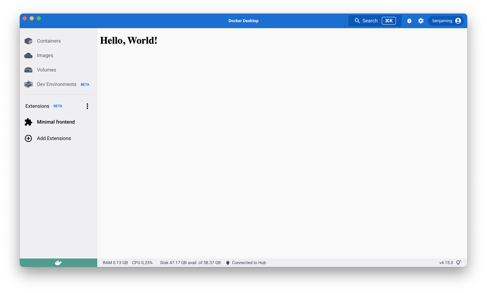

要开始创建扩展，首先需要一个包含扩展源代码和必需扩展特定文件的目录结构。本文将介绍如何基于纯 HTML 设置一个最小前端扩展。

开始之前，请确保已安装最新版本的 [Docker Desktop](/manuals/desktop/release-notes.md)。

> 提示
>
> 如果您想为新扩展创建代码库，我们的[快速入门指南](../quickstart.md)和 `docker extension init <my-extension>` 命令提供了更好的扩展基础。

## 扩展文件夹结构

在 `minimal-frontend` [示例文件夹](https://github.com/docker/extensions-sdk/tree/main/samples) 中，您可以找到一个基于 HTML 构建的 UI 扩展示例。本教程将详细介绍这个代码示例。

虽然您可以从空目录开始，但强烈建议您从以下模板开始，并根据需要进行相应修改。

```bash
.
├── Dockerfile # (1)
├── metadata.json # (2)
└── ui # (3)
    └── index.html
```

1. 包含构建扩展并在 Docker Desktop 中运行所需的全部内容。
2. 提供扩展信息的文件，如名称、描述和版本。
3. 包含所有 HTML、CSS 和 JS 文件的源文件夹。还可以包含其他静态资源，如徽标和图标。有关构建 UI 的更多信息和指南，请参阅[设计和 UI 样式部分](../design/design-guidelines.md)。

## 创建 Dockerfile

您的 Dockerfile 至少需要包含：

- [标签](../extensions/labels.md)：提供有关扩展、图标和屏幕截图的额外信息。
- 源代码：在本例中是位于 `ui` 文件夹内的 `index.html` 文件。
- `metadata.json` 文件。

```Dockerfile
# syntax=docker/dockerfile:1
FROM scratch

LABEL org.opencontainers.image.title="Minimal frontend" \
    org.opencontainers.image.description="A sample extension to show how easy it's to get started with Desktop Extensions." \
    org.opencontainers.image.vendor="Awesome Inc." \
    com.docker.desktop.extension.api.version="0.3.3" \
    com.docker.desktop.extension.icon="https://www.docker.com/wp-content/uploads/2022/03/Moby-logo.png"

COPY ui ./ui
COPY metadata.json .
```

## 配置元数据文件

在镜像文件系统的根目录中必须包含 `metadata.json` 文件。

```json
{
  "ui": {
    "dashboard-tab": {
      "title": "Minimal frontend",
      "root": "/ui",
      "src": "index.html"
    }
  }
}
```

有关 `metadata.json` 的更多信息，请参阅[元数据](../architecture/metadata.md)。

## 构建并安装扩展

现在您已经配置好了扩展，需要构建 Docker Desktop 将用于安装的扩展镜像。

```console
$ docker build --tag=awesome-inc/my-extension:latest .
```

这将构建一个标记为 `awesome-inc/my-extension:latest` 的镜像，您可以运行 `docker inspect awesome-inc/my-extension:latest` 查看更多详细信息。

最后，您可以安装扩展，并看到它出现在 Docker Desktop 仪表板中。

```console
$ docker extension install awesome-inc/my-extension:latest
```

## 预览扩展

要在 Docker Desktop 中预览扩展，安装完成后请关闭并重新打开 Docker Desktop 仪表板。

左侧菜单将显示一个带有扩展名称的新标签页。



## 下一步

- 构建更[高级的前端](frontend-extension-tutorial.md)扩展。
- 学习如何[测试和调试](../dev/test-debug.md)您的扩展。
- 学习如何为扩展[设置 CI](../dev/continuous-integration.md)。
- 了解更多关于扩展[架构](../architecture/_index.md)的信息。
