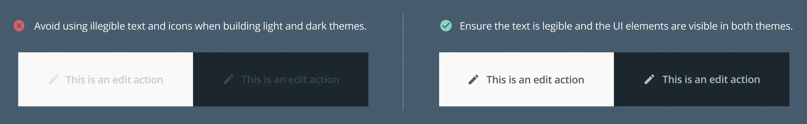
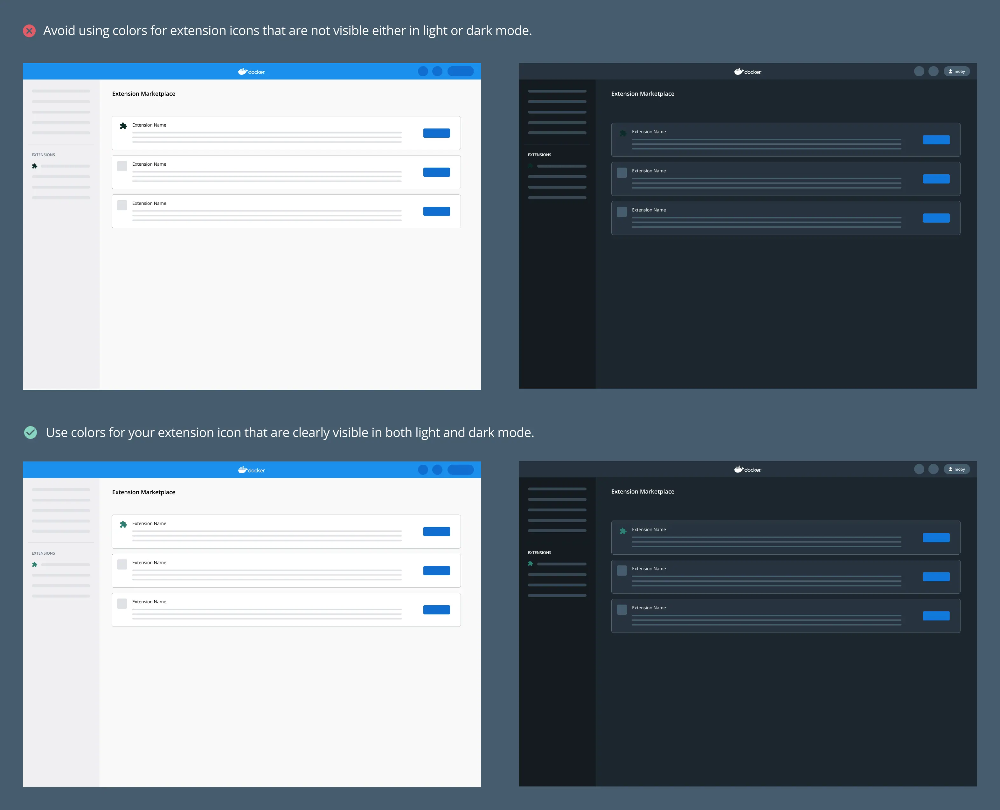
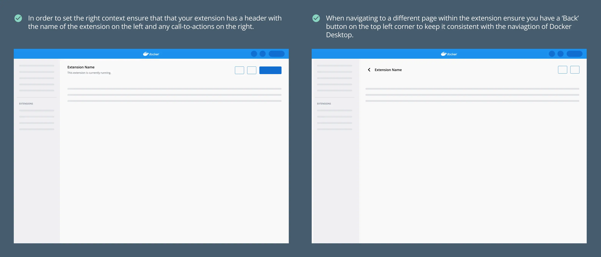
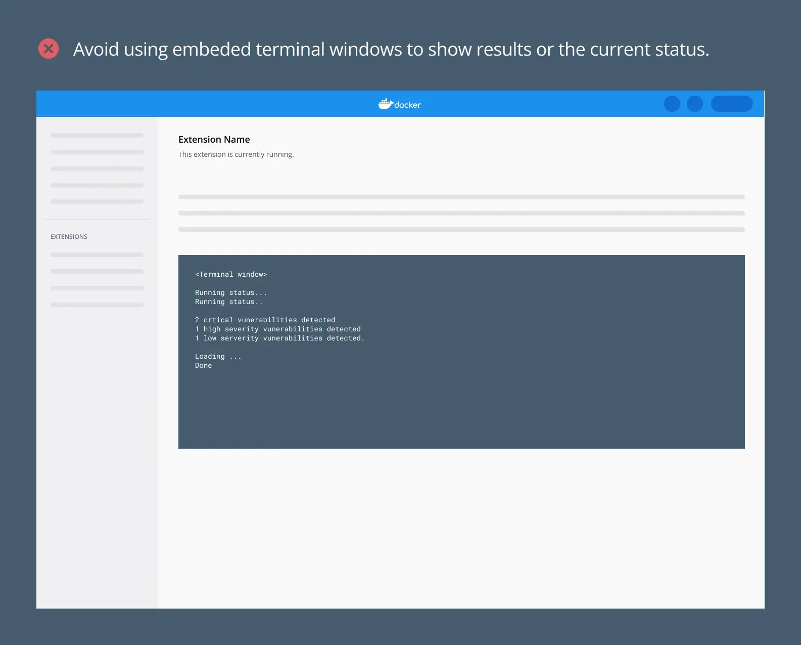
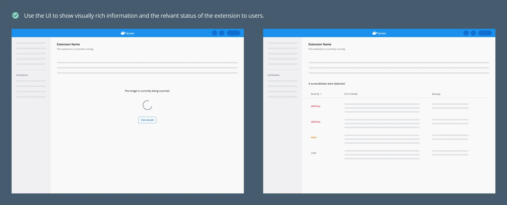
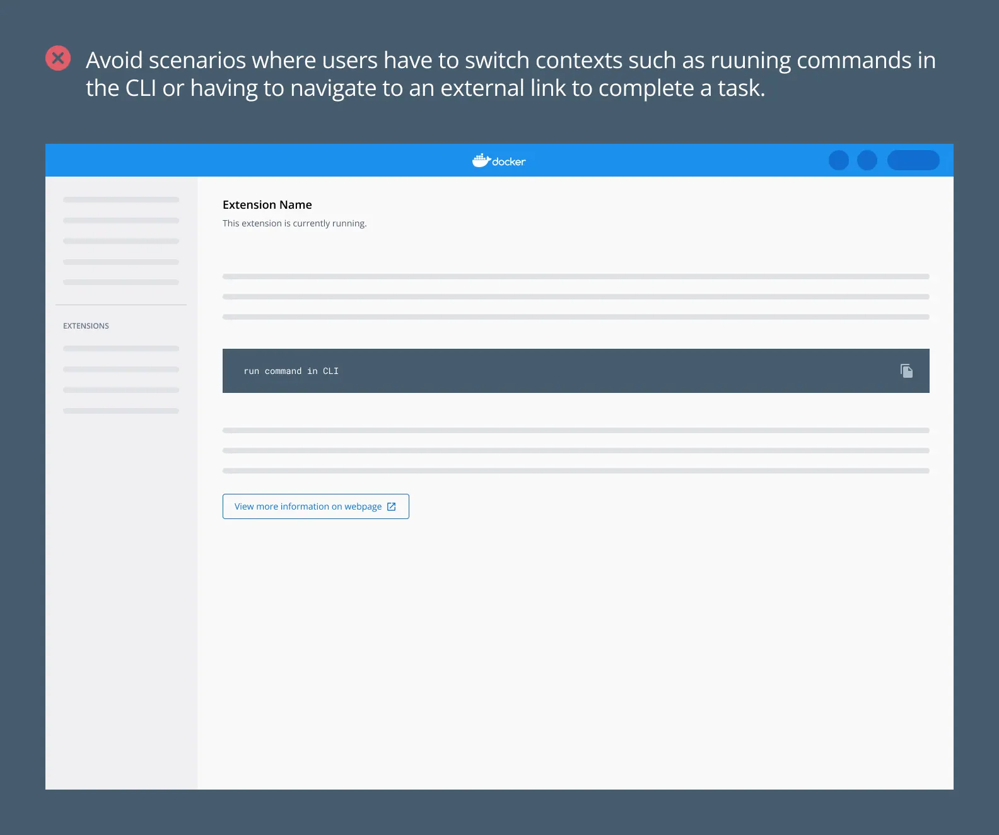
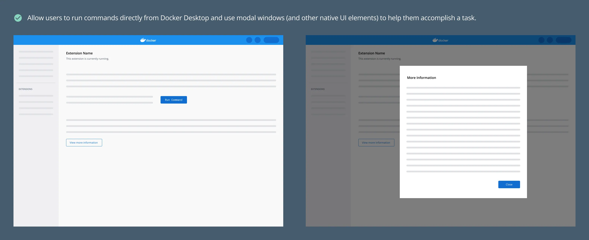
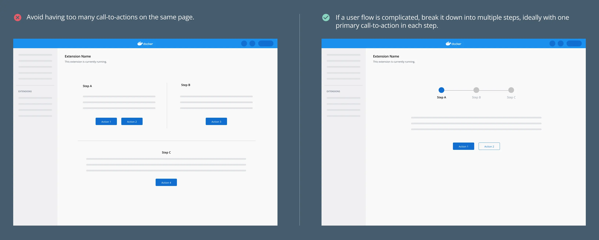
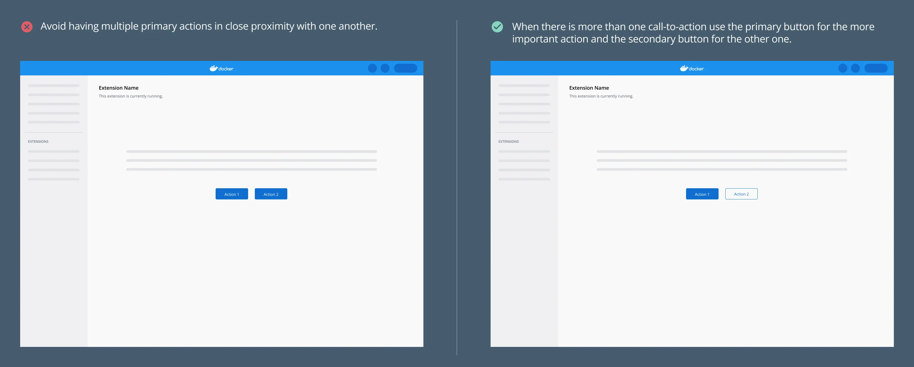
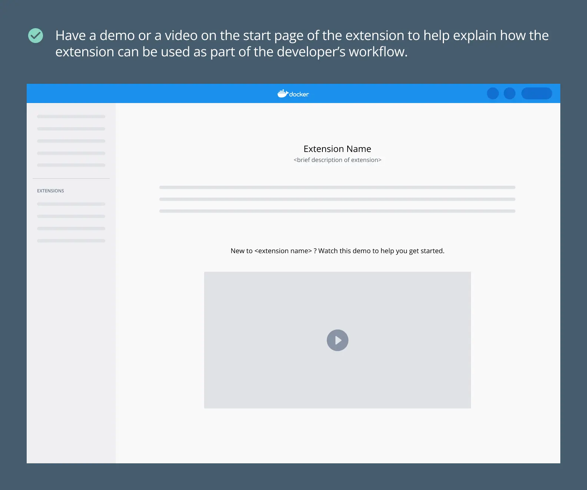

在 Docker，我们的目标是构建能够集成到用户现有工作流程中的工具，而不是要求他们采用新的工作流程。我们强烈建议您在创建扩展时遵循这些指南。我们基于这些要求审查和批准您的 Marketplace 发布内容。

以下是创建扩展时可以参考的简单检查清单：
- 是否容易上手？
- 是否易于使用？
- 需要帮助时是否容易获得支持？

## 创建与 Docker Desktop 一致的体验

使用 [Docker Material UI 主题](https://www.npmjs.com/package/@docker/docker-mui-theme) 和 [Docker 扩展样式指南](https://www.figma.com/file/U7pLWfEf6IQKUHLhdateBI/Docker-Design-Guidelines?node-id=1%3A28771) 确保您的扩展感觉像是 Docker Desktop 的一部分，为用户创造无缝体验。

- 确保扩展同时具有浅色和深色主题。按照 Docker 样式指南使用组件和样式，可以确保您的扩展符合 [AA 级无障碍标准](https://www.w3.org/WAI/WCAG2AA-Conformance)。

  

- 确保您的扩展图标在浅色和深色模式下都可见。

  

- 确保导航行为与 Docker Desktop 的其余部分保持一致。添加标题栏为扩展设置上下文。

  

- 避免嵌入终端窗口。与 CLI 相比，Docker Desktop 的优势在于我们有机会为用户提供丰富的信息。尽可能利用这个界面。

  

  

## 原生构建功能

- 为了不打断用户的流程，避免用户必须导航到 Docker Desktop 外部（例如 CLI 或网页）来执行某些功能的情况。相反，应构建 Docker Desktop 原生的功能。

  

  

## 分解复杂的用户流程

- 如果流程过于复杂或概念抽象，请将流程分解为多个步骤，每个步骤中包含一个简单的行动号召。这有助于新手用户快速上手您的扩展。

  

- 当有多个行动号召时，确保您使用主要按钮（填充按钮样式）和次要按钮（轮廓按钮样式）来传达每个操作的重要性。

  

## 引导新用户

创建扩展时，确保扩展和产品的首次用户能够理解其价值并轻松采用。确保您在扩展中包含上下文相关的帮助。

- 确保所有必要信息都添加到扩展 Marketplace 以及扩展详情页面。这应包括：
  - 扩展的截图。请注意，截图的推荐尺寸为 2400x1600 像素。
  - 详细描述，涵盖扩展的目的、适用人群以及工作方式。
  - 必要资源的链接，如文档。
- 如果您的扩展具有特别复杂的功能，请在起始页面添加演示或视频。这有助于快速引导首次用户。

  

## 下一步

- 探索我们的[设计原则](design-principles.md)。
- 查看我们的[UI 样式指南](index.md)。
- 了解如何[发布您的扩展](../extensions/_index.md)。
