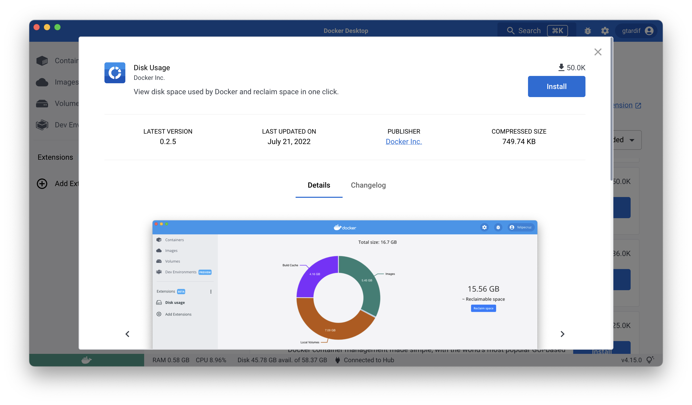
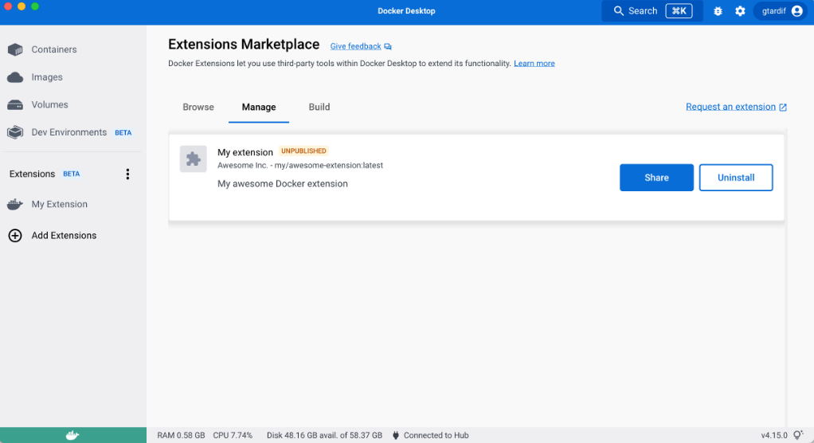

Docker 扩展使用镜像标签来提供额外信息，如标题、描述、截图等。

这些信息会作为扩展的概览展示，帮助用户决定是否安装该扩展。

你可以在扩展的 `Dockerfile` 中定义[镜像标签](/reference/dockerfile.md#label)。

> [!IMPORTANT]
>
> 如果 `Dockerfile` 中缺少任何**必需**标签，Docker Desktop 会将该扩展视为无效，不会在市场中列出。

以下是构建扩展时可以或需要指定的标签列表：

| 标签                                        | 是否必需 | 描述                                                                                                                                                                                                                                                                                                                                                                                                                                                                                              | 示例                                                                                                                                                                                                                                                         |
| ------------------------------------------- | -------- | ------------------------------------------------------------------------------------------------------------------------------------------------------------------------------------------------------------------------------------------------------------------------------------------------------------------------------------------------------------------------------------------------------------------------------------------------------------------------------------------------- | --------------------------------------------------------------------------------------------------------------------------------------------------------------------------------------------------------------------------------------------------------------- |
| `org.opencontainers.image.title`            | 是       | 镜像的人类可读标题（字符串）。此标题将显示在 Docker Desktop 的用户界面中。                                                                                                                                                                                                                                                                                                                                                                                                                          | my-extension                                                                                                                                                                                                                                                    |
| `org.opencontainers.image.description`      | 是       | 镜像中打包软件的人类可读描述（字符串）                                                                                                                                                                                                                                                                                                                                                                                                                                                             | 这是一个很棒的扩展。                                                                                                                                                                                                                                         |
| `org.opencontainers.image.vendor`           | 是       | 分发实体、组织或个人的名称。                                                                                                                                                                                                                                                                                                                                                                                                                                                                         | Acme, Inc.                                                                                                                                                                                                                                                      |
| `com.docker.desktop.extension.api.version`  | 是       | 扩展兼容的 Docker 扩展管理器版本。必须遵循[语义化版本](https://semver.org/)规范。                                                                                                                                                                                                                                                                                                                                                                                                                    | 特定版本如 `0.1.0` 或约束表达式：`>= 0.1.0`、`>= 1.4.7, < 2.0`。对于你的第一个扩展，可以使用 `docker extension version` 命令获取 SDK API 版本，并指定 `>= <SDK_API_VERSION>`。                                   |
| `com.docker.desktop.extension.icon`         | 是       | 扩展图标（格式：.svg .png .jpg）                                                                                                                                                                                                                                                                                                                                                                                                                                                                   | `https://example.com/assets/image.svg`                                                                                                                                                                                                                          |
| `com.docker.extension.screenshots`          | 是       | 图像 URL 的 JSON 数组和替代文本，按元数据中的顺序显示在扩展详情页。**注意：**推荐截图尺寸为 2400x1600 像素。                                                                                                                                                                                                                                                                                                                                                                                              | `[{"alt":"图像 1 的替代文本",` `"url":"https://example.com/image1.png"},` `{"alt":"图像 2 的替代文本",` `"url":"https://example.com/image2.jpg"}]`                                                                                         |
| `com.docker.extension.detailed-description` | 是       | 关于扩展的纯文本或 HTML 格式的附加信息，显示在详情对话框中。                                                                                                                                                                                                                                                                                                                                                                                                                                        | `我的详细描述` 或 `<h1>我的详细描述</h1>`                                                                                                                                                                                                 |
| `com.docker.extension.publisher-url`        | 是       | 发布者网站 URL，显示在详情对话框中。                                                                                                                                                                                                                                                                                                                                                                                                                                                               | `https://example.com`                                                                                                                                                                                                                                           |
| `com.docker.extension.additional-urls`      | 否       | 标题和附加 URL 的 JSON 数组，按元数据中的顺序显示在扩展详情页。Docker 建议如果适用，显示以下链接：文档、支持、服务条款和隐私政策链接。                                                                                                                                                                                                                                                                                                                                                              | `[{"title":"文档","url":"https://example.com/docs"},` `{"title":"支持","url":"https://example.com/bar/support"},` `{"title":"服务条款","url":"https://example.com/tos"},` `{"title":"隐私政策","url":"https://example.com/privacy"}]` |
| `com.docker.extension.changelog`            | 是       | 仅包含当前版本更改的纯文本或 HTML 格式的更新日志。                                                                                                                                                                                                                                                                                                                                                                                                                                                   | `扩展更新日志` 或 `
扩展更新日志<ul>` `<li>新功能 A</li>` `<li>功能 B 的错误修复</li></ul>
`                                                                                                                                         |
| `com.docker.extension.account-info`         | 否       | 用户是否需要注册到 SaaS 平台才能使用扩展的某些功能。                                                                                                                                                                                                                                                                                                                                                                                                                                                | 如果需要，设置为 `required`，否则留空。                                                                                                                                                                                                           |
| `com.docker.extension.categories`           | 否       | 扩展所属的市场类别列表：`ci-cd`、`container-orchestration`、`cloud-deployment`、`cloud-development`、`database`、`kubernetes`、`networking`、`image-registry`、`security`、`testing-tools`、`utility-tools`、`volumes`。如果不指定此标签，用户在按类别筛选时将无法在扩展市场中找到你的扩展。2022年9月22日之前发布到市场的扩展已由 Docker 自动分类。 | 多个类别时使用逗号分隔值，例如：`kubernetes,security`；单个类别时，例如：`kubernetes`。                                                                                                   |

> [!TIP]
>
> Docker Desktop 会为提供的 HTML 内容应用 CSS 样式。你可以确保它在[市场内](#preview-the-extension-in-the-marketplace)正确渲染。建议遵循[样式指南](../design/_index.md)。

## 在市场中预览扩展

你可以验证镜像标签是否按预期渲染。

当你创建并安装未发布的扩展时，可以在市场的**管理**选项卡中预览该扩展。你可以查看扩展标签在列表和扩展详情页中的渲染效果。

> 预览已在市场中列出的扩展
>
> 当你安装已在市场中发布的扩展的本地镜像时，例如使用 `latest` 标签，你的本地镜像不会被检测为"未发布"。
>
> 你可以重新标记你的镜像，以获得一个未被列为已发布扩展的不同镜像名称。
> 使用 `docker tag org/published-extension unpublished-extension`，然后使用 `docker extension install unpublished-extension`。

