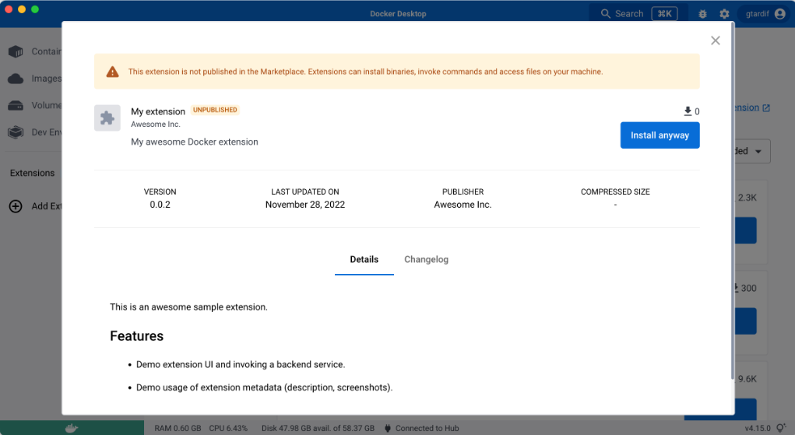

一旦您的扩展镜像在 Docker Hub 上可访问，任何有权访问该镜像的用户都可以安装该扩展。

用户可以通过在终端中输入 `docker extension install my/awesome-extension:latest` 来安装您的扩展。

然而，此选项不会在安装前提供扩展的预览。

## 创建分享链接

Docker 允许您使用 URL 分享您的扩展。

当用户导航到此 URL 时，它会打开 Docker Desktop 并以与市场中扩展相同的方式显示您的扩展预览。从预览中，用户可以选择 **安装**。



要生成此链接，您可以：

- 运行以下命令：

  ```console
  $ docker extension share my/awesome-extension:0.0.1
  ```

- 在本地安装您的扩展后，导航到 **管理** 选项卡并选择 **分享**。

  

> [!NOTE]
>
> 扩展描述或截图等预览内容是使用[扩展标签](labels.md)创建的。
