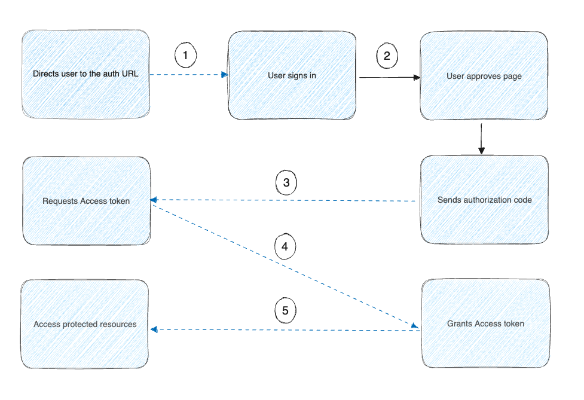

> [!NOTE]
>
> 本页面假设您已经拥有一个身份提供商 (IdP)，例如 Google、Entra ID（前身为 Azure AD）或 Okta，它们处理身份验证过程并返回访问令牌。

了解如何让用户通过 Web 浏览器使用 OAuth 2.0 从您的扩展进行身份验证，并返回到您的扩展。

在 OAuth 2.0 中，"授权类型"一词指的是应用程序获取访问令牌的方式。虽然 OAuth 2.0 定义了几种授权类型，但本页面仅描述如何使用授权码授权类型从您的扩展授权用户。

## 授权码授权流程

授权码授权类型由机密和公共客户端使用，用于将授权码交换为访问令牌。

用户通过重定向 URL 返回客户端后，应用程序从 URL 获取授权码并使用它来请求访问令牌。



上图显示了以下过程：

- Docker 扩展要求用户授权访问其数据。
- 如果用户授予访问权限，扩展会向服务提供商请求访问令牌，传递来自用户的访问授权和用于识别客户端的身份验证详细信息。
- 服务提供商验证这些详细信息并返回访问令牌。
- 扩展使用访问令牌向服务提供商请求用户数据。

### OAuth 2.0 术语

- 授权 URL：API 提供商授权服务器的端点，用于获取授权码。
- 重定向 URI：身份验证后重定向到的客户端应用程序回调 URL。这必须在 API 提供商处注册。

用户输入用户名和密码后，即成功完成身份验证。

## 打开浏览器页面以验证用户身份

从扩展 UI 中，您可以提供一个按钮，当用户选择时，会在浏览器中打开一个新窗口来验证用户身份。

使用 [ddClient.host.openExternal](../dev/api/dashboard.md#open-a-url) API 打开浏览器到授权 URL。例如：

```typescript
window.ddClient.openExternal("https://authorization-server.com/authorize?
  response_type=code
  &client_id=T70hJ3ls5VTYG8ylX3CZsfIu
  &redirect_uri=${REDIRECT_URI});
```

## 获取授权码和访问令牌

您可以通过在使用的 OAuth 应用中将 `docker-desktop://dashboard/extension-tab?extensionId=awesome/my-extension` 列为 `redirect_uri`，并将授权码作为查询参数连接，从扩展 UI 获取授权码。然后扩展 UI 代码将能够读取相应的代码查询参数。

> [!IMPORTANT]
>
> 使用此功能需要 Docker Desktop 中的扩展 SDK 0.3.3。您需要确保在[镜像标签](../extensions/labels.md)中使用 `com.docker.desktop.extension.api.version` 设置的扩展所需 SDK 版本高于 0.3.3。

#### 授权

在此步骤中，用户在浏览器中输入其凭据。授权完成后，用户将被重定向回您的扩展用户界面，扩展 UI 代码可以使用 URL 中查询参数部分的授权码。

#### 交换授权码

接下来，您将授权码交换为访问令牌。

扩展必须向 OAuth 授权服务器发送 `POST` 请求，包含以下参数：

```text
POST https://authorization-server.com/token
&client_id=T70hJ3ls5VTYG8ylX3CZsfIu
&client_secret=YABbyHQShPeO1T3NDQZP8q5m3Jpb_UPNmIzqhLDCScSnRyVG
&redirect_uri=${REDIRECT_URI}
&code=N949tDLuf9ai_DaOKyuFBXStCNMQzuQbtC1QbvLv-AXqPJ_f
```

> [!NOTE]
>
> 在此示例中，客户端凭据包含在 `POST` 查询参数中。OAuth 授权服务器可能要求将凭据作为 HTTP 基本身份验证标头发送，或者可能支持不同的格式。有关详细信息，请参阅您的 OAuth 提供商文档。

### 存储访问令牌

Docker 扩展 SDK 不提供存储机密的特定机制。

强烈建议您使用外部存储源来存储访问令牌。

> [!NOTE]
>
> 用户界面本地存储在扩展之间是隔离的（一个扩展无法访问另一个扩展的本地存储），并且当用户卸载扩展时，每个扩展的本地存储都会被删除。

## 下一步

了解如何[发布和分发您的扩展](../extensions/_index.md)
