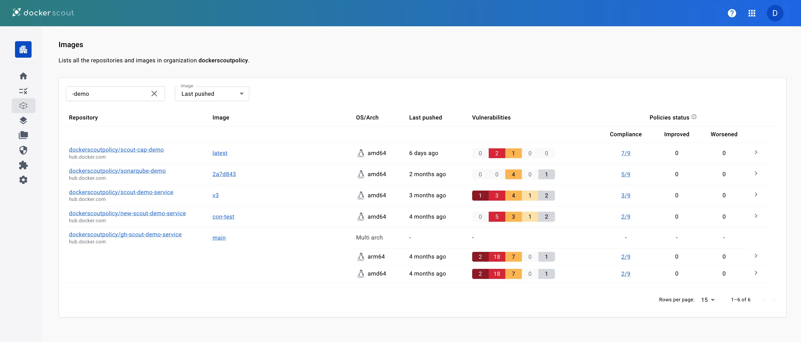

[Docker Scout Dashboard](https://scout.docker.com/) 便于在团队内部共享组织范围内的镜像分析结果。
开发者可以总览来自 Docker Hub 的所有镜像的安全状态，并即时获取修复建议。
它也帮助安全、合规与运维等角色明确需要优先处理的漏洞与问题。

## 概览

**Overview** 选项卡提供所选组织内各仓库的摘要信息。

在页面顶部，你可以选择要查看的 **Environment**。
默认显示最近 push 的镜像。关于 environment 的更多信息，参见
[环境监控](/manuals/scout/integrations/environment/_index.md)。

**Policy** 模块展示每项策略的当前合规评分，以及所选 environment 的趋势。
趋势表示最近镜像相较于上一版本在策略结果上的变化（delta）。
关于策略的更多信息，参见 [策略评估](/manuals/scout/policy/_index.md)。

漏洞图表展示所选 environment 中镜像在一段时间内的漏洞总量。
你可以通过下拉菜单调整时间范围。

通过站点顶部的导航栏，可进入 Docker Scout Dashboard 的主要功能区：

- **Policies**：显示组织的策略合规情况，见[Policies](#policies)
- **Images**：列出组织内启用了 Docker Scout 的所有仓库，见[Images](#images)
- **Base images**：列出组织中各仓库使用的所有基础镜像
- **Packages**：列出组织范围内的全部软件包
- **Vulnerabilities**：列出组织镜像中的所有 CVE，见[Vulnerabilities](#vulnerabilities)
- **Integrations**：创建与管理第三方集成，见[Integrations](#integrations)
- **Settings**：管理仓库相关设置，见[Settings](#settings)

## 策略 {#policies}

**Policies** 视图展示所选组织与 environment 下所有镜像的策略合规情况。
你可以使用 **Image** 下拉菜单按特定 environment 查看策略细分信息。

关于策略的更多信息，参见[策略评估](/manuals/scout/policy/_index.md)。

## 镜像 {#images}

**Images** 视图展示所选 environment 下所有启用 Scout 的仓库中的镜像。
你可以通过切换 environment，或按仓库名进行文本过滤来筛选列表。

每个仓库条目会显示以下信息：

- 仓库名（不含标签或摘要的镜像引用）
- 所选 environment 中该镜像的最新标签
- 该最新标签的操作系统与架构
- 该最新标签的漏洞状态
- 该最新标签的策略状态

选择仓库链接可进入该仓库已分析镜像的列表。
你可以查看某个镜像的完整分析结果，
并对比不同标签之间的软件包与漏洞差异。

选择镜像链接会打开该标签或摘要的详情视图。
该视图包含两个选项卡，展示镜像组成与策略合规详情：

- **Policy status**：展示所选镜像的策略评估结果，并提供策略违规详情链接。

  关于策略的更多信息，参见 [策略评估](/manuals/scout/policy/_index.md)。
 
- **Image layers**：分解展示镜像的分析结果，帮助你完整了解镜像包含的漏洞，并理解其引入路径。

## 漏洞 {#vulnerabilities}

**Vulnerabilities** 视图列出组织内镜像的全部漏洞。
列表包含每个 CVE 的严重等级和 CVSS（通用漏洞评分体系）分数，
以及是否存在可修复版本。此处展示的 CVSS 分数为所有可用 [来源](/manuals/scout/deep-dive/advisory-db-sources.md) 中的最高分。

选择页面中的链接会打开漏洞详情页。
该页面为公开页面，展示某个 CVE 的详细信息。
即使对方不是你的 Docker 组织成员或未登录 Docker Scout，你也可以将该链接分享给他们。

若你已登录，该页面的 **My images** 选项卡会列出受该 CVE 影响的你的全部镜像。

## 集成 {#integrations}

**Integrations** 页面用于创建与管理 Docker Scout 的各类集成，
包括 environment 集成与 registry 集成。入门请参阅
[与其他系统集成](/manuals/scout/integrations/_index.md)。

## 设置 {#settings}

Docker Scout Dashboard 的设置菜单包含：

- [**Repository settings**](#repository-settings)：启用与禁用仓库
- [**Notifications**](#notification-settings)：管理你在 Docker Scout 中的通知偏好

### 仓库设置 {#repository-settings}

当你为某个仓库启用 Docker Scout 后，
每当你向该仓库 push，新标签都会被自动分析。
若要在 Amazon ECR、Azure ACR 或其他第三方仓库启用，
需先完成相应的集成。
参见 [容器仓库集成](/manuals/scout/integrations/_index.md#container-registries)

### 通知设置 {#notification-settings}

[Notification settings](https://scout.docker.com/settings/notifications)
页面用于调整你接收 Docker Scout 通知的偏好设置。
通知设置为个人级别，仅影响你的个人账户，不影响整个组织。

Docker Scout 的通知旨在提醒与你相关的上游变更。
当安全通告披露新的漏洞且影响到你的一个或多个镜像时，你会收到通知。
由于你 push 新镜像导致的漏洞暴露或策略合规变化，不会触发通知。

> [!NOTE]
>
> 仅对每个仓库的“最后推送（last pushed）”镜像标签触发通知。
> “last pushed” 指最近一次被推送到仓库并被 Docker Scout 分析的镜像标签。
> 若该镜像标签不受新披露的 CVE 影响，则不会触发通知。

可用的通知设置包括：

- **Repository scope**

  你可以选择对全部仓库启用通知，或仅对特定仓库启用。
  这些设置作用于当前选定的组织，你可在加入的每个组织中分别配置。

  - **All repositories**：接收你有权限访问的所有仓库的通知。
  - **Specific repositories**：仅接收特定仓库的通知，并填写要接收的仓库名。

- **Delivery preferences**

  控制你接收 Docker Scout 通知的方式，
  对你所在的所有组织生效。

  - **Notification pop-ups**：在 Docker Scout Dashboard 中以弹窗形式接收通知。
  - **OS notifications**：在浏览器中打开 Docker Scout Dashboard 时，
    通过浏览器的系统通知接收消息。
  
  若要启用系统通知，需要授予 Docker Scout 使用浏览器通知 API 的权限。

在该页面，你还可以前往团队协作集成（如 [Slack](/manuals/scout/integrations/team-collaboration/slack.md)）的设置。

你也可以在 Docker Desktop 的 **Settings** > **Notifications** 中配置通知设置。
