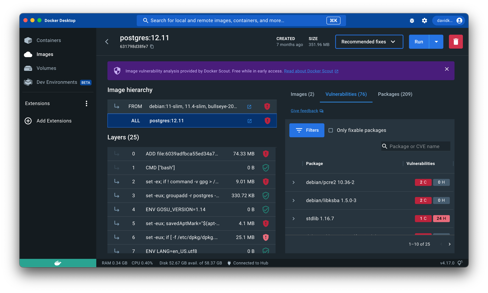
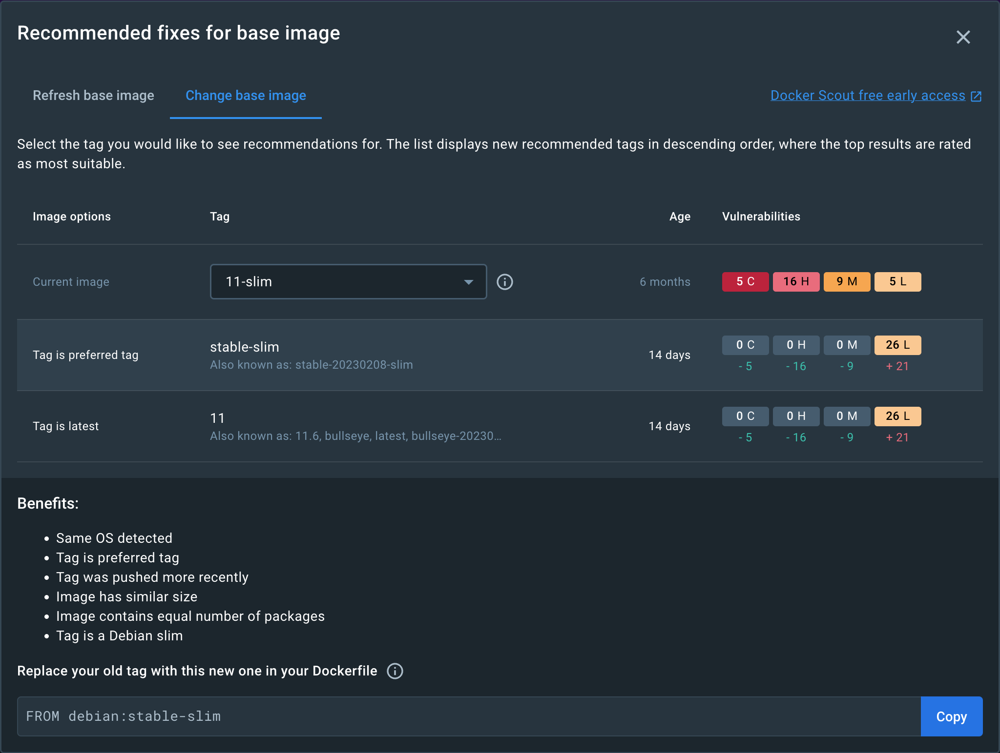

镜像详情视图用于展示 Docker Scout 的分析结果。你可以在 Docker Scout Dashboard、Docker Desktop 的
**Images** 视图，以及 Docker Hub 的镜像标签页中打开该视图。镜像详情会分解展示镜像层级（基础镜像）、
镜像层、软件包和漏洞。

Docker Desktop 会先在本地对镜像进行分析并生成软件物料清单（SBOM）。
Docker Desktop、Docker Hub、Docker Scout Dashboard 与 CLI 都会使用 SBOM 中的
[PURL（package URL）链接](https://github.com/package-url/purl-spec)，在
[Docker Scout 的通告数据库](/manuals/scout/deep-dive/advisory-db-sources.md) 中查询匹配的
CVEs（Common Vulnerabilities and Exposures，通用漏洞与暴露）。

## 镜像层级（Image hierarchy）

你正在查看的镜像，可能在 **Image hierarchy** 下显示一个或多个基础镜像。
这表示镜像作者在构建该镜像时，以其他镜像作为起点。常见的基础镜像包括操作系统镜像（如 Debian、Ubuntu、Alpine），
或编程语言镜像（如 PHP、Python、Java）。

选择链条中的任意镜像，可以查看哪些镜像层来自该基础镜像。选择 **ALL** 行可一次选中所有镜像层与基础镜像。

一个或多个基础镜像可能存在可用更新，这些更新通常包含安全补丁，可减少你当前镜像中的漏洞。
可用更新会在 **Image hierarchy** 右侧标注出来。

## 层（Layers）

Docker 镜像由多层（layer）组成。镜像层自上而下排列，最早的镜像层位于顶部，最新的镜像层位于底部。
通常，列表顶部的镜像层来自基础镜像，而靠近底部的镜像层由镜像作者添加，
一般通过 Dockerfile 中的命令生成。在 **Image hierarchy** 中选择某个基础镜像时，
会高亮显示哪些镜像层源自该基础镜像。

选择一个或多个镜像层，会在右侧过滤显示相应的软件包与漏洞，帮助你定位由这些镜像层引入的内容。

## 漏洞

**Vulnerabilities** 选项卡展示在镜像中检测到的漏洞与利用信息。列表按软件包分组，并按严重等级排序。

展开某一项可查看更多详情（例如是否存在可用修复方案）。

## 修复建议

当你在 Docker Desktop 或 Docker Hub 中查看镜像时，
Docker Scout 会提供提升该镜像安全性的建议。

### 在 Docker Desktop 中的建议

在 Docker Desktop 中查看某个镜像的安全建议：

1. 打开 Docker Desktop 的 **Images** 视图。
2. 选择你想查看建议的镜像标签。
3. 在顶部附近，点击 **Recommended fixes** 下拉按钮。

下拉菜单允许你选择查看当前镜像本身的建议，或其构建所用基础镜像的建议：

- [**Recommendations for this image**](#recommendations-for-current-image)
 ：提供针对当前镜像本身的建议。
- [**Recommendations for base image**](#recommendations-for-base-image)
  ：提供针对用于构建该镜像的基础镜像的建议。

如果当前镜像没有关联的基础镜像，则下拉菜单仅显示“查看当前镜像的建议”。

### 在 Docker Hub 中的建议

在 Docker Hub 中查看某个镜像的安全建议：

1. 进入已启用 Docker Scout 镜像分析的镜像仓库页面。
2. 打开 **Tags** 标签页。
3. 选择你想查看建议的镜像标签。
4. 点击 **View recommended base image fixes** 按钮。

   随后会弹出一个窗口，给出“通过更优的基础镜像提升镜像安全性”的建议。
   详情可参阅 [Recommendations for base image](#recommendations-for-base-image)。

### 当前镜像的建议 {#recommendations-for-current-image}

“当前镜像”的建议视图可帮助你判断所用镜像版本是否已过期。
如果该标签引用的是较旧的镜像摘要（digest），此处会建议你通过拉取最新版本来更新该标签。

点击 **Pull new image** 获取更新版本。勾选复选框可在拉取完成后移除旧版本。

### 基础镜像的建议 {#recommendations-for-base-image}

“基础镜像”的建议视图包含两个选项卡，用于切换不同类型的建议：

- **Refresh base image**
- **Change base image**

只有当你是该镜像的作者时，这些基础镜像建议才具有可操作性。
因为更换基础镜像需要你修改 Dockerfile 并重新构建镜像。

#### 刷新基础镜像

该选项卡用于判断所选基础镜像的标签是否为最新可用版本，或者是否已过期。

如果用于构建当前镜像的基础镜像标签不是最新版本，则会在此窗口展示两者之间的差异信息（delta），包括：

- 推荐（较新）版本的标签名称与别名
- 当前基础镜像版本的发布时间（age）
- 最新可用版本的发布时间（age）
- 各版本受影响的 CVE 数量

在窗口底部，你还会得到命令片段，可直接用于用最新版本重新构建镜像。

#### 更换基础镜像

该选项卡会展示可选的不同基础镜像标签，并概述每个标签版本的优缺点。
选择某个基础镜像后，会显示与该标签相关的推荐选项。

例如，如果当前镜像使用了较旧版本的 `debian` 作为基础镜像，
此处会推荐更新且更安全的 `debian` 版本供你选择。
通过提供多个备选项，你可以直观比较它们之间的差异，从而做出决策。

选择某个标签建议可查看更详细的信息：该标签的优势与潜在劣势、推荐理由，
以及如何修改 Dockerfile 以使用该版本。
