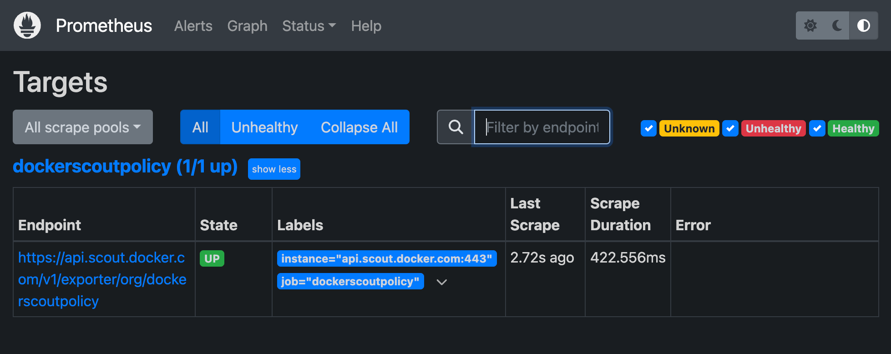
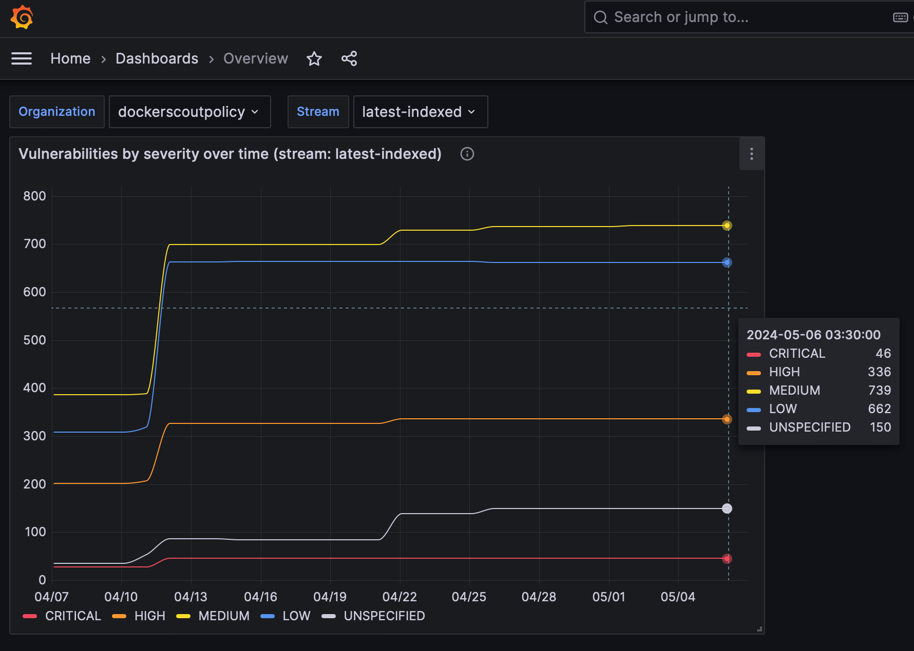
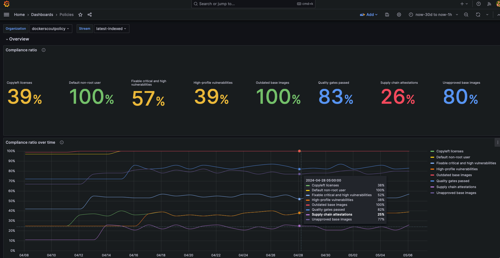
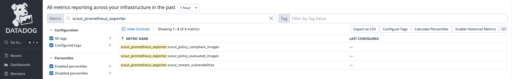
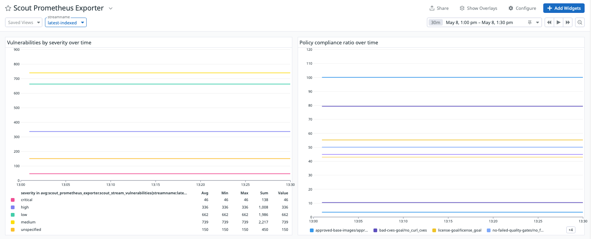
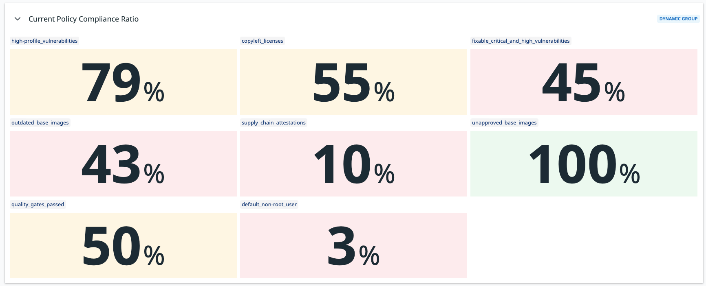

Docker Scout 提供一个指标（metrics）HTTP 端点，可配合 Prometheus 或 Datadog 抓取漏洞与策略数据。
借助它，你可以自建并托管 Docker Scout 看板，用于可视化软件供应链相关指标。

## 指标（Metrics）

该指标端点会暴露以下指标：

| 指标名                           | 描述                                                | 标签                              | 类型  |
| -------------------------------- | --------------------------------------------------- | --------------------------------- | ----- |
| `scout_stream_vulnerabilities`   | 某条 stream 中的漏洞数量                            | `streamName`, `severity`          | Gauge |
| `scout_policy_compliant_images`  | 某条 stream 中符合某策略的镜像数量                  | `id`, `displayName`, `streamName` | Gauge |
| `scout_policy_evaluated_images`  | 某条 stream 中按策略评估过的镜像总数                | `id`, `displayName`, `streamName` | Gauge |

> **Streams**
>
> 在 Docker Scout 中，stream 的概念是 [environment](/manuals/scout/integrations/environment/_index.md) 的超集。
> stream 覆盖你定义的全部运行环境，以及一个特殊的 `latest-indexed` stream。
> `latest-indexed` stream 包含每个仓库最近一次推送（且已分析）的标签。
>
> 除了通过本指标端点暴露的数据外，stream 多用于 Docker Scout 的内部概念。
{ #stream }

## 创建访问令牌（Access token）

若要从你的组织导出指标，请先确认你的组织已启用 Docker Scout。
然后创建个人访问令牌（Personal Access Token，PAT）——它用于让导出器与 Docker Scout API 进行认证。

PAT 无需特殊权限，但必须由 Docker 组织的拥有者（owner）用户创建。
创建 PAT 的步骤详见：[创建访问令牌](/manuals/security/access-tokens.md)。

创建完成后，请将 PAT 安全保存。抓取指标时需要将该令牌提供给导出器。

## Prometheus

本节介绍如何使用 Prometheus 抓取该指标端点的数据。

### 为组织新增任务

在 Prometheus 配置文件中为你的组织添加一个新任务。
任务应包含以下配置；将 `ORG` 替换为你的组织名称：

```yaml
scrape_configs:
  - job_name: <ORG>
    metrics_path: /v1/exporter/org/<ORG>/metrics
    scheme: https
    static_configs:
      - targets:
          - api.scout.docker.com
```

`targets` 字段应设置为 Docker Scout API 的域名 `api.scout.docker.com`。
确保没有防火墙规则阻止服务器访问该端点。

### 添加 Bearer Token 认证

使用 Prometheus 从导出器端点抓取指标时，需要将 PAT 配置为 Bearer Token。
导出器要求在请求的 `Authorization` 头中携带该 PAT。

在 Prometheus 配置文件中加入 `authorization` 配置块，
并将 PAT 作为 Bearer Token 存储在文件中：

```yaml
scrape_configs:
  - job_name: $ORG
    authorization:
      type: Bearer
      credentials_file: /etc/prometheus/token
```

该文件内容应为纯文本的 PAT：

```console
dckr_pat_...
```

如果 Prometheus 运行在 Docker 容器或 Kubernetes Pod 中，请通过卷或 Secret 将该文件挂载进容器。

最后，重启 Prometheus 以应用变更。

### Prometheus 示例项目

如果你尚未搭建 Prometheus 服务器，可以使用 Docker Compose 运行一个[示例项目](https://github.com/dockersamples/scout-metrics-exporter)。
该示例包含一个用于抓取指标的 Prometheus 服务器，以及一个预先配置好仪表盘的 Grafana，
用于可视化漏洞与策略指标。

1. 克隆启动模板，以拉起一组用于抓取与可视化 Docker Scout 指标端点的 Compose 服务：

   ```console
   $ git clone git@github.com:dockersamples/scout-metrics-exporter.git
   $ cd scout-metrics-exporter/prometheus
   ```

2. [创建 Docker 访问令牌](/manuals/security/access-tokens.md)，并以纯文本形式保存到模板目录下的 `/prometheus/prometheus/token`。

   ```plaintext {title=token}
   $ echo $DOCKER_PAT > ./prometheus/token
   ```

3. 在 `/prometheus/prometheus/prometheus.yml` 中，将第 6 行 `metrics_path` 中的 `ORG` 替换为你的 Docker 组织命名空间。

   ```yaml {title="prometheus/prometheus.yml",hl_lines="6",linenos=1}
   global:
     scrape_interval: 60s
     scrape_timeout: 40s
   scrape_configs:
     - job_name: Docker Scout policy
       metrics_path: /v1/exporter/org/<ORG>/metrics
       scheme: https
       static_configs:
         - targets:
             - api.scout.docker.com
       authorization:
         type: Bearer
         credentials_file: /etc/prometheus/token
   ```

4. 启动 Compose 服务。

   ```console
   docker compose up -d
   ```

   该命令启动两个服务：Prometheus 与 Grafana。
   Prometheus 从 Docker Scout 端点抓取指标，Grafana 使用预置仪表盘进行可视化。

要停止演示并清理创建的资源，执行：

```console
docker compose down -v
```

### 访问 Prometheus

服务启动后，访问 <http://localhost:9090> 打开 Prometheus 表达式浏览器。
Prometheus 服务器运行在 Docker 容器中，可通过 9090 端口访问。

数秒后，你应能在 Prometheus UI（<http://localhost:9090/targets>）中看到该指标端点作为抓取目标。



### 在 Grafana 中查看指标

访问 <http://localhost:3000/dashboards> 查看 Grafana 仪表盘，
使用 Compose 文件中定义的凭据登录（用户名：`admin`，密码：`grafana`）。





这些仪表盘已预先配置，可直接展示 Prometheus 抓取的漏洞与策略指标。

## Datadog

本节介绍如何使用 Datadog 抓取指标端点。
Datadog 通过运行可定制的[代理](https://docs.datadoghq.com/agent/?tab=Linux)来抓取公开的指标端点。
该代理内置 OpenMetrics 与 Prometheus 检查，无需在容器或主机上额外安装组件。

本指南假设你拥有 Datadog 账户与 API Key。入门请参阅[Datadog 文档](https://docs.datadoghq.com/agent)。

### 配置 Datadog 代理

要开始采集指标，你需要编辑代理的 OpenMetrics 检查配置文件。
如果代理以容器方式运行，请将该文件挂载到 `/etc/datadog-agent/conf.d/openmetrics.d/conf.yaml`。

下面的示例展示了一个 Datadog 配置：

- 指定了 `dockerscoutpolicy` 这个 Docker 组织的 OpenMetrics 端点
- 指定了所有采集指标的统一前缀 `namespace`
- 指定了代理应抓取的[`metrics`](#metrics)（`scout_*`）
- 配置了 `auth_token`，让 Datadog 代理以 Docker PAT 作为 Bearer Token 访问指标端点

```yaml
instances:
  - openmetrics_endpoint: "https://api.scout.docker.com/v1/exporter/org/dockerscoutpolicy/metrics"
    namespace: "scout-metrics-exporter"
    metrics:
      - scout_*
    auth_token:
      reader:
        type: file
        path: /var/run/secrets/scout-metrics-exporter/token
      writer:
        type: header
        name: Authorization
        value: Bearer <TOKEN>
```

> [!IMPORTANT]
>
> 请勿替换上例中的 `<TOKEN>` 占位符，请保持原样。
> 仅需确认 Docker PAT 已正确挂载到 Datadog 代理的指定路径。
> 将文件保存为 `conf.yaml` 并重启代理。

当你编写自己的 Datadog 代理配置时，请将 `openmetrics_endpoint` 中的 `dockerscoutpolicy`
替换为你的 Docker 组织命名空间，以确保指向正确组织。

### Datadog 示例项目

如果你尚未配置 Datadog 服务，可以使用 Docker Compose 运行一个[示例项目](https://github.com/dockersamples/scout-metrics-exporter)。
该示例包含一个以容器运行的 Datadog 代理，用于抓取已启用 Docker Scout 的组织的指标。
此示例假设你拥有 Datadog 账户、API Key 和 Datadog 站点信息。

1. 克隆启动模板，以拉起用于抓取 Docker Scout 指标端点的 Datadog Compose 服务：

   ```console
   $ git clone git@github.com:dockersamples/scout-metrics-exporter.git
   $ cd scout-metrics-exporter/datadog
   ```

2. [创建 Docker 访问令牌](/manuals/security/access-tokens.md)，并将其以纯文本形式存放在模板目录的 `/datadog/token`。

   ```plaintext {title=token}
   $ echo $DOCKER_PAT > ./token
   ```

3. 在 `/datadog/compose.yaml` 文件中，填入你的 Datadog 部署对应的 `DD_API_KEY` 与 `DD_SITE` 环境变量：

   ```yaml {hl_lines="5-6"}
     datadog-agent:
       container_name: datadog-agent
       image: gcr.io/datadoghq/agent:7
       environment:
         - DD_API_KEY=${DD_API_KEY} # e.g. 1b6b3a42...
         - DD_SITE=${DD_SITE} # e.g. datadoghq.com
         - DD_DOGSTATSD_NON_LOCAL_TRAFFIC=true
       volumes:
         - /var/run/docker.sock:/var/run/docker.sock:ro
         - ./conf.yaml:/etc/datadog-agent/conf.d/openmetrics.d/conf.yaml:ro
         - ./token:/var/run/secrets/scout-metrics-exporter/token:ro
   ```

   `volumes` 部分将宿主机 Docker socket 挂载至容器，这有助于在容器模式下获取准确主机名
   （详见[文档](https://docs.datadoghq.com/agent/troubleshooting/hostname_containers/)）。

   同时也会挂载代理的配置文件与 Docker 访问令牌。

4. 编辑 `/datadog/config.yaml`，将 `openmetrics_endpoint` 中的 `<ORG>` 占位符替换为目标 Docker 组织命名空间：

   ```yaml {hl_lines=2}
   instances:
     - openmetrics_endpoint: "https://api.scout.docker.com/v1/exporter/org/<<ORG>>/metrics"
       namespace: "scout-metrics-exporter"
   # ...
   ```

5. 启动 Compose 服务。

   ```console
   docker compose up -d
   ```

若配置正确，当你运行代理状态命令时，应能在 Running Checks 下看到 OpenMetrics 检查，输出类似：

```text
openmetrics (4.2.0)
-------------------
  Instance ID: openmetrics:scout-prometheus-exporter:6393910f4d92f7c2 [OK]
  Configuration Source: file:/etc/datadog-agent/conf.d/openmetrics.d/conf.yaml
  Total Runs: 1
  Metric Samples: Last Run: 236, Total: 236
  Events: Last Run: 0, Total: 0
  Service Checks: Last Run: 1, Total: 1
  Average Execution Time : 2.537s
  Last Execution Date : 2024-05-08 10:41:07 UTC (1715164867000)
  Last Successful Execution Date : 2024-05-08 10:41:07 UTC (1715164867000)
```

如需了解完整的配置项，请参考通用 OpenMetrics 检查的[示例配置](https://github.com/DataDog/integrations-core/blob/master/openmetrics/datadog_checks/openmetrics/data/conf.yaml.example)。

### 可视化数据

当代理已被配置为抓取 Prometheus 指标后，你可以据此构建 Datadog 图表、仪表盘与告警。

前往[Metric summary 页面](https://app.datadoghq.com/metric/summary?filter=scout_prometheus_exporter)
查看本示例采集到的指标。该配置会收集以 `scout_` 开头、命名空间为 `scout_metrics_exporter` 的所有指标。



下列截图展示了 Datadog 仪表盘示例，包含针对特定[stream](#stream)的漏洞与策略合规图表。




> 图中曲线看起来较为平直，主要是因为漏洞数据变化不频繁，且时间选择器中选择的时间区间较短。

## 抓取间隔（Scrape interval）

默认情况下，Prometheus 与 Datadog 以 15 秒为间隔抓取指标。
由于漏洞数据本身变化不频繁，通过该 API 暴露的指标通常不会高频更新。
因此，该端点默认设置了 60 分钟缓存，推荐抓取间隔为 60 分钟或更长。
若将抓取间隔设置为小于 60 分钟，你会在该时间窗口的多次抓取中看到相同的数据。

修改抓取间隔：

- Prometheus：在 Prometheus 配置文件的全局或 job 级别设置 `scrape_interval`。
- Datadog：在 Datadog 代理配置文件中设置 `min_collection_interval`，详见[Datadogh 文档](https://docs.datadoghq.com/developers/custom_checks/write_agent_check/#updating-the-collection-interval)。

## 撤销访问令牌

如果怀疑 PAT 被泄露或已不再需要，可随时撤销。
撤销 PAT 的步骤参见：[创建与管理访问令牌](/manuals/security/access-tokens.md)。

撤销后，该令牌立即失效，Prometheus 将无法继续使用该令牌抓取指标。
你需要创建新的 PAT 并更新 Prometheus 配置以使用新令牌。
