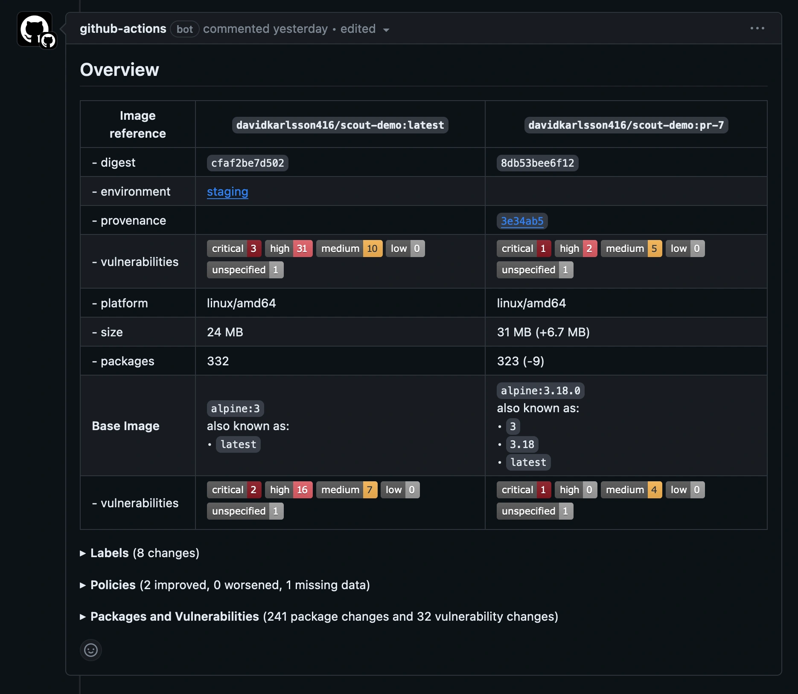
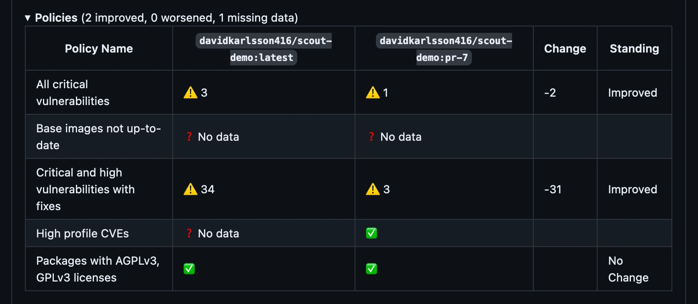

下面的示例展示了如何设置与 GitHub Actions 配合的 Docker Scout 工作流。当有 Pull Request 时，该 Action 会构建镜像，并使用 Docker Scout 将新版本与生产环境中运行的版本进行对比。

该工作流使用 [docker/scout-action](https://github.com/docker/scout-action) GitHub Action 来执行 `docker scout compare` 命令，可视化展示 PR 中的镜像与生产环境镜像的对比情况。

## 先决条件

- 本示例假设您已有一个现有的镜像仓库（在 Docker Hub 或其他仓库中），并已启用 Docker Scout。
- 本示例使用[环境](../environment/_index.md)功能，将 PR 中构建的镜像与名为 `production` 环境中的同一镜像的不同版本进行对比。

## 步骤

首先，设置 GitHub Action 工作流来构建镜像。这部分与 Docker Scout 无关，但您需要构建一个镜像才能进行对比。

在 GitHub Actions YAML 文件中添加以下内容：

```yaml
name: Docker

on:
  push:
    tags: ["*"]
    branches:
      - "main"
  pull_request:
    branches: ["**"]

env:
  # Hostname of your registry
  REGISTRY: docker.io
  # Image repository, without hostname and tag
  IMAGE_NAME: ${{ github.repository }}
  SHA: ${{ github.event.pull_request.head.sha || github.event.after }}

jobs:
  build:
    runs-on: ubuntu-latest
    permissions:
      pull-requests: write

    steps:
      # Authenticate to the container registry
      - name: Authenticate to registry ${{ env.REGISTRY }}
        uses: docker/login-action@v3
        with:
          registry: ${{ env.REGISTRY }}
          username: ${{ secrets.REGISTRY_USER }}
          password: ${{ secrets.REGISTRY_TOKEN }}
      
      - name: Setup Docker buildx
        uses: docker/setup-buildx-action@v3

      # Extract metadata (tags, labels) for Docker
      - name: Extract Docker metadata
        id: meta
        uses: docker/metadata-action@v5
        with:
          images: ${{ env.REGISTRY }}/${{ env.IMAGE_NAME }}
          labels: |
            org.opencontainers.image.revision=${{ env.SHA }}
          tags: |
            type=edge,branch=$repo.default_branch
            type=semver,pattern=v{{version}}
            type=sha,prefix=,suffix=,format=short

      # Build and push Docker image with Buildx
      # (don't push on PR, load instead)
      - name: Build and push Docker image
        id: build-and-push
        uses: docker/build-push-action@v6
        with:
          sbom: ${{ github.event_name != 'pull_request' }}
          provenance: ${{ github.event_name != 'pull_request' }}
          push: ${{ github.event_name != 'pull_request' }}
          load: ${{ github.event_name == 'pull_request' }}
          tags: ${{ steps.meta.outputs.tags }}
          labels: ${{ steps.meta.outputs.labels }}
          cache-from: type=gha
          cache-to: type=gha,mode=max
```

上述配置创建了以下工作流步骤：

1. 设置 Docker buildx。
2. 向仓库进行身份验证。
3. 从 Git 引用与 GitHub 事件中提取元数据。
4. 构建并将 Docker 镜像推送到仓库。

> [!NOTE]
>
> 该 CI 工作流会对您的镜像执行本地分析与评估。要在本地评估镜像，必须确保镜像已加载到运行器的本地镜像存储中。
>
> 如果您将镜像推送到仓库，或构建无法加载到运行器本地镜像存储的镜像（例如多平台镜像或包含 SBOM/溯源声明的镜像），则此对比功能将无法工作。

完成上述设置后，您可以添加以下步骤来执行镜像对比：

```yaml
      # You can skip this step if Docker Hub is your registry
      # and you already authenticated before
      - name: Authenticate to Docker
        uses: docker/login-action@v3
        with:
          username: ${{ secrets.DOCKER_USER }}
          password: ${{ secrets.DOCKER_PAT }}

      # Compare the image built in the pull request with the one in production
      - name: Docker Scout
        id: docker-scout
        if: ${{ github.event_name == 'pull_request' }}
        uses: docker/scout-action@v1
        with:
          command: compare
          image: ${{ steps.meta.outputs.tags }}
          to-env: production
          ignore-unchanged: true
          only-severities: critical,high
          github-token: ${{ secrets.GITHUB_TOKEN }}
```

compare 命令会分析镜像并评估策略合规性，然后将结果与 `production` 环境中的对应镜像进行交叉引用。本示例仅包含严重（critical）与高危（high）漏洞，并排除两个镜像中都存在的漏洞，仅显示变化的部分。

GitHub Action 默认会在 Pull Request 评论中输出对比结果。



展开 **Policies** 部分可查看两个镜像在策略合规性方面的差异。注意，虽然本示例中的新镜像并非完全合规，但输出显示新镜像的状况相比基线已有所改善。


