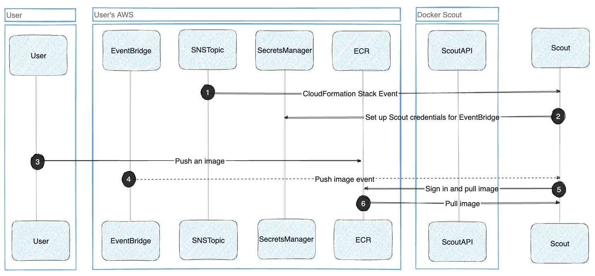

将 Docker Scout 与 Amazon Elastic Container Registry（ECR）集成后，您可以查看托管在 ECR 仓库中的镜像洞察。完成集成并在指定仓库启用 Docker Scout 后，向该仓库推送镜像会自动触发镜像分析。您可以在 Docker Scout 控制台或通过 `docker scout` CLI 查看分析结果。

## 工作原理

为便于将 Docker Scout 集成到 ECR，您可以使用 CloudFormation Stack 模板，在 AWS 中自动创建并配置集成所需的资源。关于这些 AWS 资源的更多详情，参见[CloudFormation 堆栈模板](#cloudformation-stack-template)。

下图展示了 Docker Scout 与 ECR 集成的工作方式。

集成完成后，Docker Scout 会自动拉取并分析您推送到 ECR 的镜像。镜像相关的元数据会存储在 Docker Scout 平台上，但 Docker Scout 不会存储镜像本体。关于镜像数据的处理方式，参见：[数据处理](/manuals/scout/deep-dive/data-handling.md)。

### CloudFormation 堆栈模板

下表描述了需要配置的资源：

> [!NOTE]
>
> 在 AWS 账户中创建这些资源会产生少量的持续费用。表格中的 **Cost** 列给出了当 ECR 每日有 100 个镜像推送时的月度费用估算。
>
> 此外，当 Docker Scout 从 ECR 拉取镜像时还会产生出口（egress）费用，约为 $0.09/GB。

| Resource type                 | Resource name                 | Description                                                                                | Cost  |
| ----------------------------- | ----------------------------- | ------------------------------------------------------------------------------------------ | ----- |
| `AWS::SNSTopic::Topic`        | `SNSTopic`                    | 当 AWS 资源创建完成时，用于通知 Docker Scout 的 SNS 主题。                                 | Free  |
| `AWS::SNS::TopicPolicy`       | `TopicPolicy`                 | 初始设置通知所使用的主题策略。                                                              | Free  |
| `AWS::SecretsManager::Secret` | `ScoutAPICredentials`         | 存储 EventBridge 触发事件到 Scout 所用的凭据。                                             | $0.42 |
| `AWS::Events::ApiDestination` | `ApiDestination`              | 建立到 Docker Scout 的 EventBridge 连接，用于发送 ECR 推送与删除事件。                     | $0.01 |
| `AWS::Events::Connection`     | `Connection`                  | EventBridge 到 Scout 的连接凭据。                                                           | Free  |
| `AWS::Events::Rule`           | `DockerScoutEcrRule`          | 将 ECR 推送与删除事件发送到 Scout 的规则。                                                  | Free  |
| `AWS::Events::Rule`           | `DockerScoutRepoDeletedRule`  | 将 ECR 仓库删除事件发送到 Scout 的规则。                                                    | Free  |
| `AWS::IAM::Role`              | `InvokeApiRole`               | 允许事件访问 `ApiDestination` 的内部角色。                                                  | Free  |
| `AWS::IAM::Role`              | `AssumeRoleEcrAccess`         | 拥有 `ScoutAPICredentials` 访问权限，用于完成 Docker Scout 集成的角色。                     | Free  |

## 集成首个仓库

在您的 AWS 账号中创建 CloudFormation 堆栈以启用 Docker Scout 集成。

前提条件：

- 您拥有可创建资源的 AWS 账户访问权限。
- 您是 Docker 组织的所有者。

创建堆栈步骤：

1. 打开 Docker Scout 控制台中的 [ECR 集成页面](https://scout.docker.com/settings/integrations/ecr/)。
2. 选择 **Create on AWS** 按钮。

   这会在新标签页中打开 AWS CloudFormation 控制台的 **Create stack** 向导。如果尚未登录 AWS，会先跳转到登录页面。

   如果按钮呈灰色，说明您在该 Docker 组织中缺少所需权限。

3. 按 **Create stack** 向导完成全部步骤，选择要集成的 AWS 区域，并创建资源。

   向导中的字段由 CloudFormation 模板预填，一般无需修改。

4. 当资源创建完成（AWS 控制台中 CloudFormation 状态显示为 `CREATE_COMPLETE`）后，返回 Docker Scout 控制台的 ECR 集成页面。

   在 **Integrated registries** 列表中，您将看到刚集成的 ECR 仓库对应的账号 ID 与区域；若成功，状态为 **Connected**。

至此，ECR 集成已启用。要让 Docker Scout 开始分析该仓库中的镜像，需在[仓库设置](https://scout.docker.com/settings/repos/)中对每个仓库启用分析。

启用后，您推送的镜像会被 Docker Scout 分析，结果显示在控制台。如果仓库已存在镜像，Docker Scout 会自动拉取并分析最新版本。

## 集成更多仓库

添加更多仓库：

1. 打开 [ECR 集成页面](https://scout.docker.com/settings/integrations/ecr/)。
2. 点击列表顶部的 **Add** 按钮。
3. 按步骤创建所需的 AWS 资源。
4. 资源创建完成后，返回 Docker Scout 控制台的 ECR 集成页面。

   在 **Integrated registries** 列表中会显示新集成的 ECR 仓库的账号 ID 与区域；若成功，状态为 **Connected**。

接下来，请在[仓库设置](https://scout.docker.com/settings/repos/)中为需要分析的仓库启用 Docker Scout。

## 移除集成

要移除已集成的 ECR 仓库，您必须是 Docker 组织的所有者。

1. 前往 Docker Scout 控制台的 [ECR 集成页面](https://scout.docker.com/settings/integrations/ecr/)。
2. 在已集成列表中找到目标仓库，在 **Actions** 列点击移除图标。

   若移除图标不可用，说明您在该 Docker 组织中缺少所需权限。

3. 在弹出的对话框中选择 **Remove** 确认。

> [!IMPORTANT]
>
> 从 Docker Scout 控制台移除集成并不会删除您账户中的 AWS 资源。
>
> 从 Docker Scout 中移除后，请到 AWS 控制台删除对应集成的 **DockerScoutECRIntegration** CloudFormation 堆栈。

## 故障排查

### 无法完成仓库集成

请在 Docker Scout 控制台的 [ECR 集成页面](https://scout.docker.com/settings/integrations/ecr/) 查看 **Status**：

- 如果状态长时间为 **Pending**，通常意味着 AWS 侧的集成尚未完成。点击 **Pending** 链接重新打开 CloudFormation 向导并完成所有步骤。

- 如果状态为 **Error**，表示后端发生错误。可尝试[移除集成](#remove-integration)后重新创建。

### 控制台未显示 ECR 镜像分析结果

如果 ECR 镜像的分析结果未在 Docker Scout 控制台显示：

- 确认已在目标仓库启用 Docker Scout。可在[仓库设置](https://scout.docker.com/settings/repos/)查看与管理已启用的仓库。

- 确认 ECR 集成页已列出目标仓库的 AWS 账号 ID 与区域。

  账号 ID 与区域包含在仓库主机名中：
  `<aws_account_id>.dkr.ecr.<region>.amazonaws.com/<image>`
