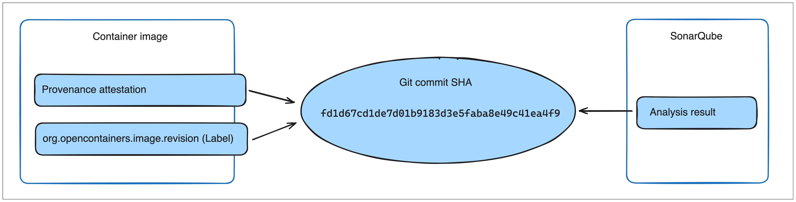

在软件供应链管理中，维持制品的安全性与可靠性是首要任务。Docker Scout 的策略评估在现有分析能力之上，引入了一层可控机制。它允许你为制品定义供应链规则，并帮助你持续跟踪制品相对这些规则与阈值的表现。

了解如何使用策略评估，确保你的制品与既定最佳实践保持一致。

## 策略评估的工作方式

当你为某个仓库启用 Docker Scout 后，推送的镜像会被[自动分析](/manuals/scout/explore/analysis.md)。
分析结果可帮助你了解镜像的组成，包括包含哪些软件包、暴露于哪些漏洞。策略评估基于镜像分析之上，将分析结果与策略中定义的规则进行比对与解读。

策略用于定义你的制品应满足的镜像质量准则。
例如，**No AGPL v3 licenses** 策略会标记任何包含以 AGPL v3 许可证分发的软件包的镜像；
若镜像包含此类软件包，则视为不符合该策略。
部分策略（如 **No AGPL v3 licenses**）是可配置的，你可以根据组织需要调整判定标准。

在 Docker Scout 中，策略旨在帮助你持续提升安全与供应链能力。不同于只给出“通过/未通过”的工具，Docker Scout 的策略会可视化展示细小的、渐进式的改进如何影响策略状态——即使你的制品暂时尚未满足策略要求。通过跟踪“不合规差距”随时间的变化，你可以更直观地判断制品相对于策略是在改进还是退步。

策略不一定只与应用安全或漏洞相关。你也可以用策略来度量与跟踪供应链管理的其他方面，例如开源许可证的使用情况、基础镜像是否最新等。

## 策略类型

在 Docker Scout 中，策略由“策略类型（policy type）”派生而来。策略类型是定义策略核心参数的模板。
你可以将策略类型类比为面向对象编程中的“类”，每个策略则是由相应策略类型实例化得到的“对象”。

Docker Scout 支持以下策略类型：

- [基于严重性的漏洞](#severity-based-vulnerability)
- [合规许可证](#compliant-licenses)
- [最新的基础镜像](#up-to-date-base-images)
- [高关注漏洞](#high-profile-vulnerabilities)
- [供应链证明（Attestations）](#supply-chain-attestations)
- [默认非 root 用户](#default-non-root-user)
- [已批准的基础镜像](#approved-base-images)
- [SonarQube 质量阈值](#sonarqube-quality-gates)

在启用 Docker Scout 的仓库中，系统会自动提供默认策略。
例外是 SonarQube 质量阈值策略，它需要先[集成 SonarQube](/manuals/scout/integrations/code-quality/sonarqube.md) 才能使用。

你可以基于上述任一策略类型创建自定义策略；若默认策略不适用于你的项目，也可将其删除。详见[配置策略](./configure.md)。

<!-- vale Docker.HeadingSentenceCase = NO -->

### 基于严重性的漏洞 {#severity-based-vulnerability}

“Severity-Based Vulnerability” 策略类型用于检查你的制品是否暴露于已知漏洞。

默认情况下，该策略仅针对“已存在可修复版本”的严重（Critical）与高危（High）漏洞进行标记。
这意味着对于不满足该策略的镜像，通常可以通过升级受影响的软件包到包含修复的版本来快速修复。

若镜像包含一个或多个不满足该策略条件的漏洞，则视为不合规。

你可以通过创建自定义版本来配置该策略的参数。可配置项包括：

- **Age**：漏洞首次披露至今的最小天数

  之所以设置“最小天数”，是为了避免新近披露的漏洞在你尚未有时间处理之前就导致评估失败。

<!-- vale Vale.Spelling = NO -->
- **Severities**：纳入考虑的严重性级别（默认：`Critical, High`）
<!-- vale Vale.Spelling = YES -->

- **Fixable vulnerabilities only**：是否仅报告存在可修复版本的漏洞（默认启用）。

- **Package types**：纳入考虑的软件包类型列表。

  该选项允许你按[PURL 包类型定义](https://github.com/package-url/purl-spec/blob/master/PURL-TYPES.rst) 指定需要纳入策略评估的软件包类型。默认情况下，会考虑所有类型。

关于策略配置的更多信息，参见[配置策略](./configure.md)。

### 合规许可证 {#compliant-licenses}

“Compliant Licenses” 策略类型用于检查你的镜像是否包含以不合适许可分发的软件包。
若镜像包含一个或多个此类软件包，则视为不合规。

你可以配置该策略需要关注的许可证列表，并通过指定允许清单（以 PURL 形式）来添加例外。详见[配置策略](./configure.md)。

### 最新的基础镜像 {#up-to-date-base-images}

“Up-to-Date Base Images” 策略类型用于检查你使用的基础镜像是否为最新。

如果用于构建镜像的标签（tag）指向的摘要（digest）与当前使用的不一致，则判定为不合规。这表明你使用的基础镜像已过期。

要成功执行该策略评估，你的镜像需要包含溯源证明（provenance attestation）。更多信息参见[No base image data](#no-base-image-data)。

### 高关注漏洞 {#high-profile-vulnerabilities}

“High-Profile Vulnerabilities” 策略类型用于检查你的镜像是否包含 Docker Scout 精选列表中的漏洞。该列表持续更新，涵盖被广泛认为具有较高风险的新披露漏洞。

该列表包括以下漏洞：

- [CVE-2014-0160 (OpenSSL Heartbleed)](https://scout.docker.com/v/CVE-2014-0160)
- [CVE-2021-44228 (Log4Shell)](https://scout.docker.com/v/CVE-2021-44228)
- [CVE-2023-38545 (cURL SOCKS5 heap buffer overflow)](https://scout.docker.com/v/CVE-2023-38545)
- [CVE-2023-44487 (HTTP/2 Rapid Reset)](https://scout.docker.com/v/CVE-2023-44487)
- [CVE-2024-3094 (XZ backdoor)](https://scout.docker.com/v/CVE-2024-3094)
- [CVE-2024-47176 (OpenPrinting - `cups-browsed`)](https://scout.docker.com/v/CVE-2024-47176)
- [CVE-2024-47076 (OpenPrinting - `libcupsfilters`)](https://scout.docker.com/v/CVE-2024-47076)
- [CVE-2024-47175 (OpenPrinting - `libppd`)](https://scout.docker.com/v/CVE-2024-47175)
- [CVE-2024-47177 (OpenPrinting - `cups-filters`)](https://scout.docker.com/v/CVE-2024-47177)

你可以通过配置来自定义哪些 CVE 被视为“高关注”。可配置项包括：

- **Excluded CVEs**：指定希望该策略忽略的 CVE。

  默认：`[]`（不忽略任何高关注 CVE）

- **CISA KEV**：启用对 CISA“已知被利用漏洞（KEV）”目录的跟踪。

  [CISA KEV 目录](https://www.cisa.gov/known-exploited-vulnerabilities-catalog) 包含正在被实际利用的漏洞。
  启用后，若镜像包含该目录中的漏洞，策略会进行标记。

  默认启用。

关于策略配置的更多信息，参见[配置策略](./configure.md)。

### 供应链证明（Attestations） {#supply-chain-attestations}

“Supply Chain Attestations” 策略类型用于检查你的镜像是否具备
[SBOM](/manuals/build/metadata/attestations/sbom.md) 与
[provenance](/manuals/build/metadata/attestations/slsa-provenance.md) 证明。

若缺少 SBOM 证明或缺少带有“max 模式”溯源的 provenance 证明，则视为不合规。
为确保合规，请在构建时附加这些证明：

```console
$ docker buildx build --provenance=true --sbom=true -t <IMAGE> --push .
```

关于在构建时附加证明的更多信息，参见[Attestations](/manuals/build/metadata/attestations/_index.md)。

如果你使用 GitHub Actions 构建并推送镜像，请参阅如何[配置该 Action](/manuals/build/ci/github-actions/attestations.md) 以附加 SBOM 与 provenance 证明。

### 默认非 root 用户 {#default-non-root-user}

默认情况下，容器以内置的超级用户 `root` 运行，拥有容器内的全部系统管理权限，除非 Dockerfile 指定了不同的默认用户。
以特权用户运行容器会削弱其运行时安全，因为容器内运行的任意代码都能执行管理操作。

“Default Non-Root User” 策略类型用于检测被设置为默认以 `root` 运行的镜像。
要满足该策略，镜像必须在镜像配置中指定非 root 用户；若在运行阶段未指定非 root 默认用户，则视为不合规。

对于不合规镜像，评估结果会显示该镜像是否显式设置了 `root` 用户。这有助于区分“隐式为 root”与“明确设置为 root”导致的策略违规。

以下 Dockerfile 虽未显式设置，但默认以 `root` 运行：

```Dockerfile
FROM alpine
RUN echo "Hi"
```

而在下面这个示例中，显式设置了 `root` 用户：

```Dockerfile
FROM alpine
USER root
RUN echo "Hi"
```

> [!NOTE]
>
> 该策略仅检查镜像配置中设置的“默认用户”。即便你确实指定了非 root 默认用户，也仍可在运行时覆盖默认用户，例如通过 `docker run` 命令的 `--user` 参数。

要满足该策略，请在 Dockerfile 中使用 [`USER`](/reference/dockerfile.md#user) 指令为运行阶段设置一个非 root 的默认用户。

以下 Dockerfile 片段展示了合规与不合规的差异：




```dockerfile
FROM alpine AS builder
COPY Makefile ./src /
RUN make build

FROM alpine AS runtime
COPY --from=builder bin/production /app
ENTRYPOINT ["/app/production"]
```




```dockerfile {hl_lines=7}
FROM alpine AS builder
COPY Makefile ./src /
RUN make build

FROM alpine AS runtime
COPY --from=builder bin/production /app
USER nonroot
ENTRYPOINT ["/app/production"]
```




### 已批准的基础镜像 {#approved-base-images}

“Approved Base Images” 策略类型确保你在构建中使用的基础镜像处于维护状态且是安全的。

该策略会检查你构建所用的基础镜像是否匹配策略配置中指定的任一模式。下表给出了一些示例：

| 使用场景                                                         | 模式（Pattern）                  |
| ---------------------------------------------------------------- | -------------------------------- |
| 允许来自 Docker Hub 的所有镜像                                   | `docker.io/*`                    |
| 允许所有 Docker 官方镜像                                         | `docker.io/library/*`            |
| 允许来自特定组织的镜像                                           | `docker.io/orgname/*`            |
| 允许特定仓库的所有标签                                           | `docker.io/orgname/repository:*` |
| 允许主机名为 `registry.example.com` 的仓库中的镜像               | `registry.example.com/*`         |
| 允许 NodeJS 镜像的 slim 标签                                     | `docker.io/library/node:*-slim`  |

星号（`*`）会匹配直到其后紧随的字符，或匹配至镜像引用末尾。注意：要匹配 Docker Hub 镜像，必须包含 `docker.io` 前缀——这是 Docker Hub 的仓库主机名。

该策略可通过以下选项进行配置：

- **Approved base image sources**

  指定你希望允许的镜像引用模式。策略会依据这些模式对基础镜像引用进行校验。

  默认：`[*]`（允许任意引用作为基础镜像）

- **Only supported tags**

  当使用 Docker 官方镜像时，仅允许受支持的标签（tag）。

  启用该选项后，若基础镜像使用了官方镜像的不受支持标签，则会触发策略违规。官方镜像的受支持标签可在 Docker Hub 仓库概览的 **Supported tags** 部分查看。

  默认启用。

- **Only supported OS distributions**

  仅允许受支持的 Linux 发行版版本的 Docker 官方镜像。

  启用该选项后，若基础镜像使用了已停止维护的 Linux 发行版（如 `ubuntu:18.04`），则会触发策略违规。

  如果无法确定操作系统版本，启用该选项可能导致策略报告“无数据”。

  默认启用。

要成功执行该策略评估，你的镜像需要包含溯源证明（provenance attestation）。更多信息参见[No base image data](#no-base-image-data)。

### SonarQube 质量阈值 {#sonarqube-quality-gates}

“SonarQube Quality Gates” 策略类型基于[SonarQube 集成](../integrations/code-quality/sonarqube.md) 来评估源代码质量。
该策略通过将 SonarQube 的代码分析结果导入 Docker Scout 来工作。

你可以使用 SonarQube 的[质量阈值（quality gates）](https://docs.sonarsource.com/sonarqube/latest/user-guide/quality-gates/) 定义该策略的判定标准。
SonarQube 会依据你设定的质量阈值评估源代码，Docker Scout 则将该评估结果以策略的形式呈现。

Docker Scout 使用[溯源证明](/manuals/build/metadata/attestations/slsa-provenance.md) 或 `org.opencontainers.image.revision` OCI 注解，将 SonarQube 分析结果与容器镜像关联。
除了启用 SonarQube 集成外，还需确保镜像包含该证明或标签。



当你推送镜像并完成策略评估后，SonarQube 质量阈值的评估结果将作为一条策略显示在 Docker Scout 控制台与 CLI 中。

> [!NOTE]
>
> Docker Scout 只能访问集成启用后生成的 SonarQube 分析结果，无法访问历史评估。
> 启用集成后请触发一次 SonarQube 分析与策略评估，以在 Docker Scout 中查看结果。

## 无基础镜像数据 {#no-base-image-data}

在某些情况下，无法确定你构建所用基础镜像的信息。此时，**Up-to-Date Base Images** 与 **Approved Base Images** 策略会被标记为 **No data**。

出现“无数据”状态的常见原因包括：

- Docker Scout 无法获知你使用的基础镜像标签（tag）
- 你使用的基础镜像版本对应多个标签，但并非所有标签都已过期

为确保 Docker Scout 始终能识别你的基础镜像，你可以在构建时附加[溯源证明](/manuals/build/metadata/attestations/slsa-provenance.md)。
Docker Scout 会通过溯源证明来确定基础镜像版本。
