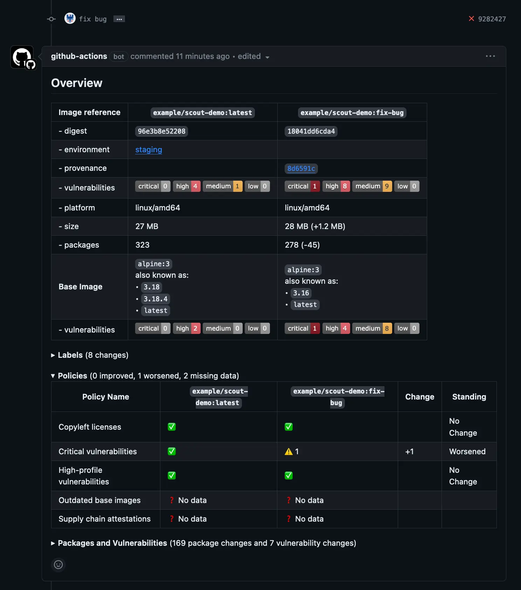

在持续集成（CI）流水线中加入策略评估（Policy Evaluation），
可帮助你及时发现并阻止代码变更导致的策略合规性相较基线变差的情况。

在 CI 场景下，推荐的策略评估方式是：对本地镜像执行评估，并与基线结果进行比较。
如果本地镜像的策略合规性劣于指定的基线，则使本次 CI 失败；
若更好或保持不变，则本次 CI 通过。

这种比较是相对的，即只关注 CI 镜像相对于基线是更好还是更差，
并非对所有策略做绝对的通过/失败判断。
通过以你定义的基线为参照，可以快速判断一次变更对策略合规性的正负影响。

## 工作原理

在 CI 中进行策略评估时，你会对在流水线中构建的镜像执行本地评估。
要进行本地评估，被评估的镜像必须存在于运行该 CI 工作流的镜像存储中。
你可以在流水线中构建或拉取该镜像，随后执行评估。

若要在策略评估中，当本地镜像较基线变差时触发失败，你需要指定用作“基线”的镜像版本。
你可以硬编码某个镜像引用，但更推荐使用[环境](../integrations/environment/_index.md)
从环境中自动推断镜像版本。下面的示例使用环境，将 CI 产出的镜像与 `production` 环境中的镜像进行比较。

## 示例

下面示例演示如何在 CI 中运行策略评估，使用的是 [Docker Scout GitHub Action](https://github.com/marketplace/actions/docker-scout)，
对 CI 中构建的镜像执行 `compare` 命令。该命令的 `to-env` 入参指定对比的环境为 `production`；
`exit-on` 设为 `policy`，表示仅当策略合规性变差时才使比较失败。

该示例不假定你使用 Docker Hub 作为容器仓库，因此工作流中使用了两次 `docker/login-action`：

- 一次用于登录你的容器仓库。
- 另一次用于登录 Docker，以拉取 `production` 镜像的分析结果。

如果你使用 Docker Hub 作为容器仓库，只需登录一次。

> [!NOTE]
>
> 由于 Docker 引擎的限制，当前不支持将多平台镜像或附带证明（attestations）的镜像加载到镜像存储。
>
> 为使策略评估正常运行，你必须将镜像加载到运行器（runner）的本地镜像存储。
> 确保构建的是不带证明的单平台镜像，并且加载了构建结果，否则策略评估会失败。

另请注意该任务需要 `pull-requests: write` 权限。
Docker Scout GitHub Action 默认会在拉取请求中添加包含评估结果的评论，
这需要上述权限。详情参见
[Pull Request Comments](https://github.com/docker/scout-action#pull-request-comments)。

```yaml
name: Docker

on:
  push:
    tags: ["*"]
    branches:
      - "main"
  pull_request:
    branches: ["**"]

env:
  REGISTRY: docker.io
  IMAGE_NAME: <IMAGE_NAME>
  DOCKER_ORG: <ORG>

jobs:
  build:
    permissions:
      pull-requests: write

    runs-on: ubuntu-latest
    steps:
      - name: Log into registry ${{ env.REGISTRY }}
        uses: docker/login-action@v3
        with:
          registry: ${{ env.REGISTRY }}
          username: ${{ secrets.REGISTRY_USER }}
          password: ${{ secrets.REGISTRY_TOKEN }}
      
      - name: Setup Docker buildx
        uses: docker/setup-buildx-action@v3

      - name: Extract metadata
        id: meta
        uses: docker/metadata-action@v5
        with:
          images: ${{ env.IMAGE_NAME }}

      - name: Build image
        id: build-and-push
        uses: docker/build-push-action@v4
        with:
          tags: ${{ steps.meta.outputs.tags }}
          labels: ${{ steps.meta.outputs.labels }}
          sbom: ${{ github.event_name != 'pull_request' }}
          provenance: ${{ github.event_name != 'pull_request' }}
          push: ${{ github.event_name != 'pull_request' }}
          load: ${{ github.event_name == 'pull_request' }}

      - name: Authenticate with Docker
        uses: docker/login-action@v3
        with:
          username: ${{ secrets.DOCKER_USER }}
          password: ${{ secrets.DOCKER_PAT }}

      - name: Compare
        if: ${{ github.event_name == 'pull_request' }}
        uses: docker/scout-action@v1
        with:
          command: compare
          image: ${{ steps.meta.outputs.tags }}
          to-env: production
          platform: "linux/amd64"
          ignore-unchanged: true
          only-severities: critical,high
          organization: ${{ env.DOCKER_ORG }}
          exit-on: policy
```

下图展示了当 PR 镜像相较基线导致策略评估检查失败时，GitHub PR 评论的效果：



以上示例展示了如何结合 GitHub Actions 在 CI 中执行策略评估。
Docker Scout 也支持其他 CI 平台。更多信息参见
[Docker Scout CI 集成](../integrations/_index.md#continuous-integration)。
