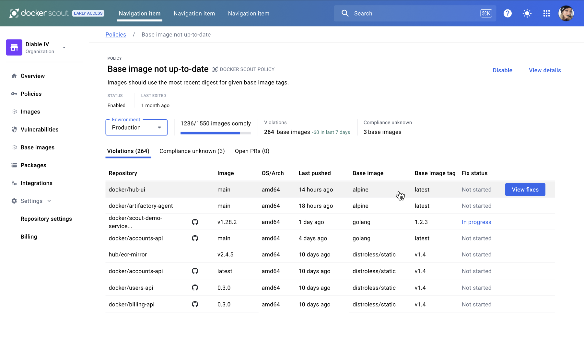



Docker Scout 会基于策略评估结果提供修复建议，帮助你处理供应链或安全问题。
这些建议是你可以采取的行动，用于提升策略合规性，或为镜像补充元数据，以便 Docker Scout
提供更准确的评估结果与建议。

Docker Scout 针对以下策略类型的默认策略提供修复建议：

- [最新的基础镜像](#up-to-date-base-images-remediation)
- [供应链证明（Attestations）](#supply-chain-attestations-remediation)

<!-- TODO(dvdksn): verify the following -->
> [!NOTE]
> 自定义策略目前不支持“引导式修复”。

对于违反策略的镜像，修复建议将聚焦于解决合规性问题并修复违规项。
对于 Docker Scout 无法判定合规性的镜像，修复建议会指引你满足必要的前置条件，
以确保 Docker Scout 能成功完成该策略的评估。

## 查看修复建议

修复建议显示在 Docker Scout Dashboard 的策略详情页中。前往方式：

1. 打开 Docker Scout Dashboard 的 [Policies 页面](https://scout.docker.com/reports/policy)。
2. 在列表中选择一条策略。

策略详情页会根据策略状态，将评估结果分为两个页签：

- Violations（违规）
- Compliance unknown（合规性未知）

**Violations** 页签列出不符合所选策略的镜像。
**Compliance unknown** 页签列出 Docker Scout 无法判定合规状态的镜像。
当合规性未知时，Docker Scout 需要更多关于该镜像的信息。

要查看某个镜像的推荐修复措施，将鼠标悬停在列表中的镜像上，即可看到 **View fixes** 按钮。

点击 **View fixes** 按钮，会打开修复侧边面板，显示针对该镜像的推荐操作。

若存在多个建议，主要建议会显示为 **Recommended fix**；其他建议会显示为 **Quick fixes**，
通常是临时性的解决方案。

侧边面板中还可能包含与可用建议相关的帮助信息。

## “最新的基础镜像”策略的修复建议 {#up-to-date-base-images-remediation}

“Up-to-Date Base Images” 策略用于检查你使用的基础镜像是否为最新。
修复侧边面板中显示的推荐操作取决于 Docker Scout 掌握的镜像信息。可用信息越多，建议越准确。

下面列举了根据镜像可用信息的不同，可能出现的不同建议：

### 没有溯源证明（provenance attestations）

要让 Docker Scout 能评估该策略，你必须为镜像添加[溯源证明](/manuals/build/metadata/attestations/slsa-provenance.md)。
如果镜像缺少溯源证明，将无法判定其合规性。

<!--
  TODO(dvdksn): no support for the following, yet

  When provenance attestations are unavailable, Docker Scout provides generic,
  best-effort recommendations in the remediation side panel. These
  recommendations estimate your base using information from image analysis
  results. The base image version is unknown, but you can manually select the
  version you use in the remediation side panel. This lets Docker Scout evaluate
  whether the base image detected in the image analysis is up-to-date with the
  version you selected.

  https://github.com/docker/docs/pull/18961#discussion_r1447186845
-->

### 已提供溯源证明

添加溯源证明后，Docker Scout 能准确识别你所使用的基础镜像版本。
系统会将证明中的版本与相应标签的当前版本进行比对，以判断其是否为最新。

若检测到策略违规，建议会指导你将基础镜像更新至最新版本，并将基础镜像版本固定到特定摘要（digest）。
详见[固定基础镜像版本](/manuals/build/building/best-practices.md#pin-base-image-versions)。

### 已启用 GitHub 集成

如果你的镜像源码托管在 GitHub，可启用[GitHub 集成](../integrations/source-code-management/github.md)。
启用后，Docker Scout 能提供更有针对性的修复建议，并允许你直接在 Dashboard 发起修复。

启用 GitHub 集成后，你可以在修复侧边面板中直接对该镜像的 GitHub 仓库发起 PR，
自动将 Dockerfile 中的基础镜像更新为最新版本。

该自动化修复会将你的基础镜像固定到特定摘要（digest），同时帮助你在有新版本发布时保持最新。
将基础镜像固定到摘要有助于复现构建，并避免不期望的变更进入供应链。

关于固定基础镜像的更多信息，参见[固定基础镜像版本](/manuals/build/building/best-practices.md#pin-base-image-versions)。

<!--
  TODO(dvdksn): no support for the following, yet

  Enabling the GitHub integration also allows Docker Scout to visualize the
  remediation workflow in the Docker Scout Dashboard. Each step, from the pull
  request being raised to the image being deployed to an environment, is
  displayed in the remediation sidebar when inspecting the image.

  https://github.com/docker/docs/pull/18961#discussion_r1447189475
-->

## “供应链证明（Attestations）”策略的修复建议 {#supply-chain-attestations-remediation}

默认的 **Supply Chain Attestations** 策略要求镜像同时具备完整的溯源与 SBOM 证明。
如果缺少任一证明，或证明信息不足，则会触发策略违规。

修复侧边面板中的建议会指引你采取相应措施。例如，若镜像包含溯源证明但信息不足，
建议以 [`mode=max`](/manuals/build/metadata/attestations/slsa-provenance.md#max) 重新构建镜像。
