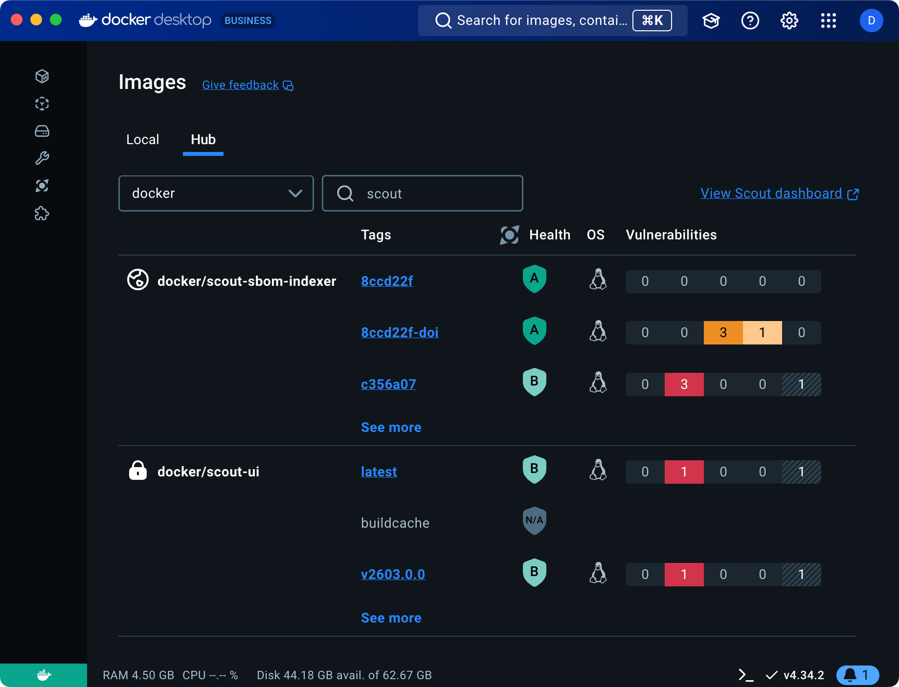



Docker Scout 健康分数为 Docker Hub 上的镜像提供安全评估与整体供应链健康状况，
帮助你判断镜像是否符合既定的安全最佳实践。评分范围为 A–F：A 代表最高安全等级，F 代表最低，
便于快速总览镜像的安全态势。

仅当用户属于该仓库所属组织，并至少拥有该仓库的“读取”权限时，才可查看健康分数。
组织外部用户或没有读取权限的成员无法看到该分数。

## 查看健康分数




在 Docker Hub 中查看镜像的健康分数：

1. Go to Docker Hub and sign in.
2. Navigate to your organization's page.

在仓库列表中，可基于最新推送的标签查看各仓库对应的健康分数。





在 Docker Desktop 中查看镜像的健康分数：

1. Open Docker Desktop and sign in to your Docker account.
2. Navigate to the **Images** view and select the **Hub** tab.

在仓库列表中，**Health** 列显示推送至 Docker Hub 的不同标签对应的分数。






健康分数徽章通过颜色指示仓库的总体健康状况：

- **绿色**：A 或 B。
- **黄色**：C。
- **橙色**：D。
- **红色**：E 或 F。
- **灰色**：`N/A`。

在某个仓库的 Docker Hub 页面，也会展示该分数以及对分数有贡献的各项策略。


## 评分体系

健康分数通过将镜像与 Docker Scout 的[策略](./_index.md)进行评估而得出。
这些策略与软件供应链的最佳实践保持一致。

如果你的镜像仓库已接入 Docker Scout，系统会基于组织当前启用的策略自动计算健康分数，
其中也包括你配置的自定义策略。

若尚未使用 Docker Scout，健康分数将基于默认策略来评估镜像的合规性。
默认策略是一组由 Docker 推荐的、面向镜像的基础供应链规则。
你可以为组织启用 Docker Scout，并编辑策略配置，使健康分数更加贴合你的实际策略。

### 评分流程

每种策略会依据其[类型](/manuals/scout/policy/_index.md#policy-types)被分配一个分值。
若镜像满足该策略，即可获得该策略类型对应的分数。镜像的健康分数根据“实际获得分数占总分的百分比”计算。

1. 评估镜像的各项策略合规性。
2. 按满足的策略累计分数。
3. 计算得分百分比：

   ```text
   Percentage = (Points / Total) * 100
   ```

4. 根据所得百分比映射为最终等级，规则如下表所示：

   | 分数占比（实际获得/总分） | 等级 |
   | ---------------------- | ---- |
   | > 90%                  | A    |
   | 71%–90%                | B    |
   | 51%–70%                | C    |
   | 31%–50%                | D    |
   | 11%–30%                | E    |
   | < 10%                  | F    |

### N/A 分数

镜像也可能被评为 `N/A`，常见原因包括：

- 镜像压缩体积大于 4GB。
- 镜像架构不是 `linux/amd64` 或 `linux/arm64`。
- 镜像过旧，缺乏用于评估的最新数据。

若出现 `N/A` 分数，可考虑：

- 若镜像过大，尝试缩小镜像体积。
- 若架构不受支持，请为受支持的架构重新构建。
- 若镜像过旧，请推送新标签以触发重新评估。

### 策略权重

不同策略类型具有不同权重，会影响评估时分配给镜像的分值，如下表所示。

| 策略类型                                                                                      | 分值 |
| -------------------------------------------------------------------------------------------- | ---- |
| [基于严重度的漏洞](/manuals/scout/policy/_index.md#severity-based-vulnerability)              | 20  |
| [高关注度漏洞](/manuals/scout/policy/_index.md#high-profile-vulnerabilities)                  | 20  |
| [供应链证明（Attestations）](/manuals/scout/policy/_index.md#supply-chain-attestations)       | 15  |
| [已批准的基础镜像](/manuals/scout/policy/_index.md#approved-base-images)                      | 15  |
| [基础镜像为最新](/manuals/scout/policy/_index.md#up-to-date-base-images)                      | 10  |
| [SonarQube 质量门](/manuals/scout/policy/_index.md#sonarqube-quality-gates) \*                | 10  |
| [默认非 root 用户](/manuals/scout/policy/_index.md#default-non-root-user)                     | 5   |
| [许可证合规](/manuals/scout/policy/_index.md#compliant-licenses)                              | 5   |

\* _该策略默认不启用，需要用户自行配置。_

### 评估时机

启用该功能后，健康分数会针对推送至 Docker Hub 的新镜像进行计算。
健康分数有助于你维持高标准的安全要求，并确保应用基于安全、可靠的镜像构建。

### 仓库分数

除按镜像（标签或摘要）计算的分数外，每个仓库还会基于最新推送的标签获得一个健康分数，
便于从整体上了解仓库的安全状态。

### 示例

假设某镜像的总分为 100 分：

- 若镜像仅在一条策略上偏离（该策略权重为 5 分），则得分为 95/100。由于超过 90%，该镜像将获得 A。
- 若镜像不满足更多策略，得分为 65/100，则获得 C，反映其较低的合规性。

## 提升健康分数

要提升镜像的健康分数，需要确保镜像符合 Docker Scout 推荐的[策略](./_index.md)。

1. 访问 [Docker Scout Dashboard](https://scout.docker.com/)。
2. 使用你的 Docker ID 登录。
3. 前往 [Repository settings](https://scout.docker.com/settings/repos)，
   为 Docker Hub 镜像仓库启用 Docker Scout。
4. 分析仓库的[策略合规性](./_index.md)，并据此采取行动，确保镜像满足策略要求。

由于各策略权重不同，优先处理分值更高的策略，能对镜像的总体分数产生更显著的提升。
